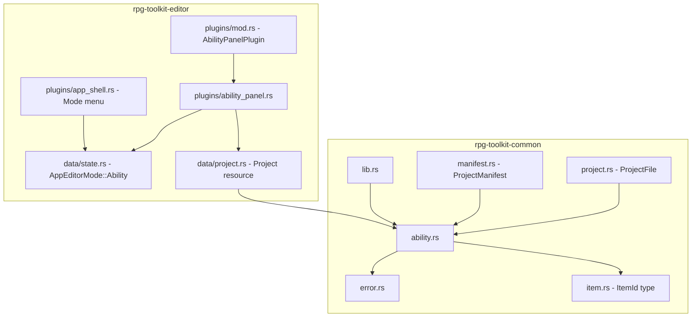

# Design Document: Abilities Editor

## Overview

The Abilities Editor adds a new first-class data type — **Ability** — to the RPG Toolkit, following the established patterns set by `CharacterRegistry` and `ItemRegistry`. The feature spans two crates:

1. **rpg-toolkit-common**: New `ability.rs` module with data model types (`Ability`, `AbilityRegistry`, enums) plus updates to `error.rs`, `project.rs`, `manifest.rs`, and `lib.rs`.
2. **rpg-toolkit-editor**: New `ability_panel.rs` plugin with the standard 3-panel layout, plus updates to `data/state.rs`, `data/project.rs`, `plugins/mod.rs`, and `plugins/app_shell.rs`.

The design mirrors the Item Editor implementation as closely as possible to maintain consistency across the codebase.

## Architecture



The ability module has no dependencies on the character module; it references `ItemId` from `item.rs` only for the `AbilitySource` variants that link abilities to items.

## Components and Interfaces

### 1. Common Crate: `ability.rs`

**Public types:**

| Type | Description |
|------|-------------|
| `AbilityId` | Type alias: `String` (UUID v4) |
| `AbilityCategory` | Enum: `Skill`, `Spell`, `SpecialAction` |
| `TargetType` | Enum: `SingleAlly`, `AllAllies`, `SingleEnemy`, `AllEnemies`, `SelfTarget` |
| `CostType` | Enum: `MP`, `HP` |
| `AbilitySource` | Tagged enum: `LevelUp { required_level }`, `LearnedFromItem { item_id }`, `EquipmentGrant { item_id }`, `AccessoryGrant { item_id }` |
| `Ability` | Struct with all fields per Requirement 1.2 |
| `AbilityRegistry` | Wrapper around `HashMap<AbilityId, Ability>` with CRUD methods |

**Key methods on `AbilityRegistry`:**

```rust
pub fn create_ability(&mut self, name: &str, category: AbilityCategory) -> Result<AbilityId, CommonError>;
pub fn delete_ability(&mut self, id: &AbilityId) -> Result<(), CommonError>;
pub fn update_display_name(&mut self, id: &AbilityId, name: &str) -> Result<(), CommonError>;
pub fn update_description(&mut self, id: &AbilityId, desc: &str) -> Result<(), CommonError>;
pub fn update_category(&mut self, id: &AbilityId, category: AbilityCategory) -> Result<(), CommonError>;
pub fn update_cost_type(&mut self, id: &AbilityId, cost_type: CostType) -> Result<(), CommonError>;
pub fn update_target_type(&mut self, id: &AbilityId, target_type: TargetType) -> Result<(), CommonError>;
pub fn update_power(&mut self, id: &AbilityId, power: u32) -> Result<(), CommonError>;
pub fn update_cost_value(&mut self, id: &AbilityId, cost_value: u32) -> Result<(), CommonError>;
pub fn add_source(&mut self, id: &AbilityId, source: AbilitySource) -> Result<(), CommonError>;
pub fn remove_source(&mut self, id: &AbilityId, index: usize) -> Result<(), CommonError>;
pub fn filtered_abilities(&self, category: Option<AbilityCategory>) -> Vec<&Ability>;
```

### 2. Common Crate: `error.rs` Update

Add a new variant to `CommonError`:

```rust
#[error("Ability validation error: {0}")]
AbilityValidationError(String),
```

### 3. Common Crate: `project.rs` Update

Add to `ProjectFile`:

```rust
#[serde(default)]
pub abilities: AbilityRegistry,
```

Add to `ProjectFile::deserialize()` a validation block matching the character/item pattern:

```rust
for (id, ability) in &project.abilities.abilities {
    if id != &ability.id {
        return Err(CommonError::ProjectValidationError(format!(
            "ability registry key '{}' does not match ability id '{}'",
            id, ability.id
        )));
    }
}
```

### 4. Common Crate: `manifest.rs` Update

Add `pub abilities: AbilityRegistry` to `ProjectManifest` (with `#[serde(default)]`).

### 5. Common Crate: `lib.rs` Update

```rust
pub mod ability;
pub use ability::{
    Ability, AbilityCategory, AbilityId, AbilityRegistry, AbilitySource, CostType, TargetType,
};
```

### 6. Editor Crate: `data/state.rs` Update

Add variant to `AppEditorMode`:

```rust
#[derive(Clone, Copy, Debug, Default, PartialEq, Eq, Resource)]
pub enum AppEditorMode {
    #[default]
    Map,
    Character,
    Item,
    Ability,
}
```

### 7. Editor Crate: `data/project.rs` Update

Add to `Project` resource:

```rust
pub abilities: AbilityRegistry,
pub has_unsaved_ability_changes: bool,
```

### 8. Editor Crate: `plugins/ability_panel.rs`

New file implementing the 3-panel layout:

- **AbilityPanelPlugin** — registers `AbilityPanelState` resource and the `ability_panel_ui` system with `run_if(resource_equals(AppEditorMode::Ability))`.
- **AbilityPanelState** — tracks `selected_ability`, `category_filter`, `create_dialog_open`, buffers for name/description editing, delete confirmation, and source-add dialog state.
- **ability_panel_ui** system — renders left list panel (220px), right preview panel (250px), and central detail panel using `egui::SidePanel` and `egui::CentralPanel` with `ScrollArea`.

### 9. Editor Crate: `plugins/app_shell.rs` Update

Add to the Mode menu:

```rust
if ui
    .selectable_label(*app_editor_mode == AppEditorMode::Ability, "✨ Ability Editor")
    .clicked()
{
    *app_editor_mode = AppEditorMode::Ability;
    ui.close();
}
```

### 10. Editor Crate: `plugins/mod.rs` Update

```rust
pub mod ability_panel;
pub use ability_panel::AbilityPanelPlugin;
```

Register in `main.rs` plugin group alongside other panel plugins.

## Data Models

### Ability

```rust
#[derive(Clone, Debug, PartialEq, Eq, Serialize, Deserialize)]
pub struct Ability {
    pub id: AbilityId,
    pub display_name: String,
    pub description: String,
    pub category: AbilityCategory,
    pub cost_type: CostType,
    pub cost_value: u32,
    pub power: u32,
    pub target_type: TargetType,
    pub sources: Vec<AbilitySource>,
}
```

### AbilityCategory

```rust
#[derive(Clone, Copy, Debug, PartialEq, Eq, Serialize, Deserialize)]
pub enum AbilityCategory {
    Skill,
    Spell,
    SpecialAction,
}
```

### TargetType

```rust
#[derive(Clone, Copy, Debug, PartialEq, Eq, Serialize, Deserialize)]
pub enum TargetType {
    SingleAlly,
    AllAllies,
    SingleEnemy,
    AllEnemies,
    SelfTarget,
}
```

### CostType

```rust
#[derive(Clone, Copy, Debug, PartialEq, Eq, Serialize, Deserialize)]
pub enum CostType {
    MP,
    HP,
}
```

### AbilitySource

```rust
#[derive(Clone, Debug, PartialEq, Eq, Serialize, Deserialize)]
#[serde(tag = "source_type")]
pub enum AbilitySource {
    LevelUp { required_level: u32 },
    LearnedFromItem { item_id: ItemId },
    EquipmentGrant { item_id: ItemId },
    AccessoryGrant { item_id: ItemId },
}
```

### AbilityRegistry

```rust
#[derive(Clone, Debug, Default, PartialEq, Eq, Serialize, Deserialize)]
pub struct AbilityRegistry {
    pub abilities: HashMap<AbilityId, Ability>,
}
```

### AbilityPanelState (Editor)

```rust
#[derive(Resource, Default)]
pub struct AbilityPanelState {
    pub selected_ability: Option<AbilityId>,
    pub category_filter: Option<AbilityCategory>,
    pub create_dialog_open: bool,
    pub create_name_buffer: String,
    pub create_category: Option<AbilityCategory>,
    pub create_error: Option<String>,
    pub delete_confirm_target: Option<AbilityId>,
    pub name_edit_buffer: String,
    pub name_edit_error: Option<String>,
    pub description_buffer: String,
    pub add_source_dialog_open: bool,
    pub add_source_type: AbilitySourceType,
    pub add_source_level_buffer: String,
    pub add_source_item_id_buffer: String,
    pub add_source_error: Option<String>,
}
```

### Validation Rules Summary

| Field | Rule |
|-------|------|
| `display_name` | Trim whitespace, 1–64 chars, at least 1 non-whitespace char |
| `description` | Truncate to 256 Unicode codepoints |
| `sources` | Max 10 per ability |
| `LevelUp.required_level` | Must be ≥ 1 |
| `LearnedFromItem/EquipmentGrant/AccessoryGrant.item_id` | Must be non-empty after trim |


## Correctness Properties

*A property is a characteristic or behavior that should hold true across all valid executions of a system — essentially, a formal statement about what the system should do. Properties serve as the bridge between human-readable specifications and machine-verifiable correctness guarantees.*

### Property 1: Creation produces a valid ability with correct defaults

*For any* valid display name (trimmed, 1–64 chars, at least one non-whitespace) and *any* `AbilityCategory` variant, calling `create_ability` SHALL return an `Ok(AbilityId)` where the ID is present in the registry, and the stored ability has `cost_value = 0`, `power = 0`, `target_type = SingleEnemy`, `cost_type = MP`, `sources = []`, `description = ""`, and the provided category.

**Validates: Requirements 2.1, 2.5**

### Property 2: Name validation rejects all invalid names

*For any* string that is either empty after trimming or exceeds 64 characters after trimming, both `create_ability` and `update_display_name` SHALL return `Err(AbilityValidationError)`. Conversely, *for any* string that is 1–64 characters after trimming and contains at least one non-whitespace character, the name SHALL be accepted.

**Validates: Requirements 2.2, 2.3, 2.4, 4.1, 4.2**

### Property 3: Deletion removes and only removes the target ability

*For any* `AbilityRegistry` containing at least one ability, deleting an existing ability by its ID SHALL result in that ID no longer being present in the registry, while all other abilities remain unchanged.

**Validates: Requirements 3.1**

### Property 4: Description truncation preserves the first 256 codepoints

*For any* ability and *any* input string, after calling `update_description`, the stored description SHALL equal the first `min(len, 256)` Unicode codepoints of the input.

**Validates: Requirements 4.3**

### Property 5: Field updates are stored correctly

*For any* existing ability and *any* valid `AbilityCategory`, `CostType`, `TargetType`, `u32` power value, or `u32` cost value, calling the corresponding update method SHALL result in the ability's field being set to the provided value.

**Validates: Requirements 4.4**

### Property 6: Source addition appends to the sources list

*For any* ability with fewer than 10 sources and *any* valid `AbilitySource` (LevelUp with `required_level >= 1`, or item-referencing variants with non-empty `item_id`), calling `add_source` SHALL result in the sources list growing by exactly one element, with the new source at the end.

**Validates: Requirements 5.1, 5.3**

### Property 7: Source removal removes exactly the element at the given index

*For any* ability with at least one source and *any* valid index within the sources list, calling `remove_source` SHALL result in the sources list shrinking by one, with the element previously at that index no longer present and all other elements preserved in order.

**Validates: Requirements 5.5**

### Property 8: Filtered listing returns correctly filtered and sorted results

*For any* `AbilityRegistry` and *any* `Option<AbilityCategory>` filter, calling `filtered_abilities` SHALL return a `Vec` where: (a) every returned ability matches the filter category (or all are returned if filter is `None`), (b) the results are sorted case-insensitively by `display_name`, and (c) no abilities matching the criteria are omitted.

**Validates: Requirements 6.1, 6.2, 6.3, 6.4**

### Property 9: Serialization round-trip preserves registry equality

*For any* valid `AbilityRegistry` containing 0–50 abilities each with 0–10 sources satisfying all validation rules, serializing to JSON via `serde_json::to_string` and deserializing back via `serde_json::from_str` SHALL produce an `AbilityRegistry` that is structurally equal (via `PartialEq`) to the original.

**Validates: Requirements 12.1, 12.4**

## Error Handling

### Common Crate Errors

All validation failures in `AbilityRegistry` methods return `CommonError::AbilityValidationError(String)` with a descriptive message. The error variants and their triggers:

| Condition | Error |
|-----------|-------|
| Empty/whitespace-only display name | `AbilityValidationError("Display name must not be empty or whitespace-only")` |
| Display name > 64 chars | `AbilityValidationError("Display name must not exceed 64 characters")` |
| Ability not found by ID | `AbilityValidationError("Ability not found: {id}")` |
| Sources list at capacity (10) | `AbilityValidationError("Ability cannot have more than 10 sources")` |
| Source index out of bounds | `AbilityValidationError("Source index {index} is out of bounds")` |
| LevelUp required_level = 0 | `AbilityValidationError("LevelUp required_level must be at least 1")` |
| Item-source with empty item_id | `AbilityValidationError("Item ID must not be empty")` |

### Project Deserialization Errors

| Condition | Error |
|-----------|-------|
| Ability key/id mismatch | `ProjectValidationError("ability registry key '{key}' does not match ability id '{id}'")` |

### Editor Error Propagation

The editor panel catches `CommonError` results from registry operations and displays them as inline red error text (using `egui::Color32::RED`). Operations that fail do not modify the registry state (all validation happens before mutation).

## Testing Strategy

### Property-Based Tests (rpg-toolkit-common)

The `AbilityRegistry` is pure data logic with no I/O dependencies, making it ideal for property-based testing. We will use the [`proptest`](https://crates.io/crates/proptest) crate (already commonly used in Rust ecosystems) with a minimum of 100 iterations per property.

**Test configuration:**
- Library: `proptest`
- Iterations: 100+ per property
- Generators: Custom `Arbitrary`-like strategies for `Ability`, `AbilitySource`, `AbilityCategory`, `TargetType`, `CostType`
- Tag format: `// Feature: abilities-editor, Property {N}: {title}`

**Properties to implement:**
1. Creation produces valid ability with defaults
2. Name validation accepts/rejects correctly
3. Deletion removes target ability
4. Description truncation
5. Field updates stored correctly
6. Source addition appends
7. Source removal by index
8. Filtered listing correctness
9. Serialization round-trip

### Unit Tests (rpg-toolkit-common)

Example-based tests for specific edge cases:

- Creating ability with exactly 64-char name succeeds
- Creating ability with 65-char name fails
- Deleting non-existent ID returns error
- Adding 11th source fails
- LevelUp with `required_level = 0` fails
- Item source with whitespace-only `item_id` fails
- Deserializing JSON without `abilities` field yields empty registry
- Deserializing JSON with mismatched key/id returns `ProjectValidationError`
- Malformed JSON returns deserialization error

### Integration Tests (rpg-toolkit-editor)

These verify the Bevy plugin wiring and egui rendering:

- `AbilityPanelPlugin` only renders when `AppEditorMode::Ability` is active
- Mode menu includes "Ability Editor" entry
- Panel renders empty state when registry is empty
- Creation dialog flow sets `has_unsaved_ability_changes`

### Test File Locations

| Test Type | Location |
|-----------|----------|
| Property tests | `crates/rpg-toolkit-common/src/ability.rs` (inline `#[cfg(test)]` module) |
| Unit tests | `crates/rpg-toolkit-common/src/ability.rs` (inline `#[cfg(test)]` module) |
| Integration tests | `crates/rpg-toolkit-editor/tests/ability_panel_tests.rs` (if Bevy test harness is available) |
