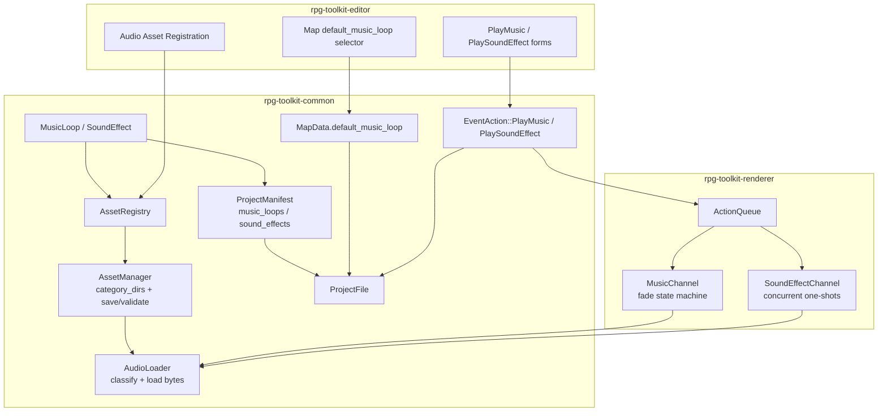

# Design Document

## Overview

The audio system extends the RPG toolkit with two new project asset types — **music loops** and **sound effects** — and wires them through the existing asset, map, event, manifest, renderer, and editor layers. The design follows the conventions already established for image assets and event actions, so the new capability slots into the codebase with minimal new machinery.

The work spans three crates:

- **`rpg-toolkit-common`** — the data models (`MusicLoop`, `SoundEffect`), two new category constants, `AssetManager` category mappings, the `default_music_loop` field on `MapData`, the `PlayMusic` / `PlaySoundEffect` `EventAction` variants, the `music_loops` / `sound_effects` registries on `ProjectManifest` / `ProjectFile`, and the shared `AudioLoader` utility. This crate owns all serialization, validation, and round-trip guarantees.
- **`rpg-toolkit-renderer`** — runtime playback: a single music channel with cross-fade / fade-in / fade-out support and a concurrent sound-effect channel, driven by the existing `ActionQueue` as non-blocking actions.
- **`rpg-toolkit-editor`** — UI to register audio assets, choose a map's default music loop, and configure `PlayMusic` / `PlaySoundEffect` in the Event Trigger Editor, with validation and clamping.

The design intentionally reuses `AssetManager::resolve_path`, `AssetManager::load_file_bytes`, and `AssetManager::resolve_and_load` rather than reimplementing path resolution. `AudioLoader` is a thin classification/loading layer built on top of those primitives.

### Requirements coverage summary

| Requirement | Covered by |
|---|---|
| 1. MusicLoop data model | `MusicLoop` struct + validated deserialize in `asset.rs` |
| 2. SoundEffect data model | `SoundEffect` struct + validated deserialize in `asset.rs` |
| 3. Categories & AssetManager | `CATEGORY_MUSIC_LOOP`, `CATEGORY_SOUND_EFFECT`, default `category_dirs` |
| 4. Map default music loop | `MapData.default_music_loop` + validation + loader warning |
| 5. PlayMusic data model | `EventAction::PlayMusic` variant + field validators |
| 6. PlayMusic runtime | Music channel state machine in renderer |
| 7. PlaySoundEffect data model | `EventAction::PlaySoundEffect` variant + field validators |
| 8. PlaySoundEffect runtime | Sound-effect channel in renderer |
| 9. AudioLoader | `AudioLoader` in `rpg-toolkit-common` |
| 10. Manifest audio registries | `music_loops` / `sound_effects` on manifest + validation |
| 11. Serialization compatibility | `#[serde(default)]` fields + tagged enum error path |
| 12. Editor support | Audio registration panel + Event Trigger Editor forms |
| 13. Audio database page | Dedicated `AudioPagePlugin` gated on `AppEditorMode::Audio` + preview playback via bevy_audio |

## Architecture



### Data flow

1. **Authoring (editor):** A designer registers an audio file, which creates an `AssetReference` with category `music_loop` / `sound_effect` in the `AssetRegistry` and a `MusicLoop` / `SoundEffect` record in the manifest registries. Map properties and event triggers reference these by id.
2. **Persistence:** On save, `AssetManager` copies audio files to `audio/music/` or `audio/sfx/` (directory target) or writes them at their normalized relative path (ZIP target). The manifest serializes the two registries. On load, the manifest deserializes with `#[serde(default)]` empty registries and key/id validation.
3. **Runtime (renderer):** Entering a map plays the map's `default_music_loop`. As the `ActionQueue` advances, `PlayMusic` mutates the music channel (cross-fade / fade-in / finite loop-count with end fade-out) and `PlaySoundEffect` spawns a concurrent one-shot on the sound-effect channel. Both actions are non-blocking; fades run to completion independently of queue advancement.

### Audio backend decision

Bevy 0.18 ships `bevy_audio` (backed by `rodio`) via the default `bevy` feature set already used across the workspace. The renderer will use Bevy's `AudioPlayer` / `AudioSink` components:

- **Music channel:** at most one active loop entity tagged with a `MusicChannel` marker, using `PlaybackSettings::LOOP` and `AudioSink::set_volume` to drive fades. Cross-fades keep the outgoing sink alive with a decaying volume until it reaches zero, then despawn it.
- **Sound-effect channel:** each `PlaySoundEffect` spawns a `PlaybackSettings::DESPAWN` (or `REMOVE`) one-shot entity tagged `SoundEffectChannel`; Bevy plays them concurrently and cleans them up when finished.

Audio *decoding* for validation and byte loading is centralized in `AudioLoader`; the renderer feeds bytes/handles through Bevy's asset system. This keeps `rpg-toolkit-common` free of a Bevy audio-playback dependency while still providing a single loading path (Requirement 9).

## Components and Interfaces

### 1. `MusicLoop` and `SoundEffect` (rpg-toolkit-common/src/asset.rs)

Both are thin records mirroring `AssetReference`'s field names (`id`, `relative_path`, `category`) so JSON encoding is consistent. `category` is fixed to the corresponding constant on construction and validated on deserialize.

```rust
pub type MusicLoopId = String;
pub type SoundEffectId = String;

pub const CATEGORY_MUSIC_LOOP: &str = "music_loop";
pub const CATEGORY_SOUND_EFFECT: &str = "sound_effect";

#[derive(Clone, Debug, PartialEq, Eq, Serialize)]
#[serde(try_from = "RawAudioAsset")]   // validation on deserialize
pub struct MusicLoop {
    pub id: MusicLoopId,        // 1..=128 chars
    pub relative_path: String,  // non-empty after trim
    pub category: AssetCategory, // always CATEGORY_MUSIC_LOOP
}

#[derive(Clone, Debug, PartialEq, Eq, Serialize)]
#[serde(try_from = "RawAudioAsset")]
pub struct SoundEffect {
    pub id: SoundEffectId,      // 1..=128 chars
    pub relative_path: String,  // 1..=4096 chars
    pub category: AssetCategory, // always CATEGORY_SOUND_EFFECT
}
```

Validation follows the established `TryFrom<Raw...>` pattern used by `ParallaxLayer` and `ChoiceData` in `map.rs`:

- `id`: reject empty or `> 128` chars with a message about identifier length (Req 1.4–1.5, 2.4–2.5).
- `MusicLoop.relative_path`: reject empty/whitespace-only after trim (Req 1.6–1.7).
- `SoundEffect.relative_path`: reject length `0` or `> 4096` (Req 2.6–2.7).
- `category` defaults to / is coerced to the correct constant so serialization emits `id`, `relative_path`, `category` like `AssetReference` (Req 1.8, 2.8).

Registration reuses `AssetRegistry::register`, which already enforces 1–128 id length, duplicate rejection (leaving the existing entry unchanged), and stores the entry by id. A convenience helper `AssetReference::from(&MusicLoop)` / `from(&SoundEffect)` produces the registry record with the correct category (Req 1.2–1.3, 2.2–2.3).

### 2. AssetManager category mappings (rpg-toolkit-common/src/asset.rs)

`AssetManager::new()` gains two entries in `category_dirs`:

```rust
category_dirs.insert(CATEGORY_MUSIC_LOOP.to_string(), "audio/music/".to_string());
category_dirs.insert(CATEGORY_SOUND_EFFECT.to_string(), "audio/sfx/".to_string());
```

No changes are needed to `save_to_directory`, `save_to_zip`, or `validate_registry_files` — they already iterate the registry generically, copy to the category-mapped subdir, emit an `AssetWarning` on a missing source during save while continuing, and emit one `AssetValidationError` per missing resolved path while skipping empty relative paths (Req 3.3–3.8). The design's only job is to register audio assets into the same registry the manager iterates.

### 3. `MapData.default_music_loop` (rpg-toolkit-common/src/map.rs)

```rust
pub struct MapData {
    // ...existing fields...
    #[serde(default, deserialize_with = "deserialize_optional_music_loop_id")]
    pub default_music_loop: Option<MusicLoopId>,
}
```

- Absent → `None` (Req 4.2). `MapData::new` sets it to `None`.
- A custom optional deserializer validates 1–128 chars when present, rejecting empty (Req 4.4) and `> 128` (Req 4.5), reusing the same style as `deserialize_optional_non_empty_string` plus a length bound.
- Existing serde format is preserved (Req 4.6), and the round-trip property holds (Req 4.7).
- **Loader warning (Req 4.8):** In `ProjectFile::deserialize` and `ProjectManifest::into_project_file`, after maps and registries are loaded, iterate maps whose `default_music_loop` is `Some(id)` where `id` is not present in `music_loops`; log a warning identifying the map by `name` and the missing id, then continue loading (mirrors the existing `JumpTo` unknown-map warning loop). This is a warning, not an error.

### 4. `EventAction::PlayMusic` and `EventAction::PlaySoundEffect` (rpg-toolkit-common/src/map.rs)

Added as new variants on the existing `#[serde(tag = "type")]` enum, so they serialize with `"type": "PlayMusic"` / `"type": "PlaySoundEffect"` (Req 5.14, 7.9) and an unknown tag continues to produce a serde error that includes the tag value (Req 11.5).

```rust
PlayMusic {
    #[serde(deserialize_with = "deserialize_music_loop_id")] // 1..=128
    music_loop_id: MusicLoopId,
    #[serde(default, deserialize_with = "deserialize_fade_seconds")] // finite 0.0..=10.0, default 0.0
    fade_duration: f32,
    #[serde(default, deserialize_with = "deserialize_optional_loop_count")] // None or >=1
    loop_count: Option<u32>,
    #[serde(default, deserialize_with = "deserialize_fade_seconds")] // finite 0.0..=10.0, default 0.0
    fade_out_duration: f32,
},
PlaySoundEffect {
    #[serde(deserialize_with = "deserialize_sound_effect_id")] // 1..=128, required
    sound_effect_id: SoundEffectId,
    #[serde(default = "default_volume", deserialize_with = "deserialize_volume")] // finite 0.0..=1.0, default 1.0
    volume: f32,
},
```

New validation helpers (same style as existing `deserialize_*` functions in `map.rs`):

- `deserialize_music_loop_id` / `deserialize_sound_effect_id`: reject empty (Req 5.3, 7.3) and `> 128` (Req 5.4, 7.4). Absent `sound_effect_id` → missing-field error is produced by serde since the field has no default (Req 7.5).
- `deserialize_fade_seconds`: reject NaN, infinity, `< 0.0`, `> 10.0`; default `0.0` when absent (Req 5.5–5.7, 5.11–5.13).
- `deserialize_optional_loop_count`: absent → `None` (infinite); present `0` rejected; present `>= 1` accepted (Req 5.8–5.10).
- `deserialize_volume` / `default_volume`: reject NaN, infinity, `< 0.0`, `> 1.0`; default `1.0` (Req 7.6–7.8).

Round-trip holds for all valid values (Req 5.15, 7.10).

### 5. `AudioLoader` (rpg-toolkit-common/src/audio.rs — new module)

A stateless utility that classifies audio format by extension and returns raw bytes, layered on `AssetManager`.

```rust
#[derive(Clone, Copy, Debug, PartialEq, Eq)]
pub enum AudioFormat { Ogg, Wav, Mp3 }

pub struct AudioLoader;

impl AudioLoader {
    /// Classify by file extension (case-insensitive). Errors:
    /// - no extension -> "could not determine audio format"
    /// - unsupported extension -> identifies the extension
    pub fn classify_format(relative_path: &str) -> Result<AudioFormat, CommonError>;

    /// Resolve `relative_path` against `root`, validate a regular file,
    /// classify format, and return raw bytes.
    pub fn load(root: &Path, relative_path: &str) -> Result<(AudioFormat, Vec<u8>), CommonError>;
}
```

`load` sequences the checks so the *first* failing condition wins, matching Requirement 9's ordering:

1. Trim; empty/whitespace-only → error "path is empty" (Req 9.4) — reuses `resolve_and_load`'s trim/empty guard semantics.
2. `AssetManager::resolve_path` → rejects `..` traversal without reading any file (Req 9.3) and normalizes.
3. Classify by extension: no extension → format-undeterminable error (Req 9.9); unsupported extension → error naming the extension (Req 9.8); `ogg`/`wav`/`mp3` case-insensitive accepted (Req 9.7).
4. `AssetManager::load_file_bytes` → non-existent path error (Req 9.5), directory error (Req 9.6), and read-failure error (Req 9.10). On success returns the complete bytes (Req 9.2) plus the classified format (Req 9.1).

`CommonError` gains an `AudioLoadError(String)` variant (or reuses `AssetPathError`) for the format-specific messages; existing `AssetPathError` messages already cover empty/missing/directory/read cases, so the loader maps or wraps them to keep messages consistent.

### 6. `ProjectManifest` / `ProjectFile` audio registries (rpg-toolkit-common)

Two new maps, defined as small newtype registries mirroring the existing registry pattern, added to both `ProjectManifest` and `ProjectFile`:

```rust
#[serde(default)]
pub music_loops: HashMap<MusicLoopId, MusicLoop>,
#[serde(default)]
pub sound_effects: HashMap<SoundEffectId, SoundEffect>,
```

- Absent → empty maps (Req 10.1–10.3, 11.2).
- `ProjectManifest`/`ProjectFile` deserialization validation gains key/id-match checks in the same block that already validates characters/items/abilities/enemies/shops: if a `music_loops` or `sound_effects` key differs from the record's `id`, return a `ProjectValidationError` naming the registry and key, aborting the load (Req 10.4).
- `to_manifest` / `into_project_file` / `ProjectFile::new` are updated to carry the two registries so directory and ZIP round-trips preserve them (Req 10.5, 11.7). Ordering independence is guaranteed by `HashMap` + `PartialEq`.

### 7. Renderer playback (rpg-toolkit-renderer)

A new `systems/audio.rs` plus resources in `resources.rs`, registered by the renderer plugin.

**Resources / components:**

```rust
#[derive(Resource, Default)]
pub struct MusicChannelState {
    pub current: Option<MusicPlayback>,   // id + sink handle + volume + loop bookkeeping
    pub fading_out: Vec<FadingTrack>,      // outgoing cross-fade tracks
}

pub struct MusicPlayback {
    pub music_loop_id: MusicLoopId,
    pub fade_in: Option<FadeRamp>,         // fade-in / cross-fade-in progress
    pub loop_count: Option<u32>,           // None = infinite
    pub loops_completed: u32,
    pub fade_out_duration: f32,
    pub fade_out: Option<FadeRamp>,        // end-of-playback fade
}

#[derive(Component)] pub struct MusicChannel;
#[derive(Component)] pub struct SoundEffectChannel;
```

**`PlayMusic` handling** (in `advance_action_queue`, non-blocking — pop and continue, Req 6.11):

- Look up `music_loop_id` in `project_file.music_loops`; if missing, `warn!` and leave the channel unchanged (Req 6.6).
- If it matches the currently playing or currently fading-in id, do nothing to playback/volume/fade (Req 6.3).
- Otherwise begin the new loop:
  - `fade_duration == 0.0`: stop the previous track in the same step and start the new one at full volume (Req 6.2).
  - `fade_duration > 0.0` with a previous track: cross-fade over the duration (new → full, old → zero), then despawn the old sink (Req 6.4).
  - `fade_duration > 0.0` with no previous track: fade the new track in from zero to full (Req 6.5).
  - `loop_count = None`: loop indefinitely until changed/stopped (Req 6.1).
  - `loop_count = Some(N)`: play exactly N times (Req 6.7); on completion of the Nth repetition, if `fade_out_duration == 0.0` stop and leave silent (Req 6.8); if `> 0.0` fade to zero over that duration ending as the final repetition ends, then leave silent (Req 6.9). Never resume the map default (Req 6.10).

An `update_music_fades` system advances `FadeRamp`s each frame via `AudioSink::set_volume`, completing cross-fades, fade-ins, and fade-outs independently of the `ActionQueue` (Req 6.12), and counts loop completions for finite `loop_count`.

**`PlaySoundEffect` handling** (non-blocking — pop and continue, Req 8.4):

- Look up `sound_effect_id`; if missing, `warn!` and advance without touching either channel (Req 8.3).
- Load/decode via the audio asset path; on load/decode failure `warn!` and advance without touching the music channel (Req 8.5).
- Otherwise spawn a one-shot `SoundEffectChannel` entity at `volume`, playing exactly once (Req 8.1), concurrently with any already-playing effects (Req 8.6), and never altering the music channel (Req 8.2).

**Map entry default music:** the map-load path (where `MapChanged` is handled) issues an internal "play default music" equivalent to `PlayMusic { music_loop_id: default, fade_duration: 0.0, loop_count: None, fade_out_duration: 0.0 }` when `default_music_loop` is `Some`, honoring the same channel semantics (supports Req 4 at runtime).

### 8. Editor support (rpg-toolkit-editor)

- **Registration** (extend `project_settings_panel.rs` or a new `audio_panel.rs`): file picker + id text field; on submit, validate id length/non-empty and duplicate against the registry, register a `MusicLoop` / `SoundEffect` and add to the manifest registry, and display it in a list. Invalid/duplicate ids are rejected with an error indication, leaving existing assets unchanged (Req 12.1–12.2, 12.11).
- **Map default selector** (map properties UI): a combobox populated with one entry per registered music loop plus a "None" option, preselected to "None" when the field is `None` (Req 12.3). Reuses the existing `searchable_combobox` component.
- **Event Trigger Editor** (`attribute/action_editor_forms.rs` + `action_editor_ui.rs`): add `PlayMusic` and `PlaySoundEffect` to the selectable action list (Req 12.4).
  - `PlayMusic` form: music loop selector; `fade_duration` numeric input init `0.0`, range `0.0..=10.0`; `loop_count` control defaulting to "infinite" (= `None`) else integer `>= 1`; `fade_out_duration` numeric input init `0.0`, range `0.0..=10.0` (Req 12.5).
  - `PlaySoundEffect` form: sound effect selector; `volume` numeric input init `1.0`, range `0.0..=1.0` (Req 12.6).
  - Add/Update button disabled while the required id selection is empty (Req 12.7).
  - On save, clamp `fade_duration` / `fade_out_duration` to `[0.0, 10.0]` (Req 12.8), clamp finite `loop_count < 1` to `1` (Req 12.9), clamp `volume` to `[0.0, 1.0]` (Req 12.10).

### 8a. Audio database page (rpg-toolkit-editor)

Promotes audio management from the Project Settings section to a dedicated page, matching the pattern of the existing database pages (`AbilityPanelPlugin`, item, enemy, shop). This gives audio assets a first-class home and prepares the ground for other entities (abilities, spell-effect animations, items) to reference sound effects and music loops by id via the existing `searchable_combobox`.

- **Navigation:** add an `Audio` variant to `AppEditorMode` (in `data/state.rs`) and a matching entry in the mode-switching UI, so the Audio page is a peer of Map/Character/Item/Ability/Enemy/Shop (Req 13.1).
- **Plugin:** a new `AudioPagePlugin` (`plugins/audio_page.rs`) that registers an `AudioPageState` resource and an egui system running in `EguiPrimaryContextPass` under `EditorUiSet::Panels`, gated on `resource_equals(AppEditorMode::Audio)` — identical wiring to `AbilityPanelPlugin`.
- **Layout:** a left list area with two sections (music loops, sound effects), each listing `id — relative_path`, an empty-state label when a registry is empty (Req 13.2, 13.3), and a registration control (file picker + id field + Register button) reusing the existing normalize-path and validation logic already in `audio_panel.rs`. Registration validates id length/non-empty and duplicates, rejecting with an inline error and leaving assets unchanged, and sets `has_unsaved_audio_changes` on success (Req 13.4, 13.5, 13.6, 13.12).
- **Preview playback (bevy_audio):** selecting an asset shows Play/Stop controls. Play resolves the asset's `relative_path` against the current project root and plays it through Bevy's audio. The page tracks the currently playing preview entity in `AudioPageState`; starting a new preview despawns the previous one first, guaranteeing at most one concurrent preview (Req 13.7, 13.8, 13.9, 13.10). Load/decode/resolve failures surface an inline error and leave assets unchanged (Req 13.11).
  - Implementation note: preview loads the file via the Bevy `AssetServer` using the resolved path (or loads bytes through `AudioLoader` and feeds an `AudioSource`), spawns an entity with an `AudioPlayer` + `PlaybackSettings::DESPAWN`, and stores its `Entity` in `AudioPageState::preview_entity`. Stop and switch despawn that entity. This reuses `bevy_audio` (already available via the `bevy` workspace dependency), consistent with the renderer's playback path.
- **Relationship to Requirement 12:** the existing Project Settings audio controls (Req 12.1–12.2, 12.11) remain valid; the Audio page provides the same registration plus preview in a dedicated location. The two can share the `music_relative_path` / `sfx_relative_path` / validation helpers.

## Data Models

### MusicLoop / SoundEffect JSON

```json
{ "id": "village_theme", "relative_path": "audio/music/village.ogg", "category": "music_loop" }
{ "id": "door_open",    "relative_path": "audio/sfx/door.wav",       "category": "sound_effect" }
```

### PlayMusic / PlaySoundEffect JSON

```json
{ "type": "PlayMusic", "music_loop_id": "boss_theme", "fade_duration": 2.0, "loop_count": 3, "fade_out_duration": 1.5 }
{ "type": "PlayMusic", "music_loop_id": "town" }
{ "type": "PlaySoundEffect", "sound_effect_id": "clash", "volume": 0.8 }
{ "type": "PlaySoundEffect", "sound_effect_id": "clash" }
```

### Manifest excerpt

```json
{
  "maps": ["map-1"],
  "tilesets": {},
  "music_loops":  { "town": { "id": "town", "relative_path": "audio/music/town.ogg", "category": "music_loop" } },
  "sound_effects": { "door": { "id": "door", "relative_path": "audio/sfx/door.wav", "category": "sound_effect" } }
}
```

### Value ranges

| Field | Type | Range / default |
|---|---|---|
| `MusicLoop.id` / `SoundEffect.id` | String | 1..=128 chars |
| `MusicLoop.relative_path` | String | non-empty after trim |
| `SoundEffect.relative_path` | String | 1..=4096 chars |
| `MapData.default_music_loop` | Option<String> | None, else 1..=128 chars |
| `PlayMusic.fade_duration` | f32 | finite 0.0..=10.0, default 0.0 |
| `PlayMusic.loop_count` | Option<u32> | None (infinite) or >=1 |
| `PlayMusic.fade_out_duration` | f32 | finite 0.0..=10.0, default 0.0 |
| `PlaySoundEffect.volume` | f32 | finite 0.0..=1.0, default 1.0 |


## Correctness Properties

*A property is a characteristic or behavior that should hold true across all valid executions of a system — essentially, a formal statement about what the system should do. Properties serve as the bridge between human-readable specifications and machine-verifiable correctness guarantees.*

These properties are derived from the prework analysis. Validation, serialization, and pure-decision behavior in `rpg-toolkit-common` (and the pure editor clamp/queue-classification logic) are exercised as property-based tests. Time-based audio playback in the renderer (cross-fades, loop counting, concurrent one-shots) is verified by integration tests instead, since those depend on the audio backend and elapsed time rather than input variation (see Testing Strategy).

### Property 1: Audio asset registration stores the correct category and succeeds

*For all* valid `MusicLoop` or `SoundEffect` values (id 1–128 chars, valid `relative_path`), converting the value to an `AssetReference` and registering it in a fresh `AssetRegistry` succeeds, and retrieving it by id returns an entry whose `category` equals `CATEGORY_MUSIC_LOOP` for a music loop and `CATEGORY_SOUND_EFFECT` for a sound effect.

**Validates: Requirements 1.2, 2.2**

### Property 2: Duplicate audio identifiers are rejected and leave the existing entry unchanged

*For all* audio assets and any second asset sharing the same id, registering the second one in a registry that already contains the first returns an error indicating the identifier is already registered, and the entry retrieved by that id remains equal to the first.

**Validates: Requirements 1.3, 2.3**

### Property 3: MusicLoop validation accepts valid values and rejects invalid ones

*For all* strings, deserializing a `MusicLoop` succeeds if and only if the `id` is 1–128 characters and the `relative_path` is non-empty after trimming leading/trailing whitespace; otherwise deserialization returns an error and produces no value.

**Validates: Requirements 1.4, 1.5, 1.6, 1.7**

### Property 4: SoundEffect validation accepts valid values and rejects invalid ones

*For all* strings, deserializing a `SoundEffect` succeeds if and only if the `id` is 1–128 characters and the `relative_path` is 1–4096 characters; otherwise deserialization returns an error and produces no value.

**Validates: Requirements 2.4, 2.5, 2.6, 2.7**

### Property 5: Audio asset serialization round-trip

*For all* valid `MusicLoop` and `SoundEffect` values, serializing to JSON and deserializing the result produces a value whose `id`, `relative_path`, and `category` fields each equal the original's.

**Validates: Requirements 1.8, 1.9, 2.8, 2.9**

### Property 6: MapData default_music_loop round-trip

*For all* valid `MapData` values whose `default_music_loop` is either `None` or a 1–128 character id, serializing to JSON and deserializing the result produces a value equal to the original.

**Validates: Requirements 4.1, 4.2, 4.3, 4.6, 4.7**

### Property 7: Invalid default_music_loop is rejected

*For all* map JSON documents in which `default_music_loop` is present as an empty string or a string longer than 128 characters, deserialization returns an error and produces no `MapData` value.

**Validates: Requirements 4.4, 4.5**

### Property 8: Audio EventAction round-trip

*For all* valid `PlayMusic` values (any valid combination of `music_loop_id`, `fade_duration`, `loop_count`, and `fade_out_duration`) and all valid `PlaySoundEffect` values (any valid `sound_effect_id` and `volume`), serializing to JSON using the `#[serde(tag = "type")]` format and deserializing the result produces a value equal to the original, and the serialized JSON carries the correct `"type"` tag.

**Validates: Requirements 5.1, 5.2, 5.5, 5.6, 5.8, 5.9, 5.11, 5.12, 5.14, 5.15, 7.1, 7.2, 7.6, 7.7, 7.9, 7.10**

### Property 9: Invalid audio EventAction fields are rejected

*For all* audio `EventAction` JSON documents in which any field is out of range — `music_loop_id`/`sound_effect_id` empty or longer than 128 characters, `fade_duration`/`fade_out_duration`/`volume` non-finite or outside their allowed ranges, or `loop_count` present with value 0 — deserialization returns an error and produces no value.

**Validates: Requirements 5.3, 5.4, 5.7, 5.10, 5.13, 7.3, 7.4, 7.8**

### Property 10: AssetManager places audio files under their category subdirectory on save

*For all* sets of registered audio assets whose source files exist, saving the project to a directory target copies each audio file into the target under its category-mapped subdirectory (`audio/music/` for music loops, `audio/sfx/` for sound effects), preserving the source file name.

**Validates: Requirements 3.5**

### Property 11: AssetManager validation reports exactly the missing audio assets

*For all* sets of registered audio assets, validating against a root produces exactly one `AssetValidationError` — carrying the asset id, category, and resolved path — for each asset whose resolved path does not exist and whose relative path is non-empty, and none for assets whose relative path is empty or whose file exists.

**Validates: Requirements 3.8**

### Property 12: AudioLoader byte round-trip

*For all* byte sequences written to a file with a supported extension (`ogg`, `wav`, `mp3`) under a project root, `AudioLoader::load` returns the complete, unaltered byte contents of that file.

**Validates: Requirements 9.1, 9.2**

### Property 13: AudioLoader recognizes supported formats case-insensitively

*For all* relative paths whose extension is `ogg`, `wav`, or `mp3` in any combination of upper- and lower-case letters, `AudioLoader` classifies the file as the corresponding supported format.

**Validates: Requirements 9.7**

### Property 14: AudioLoader rejects unrecognizable or unsupported extensions

*For all* relative paths whose extension is not one of `ogg`, `wav`, `mp3`, and *for all* relative paths that have no extension, `AudioLoader` returns an error — identifying the unsupported extension in the former case and indicating the format could not be determined in the latter.

**Validates: Requirements 9.8, 9.9**

### Property 15: AudioLoader rejects empty and traversing paths without reading a file

*For all* relative paths that are empty or whitespace-only, and *for all* relative paths containing a `..` component that would escape the project root, `AudioLoader` returns an error and reads no file.

**Validates: Requirements 9.3, 9.4**

### Property 16: Manifest rejects audio-registry key/id mismatches

*For all* `ProjectManifest` JSON documents containing a `music_loops` or `sound_effects` entry whose map key differs from the `id` of the record it maps to, deserialization/validation returns a validation error identifying the offending registry name and map key, and produces no manifest value.

**Validates: Requirements 10.4**

### Property 17: Manifest audio-registry round-trip is order-independent

*For all* `ProjectManifest` values whose `music_loops` and `sound_effects` registries have every key equal to its record's `id`, serializing to JSON and deserializing the result yields a manifest that compares equal (via `PartialEq`) to the original, regardless of registry entry ordering.

**Validates: Requirements 10.1, 10.2, 10.5**

### Property 18: Unknown EventAction type tag produces an error naming the tag

*For all* strings that are not the name of a defined `EventAction` variant, deserializing an `EventAction` JSON object whose `"type"` field holds that string returns an error whose message includes the unrecognized tag value, and produces no value.

**Validates: Requirements 11.5**

### Property 19: Comprehensive project round-trip

*For all* valid `ProjectFile` values containing any combination of `EventAction` variants (including `PlayMusic` with any valid `fade_duration`, `loop_count`, and `fade_out_duration`, and `PlaySoundEffect`), a `default_music_loop` value of `None` or a registered `MusicLoopId`, and any combination of music loop and sound effect registry entries, serializing the project and deserializing the result produces a project that compares equal by value to the original.

**Validates: Requirements 11.7**

### Property 20: Music channel is unchanged for a same-id or unregistered PlayMusic request

*For all* music channel states and all `PlayMusic` requests, the pure "next music command" decision function returns "no change" whenever the requested `music_loop_id` equals the id currently playing or currently fading in, or whenever the requested id is not registered in the project — leaving the channel's playback, volume, and fade progress unchanged.

**Validates: Requirements 6.3, 6.6**

### Property 21: Audio event actions are non-blocking

*For all* `PlayMusic` and `PlaySoundEffect` actions, processing the action advances the `ActionQueue` to the next action within the same processing step, without entering any `WaitingFor` blocking state.

**Validates: Requirements 6.11, 8.4**

### Property 22: Editor clamps out-of-range numeric inputs

*For all* finite `f32` inputs, the editor's save-time clamping yields `fade_duration` and `fade_out_duration` within `[0.0, 10.0]` and `volume` within `[0.0, 1.0]` (each equal to the standard clamp of the input to that range); and *for all* `u32` inputs, a finite `loop_count` less than 1 is clamped to 1.

**Validates: Requirements 12.8, 12.9, 12.10**

## Error Handling

The design follows the crate's existing error conventions: deserialization/validation failures surface through serde errors and `CommonError` variants, while runtime lookups that reference missing assets log a warning and continue rather than aborting.

### Deserialization and validation errors (`rpg-toolkit-common`)

- **Field validation** (`MusicLoop`, `SoundEffect`, `PlayMusic`, `PlaySoundEffect`, `MapData.default_music_loop`): invalid id length, empty/whitespace paths, out-of-range floats (including NaN/infinity), `loop_count == 0`, and over-length sound-effect paths produce serde errors via `TryFrom`/`deserialize_with`, matching the existing patterns (`ParallaxLayer`, `deserialize_wait_duration`, etc.). No partial value is produced.
- **Unknown EventAction tag** (Req 11.5): the existing `#[serde(tag = "type")]` machinery already returns an "unknown variant" error that includes the tag value; no custom handling is needed. Deserialization aborts before any project state is applied.
- **Manifest key/id mismatch** (Req 10.4): validated in `ProjectFile::deserialize` / `ProjectManifest::into_project_file` alongside the existing registry checks, returning `CommonError::ProjectValidationError` naming the registry and key, aborting the load.
- **Invalid JSON** (Req 11.6): produces `CommonError::ProjectParseError`; callers keep any previously loaded project.
- **AudioLoader** (Req 9.3–9.10): each failure maps to a descriptive `CommonError` (`AssetPathError` for empty/traversal/missing/directory/read, plus a format-specific message for unsupported/undeterminable extensions). Checks are ordered so the first applicable failure is reported.

### Runtime warnings (`rpg-toolkit-renderer`)

- **Unregistered `default_music_loop`** (Req 4.8): logged via `warn!` naming the map and missing id during load; load completes.
- **Unregistered `PlayMusic` id** (Req 6.6): `warn!`; music channel left unchanged.
- **Unregistered / failed-to-load `PlaySoundEffect`** (Req 8.3, 8.5): `warn!`; queue advances; no channel altered.

### Save warnings (`rpg-toolkit-common`)

- **Missing audio source file on save** (Req 3.7): the existing save path emits one `AssetWarning` per missing source, keeps previously written files, and continues with remaining assets. No new code path required beyond registering audio assets.

### Editor validation (`rpg-toolkit-editor`)

- **Invalid/duplicate audio id registration** (Req 12.11): registration is rejected with an on-screen error indication; existing registered assets are left unchanged.
- **Out-of-range numeric inputs** (Req 12.8–12.10): clamped to the nearest bound at save time rather than rejected.

## Testing Strategy

Property-based testing applies to this feature because the core logic is pure data validation, serialization/round-trips, and small pure decision/clamp functions with large input spaces — exactly the cases where universally quantified properties over generated inputs find edge cases that examples miss. Time-based audio playback in the renderer is not suitable for PBT (it depends on the audio backend and elapsed time, and its behavior does not vary meaningfully with random input), so it is covered by integration tests and manual verification instead.

### Property-based tests (`proptest`)

- **Library:** `proptest` (already the workspace standard; do not hand-roll PBT).
- **Iterations:** each property test runs a minimum of 100 cases (`ProptestConfig { cases: 100, .. }`), matching existing tests.
- **Tagging:** each test is annotated with a comment in the form
  `// Feature: audio-system, Property {number}: {property_text}` and a `**Validates: Requirements X.Y**` doc comment, following `event_reward_actions.rs` and `asset_registry_round_trip.rs`.
- **Placement / registration:** common-crate property tests live in `crates/rpg-toolkit-common/tests/properties/` with a matching `[[test]]` entry in that crate's `Cargo.toml`; the queue-classification property lives in `crates/rpg-toolkit-renderer/tests/properties/` alongside `intro_blocking_classification.rs`; the editor clamp property lives with the editor crate's tests.
- **Coverage:** Properties 1–22 above. Generators build valid audio assets, maps, `EventAction`s, manifests, and `ProjectFile`s (reusing the existing `arb_*` strategy style), plus boundary-focused strategies for the reject-side properties (lengths 0, 1, 128, 129; floats including NaN/±inf and the 0.0/10.0/1.0 bounds; `loop_count` 0 and ≥1; extensions in mixed case and outside the supported set).

### Unit / example tests

- Category constant values `music_loop` / `sound_effect` (Req 3.1, 3.2) and default `category_dirs` mappings (Req 3.3, 3.4).
- Absent-field defaults: `default_music_loop` → `None`, `fade_duration`/`fade_out_duration` → `0.0`, `loop_count` → `None`, `volume` → `1.0`, missing `sound_effect_id` → error (Req 4.2, 5.5, 5.8, 5.11, 7.5, 7.6).
- Backward compatibility: pre-audio project/manifest loads with empty registries and `None` map default; file with only pre-existing action tags loads without error; malformed JSON errors (Req 10.3, 11.1, 11.2, 11.3, 11.4, 11.6).
- Save-to-ZIP audio entry placement and missing-source warning behavior (Req 3.6, 3.7).
- AudioLoader directory and unreadable-file errors (Req 9.6, 9.10), where platform-supported.
- Unregistered `default_music_loop` load-completes example (Req 4.8).

### Integration / manual tests (renderer & editor)

- **Renderer playback** (Req 6.1, 6.2, 6.4, 6.5, 6.7, 6.8, 6.9, 6.10, 6.12, 8.1, 8.2, 8.3, 8.5, 8.6): integration/manual verification that a differing `PlayMusic` starts/cross-fades/fades-in the new loop, finite `loop_count` plays exactly N times and then goes silent (with or without `fade_out_duration`) without resuming the map default, fades run to completion independent of the queue, and sound effects play once, concurrently, at the requested volume without disturbing the music channel. A pure decision-function property (Property 20) covers the same-id/unknown-id no-op rule at the logic level.
- **Editor UI** (Req 12.1–12.7, 12.11): manual verification of asset registration and list display, the map default selector with a preselected "None", the presence of `PlayMusic`/`PlaySoundEffect` in the action list, their form controls with correct defaults/ranges, the disabled Add/Update button while a required id is empty, and error indication on invalid/duplicate registration. The clamping logic (Req 12.8–12.10) is covered by Property 22.
- **Audio page** (Req 13.1–13.12): manual verification that the Audio page is selectable as a peer page, lists both registries with empty states, registers assets with duplicate/invalid rejection, and previews a selected asset with play/stop and single-preview-at-a-time behavior, including an error indication when a source file fails to load. The registration validation reuses the pure logic already covered by the editor tests.
