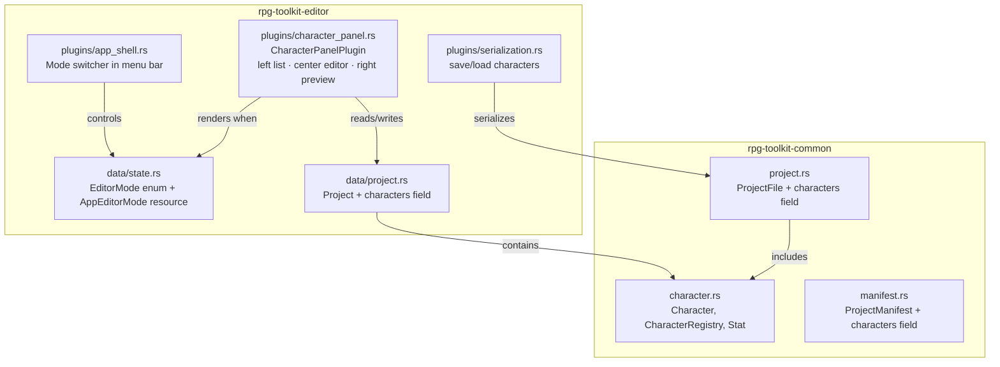

# Design Document: Character Editor

## Overview

The Character Editor adds a character data model to `rpg-toolkit-common` and a corresponding editor mode to `rpg-toolkit-editor` for creating, editing, and deleting playable characters with configurable stats and level-based progression.

**Key design decision: Dedicated Editor Mode.** Rather than cramming character editing into the existing map editor panels (which are already dense with tile palette, animation, and spritesheet tools), the Character Editor introduces a top-level `EditorMode` concept. A mode switcher in the menu bar lets users toggle between `MapEditor` (the current default) and `CharacterEditor`. When in `CharacterEditor` mode, the entire viewport reconfigures for character management:

- **Left panel**: Scrollable, alphabetically sorted character list
- **Center/main area**: Character detail editor (name, stats with base/growth values, add/remove optional stats)
- **Right panel/section**: Stat progression preview

This approach keeps the map editor completely untouched — existing plugins only render when `EditorMode::MapEditor` is active. The mode concept is extensible: future specs can add `SpritesheetEditor`, `ItemDatabase`, etc. without cluttering any single view.

**Scope boundary:** This spec ONLY introduces the `EditorMode` enum and implements the `CharacterEditor` mode. All existing map editor panels, tools, and layout remain exactly as they are.

## Architecture

The feature spans two crates:



### Plugin Integration

The `CharacterPanelPlugin` is a new Bevy plugin registered in `main.rs`. It renders **only** when `AppEditorMode` is set to `CharacterEditor`. When active, it takes over the full viewport with its own panel layout (left list, center editor, right preview).

All existing map editor plugins (`TilePalettePlugin`, `CanvasPlugin`, `LayerPanelPlugin`, `ToolbarPlugin`, `PaintingPlugin`, `AttributePlugin`, `SpritesheetPlugin`, `DialogTextPanelPlugin`) add a run condition gating their UI systems on `AppEditorMode::MapEditor`. This is a single-line change per plugin and does not alter their internal logic.

### Mode Switching

A mode switcher control is added to the top menu bar (rendered by `AppShellPlugin`). It presents the available modes and updates the `AppEditorMode` resource. The menu bar itself always renders regardless of mode — it's the shell for the entire application.

## Components and Interfaces

### `rpg-toolkit-common::character` (new module)

```rust
use std::collections::HashMap;
use serde::{Deserialize, Serialize};

pub type CharacterId = String;

/// A single stat on a character.
#[derive(Clone, Debug, PartialEq, Eq, Serialize, Deserialize)]
pub struct Stat {
    pub name: String,
    pub base_value: u32,
    pub growth_value: u32,
}

/// A playable character with stats and progression.
#[derive(Clone, Debug, PartialEq, Eq, Serialize, Deserialize)]
pub struct Character {
    pub id: CharacterId,
    pub display_name: String,
    pub stats: Vec<Stat>,
}

/// The set of all available optional stat names.
pub const OPTIONAL_STATS: &[&str] = &[
    "Strength", "Stamina", "Speed", "Luck", "MP", "Wisdom", "Intelligence",
];

/// Required stats that every character must have.
pub const REQUIRED_STATS: &[(&str, u32, u32)] = &[
    ("HP", 10, 5),
    ("Level", 1, 0),
];

/// Project-level collection of characters.
#[derive(Clone, Debug, Default, PartialEq, Eq, Serialize, Deserialize)]
pub struct CharacterRegistry {
    pub characters: HashMap<CharacterId, Character>,
}
```

**Key methods on `CharacterRegistry`:**

| Method | Description |
|--------|-------------|
| `create_character(name: &str) -> Result<CharacterId, CommonError>` | Validates name, generates UUID, creates character with default stats |
| `delete_character(id: &CharacterId) -> Result<(), CommonError>` | Removes character from registry |
| `rename_character(id: &CharacterId, new_name: &str) -> Result<(), CommonError>` | Validates and updates display name |
| `add_stat(id: &CharacterId, stat_name: &str) -> Result<(), CommonError>` | Adds optional stat with defaults, rejects duplicates |
| `remove_stat(id: &CharacterId, stat_name: &str) -> Result<(), CommonError>` | Removes stat, rejects required stats |
| `update_stat(id: &CharacterId, stat_name: &str, base: u32, growth: u32) -> Result<(), CommonError>` | Updates stat values |
| `compute_stat_value(stat: &Stat, level: u32) -> u32` | Returns `base + growth * (level - 1)`, saturating at u32::MAX |

### `rpg-toolkit-editor::data::state` — EditorMode Extension

A new top-level `AppEditorMode` enum and Bevy resource replaces the need for a panel tab:

```rust
/// Top-level application editor mode. Controls which set of plugins
/// renders in the viewport.
#[derive(Clone, Copy, Debug, Default, PartialEq, Eq, Resource)]
pub enum AppEditorMode {
    #[default]
    MapEditor,
    CharacterEditor,
}
```

This is a **separate** concept from the existing `EditorMode` enum (which toggles Paint/Attribute within the map editor). The existing `EditorMode` enum is left completely unchanged.

### `rpg-toolkit-editor::plugins::character_panel` (new module)

```rust
/// Bevy plugin for the character editor mode.
/// Renders a full-viewport layout when AppEditorMode::CharacterEditor is active.
pub struct CharacterPanelPlugin;

/// Local UI state for the character panel.
#[derive(Resource, Default)]
pub struct CharacterPanelState {
    pub selected_character: Option<CharacterId>,
    pub create_dialog_open: bool,
    pub create_name_buffer: String,
    pub create_error: Option<String>,
    pub delete_confirm_target: Option<CharacterId>,
    pub preview_level: u32,   // 1..=99, default 1
    pub name_edit_buffer: String,
    pub name_edit_error: Option<String>,
}
```

The plugin registers an `EguiPrimaryContextPass` system that:
1. Checks `Res<AppEditorMode>` — if not `CharacterEditor`, returns early.
2. Renders a left `SidePanel` with the character list (scrollable, sorted alphabetically).
3. Renders a right `SidePanel` with the stat progression preview.
4. Renders a `CentralPanel` with the character detail editor (name field, stat table with base/growth inputs, add/remove stat buttons).

### Mode Switcher (AppShellPlugin modification)

The `AppShellPlugin`'s menu bar gains a "Mode" menu (or inline toggle) that lets users switch `AppEditorMode`:

```rust
// In menu bar rendering:
ui.menu_button("Mode", |ui| {
    if ui.selectable_label(*app_mode == AppEditorMode::MapEditor, "🗺 Map Editor").clicked() {
        *app_mode = AppEditorMode::MapEditor;
        ui.close();
    }
    if ui.selectable_label(*app_mode == AppEditorMode::CharacterEditor, "👤 Character Editor").clicked() {
        *app_mode = AppEditorMode::CharacterEditor;
        ui.close();
    }
});
```

### Existing Plugin Gating

Each existing map-editor plugin adds a run condition to its UI systems:

```rust
// Example for TilePalettePlugin:
app.add_systems(
    EguiPrimaryContextPass,
    tile_palette_ui.run_if(resource_equals(AppEditorMode::MapEditor)),
);
```

This ensures tile palette, canvas, layer panel, toolbar, painting, attribute, spritesheet, and dialog text plugins only render in MapEditor mode.

### Project Resource Extension

The `Project` struct in the editor gains a `characters` field:

```rust
pub characters: CharacterRegistry,
```

### Serialization Integration

`ProjectFile` and `ProjectManifest` gain a `characters` field:

```rust
#[serde(default)]
pub characters: CharacterRegistry,
```

The `serde(default)` attribute ensures backward compatibility — existing projects without characters deserialize to an empty registry.

## Data Models

### Character

| Field | Type | Constraints |
|-------|------|-------------|
| `id` | `String` (UUID v4) | Generated on creation, immutable |
| `display_name` | `String` | 1–64 chars, at least 1 non-whitespace |
| `stats` | `Vec<Stat>` | Always contains HP and Level |

### Stat

| Field | Type | Constraints |
|-------|------|-------------|
| `name` | `String` | 1–32 chars, unique per character |
| `base_value` | `u32` | 0–4,294,967,295 |
| `growth_value` | `u32` | 0–4,294,967,295 |

### Progression Formula

```
computed_value = base_value + (growth_value × (preview_level - 1))
```

Clamped to `u32::MAX` via saturating arithmetic.

### Validation Rules

- Display name: trimmed, 1–64 chars, at least 1 non-whitespace character
- Stat name: 1–32 chars, unique within a character
- Required stats (HP, Level): cannot be removed
- Optional stats: can only be added once (duplicate rejected with error)
- Base/Growth values: must be valid u32 (non-numeric input rejected at UI level)

## Correctness Properties

*A property is a characteristic or behavior that should hold true across all valid executions of a system — essentially, a formal statement about what the system should do. Properties serve as the bridge between human-readable specifications and machine-verifiable correctness guarantees.*

### Property 1: Character serialization round-trip

*For any* valid `CharacterRegistry` containing zero or more characters with arbitrary stat configurations, serializing to JSON (as part of a `ProjectFile`) and then deserializing should produce an equivalent `CharacterRegistry` with identical characters, stats, and field values.

**Validates: Requirements 2.1, 2.2**

### Property 2: Required stats invariant

*For any* character created via `create_character`, and after any sequence of `add_stat` / `remove_stat` / `update_stat` operations, the character SHALL always contain exactly one stat named "HP" and exactly one stat named "Level".

**Validates: Requirements 1.5, 1.6, 4.5, 5.4**

### Property 3: Duplicate stat rejection

*For any* character and any stat name that already exists on that character, calling `add_stat` with that name SHALL return an error and leave the character's stat list unchanged.

**Validates: Requirements 1.10**

### Property 4: Stat progression computation

*For any* stat with `base_value` and `growth_value`, and any preview level in [1, 99], `compute_stat_value` SHALL return `min(base_value + growth_value * (level - 1), u32::MAX)`.

**Validates: Requirements 7.2, 7.5**

### Property 5: Whitespace-only name rejection

*For any* string composed entirely of whitespace characters (spaces, tabs, newlines), `create_character` and `rename_character` SHALL return an error and leave the registry unchanged.

**Validates: Requirements 3.3, 4.3**

### Property 6: Character list ordering

*For any* `CharacterRegistry` containing multiple characters, retrieving the character list sorted alphabetically by display name SHALL produce a stable, case-insensitive alphabetical ordering.

**Validates: Requirements 8.1**

## Error Handling

### CommonError Extensions

New variants added to `CommonError`:

```rust
#[error("Character validation error: {0}")]
CharacterValidationError(String),
```

### Error Scenarios

| Operation | Error Condition | Behavior |
|-----------|----------------|----------|
| Create character | Empty/whitespace name | Return `CharacterValidationError`, no state change |
| Create character | Name exceeds 64 chars | Return `CharacterValidationError`, no state change |
| Add stat | Duplicate stat name | Return `CharacterValidationError`, no state change |
| Remove stat | Required stat (HP/Level) | Return `CharacterValidationError`, no state change |
| Rename character | Empty/whitespace name | Return `CharacterValidationError`, retain previous name |
| Update stat | Character not found | Return `CharacterValidationError`, no state change |
| Deserialize | Duplicate character IDs | Return `ProjectValidationError` |

### UI Error Display

Validation errors are displayed inline in the Character Panel (red text below the offending field), consistent with how the existing animation editor shows `error_message`. No modal dialogs are needed for validation errors.

The delete confirmation uses a modal dialog (same pattern as the existing `MapDeleteDialogOpen`).

## Testing Strategy

### Property-Based Tests (proptest)

Property-based testing is well-suited to this feature because:
- The character data model has clear input/output behavior (pure functions)
- Universal properties hold across a wide input space (any character name, any stat values, any sequence of operations)
- The serialization round-trip pattern is proven effective in this codebase

**Configuration:**
- Library: `proptest` (already in workspace dependencies)
- Minimum 100 iterations per property test
- Tests added to `tests/properties/` crate
- Tag format: `Feature: character-editor, Property N: {property_text}`

Each correctness property maps to a single property-based test:

| Property | Test File | Strategy |
|----------|-----------|----------|
| 1: Serialization round-trip | `character_round_trip.rs` | Generate arbitrary `CharacterRegistry`, serialize/deserialize ProjectFile |
| 2: Required stats invariant | `character_invariants.rs` | Generate character + random operation sequence, assert HP/Level always present |
| 3: Duplicate stat rejection | `character_invariants.rs` | Generate character with stats, attempt duplicate add, assert error + unchanged |
| 4: Stat progression | `character_progression.rs` | Generate arbitrary base/growth/level, verify formula |
| 5: Whitespace name rejection | `character_invariants.rs` | Generate whitespace-only strings, assert rejection |
| 6: Character list ordering | `character_invariants.rs` | Generate registry with random names, verify sort order |

### Unit Tests

Unit tests complement property tests for specific scenarios:

- Creating a character with exact default stats (HP: 10/5, Level: 1/0)
- Backward-compatible deserialization of a project file with no `characters` key
- UI state transitions (selecting character after creation, selecting first after deletion)
- Preview level clamping at boundaries (1 and 99)
- Edge case: adding all 7 optional stats then verifying add action is disabled
- Mode switching: verify `AppEditorMode` transitions correctly
- Plugin gating: verify map editor plugins do not render in CharacterEditor mode

### Integration Tests

- Full save/load cycle with characters included in project directory format
- Full save/load cycle with characters in ZIP format
- Legacy JSON project loading defaults to empty character registry
