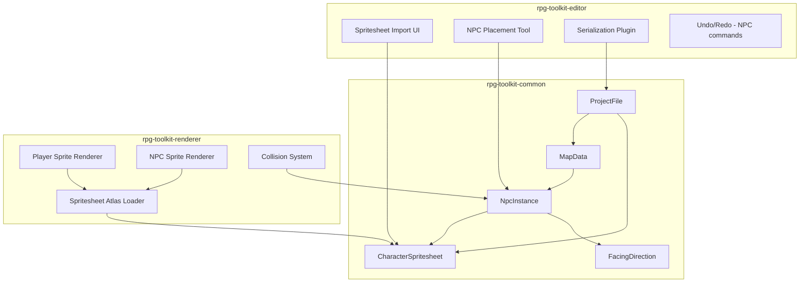
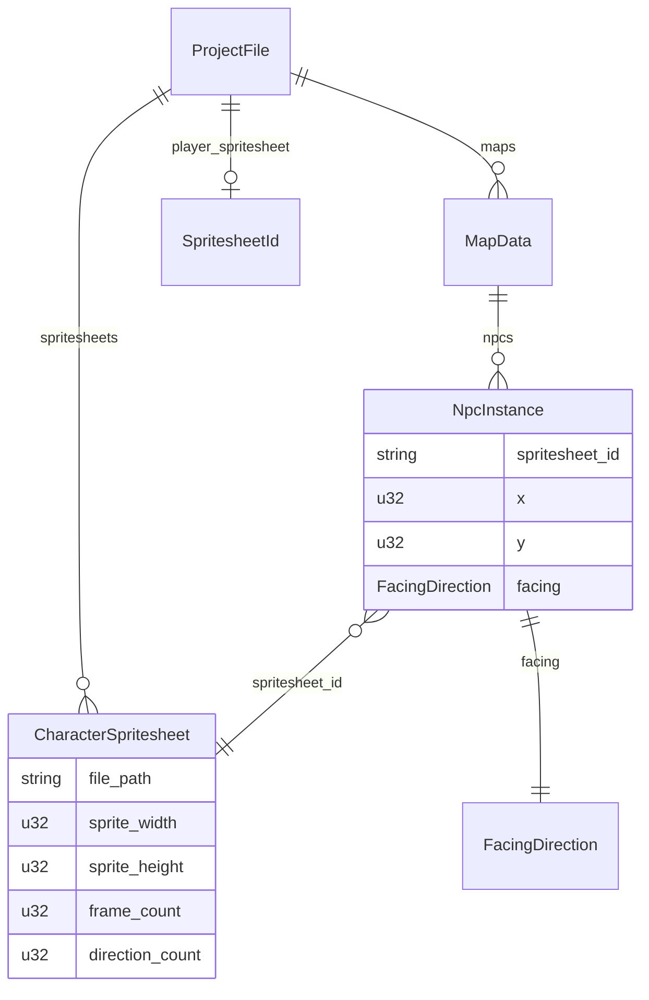

# Design Document: Character Spritesheets & NPC Placement

## Overview

This feature replaces the solid-color player rectangle with animated directional sprites and introduces NPC entities that can be placed on maps via the editor. The design follows the project's "nouns before verbs" philosophy: we define the data models (spritesheet metadata, NPC instances) first, wire them into serialization, then build the rendering and editing tools on top.

The implementation spans all three crates:
- **rpg-toolkit-common**: New data types (`CharacterSpritesheet`, `NpcInstance`, `FacingDirection`, `SpritesheetId`) and extended `ProjectFile` / `MapData` serialization.
- **rpg-toolkit-editor**: Spritesheet import UI, NPC placement tool (new `AttributeTool` variant), undo/redo support for NPC operations.
- **rpg-toolkit-renderer**: Spritesheet texture atlas loading, animated player sprite, NPC sprite spawning, and NPC-aware collision.

Key design decisions:
1. **Spritesheet layout is fixed at 72×128 (3×4 grid of 24×32 frames)**. This matches the RPG Maker standard and avoids a configurable-but-complex metadata system. Validation rejects non-conforming images at import time.
2. **NPCs are per-map, stored in `MapData`** alongside layers. They are not layer-specific entities — they occupy a grid position and block movement on the player's layer.
3. **Collision is extended, not replaced**. The existing `is_tile_blocked` function gains an NPC check in addition to the opacity attribute check.
4. **The NPC data model uses `#[serde(default)]` for future fields** (event triggers, patrol paths) so existing project files remain forward-compatible.

## Architecture



The data flows top-down: common types define the schema, the editor writes them, and the renderer reads them. The spritesheet atlas is built once at load time and shared between player and NPC rendering.

## Components and Interfaces

### rpg-toolkit-common — New Types

| Type | Purpose |
|------|---------|
| `SpritesheetId` | Type alias (`String`), analogous to `TilesetId` / `MapId` |
| `FacingDirection` | Enum: `Down`, `Left`, `Right`, `Up` (row indices 0–3) |
| `CharacterSpritesheet` | Struct: `file_path`, `sprite_width` (24), `sprite_height` (32), `frame_count` (3), `direction_count` (4) |
| `NpcInstance` | Struct: `spritesheet_id`, `x`, `y`, `facing`, plus `#[serde(default)]` future fields |

### rpg-toolkit-common — Extended Types

| Type | Change |
|------|--------|
| `ProjectFile` | Add `spritesheets: HashMap<SpritesheetId, CharacterSpritesheet>`, `player_spritesheet: Option<SpritesheetId>` |
| `MapData` | Add `npcs: Vec<NpcInstance>` with `#[serde(default)]` |

### rpg-toolkit-editor — New Components

| Component | Purpose |
|-----------|---------|
| `AttributeTool::NpcPlacement` | New variant in the existing `AttributeTool` enum |
| `EditCommandKind::PlaceNpc` | Undo/redo command for NPC add/edit |
| `EditCommandKind::RemoveNpc` | Undo/redo command for NPC removal |
| `NpcPlacementDialog` | Egui resource for the NPC placement/edit dialog |
| Spritesheet import UI | Panel in the app shell for importing/managing spritesheets |

### rpg-toolkit-renderer — New Components

| Component | Purpose |
|-----------|---------|
| `NpcSprite` | Marker component on NPC sprite entities, stores `npc_index` |
| `PlayerSpriteState` | Component tracking `facing: FacingDirection`, `animation_frame: usize`, `animation_timer: f32` |
| `RendererProjectData` extension | Add `spritesheet_textures` and `spritesheet_atlas_layouts` HashMaps |
| `AnimationConfig` | Resource: `frame_duration: f32` (configurable walk animation speed) |

### Key Interfaces

**Spritesheet atlas construction** (renderer startup):
```rust
fn build_spritesheet_atlas(spritesheet: &CharacterSpritesheet) -> TextureAtlasLayout {
    TextureAtlasLayout::from_grid(
        UVec2::new(24, 32),  // sprite_width, sprite_height
        3,                    // columns (frames)
        4,                    // rows (directions)
        None,
        None,
    )
}
```

**Frame index calculation**:
```rust
fn sprite_atlas_index(facing: FacingDirection, frame: usize) -> usize {
    let row = facing as usize; // Down=0, Left=1, Right=2, Up=3
    row * 3 + frame            // 3 frames per row
}
```

**NPC collision check** (extends existing `is_tile_blocked`):
```rust
fn is_tile_blocked(map: &MapData, x: u32, y: u32) -> bool {
    let opacity_blocked = map.layers.iter().any(|layer| /* existing check */);
    let npc_blocked = map.npcs.iter().any(|npc| npc.x == x && npc.y == y);
    opacity_blocked || npc_blocked
}
```

## Data Models

### CharacterSpritesheet

```rust
pub type SpritesheetId = String;

#[derive(Clone, Debug, PartialEq, Eq, Serialize, Deserialize)]
pub struct CharacterSpritesheet {
    pub file_path: String,
    pub sprite_width: u32,   // always 24
    pub sprite_height: u32,  // always 32
    pub frame_count: u32,    // always 3
    pub direction_count: u32, // always 4
}
```

Stored in `ProjectFile::spritesheets: HashMap<SpritesheetId, CharacterSpritesheet>`.

### FacingDirection

```rust
#[derive(Clone, Copy, Debug, Default, PartialEq, Eq, Serialize, Deserialize)]
pub enum FacingDirection {
    #[default]
    Down = 0,
    Left = 1,
    Right = 2,
    Up = 3,
}
```

The numeric values map directly to spritesheet row indices.

### NpcInstance

```rust
#[derive(Clone, Debug, PartialEq, Serialize, Deserialize)]
pub struct NpcInstance {
    pub spritesheet_id: SpritesheetId,
    pub x: u32,
    pub y: u32,
    pub facing: FacingDirection,
    // Future-compatible fields (deferred, Requirement 9)
    #[serde(default)]
    pub event_triggers: Vec<EventAction>,
    #[serde(default)]
    pub patrol_path: Vec<(u32, u32)>,
}
```

Stored in `MapData::npcs: Vec<NpcInstance>` with `#[serde(default)]`.

### Extended ProjectFile

```rust
pub struct ProjectFile {
    pub maps: HashMap<MapId, MapData>,
    pub tilesets: HashMap<TilesetId, TilesetMeta>,
    #[serde(default)]
    pub spawn_point: Option<SpawnPoint>,
    // New fields
    #[serde(default)]
    pub spritesheets: HashMap<SpritesheetId, CharacterSpritesheet>,
    #[serde(default)]
    pub player_spritesheet: Option<SpritesheetId>,
}
```

### Extended MapData

```rust
pub struct MapData {
    // ... existing fields ...
    #[serde(default)]
    pub npcs: Vec<NpcInstance>,
}
```

### Editor Undo/Redo Commands

```rust
pub enum EditCommandKind {
    // ... existing variants ...
    PlaceNpc {
        npc_index: Option<usize>, // None = new, Some = edit (stores old)
        old_npc: Option<NpcInstance>,
        new_npc: NpcInstance,
    },
    RemoveNpc {
        npc_index: usize,
        removed_npc: NpcInstance,
    },
}
```

### Renderer NPC Components

```rust
#[derive(Component)]
pub struct NpcSprite {
    pub npc_index: usize,
}

#[derive(Component)]
pub struct PlayerSpriteState {
    pub facing: FacingDirection,
    pub animation_frame: usize,  // 0, 1, 2
    pub animation_timer: f32,
    pub is_moving: bool,
}

#[derive(Resource)]
pub struct AnimationConfig {
    pub frame_duration: f32, // seconds per frame, default 0.15
}
```

### Renderer Extended Resources

```rust
pub struct RendererProjectData {
    // ... existing fields ...
    pub spritesheet_textures: HashMap<SpritesheetId, Handle<Image>>,
    pub spritesheet_atlas_layouts: HashMap<SpritesheetId, Handle<TextureAtlasLayout>>,
}
```

### Mermaid: Data Model Relationships




## Correctness Properties

*A property is a characteristic or behavior that should hold true across all valid executions of a system — essentially, a formal statement about what the system should do. Properties serve as the bridge between human-readable specifications and machine-verifiable correctness guarantees.*

### Property 1: Spritesheet dimension validation

*For any* image dimensions `(width, height)`, the spritesheet validation function should return `Ok` if and only if `width == 72` and `height == 128`. All other dimensions should produce an error.

**Validates: Requirements 1.2, 1.3**

### Property 2: ProjectFile serialization round-trip

*For any* valid `ProjectFile` containing spritesheets, NPC instances, a player spritesheet reference, maps, and tilesets, serializing to JSON and then deserializing should produce an equivalent `ProjectFile`.

**Validates: Requirements 1.4, 1.5, 1.6, 5.4**

### Property 3: Spritesheet reference tracking

*For any* project state with spritesheets, NPC instances, and a player spritesheet reference, the function that computes references for a given spritesheet should return exactly the set of NPC instances and the player reference (if any) that point to that spritesheet. A spritesheet with a non-empty reference set should be flagged as "in use".

**Validates: Requirements 2.1, 2.3**

### Property 4: Player rendering mode follows spritesheet presence

*For any* project state, if `player_spritesheet` is `Some(id)` and `id` exists in the spritesheet registry, the player spawn logic should produce a sprite entity with a texture atlas. If `player_spritesheet` is `None`, the player spawn logic should produce a solid-color sprite.

**Validates: Requirements 3.2, 3.3**

### Property 5: Sprite atlas index correctness

*For any* `FacingDirection` and *for any* frame index in `{0, 1, 2}`, the function `sprite_atlas_index(facing, frame)` should return `facing_row * 3 + frame`, where `facing_row` is the ordinal value of the direction (Down=0, Left=1, Right=2, Up=3). The result should always be in the range `[0, 12)`.

**Validates: Requirements 3.5, 7.2**

### Property 6: Walk animation frame cycling

*For any* `FacingDirection` and *for any* non-negative elapsed time and positive frame duration, the animation system should produce frame index `floor(elapsed / frame_duration) % 3`, cycling through frames 0, 1, 2 continuously while the player is moving.

**Validates: Requirements 4.1**

### Property 7: Idle pose is middle frame

*For any* `FacingDirection`, when the player is stationary (not moving), the displayed animation frame should be frame index 1 (the middle frame).

**Validates: Requirements 4.2, 4.4**

### Property 8: Facing direction matches movement direction

*For any* movement direction, when the player begins moving, the player's `FacingDirection` should be updated to match the movement direction before the walk animation starts.

**Validates: Requirements 4.3**

### Property 9: NPC spritesheet reference validation

*For any* `ProjectFile` containing an `NpcInstance` whose `spritesheet_id` does not exist in the `spritesheets` registry, the project validation function should return an error referencing the invalid spritesheet ID.

**Validates: Requirements 5.3**

### Property 10: NPC placement creates correct instance

*For any* valid tile position `(x, y)`, *for any* `SpritesheetId` present in the registry, and *for any* `FacingDirection`, placing an NPC should add an `NpcInstance` to the map's `npcs` list with exactly those values, increasing the NPC count by one.

**Validates: Requirements 6.3**

### Property 11: NPC undo/redo round-trip

*For any* NPC placement or removal operation, applying the operation and then undoing it should restore the map's `npcs` list to its original state. Applying the operation, undoing, then redoing should produce the same state as just applying the operation.

**Validates: Requirements 6.6, 6.7**

### Property 12: NPC collision blocks tile

*For any* map and *for any* `NpcInstance` at position `(x, y)`, the collision check `is_tile_blocked(map, x, y)` should return `true`. Additionally, for any tile already blocked by opacity attributes, adding or removing an NPC should not change the blocked state (it remains blocked).

**Validates: Requirements 7.4, 8.1, 8.3**

### Property 13: NPC world position matches grid conversion

*For any* `NpcInstance` at grid position `(x, y)` on a map with tile dimensions `(tw, th)`, the NPC sprite's world position should equal `grid_to_world(x, y, tw, th)`.

**Validates: Requirements 7.3**

### Property 14: Forward-compatible NPC deserialization

*For any* valid `NpcInstance` JSON that omits the `event_triggers` and `patrol_path` fields, deserialization should succeed and produce an `NpcInstance` with empty defaults for those fields. Re-serializing should include the default values, and a second round-trip should be stable.

**Validates: Requirements 9.1, 9.2**

## Error Handling

| Scenario | Behavior | Crate |
|----------|----------|-------|
| Spritesheet image is not 72×128 | Return `CommonError::ProjectValidationError` with descriptive message; reject import | common / editor |
| Spritesheet file not found on disk during project load | Log warning, skip texture loading, mark spritesheet as unavailable | editor / renderer |
| NPC references non-existent spritesheet during project load | Return `CommonError::ProjectValidationError` listing the invalid reference | common |
| Player spritesheet reference points to non-existent spritesheet | Log warning, fall back to solid-color rectangle | renderer |
| NPC placed at out-of-bounds grid position | Clamp to map bounds during validation; editor prevents via UI | common / editor |
| Removing a spritesheet with active references | Editor shows warning dialog listing references; requires user confirmation | editor |
| Deserialization of old project file without spritesheet/NPC fields | `#[serde(default)]` provides empty defaults; no error | common |
| NPC placement on a tile that already has an NPC | Editor opens edit dialog for existing NPC instead of creating a duplicate | editor |

## Testing Strategy

### Unit Tests

Unit tests cover specific examples, edge cases, and integration points:

- **Spritesheet validation**: Test exact 72×128 acceptance, and rejection of common wrong sizes (71×128, 72×127, 0×0, 100×100).
- **Atlas index calculation**: Test all 12 combinations of 4 directions × 3 frames against expected indices.
- **Idle frame**: Verify frame index 1 is returned for each of the 4 directions when stationary.
- **NPC collision with opacity**: Verify that a tile blocked by opacity remains blocked after NPC placement and after NPC removal.
- **Forward-compatible deserialization**: Deserialize a hand-crafted JSON string missing `event_triggers` and `patrol_path` fields.
- **Spritesheet removal guard**: Verify the reference-checking function correctly identifies NPCs and player references.
- **Editor NPC dialog**: Verify that clicking a tile with an existing NPC returns that NPC's data for pre-population.

### Property-Based Tests

Property-based tests use the `proptest` crate (already in workspace dependencies) with a minimum of 100 iterations per property. Each test references its design document property.

| Test | Property | Generator Strategy |
|------|----------|--------------------|
| `test_spritesheet_validation` | Property 1 | Random `(u32, u32)` dimensions in range 1..256 |
| `test_project_file_round_trip` | Property 2 | Random `ProjectFile` with 0–3 maps, 0–3 spritesheets, 0–5 NPCs per map, optional player spritesheet |
| `test_spritesheet_reference_tracking` | Property 3 | Random project state with 1–3 spritesheets and 0–5 NPCs with random spritesheet references |
| `test_sprite_atlas_index` | Property 5 | All `FacingDirection` variants × frame indices 0–2 (exhaustive, but wrapped in proptest for consistency) |
| `test_walk_animation_cycling` | Property 6 | Random `FacingDirection`, random elapsed time (0.0..10.0), random frame_duration (0.01..1.0) |
| `test_idle_pose_middle_frame` | Property 7 | Random `FacingDirection` |
| `test_facing_matches_movement` | Property 8 | Random `Direction` |
| `test_npc_reference_validation` | Property 9 | Random `ProjectFile` with some NPCs referencing non-existent spritesheet IDs |
| `test_npc_placement` | Property 10 | Random map dimensions, random valid position, random spritesheet ID, random facing |
| `test_npc_undo_redo_round_trip` | Property 11 | Random NPC placement/removal operations on random maps |
| `test_npc_collision` | Property 12 | Random map with random NPCs and random opacity attributes |
| `test_npc_world_position` | Property 13 | Random grid positions and tile dimensions |
| `test_npc_forward_compat_deserialization` | Property 14 | Random `NpcInstance` serialized with and without optional fields |

Each property test will be tagged with a comment:
```rust
// Feature: character-spritesheets, Property N: <property title>
```

### Test Organization

- Property tests go in `tests/properties/` (workspace-level integration tests)
- Unit tests go in `tests/unit/` or as `#[cfg(test)]` modules within the relevant crate
- The `proptest` crate is already declared in `[workspace.dependencies]`
