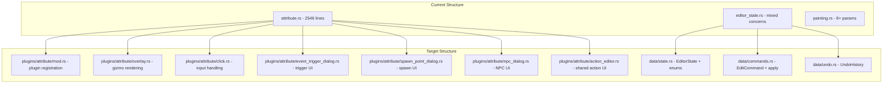

# Design Document: Code Simplification

## Overview

This design describes the decomposition and simplification of the `rpg-toolkit-editor` crate's largest module (`attribute.rs`, 2546 lines) and related structural improvements across the editor. The refactoring preserves all existing behavior while establishing clearer module boundaries, eliminating code duplication, and reducing cognitive load for future development.

The approach follows Rust's module system conventions and Bevy's plugin architecture patterns. No new features are introduced — this is a pure structural refactoring with identical runtime behavior.

## Architecture

The refactoring reorganizes the editor's plugin layer from flat files into a hierarchical module structure where appropriate, while extracting shared patterns into reusable components.



### Design Decisions

1. **Directory module for attribute plugin**: Converting `attribute.rs` to `attribute/mod.rs` with sub-modules. This is idiomatic Rust for modules that grow beyond a single file, and Bevy plugins commonly use this pattern.

2. **Shared `ActionEditorState` struct**: The `EventTriggerDialog` and `NpcPlacementDialog` resources duplicate ~15 fields for action editing. Extracting these into a single struct eliminates the duplication and ensures consistent defaults.

3. **Shared action editor UI function**: Both dialogs render identical UI for adding/editing `EventAction` variants. A single function parameterized by the action list and editor state eliminates ~800 lines of duplication.

4. **`SystemParam` bundles**: Bevy's `SystemParam` derive macro allows grouping related system parameters into named structs, improving readability without changing runtime behavior.

5. **editor_state.rs split**: The file currently mixes three unrelated concerns (editor state, edit commands, undo history). Splitting follows single-responsibility principle and makes each piece independently navigable.

## Components and Interfaces

### Module: `plugins/attribute/mod.rs`

The plugin entry point. Registers all resources and systems, re-exports public types.

```rust
//! Attribute editing plugin — coordinates overlay rendering, click handling,
//! and modal dialogs for opacity, event triggers, spawn points, and NPCs.

mod action_editor;
mod click;
mod event_trigger_dialog;
mod npc_dialog;
mod overlay;
mod spawn_point_dialog;

pub use action_editor::ActionEditorState;
pub use event_trigger_dialog::EventTriggerDialog;
pub use npc_dialog::NpcPlacementDialog;
pub use spawn_point_dialog::SpawnPointConfirmDialog;

pub struct AttributePlugin;

impl Plugin for AttributePlugin {
    fn build(&self, app: &mut App) {
        // Identical resource/system registration as current implementation
    }
}
```

### Module: `plugins/attribute/action_editor.rs`

Shared state and UI for editing `EventAction` variants.

```rust
//! Shared action editor state and UI rendering used by both the
//! Event Trigger Dialog and the NPC Placement Dialog.

/// Consolidated state for editing a single EventAction.
/// Replaces the duplicated field sets in EventTriggerDialog and NpcPlacementDialog.
#[derive(Default)]
pub struct ActionEditorState {
    pub action_type: ActionType,
    pub editing_index: Option<usize>,
    // JumpTo fields
    pub target_map_id: String,
    pub target_x: String,
    pub target_y: String,
    // ShowDialog fields
    pub dialog_text_mode: DialogTextMode,
    pub dialog_inline_text: String,
    pub dialog_text_id: String,
    pub dialog_text_speed: String,
    pub dialog_position: DialogPositionData,
    pub dialog_movement_block: bool,
    // ScreenShake fields
    pub shake_mode: ScreenShakeMode,
    pub shake_intensity: String,
    pub shake_duration: String,
    // FadeTransition fields
    pub fade_type: FadeType,
    pub fade_duration: String,
    pub fade_color: [f32; 4],
    // SetState fields
    pub state_key: String,
    pub state_value: String,
    // SetPlayerAppearance fields
    pub appearance: PlayerAppearance,
    pub appearance_path: String,
}

impl ActionEditorState {
    /// Resets all fields to their defaults.
    pub fn reset(&mut self) { ... }

    /// Populates fields from an existing EventAction for editing.
    pub fn load_from_action(&mut self, action: &EventAction, index: usize) { ... }

    /// Builds an EventAction from the current field values.
    /// Returns None if required fields are empty.
    pub fn build_action(&self) -> Option<EventAction> { ... }
}

/// Renders the action editor UI into the given egui Ui.
/// Operates on the provided action list and editor state.
pub fn render_action_editor(
    ui: &mut egui::Ui,
    actions: &mut Vec<EventAction>,
    editor_state: &mut ActionEditorState,
    id_salt: &str,
    map_entries: &[(String, String)],
) { ... }
```

### Module: `plugins/attribute/overlay.rs`

```rust
//! Gizmo overlay rendering for attribute mode — draws opacity indicators,
//! event trigger markers, spawn point markers, NPC positions, and patrol paths.

pub fn attribute_overlay_system(...) { ... }
```

### Module: `plugins/attribute/click.rs`

```rust
//! Click handling for attribute mode — dispatches to opacity toggle,
//! event trigger dialog, spawn point placement, or NPC placement
//! based on the active AttributeTool.

/// Bundled parameters for the attribute click system.
#[derive(SystemParam)]
pub struct AttributeClickParams<'w, 's> {
    mouse: Res<'w, ButtonInput<MouseButton>>,
    editor_state: Res<'w, EditorState>,
    cursor_state: Res<'w, CursorWorldState>,
    project: ResMut<'w, Project>,
    edit_events: MessageWriter<'w, 's, EditCommand>,
    event_trigger_dialog: ResMut<'w, EventTriggerDialog>,
    spawn_confirm_dialog: ResMut<'w, SpawnPointConfirmDialog>,
    npc_placement_dialog: ResMut<'w, NpcPlacementDialog>,
    any_dialog_open: Res<'w, AnyDialogOpen>,
}

pub fn attribute_click_system(params: AttributeClickParams) { ... }
```

### Module: `plugins/attribute/event_trigger_dialog.rs`

```rust
//! Modal dialog for editing event trigger action sequences on a tile.

#[derive(Resource)]
pub struct EventTriggerDialog {
    pub open: bool,
    pub layer_index: usize,
    pub tile_x: u32,
    pub tile_y: u32,
    pub actions: Vec<EventAction>,
    pub original_actions: Vec<EventAction>,
    pub action_editor: ActionEditorState,  // Replaces 15+ individual fields
}

pub fn event_trigger_panel_ui(...) -> Result { ... }
```

### Module: `plugins/attribute/npc_dialog.rs`

```rust
//! Modal dialog for placing and editing NPCs on the map.

#[derive(Resource)]
pub struct NpcPlacementDialog {
    pub open: bool,
    pub tile_x: u32,
    pub tile_y: u32,
    pub selected_spritesheet_id: Option<SpritesheetId>,
    pub selected_facing: FacingDirection,
    pub editing_index: Option<usize>,
    pub original_npc: Option<NpcInstance>,
    // Patrol config
    pub patrol_waypoints: Vec<(u32, u32)>,
    pub patrol_mode: PatrolMode,
    pub patrol_speed: String,
    pub patrol_pause: String,
    pub adding_waypoints: bool,
    // Event triggers
    pub trigger_mode: TriggerMode,
    pub event_triggers: Vec<EventAction>,
    pub action_editor: ActionEditorState,  // Replaces 15+ individual fields
}

impl NpcPlacementDialog {
    /// Resets all fields to defaults for a fresh dialog.
    pub fn reset(&mut self) { ... }

    /// Opens the dialog for new NPC placement at the given tile.
    pub fn open_new(&mut self, tile_x: u32, tile_y: u32, default_spritesheet: Option<SpritesheetId>) { ... }

    /// Opens the dialog pre-populated from an existing NPC for editing.
    pub fn open_edit(&mut self, index: usize, npc: &NpcInstance) { ... }
}

pub fn npc_placement_dialog_ui(...) -> Result { ... }
```

### Module: `plugins/attribute/spawn_point_dialog.rs`

```rust
//! Confirmation dialog for moving the project spawn point.

#[derive(Resource, Default)]
pub struct SpawnPointConfirmDialog { ... }

pub fn spawn_point_confirm_ui(...) -> Result { ... }
```

### Module: `data/state.rs`

```rust
//! Editor state resource and related enums (EditorTool, EditorMode, AttributeTool).

pub struct EditorState { ... }
pub enum EditorTool { ... }
pub enum EditorMode { ... }
pub enum AttributeTool { ... }
pub struct AnyDialogOpen(pub bool);
```

### Module: `data/commands.rs`

```rust
//! Edit commands for undo/redo support — defines EditCommand, EditCommandKind,
//! and their apply/apply_inverse implementations.

pub struct EditCommand { ... }
pub enum EditCommandKind { ... }
```

### Module: `data/undo.rs`

```rust
//! Undo/redo history management.

pub struct UndoHistory { ... }
```

### Module: `data/mod.rs` (updated)

```rust
pub mod commands;
pub mod map;
pub mod project;
pub mod state;
pub mod tileset;
pub mod undo;

// Re-exports remain identical to current public API
pub use commands::{EditCommand, EditCommandKind};
pub use state::{AnyDialogOpen, AttributeTool, EditCommand, EditorMode, EditorState, EditorTool, StampBrushSelection};
pub use undo::UndoHistory;
pub use map::MapDataEditorExt;
pub use project::{Project, ProjectFile};
pub use tileset::TilesetMeta;
```

### SystemParam for painting.rs

```rust
/// Bundled parameters for the painting system.
#[derive(SystemParam)]
pub struct PaintingParams<'w, 's> {
    mouse: Res<'w, ButtonInput<MouseButton>>,
    keys: Res<'w, ButtonInput<KeyCode>>,
    cursor_state: Res<'w, CursorWorldState>,
    project: ResMut<'w, Project>,
    editor_state: ResMut<'w, EditorState>,
    tool: Res<'w, EditorTool>,
    edit_events: MessageWriter<'w, 's, EditCommand>,
    any_dialog_open: Res<'w, AnyDialogOpen>,
}
```

## Data Models

### ActionEditorState (new shared struct)

| Field | Type | Default | Purpose |
|-------|------|---------|---------|
| `action_type` | `ActionType` | `JumpTo` | Currently selected action variant |
| `editing_index` | `Option<usize>` | `None` | Index of action being edited |
| `target_map_id` | `String` | `""` | JumpTo target map |
| `target_x` | `String` | `"0"` | JumpTo X coordinate |
| `target_y` | `String` | `"0"` | JumpTo Y coordinate |
| `dialog_text_mode` | `DialogTextMode` | `Inline` | ShowDialog text source |
| `dialog_inline_text` | `String` | `""` | Inline dialog text |
| `dialog_text_id` | `String` | `""` | Text ID reference |
| `dialog_text_speed` | `String` | `"30"` | Characters per second |
| `dialog_position` | `DialogPositionData` | `Bottom` | Dialog position |
| `dialog_movement_block` | `bool` | `true` | Block movement during dialog |
| `shake_mode` | `ScreenShakeMode` | `Timed` | Shake mode |
| `shake_intensity` | `String` | `"5.0"` | Shake intensity |
| `shake_duration` | `String` | `"0.5"` | Shake duration |
| `fade_type` | `FadeType` | `FadeOut` | Fade direction |
| `fade_duration` | `String` | `"1.0"` | Fade duration |
| `fade_color` | `[f32; 4]` | `[0,0,0,1]` | Fade color RGBA |
| `state_key` | `String` | `""` | SetState key |
| `state_value` | `String` | `""` | SetState value |
| `appearance` | `PlayerAppearance` | `Hidden` | Appearance variant |
| `appearance_path` | `String` | `""` | Spritesheet path |

### Revised EventTriggerDialog

Reduces from ~30 fields to ~6 fields + embedded `ActionEditorState`.

### Revised NpcPlacementDialog

Reduces from ~35 fields to ~14 fields + embedded `ActionEditorState`. The `open_new` and `open_edit` methods replace the two duplicated 30-line initialization blocks in `attribute_click_system`.

## Error Handling

This refactoring does not introduce new error paths. All existing error handling patterns are preserved:

- **Dialog validation**: Empty required fields prevent action creation (unchanged)
- **Bounds checking**: Tile coordinates validated against map dimensions (unchanged)
- **Parse fallbacks**: String-to-number parsing uses `unwrap_or(default)` (unchanged)
- **Bevy Result returns**: Dialog UI systems continue returning `Result` for EguiContext access (unchanged)

No new error types or recovery mechanisms are needed since this is a structural refactoring.

## Testing Strategy

### Approach

This is a pure structural refactoring — no functional logic changes. The testing strategy focuses on **compilation correctness** and **behavioral preservation** rather than property-based testing.

**Why PBT does not apply**: The requirements describe code organization (module splitting, field consolidation, parameter grouping). These are architectural concerns with no algorithmic logic that varies meaningfully with input. The existing property tests in `tests/properties/` already validate the functional behavior that must be preserved.

### Verification Methods

1. **Compilation check**: `cargo build` must succeed with no new warnings after all changes
2. **Existing property tests**: All tests in `tests/properties/` must pass unchanged:
   - `project_round_trip` — serialization round-trip
   - `walk_animation` — animation frame logic
   - `dialog_bleedthrough` — dialog blocking behavior
   - `preservation` — canvas interaction preservation
3. **Public API surface**: The `plugins/mod.rs` re-exports and `data/mod.rs` re-exports must expose identical types to the rest of the crate
4. **No runtime behavior change**: The refactoring is purely structural — same systems registered in the same schedules with the same ordering constraints

### Test Execution

```bash
# Verify compilation
cargo build --workspace

# Run existing property tests
cargo test --package rpg-toolkit-properties

# Run any unit tests
cargo test --workspace
```

### Module Size Validation

After decomposition, verify no attribute sub-module exceeds 500 lines:
- `overlay.rs`: ~120 lines (gizmo rendering)
- `click.rs`: ~150 lines (input dispatch)
- `event_trigger_dialog.rs`: ~200 lines (dialog UI, delegates to action_editor)
- `npc_dialog.rs`: ~250 lines (dialog UI, delegates to action_editor)
- `spawn_point_dialog.rs`: ~80 lines (confirmation dialog)
- `action_editor.rs`: ~400 lines (shared action editing UI + state)
- `mod.rs`: ~30 lines (plugin registration + re-exports)
