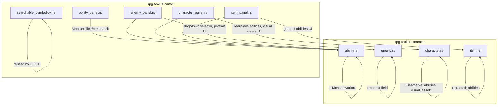

# Design Document

## Overview

This design covers six enhancements to the RPG toolkit's database editor system. The changes span the `rpg-toolkit-common` data model crate and the `rpg-toolkit-editor` UI crate (Bevy + egui). The features introduce a new ability category variant, replace free-text inputs with searchable dropdown selectors, add character ability progression, add enemy portraits, add equipment-granted abilities, and add character visual asset fields.

All six features follow existing patterns in the codebase: data model changes in the common crate with validation logic and serde support, and UI changes in the editor crate's plugin panels using egui widgets. The existing `searchable_combobox` utility module provides the dropdown filter pattern reused across multiple features.

## Architecture



The architecture is a straightforward layered design:
1. **Data Layer** (`rpg-toolkit-common`): Structs, enums, registries with validation logic, and serde serialization.
2. **UI Layer** (`rpg-toolkit-editor`): Bevy plugin panels that read/write the data layer through the `Project` resource.

Each feature touches one or two data model files and their corresponding panel(s). No new crates or cross-cutting concerns are introduced.

## Components and Interfaces

### Requirement 1: Monster Ability Category

**Data model change** (`ability.rs`):
- Add `Monster` variant to `AbilityCategory` enum.
- No new methods needed — existing `create_ability`, `update_category`, and `filtered_abilities` already work with the enum generically.

**UI change** (`ability_panel.rs`):
- Add `"Monster"` option to the category filter ComboBox.
- Add `"Monster"` option to the create dialog category selector.
- Add `"Monster"` option to the category edit ComboBox.
- Add a `category_display_name` match arm for `AbilityCategory::Monster => "Monster"`.

### Requirement 2: Enemy Ability Dropdown Selection

**UI change** (`enemy_panel.rs`):
- Replace the free-text `add_ability_id_buffer` + "Add" button with the `searchable_combobox` widget.
- Build the items list as `Vec<(String, String)>` from `AbilityRegistry::filtered_abilities(None)`, formatting labels as `"{display_name} [{category}]"`.
- On selection, call `EnemyRegistry::add_ability(enemy_id, selected_ability_id)`.
- Show "No abilities available" message when `AbilityRegistry` is empty.
- Show error when max 10 abilities reached.
- Prevent duplicate assignment (already handled by `add_ability` validation).

**State change** (`EnemyPanelState`):
- Keep `ability_search_buffer: String` for the searchable combobox filter state.

### Requirement 3: Character Ability Learning System

**Data model change** (`character.rs`):
- Add `LearnableAbility` struct: `{ ability_id: AbilityId, required_level: u32 }`.
- Add `learnable_abilities: Vec<LearnableAbility>` field to `Character`.
- Add methods to `CharacterRegistry`:
  - `add_learnable_ability(id, ability_id, level) -> Result<(), CommonError>` — validates level 1–99, rejects duplicates, enforces max 20 entries.
  - `remove_learnable_ability(id, ability_id) -> Result<(), CommonError>`
  - `update_learnable_ability_level(id, ability_id, new_level) -> Result<(), CommonError>` — clamps level to 1–99.

**UI change** (`character_panel.rs`):
- Add "Learnable Abilities" section after stats.
- Display entries sorted by `required_level` ascending, showing ability display name and level.
- Provide a searchable dropdown (using `searchable_combobox`) to add new learnable abilities.
- Provide DragValue for level input (range 1..=99).
- Provide remove button per entry.
- Show "No abilities available" when `AbilityRegistry` is empty.

**State change** (`CharacterPanelState`):
- Add `add_learnable_search_buffer: String`.
- Add `add_learnable_level: u32` (default 1).
- Add `add_learnable_error: Option<String>`.

### Requirement 4: Enemy Portrait

**Data model change** (`enemy.rs`):
- Add `portrait: Option<String>` field to `Enemy` struct (defaults to `None` in `create_enemy`).
- Add methods to `EnemyRegistry`:
  - `set_portrait(id, path) -> Result<(), CommonError>` — trims, validates non-empty after trim, truncates to 260 chars.
  - `clear_portrait(id) -> Result<(), CommonError>` — sets to `None`.

**UI change** (`enemy_panel.rs`):
- Add "Portrait" section in the central panel.
- Show "No portrait assigned" label when `None`.
- Single-line text input for path (truncate to 260).
- "Clear" button to reset to `None`.
- Validate on lost focus: if trimmed value is empty, show error and don't store.

**State change** (`EnemyPanelState`):
- Add `portrait_buffer: String`.
- Add `portrait_error: Option<String>`.

### Requirement 5: Equipment-Granted Abilities

**Data model change** (`item.rs`):
- Add `granted_abilities: Vec<AbilityId>` field to `Item` struct (defaults to empty `Vec`).
- Initialize as empty in `create_item` for all categories.
- Add methods to `ItemRegistry`:
  - `add_granted_ability(id, ability_id) -> Result<(), CommonError>` — validates item is equippable (Weapon/Armor/Accessory), validates non-empty ability_id, rejects duplicates, enforces max 4.
  - `remove_granted_ability(id, ability_id) -> Result<(), CommonError>`
- When `change_category` is called:
  - If new category is `Consumable` or `KeyItem`, clear `granted_abilities`.
  - Otherwise, preserve existing list.

**UI change** (`item_panel.rs`):
- Add "Granted Abilities" section (visible only for Weapon/Armor/Accessory).
- Display each granted ability by display name + category bracket.
- Searchable dropdown to add abilities.
- Remove button per entry.
- Show "No abilities available" when registry is empty.
- Show error when max 4 reached or duplicate.

**State change** (`ItemPanelState`):
- Add `granted_ability_search_buffer: String`.
- Add `granted_ability_error: Option<String>`.

### Requirement 6: Character Visual Assets

**Data model change** (`character.rs`):
- Add `VisualAssets` struct: `{ spritesheet: Option<String>, face_portrait: Option<String>, status_portrait: Option<String> }`.
- Add `visual_assets: VisualAssets` field to `Character` (defaults all `None`).
- Add methods to `CharacterRegistry`:
  - `set_visual_asset(id, asset_type, path) -> Result<(), CommonError>` — trims, if empty after trim sets to None, otherwise truncates to 260 chars and stores.
  - `clear_visual_asset(id, asset_type) -> Result<(), CommonError>` — sets specific field to None.

**UI change** (`character_panel.rs`):
- Add "Visual Assets" section with three single-line text inputs.
- Each shows placeholder "No asset assigned" when None.
- Truncate to 260 chars.
- On lost focus: trim, if empty → set to None, otherwise store.
- Clear button per field.
- Mark `has_unsaved_character_changes` on any modification.

**State change** (`CharacterPanelState`):
- Add `spritesheet_buffer: String`.
- Add `face_portrait_buffer: String`.
- Add `status_portrait_buffer: String`.

## Data Models

### Modified Enums

```rust
// ability.rs
#[derive(Clone, Copy, Debug, PartialEq, Eq, Serialize, Deserialize)]
pub enum AbilityCategory {
    Skill,
    Spell,
    SpecialAction,
    Monster,  // NEW
}
```

### New Structs

```rust
// character.rs
#[derive(Clone, Debug, PartialEq, Eq, Serialize, Deserialize)]
pub struct LearnableAbility {
    pub ability_id: AbilityId,
    pub required_level: u32,  // 1..=99
}

#[derive(Clone, Debug, Default, PartialEq, Eq, Serialize, Deserialize)]
pub struct VisualAssets {
    pub spritesheet: Option<String>,       // max 260 chars
    pub face_portrait: Option<String>,     // max 260 chars
    pub status_portrait: Option<String>,   // max 260 chars
}
```

### Modified Structs

```rust
// character.rs
pub struct Character {
    pub id: CharacterId,
    pub display_name: String,
    pub stats: Vec<Stat>,
    pub learnable_abilities: Vec<LearnableAbility>,  // NEW
    pub visual_assets: VisualAssets,                  // NEW
}

// enemy.rs
pub struct Enemy {
    pub id: EnemyId,
    pub display_name: String,
    pub description: String,
    pub stats: Vec<EnemyStat>,
    pub defeat_rewards: DefeatReward,
    pub carried_items: Vec<CarriedItem>,
    pub elemental_modifiers: Vec<ElementalModifier>,
    pub abilities: Vec<AbilityId>,
    pub portrait: Option<String>,  // NEW, max 260 chars
}

// item.rs
pub struct Item {
    pub id: ItemId,
    pub display_name: String,
    pub description: String,
    pub category_data: ItemCategoryData,
    pub value: u32,
    pub rarity: Rarity,
    pub stackable: bool,
    pub stack_limit: u32,
    pub stat_modifiers: Vec<StatModifier>,
    pub granted_abilities: Vec<AbilityId>,  // NEW, max 4 for equippable
}
```

### Serialization

All new fields use `#[serde(default)]` to ensure backward compatibility with existing JSON data files. When deserializing older files without these fields:
- `learnable_abilities` → empty `Vec`
- `visual_assets` → `VisualAssets::default()` (all `None`)
- `portrait` → `None`
- `granted_abilities` → empty `Vec`


## Correctness Properties

*A property is a characteristic or behavior that should hold true across all valid executions of a system — essentially, a formal statement about what the system should do. Properties serve as the bridge between human-readable specifications and machine-verifiable correctness guarantees.*

### Property 1: Category filter returns exactly matching abilities

*For any* `AbilityRegistry` and *for any* category filter value (including `None` for "All"), calling `filtered_abilities(filter)` shall return exactly those abilities whose category matches the filter (or all abilities when filter is `None`), and no matching ability shall be excluded from the result.

**Validates: Requirements 1.4, 1.5**

### Property 2: Ability registry serialization round-trip

*For any* valid `AbilityRegistry` containing abilities of all categories including `Monster`, serializing to JSON and deserializing back shall produce a value equal to the original.

**Validates: Requirements 1.6**

### Property 3: Searchable filter correctness

*For any* list of `(id, display_label)` items and *for any* non-empty query string, `filter_items` shall return exactly those items whose `display_label` contains the query as a case-insensitive substring, sorted case-insensitively by `display_label`, with no matching items excluded and no non-matching items included.

**Validates: Requirements 2.2, 2.4, 5.4**

### Property 4: Learnable ability level invariant

*For any* character in the `CharacterRegistry`, every entry in `learnable_abilities` shall have a `required_level` in the range [1, 99] inclusive. Any attempt to add or update a learnable ability with a level outside this range shall result in the stored level being clamped to [1, 99].

**Validates: Requirements 3.1, 3.4, 3.7**

### Property 5: Character serialization round-trip with new fields

*For any* valid `CharacterRegistry` containing characters with `learnable_abilities` and `visual_assets` populated, serializing to JSON and deserializing back shall produce a value equal to the original.

**Validates: Requirements 3.8, 6.7**

### Property 6: Enemy portrait invariant

*For any* enemy in the `EnemyRegistry`, the `portrait` field is either `None` or a non-empty trimmed string of at most 260 characters. Any attempt to set a portrait with a whitespace-only or empty string (after trimming) shall be rejected with an error, and the portrait shall remain unchanged.

**Validates: Requirements 4.1, 4.4, 4.7**

### Property 7: Enemy serialization round-trip with portrait

*For any* valid `EnemyRegistry` containing enemies with and without portrait values, serializing to JSON and deserializing back shall produce a value equal to the original.

**Validates: Requirements 4.6**

### Property 8: Granted abilities category and count constraint

*For any* item in the `ItemRegistry`, if the item's category is `Consumable` or `KeyItem`, then `granted_abilities` shall be empty. If the item's category is `Weapon`, `Armor`, or `Accessory`, then `granted_abilities.len()` shall be at most 4. Any attempt to add a granted ability to a non-equippable item shall be rejected.

**Validates: Requirements 5.1, 5.8**

### Property 9: Item serialization round-trip with granted abilities

*For any* valid `ItemRegistry` containing items with `granted_abilities` populated, serializing to JSON and deserializing back shall produce a value equal to the original.

**Validates: Requirements 5.10**

### Property 10: Visual asset path invariant

*For any* character in the `CharacterRegistry`, each visual asset field (`spritesheet`, `face_portrait`, `status_portrait`) is either `None` or a trimmed non-empty string of at most 260 characters. Setting a field with a whitespace-only or empty string (after trimming) shall result in the field being stored as `None`.

**Validates: Requirements 6.1, 6.4, 6.5, 6.8**

## Error Handling

### Data Model Validation Errors

All validation errors use the existing `CommonError` enum with appropriate variants:

| Operation | Error Condition | Error Variant |
|-----------|----------------|---------------|
| `add_learnable_ability` | Duplicate ability ID | `CharacterValidationError` |
| `add_learnable_ability` | Max 20 entries exceeded | `CharacterValidationError` |
| `set_portrait` | Empty/whitespace path | `EnemyValidationError` |
| `set_portrait` | Enemy not found | `EnemyValidationError` |
| `add_granted_ability` | Non-equippable category | `ItemValidationError` |
| `add_granted_ability` | Duplicate ability ID | `ItemValidationError` |
| `add_granted_ability` | Max 4 exceeded | `ItemValidationError` |
| `add_granted_ability` | Empty ability ID | `ItemValidationError` |
| `remove_granted_ability` | Ability not found | `ItemValidationError` |
| `set_visual_asset` | Character not found | `CharacterValidationError` |
| `clear_visual_asset` | Character not found | `CharacterValidationError` |

### UI Error Display

All panels follow the existing pattern:
- Validation errors display as red-colored text (`egui::Color32::RED`) below the relevant input field.
- Errors clear automatically on the next successful operation.
- State buffers (`*_error: Option<String>`) hold the current error message.

### Backward Compatibility

- New fields use `#[serde(default)]` to gracefully handle deserialization of older JSON files.
- Missing fields deserialize to their default values (empty vecs, `None` options).
- No migration step is required.

## Testing Strategy

### Unit Tests (Example-Based)

Unit tests cover specific scenarios and edge cases:

- **Requirement 1**: Verify Monster variant appears in category display name function, verify it can be created and filtered.
- **Requirement 2**: Verify dropdown label formatting (`"Fireball [Spell]"`), verify empty registry message, verify max-10 error.
- **Requirement 3**: Verify duplicate learnable ability rejection, verify removal, verify empty registry disabled state.
- **Requirement 4**: Verify clear sets to None, verify "No portrait assigned" state, verify empty/whitespace rejection error message.
- **Requirement 5**: Verify max-4 error, verify duplicate rejection, verify removal, verify section hidden for Consumable/KeyItem.
- **Requirement 6**: Verify clear action, verify "No asset assigned" placeholder, verify unsaved changes flag set.

### Property-Based Tests

Property-based tests use `proptest` (already a workspace dependency) and run a minimum of 100 iterations each. Tests are located in `tests/properties/` as integration test files.

New test files:
- `tests/properties/ability_category_filter.rs` — Properties 1, 2
- `tests/properties/searchable_filter.rs` (extend existing) — Property 3
- `tests/properties/character_learnable.rs` — Properties 4, 5
- `tests/properties/enemy_portrait.rs` — Properties 6, 7
- `tests/properties/item_granted_abilities.rs` — Properties 8, 9
- `tests/properties/character_visual_assets.rs` — Property 10

Each property test includes a tag comment:
```rust
// Feature: database-editor-enhancements, Property N: <property_text>
```

**Property test library**: `proptest` 1.x (already in `[workspace.dependencies]`)

**Configuration**: Default proptest config with minimum 100 cases (`ProptestConfig { cases: 100, .. }` or use the default which is 256).
