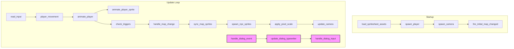

# Design Document: Dialog Foundations

## Overview

This design introduces a foundational dialog system for the RPG toolkit's game renderer. The system enables event-driven dialog boxes that display text with a configurable typewriter effect, support positional placement on screen, and optionally block player movement while active. Dialog text can be supplied inline or referenced by ID from a separate text registry, enabling future localization.

The scope is limited to single-message dialog display. Conversation trees, branching choices, and NPC portrait integration are out of scope.

### Current State

| Area | Current Behavior | Target Behavior |
|---|---|---|
| Dialog display | No dialog system exists | Event-driven dialog boxes with typewriter text reveal |
| Text management | N/A | Text registry with string ID lookup, JSON-loadable, runtime-replaceable |
| Movement during dialog | N/A | Configurable movement blocking while dialog is active |
| Dialog input | N/A | Space/Enter to advance typewriter or dismiss dialog |
| Dialog positioning | N/A | Top, center, or bottom screen placement |

### Key Design Decisions

**D1: Bevy UI nodes for dialog rendering, not world-space sprites.**
Dialog boxes are screen-space overlays that must be independent of the game camera and pixel scale. Bevy's built-in UI system (`Node`, `Text`, `BackgroundColor`) renders in screen space by default, which is exactly what we need. This avoids manual projection math and works correctly with the existing `PixelScaleConfig` camera zoom.

**D2: `DialogState` as an optional Bevy resource, not a component.**
There is at most one active dialog at a time. A resource is the natural ECS pattern for singleton state — its presence/absence cleanly indicates whether a dialog is active. Other systems (like `player_movement`) can check for the resource with `Option<Res<DialogState>>` to gate behavior.

**D3: Movement blocking via resource check in `player_movement`, not a separate system.**
Rather than introducing a new system that clears `MovementIntent`, we add a guard at the top of the existing `player_movement` system. This is simpler, avoids ordering dependencies between a new "clear intent" system and `player_movement`, and follows the existing pattern where `player_movement` already has early-return guards.

**D4: `DialogTextRegistry` as a newtype around `HashMap<String, String>`.**
This keeps the API simple and serde-compatible. The newtype provides insert/get/remove methods and derives `Serialize`/`Deserialize` for JSON round-tripping. It's a Bevy `Resource` that can be replaced at runtime for localization.

**D5: Dialog text content as a `DialogText` enum (Inline vs. Id).**
This cleanly separates the two text sources at the type level and makes serialization unambiguous via serde's tagged enum representation.

**D6: Typewriter effect as a pure computation, not a timer component.**
The visible character count is computed as `min(floor(elapsed * speed), total_len)` each frame. This is a pure function of elapsed time and speed — no need for a separate timer component. The `DialogState` resource tracks elapsed time, and the system recomputes visible characters each frame.

## Architecture

### System Interaction Diagram



The dialog systems form a separate chain that runs alongside the existing update loop:

1. **`handle_dialog_event`** — Reads `ShowDialog` messages, resolves text (inline or registry lookup), spawns UI entities, inserts `DialogState` resource.
2. **`update_dialog_typewriter`** — Advances elapsed time, recomputes visible characters, updates the UI text node.
3. **`handle_dialog_input`** — Reads Space/Enter input. If typewriter is animating, completes it. If text is fully revealed, dismisses the dialog (despawns entities, removes `DialogState`).

The existing `player_movement` system gains a guard: if `DialogState` exists and `movement_blocked` is true, it early-returns without processing movement intent.

### Integration Points

| Existing System | Integration |
|---|---|
| `player_movement` | Checks `Option<Res<DialogState>>` to suppress movement when blocked |
| `read_input` | Unchanged — still writes `MovementIntent` every frame |
| `check_triggers` | Future: could fire `ShowDialog` events from tile event triggers (out of scope for this spec, but the `EventAction` enum in `rpg-toolkit-common` would gain a `ShowDialog` variant) |
| `ProjectRendererPlugin` | Registers new message type, systems, and resources |

## Components and Interfaces

### New Message: `ShowDialog`

```rust
/// Fired to request a dialog box. Ignored if a dialog is already active.
#[derive(Message)]
pub struct ShowDialog {
    pub text: DialogText,
    pub config: DialogConfig,
}
```

### New Enum: `DialogText`

```rust
/// The text content for a dialog event.
#[derive(Clone, Debug, PartialEq, Eq, Serialize, Deserialize)]
#[serde(tag = "type", content = "value")]
pub enum DialogText {
    /// Inline text string.
    Inline(String),
    /// Reference to a text registry entry.
    Id(String),
}
```

### New Struct: `DialogConfig`

```rust
/// Configuration for how a dialog box behaves.
#[derive(Clone, Debug, PartialEq, Serialize, Deserialize)]
pub struct DialogConfig {
    /// Characters revealed per second. 0 means instant reveal.
    #[serde(default = "default_text_speed")]
    pub text_speed: f32,
    /// Vertical placement on screen.
    #[serde(default)]
    pub position: DialogPosition,
    /// Whether to block player movement while dialog is active.
    #[serde(default = "default_movement_block")]
    pub movement_block: bool,
}

fn default_text_speed() -> f32 { 30.0 }
fn default_movement_block() -> bool { true }

impl Default for DialogConfig {
    fn default() -> Self {
        Self {
            text_speed: 30.0,
            position: DialogPosition::Bottom,
            movement_block: true,
        }
    }
}
```

### New Enum: `DialogPosition`

```rust
/// Vertical placement of the dialog box on screen.
#[derive(Clone, Debug, Default, PartialEq, Eq, Serialize, Deserialize)]
pub enum DialogPosition {
    Top,
    Center,
    #[default]
    Bottom,
}
```

### New Resource: `DialogState`

```rust
/// Tracks the active dialog. Present only while a dialog is displayed.
#[derive(Resource)]
pub struct DialogState {
    /// The full text being displayed.
    pub full_text: String,
    /// Total number of characters in the text.
    pub total_chars: usize,
    /// Number of characters currently revealed.
    pub chars_revealed: usize,
    /// Whether all text has been fully revealed.
    pub fully_revealed: bool,
    /// Elapsed time since dialog was spawned (seconds).
    pub elapsed: f32,
    /// Characters per second (from DialogConfig).
    pub text_speed: f32,
    /// Whether player movement is blocked.
    pub movement_blocked: bool,
}
```

### New Resource: `DialogTextRegistry`

```rust
/// A mapping from string IDs to dialog text strings.
/// Loadable from JSON, replaceable at runtime for localization.
#[derive(Resource, Clone, Debug, Default, PartialEq, Serialize, Deserialize)]
pub struct DialogTextRegistry {
    entries: HashMap<String, String>,
}

impl DialogTextRegistry {
    pub fn new() -> Self { Self { entries: HashMap::new() } }

    pub fn from_map(entries: HashMap<String, String>) -> Self {
        Self { entries }
    }

    pub fn insert(&mut self, id: impl Into<String>, text: impl Into<String>) {
        self.entries.insert(id.into(), text.into());
    }

    pub fn get(&self, id: &str) -> Option<&str> {
        self.entries.get(id).map(|s| s.as_str())
    }

    pub fn remove(&mut self, id: &str) -> Option<String> {
        self.entries.remove(id)
    }

    /// Deserialize from a JSON string containing a flat object.
    pub fn from_json(json: &str) -> Result<Self, serde_json::Error> {
        let entries: HashMap<String, String> = serde_json::from_str(json)?;
        Ok(Self { entries })
    }
}
```

### New Marker Component: `DialogBox`

```rust
/// Marker for the root dialog box UI entity.
#[derive(Component)]
pub struct DialogBox;

/// Marker for the dialog text UI entity.
#[derive(Component)]
pub struct DialogTextNode;
```

### New System: `handle_dialog_event`

```rust
/// Reads ShowDialog messages, resolves text, spawns dialog UI, inserts DialogState.
pub fn handle_dialog_event(
    mut show_dialog: MessageReader<ShowDialog>,
    dialog_state: Option<Res<DialogState>>,
    registry: Option<Res<DialogTextRegistry>>,
    mut commands: Commands,
)
```

### New System: `update_dialog_typewriter`

```rust
/// Advances the typewriter effect each frame.
pub fn update_dialog_typewriter(
    time: Res<Time>,
    mut dialog_state: Option<ResMut<DialogState>>,
    mut text_query: Query<&mut Text, With<DialogTextNode>>,
)
```

### New System: `handle_dialog_input`

```rust
/// Reads Space/Enter to advance or dismiss the dialog.
pub fn handle_dialog_input(
    keyboard: Res<ButtonInput<KeyCode>>,
    dialog_state: Option<Res<DialogState>>,
    dialog_entities: Query<Entity, With<DialogBox>>,
    mut commands: Commands,
)
```

### Modified System: `player_movement`

Adds a guard at the top:

```rust
pub fn player_movement(
    intent: Res<MovementIntent>,
    dialog_state: Option<Res<DialogState>>,
    // ... existing params
) {
    // Block movement if dialog is active with movement_block
    if let Some(ref state) = dialog_state {
        if state.movement_blocked {
            return;
        }
    }
    // ... existing movement logic unchanged
}
```

### Pure Function: `compute_visible_chars`

```rust
/// Computes the number of visible characters for the typewriter effect.
/// Returns min(floor(elapsed * text_speed), total_chars) for speed > 0,
/// or total_chars for speed == 0.
pub fn compute_visible_chars(elapsed: f32, text_speed: f32, total_chars: usize) -> usize {
    if text_speed <= 0.0 {
        return total_chars;
    }
    let computed = (elapsed * text_speed).floor() as usize;
    computed.min(total_chars)
}
```

### Plugin Registration

The `ProjectRendererPlugin::build` method gains:

```rust
// Dialog resources
.init_resource::<DialogTextRegistry>()
// Dialog events
.add_message::<ShowDialog>()
// Dialog systems
.add_systems(
    Update,
    (
        handle_dialog_event,
        update_dialog_typewriter.after(handle_dialog_event),
        handle_dialog_input.after(update_dialog_typewriter),
    ),
)
```

And `player_movement` gains the `dialog_state: Option<Res<DialogState>>` parameter.

## Data Models

### Persistent Data (serde-compatible)

| Type | Fields | Serialization |
|---|---|---|
| `DialogConfig` | `text_speed: f32`, `position: DialogPosition`, `movement_block: bool` | JSON with serde defaults |
| `DialogPosition` | `Top`, `Center`, `Bottom` | JSON string enum |
| `DialogText` | `Inline(String)` or `Id(String)` | Tagged JSON: `{"type": "Inline", "value": "..."}` |
| `DialogTextRegistry` | `entries: HashMap<String, String>` | Flat JSON object |

### Runtime-Only Data (ECS)

| Type | Kind | Lifecycle |
|---|---|---|
| `DialogState` | Resource | Inserted on dialog spawn, removed on dismiss |
| `DialogTextRegistry` | Resource | Initialized at startup, persists for app lifetime, replaceable |
| `ShowDialog` | Message | Fired by game logic, consumed by `handle_dialog_event` |
| `DialogBox` | Component | Marker on root dialog UI entity |
| `DialogTextNode` | Component | Marker on text UI entity |

## Correctness Properties

*A property is a characteristic or behavior that should hold true across all valid executions of a system — essentially, a formal statement about what the system should do. Properties serve as the bridge between human-readable specifications and machine-verifiable correctness guarantees.*

### Property 1: Typewriter visible character computation

*For any* non-negative elapsed time, non-negative text speed, and total character count, `compute_visible_chars(elapsed, text_speed, total_chars)` SHALL return `min(floor(elapsed * text_speed), total_chars)` when `text_speed > 0`, and `total_chars` when `text_speed == 0`. The result SHALL always satisfy `0 <= result <= total_chars`.

**Validates: Requirements 3.1, 3.2, 3.4, 3.5**

### Property 2: Advance input completes typewriter

*For any* dialog state where `chars_revealed < total_chars`, applying the advance action SHALL set `chars_revealed` equal to `total_chars` and `fully_revealed` to `true`.

**Validates: Requirements 4.1**

### Property 3: Movement blocking respects config flag

*For any* movement intent direction and dialog state, player movement initiation SHALL be suppressed if and only if the dialog is active with `movement_blocked == true`. When `movement_blocked == false`, the movement intent SHALL be processed normally regardless of dialog activity.

**Validates: Requirements 5.1, 5.2**

### Property 4: In-progress animation completes despite movement block

*For any* in-progress movement animation (with `from`, `to`, `elapsed`, `duration` where `elapsed < duration`) and active dialog with `movement_blocked == true`, the animation SHALL continue advancing by delta time and SHALL complete when `elapsed >= duration`. The movement block SHALL only prevent new movement initiation, not interrupt existing animations.

**Validates: Requirements 5.3**

### Property 5: DialogConfig serde round-trip

*For any* valid `DialogConfig` value (with non-negative `text_speed`, any `DialogPosition` variant, and any `movement_block` boolean), serializing to JSON and then deserializing SHALL produce an equal `DialogConfig`.

**Validates: Requirements 8.2, 8.5**

### Property 6: DialogConfig default deserialization

*For any* subset of `DialogConfig` fields present in a JSON object, deserializing SHALL use the default value for each absent field (`text_speed: 30.0`, `position: Bottom`, `movement_block: true`). The present fields SHALL retain their specified values.

**Validates: Requirements 8.3**

### Property 7: DialogTextRegistry serde round-trip

*For any* valid `DialogTextRegistry` (a `HashMap<String, String>` with arbitrary string keys and values), serializing to JSON and then deserializing SHALL produce an equal `DialogTextRegistry`.

**Validates: Requirements 8.7, 9.5**

### Property 8: Registry insert-get-remove semantics

*For any* sequence of insert, get, and remove operations on a `DialogTextRegistry`, the registry SHALL behave identically to a `HashMap<String, String>`: after `insert(k, v)`, `get(k)` returns `Some(v)`; after `remove(k)`, `get(k)` returns `None`; `get(k)` on a key never inserted returns `None`.

**Validates: Requirements 9.2, 9.3, 9.4, 1.3, 1.4**

### Property 9: Dialog state fully_revealed flag invariant

*For any* `DialogState` with `chars_revealed` and `total_chars`, the `fully_revealed` flag SHALL be `true` if and only if `chars_revealed >= total_chars`.

**Validates: Requirements 7.4**

## Error Handling

| Scenario | Handling |
|---|---|
| `ShowDialog` received while dialog already active | Ignore the event (log at debug level) |
| `DialogText::Id` references missing registry key | Log warning, ignore the event |
| `DialogTextRegistry` resource not present when `Id` lookup needed | Log warning, ignore the event |
| `text_speed` is negative in `DialogConfig` | Treat as 0 (instant reveal) in `compute_visible_chars` |
| Empty text string in dialog event | Spawn dialog with empty text; immediately fully revealed |
| JSON deserialization of `DialogConfig` with unknown fields | serde ignores unknown fields by default (use `#[serde(deny_unknown_fields)]` is NOT applied — forward compatibility) |
| JSON deserialization of `DialogTextRegistry` fails | Return `serde_json::Error` to caller |

All error paths are non-panicking. Systems use early returns when preconditions aren't met, consistent with the existing codebase pattern (see `check_triggers`, `handle_map_change`).

## Testing Strategy

### Property-Based Tests (proptest)

The project uses `proptest` for property-based testing (see `tests/properties/`). Each correctness property maps to a single property-based test with a minimum of 100 iterations.

**Library:** `proptest` (already a workspace dependency)

**Test configuration:** `ProptestConfig::with_cases(100)` minimum per property.

**Tag format:** `Feature: dialog-foundations, Property N: <property_text>`

| Property | Test Target | Generator Strategy |
|---|---|---|
| P1: Typewriter computation | `compute_visible_chars(elapsed, speed, total)` | `elapsed` in 0.0..100.0, `speed` in 0.0..500.0, `total` in 0..10000 |
| P2: Advance completes | `DialogState` advance logic | `chars_revealed` in 0..total, `total` in 1..1000 |
| P3: Movement blocking | Guard logic in `player_movement` | `movement_blocked` bool, `direction` from 4 variants |
| P4: Animation continues | `MoveAnimation` advance logic | `elapsed` in 0.0..duration, `duration` in 0.01..1.0, `delta` in 0.001..0.1 |
| P5: DialogConfig round-trip | `serde_json::to_string` / `from_str` | `text_speed` in 0.0..1000.0, `position` from 3 variants, `movement_block` bool |
| P6: Default deserialization | `serde_json::from_str` with partial JSON | Random subsets of 3 fields |
| P7: Registry round-trip | `serde_json::to_string` / `from_str` | `HashMap` with 0..20 entries, keys/values as `"[a-z]{1,20}"` |
| P8: Registry CRUD | `insert`/`get`/`remove` sequences | Random operation sequences of length 1..50 |
| P9: fully_revealed flag | `DialogState` invariant check | `chars_revealed` in 0..2000, `total_chars` in 0..1000 |

### Unit Tests

Unit tests cover specific examples, integration points, and edge cases:

- **Default values:** `DialogConfig::default()` has `text_speed: 30.0`, `position: Bottom`, `movement_block: true`
- **Default values:** `DialogPosition::default()` is `Bottom`
- **Instant reveal:** `compute_visible_chars(0.0, 0.0, 100)` returns `100`
- **Zero-length text:** `compute_visible_chars(1.0, 30.0, 0)` returns `0`
- **Registry empty lookup:** `DialogTextRegistry::new().get("missing")` returns `None`
- **Advance input keys:** Space and Enter are both recognized as advance input
- **Dialog dismissal restores movement:** After removing `DialogState`, `player_movement` processes intent normally

### Integration Testing

Manual/visual integration tests in the running renderer:

- Dialog box appears at correct screen position (top/center/bottom)
- Typewriter effect reveals text at the configured speed
- Space/Enter advances typewriter, then dismisses dialog
- Player cannot move while dialog is active with `movement_block: true`
- Player can move while dialog is active with `movement_block: false`
- In-progress movement animation completes even when dialog spawns with blocking
- Dialog renders above all game world entities
- Dialog is independent of camera position and pixel scale
