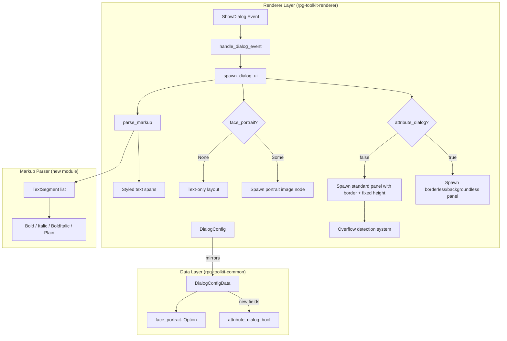

# Design Document: Dialog Rendering Polish

## Overview

This design enhances the dialog rendering system in `rpg-toolkit-renderer` to support six improvements: fixed dialog height, visible borders, overflow indicators, borderless attribute dialogs, inline text style markup, and face portrait display. The changes are primarily in the dialog spawning logic (`dialog.rs`, `systems/dialog.rs`) and the shared data model (`rpg-toolkit-common/src/map.rs`).

The existing dialog system spawns a full-screen overlay with an inner panel (80% width, no fixed height, no border). Text is revealed via a typewriter effect. This design extends that foundation without breaking existing behavior.

## Architecture



The architecture keeps the markup parser as a pure function separate from the Bevy UI spawning logic, enabling property-based testing of the parsing without needing the ECS.

## Components and Interfaces

### New/Modified Structs

#### `DialogConfig` (renderer) and `DialogConfigData` (common)

```rust
// In crates/rpg-toolkit-renderer/src/dialog.rs
pub struct DialogConfig {
    pub text_speed: f32,
    pub position: DialogPosition,
    pub movement_block: bool,
    /// When true, renders without background/border (floating text).
    pub attribute_dialog: bool,
    /// Optional face portrait image path (relative to project assets).
    pub face_portrait: Option<String>,
}

// In crates/rpg-toolkit-common/src/map.rs
pub struct DialogConfigData {
    pub text_speed: f32,
    pub position: DialogPositionData,
    pub movement_block: bool,
    #[serde(default)]
    pub attribute_dialog: bool,
    #[serde(default)]
    pub face_portrait: Option<String>,
}
```

#### `TextStyle` enum (new)

```rust
// In crates/rpg-toolkit-renderer/src/dialog/markup.rs (new module)
#[derive(Clone, Debug, PartialEq, Eq)]
pub enum TextStyle {
    Plain,
    Bold,
    Italic,
    BoldItalic,
}
```

#### `TextSegment` struct (new)

```rust
#[derive(Clone, Debug, PartialEq, Eq)]
pub struct TextSegment {
    pub text: String,
    pub style: TextStyle,
}
```

#### New Component Markers

```rust
/// Marker for the inner dialog panel (the bordered/backgrounded box).
#[derive(Component)]
pub struct DialogPanel;

/// Marker for the overflow indicator entity.
#[derive(Component)]
pub struct OverflowIndicator;

/// Marker for the face portrait image entity.
#[derive(Component)]
pub struct FacePortrait;
```

### New Pure Functions

#### `parse_markup(input: &str) -> Vec<TextSegment>`

Parses underscore-fenced markup into styled segments. Rules:
- `___text___` → BoldItalic
- `__text__` → Bold
- `_text_` → Italic
- Unclosed delimiters → remaining text treated as Plain
- Greedy matching: longest delimiter sequence matched first (3, then 2, then 1)

This function is pure (no side effects, no ECS dependency) and is the primary target for property-based testing.

### Modified Systems

#### `spawn_dialog_ui` (refactored)

The existing function is extended to:
1. Apply fixed height (`Val::Px(120.0)`) to the inner panel
2. Set `overflow: Overflow::clip()` on the panel for content clipping
3. Apply border (`UiRect::all(Val::Px(2.0))`) with a distinct border color
4. Conditionally skip background/border when `attribute_dialog` is true
5. Spawn a face portrait image node when `face_portrait` is Some
6. Parse text through `parse_markup` and spawn multiple `TextSpan` children with appropriate `TextFont` styles

#### `update_dialog_typewriter` (modified)

Extended to work with multiple text span entities. The typewriter reveals characters across spans sequentially.

#### New system: `detect_overflow`

Runs after `handle_dialog_event`. Checks if the text content exceeds the panel's visible area and spawns/despawns the `OverflowIndicator` entity accordingly. Uses a character-count heuristic (estimated characters per line × estimated lines) since Bevy's layout measurement is not easily accessible in systems.

## Data Models

### DialogConfig Extensions

| Field | Type | Default | Description |
|-------|------|---------|-------------|
| `attribute_dialog` | `bool` | `false` | Renders without background/border |
| `face_portrait` | `Option<String>` | `None` | Asset path for portrait image |

### TextSegment

| Field | Type | Description |
|-------|------|-------------|
| `text` | `String` | The text content of this segment |
| `style` | `TextStyle` | The style to apply (Plain, Bold, Italic, BoldItalic) |

### Markup Parsing Grammar

```
text        = (styled_span | plain_char)*
styled_span = bold_italic | bold | italic
bold_italic = "___" inner_text "___"
bold        = "__" inner_text "__"
italic      = "_" inner_text "_"
inner_text  = (any char except the closing delimiter)+
plain_char  = any single character
```

The parser scans left-to-right, greedily matching the longest delimiter first. When an opening delimiter is found, it searches for the matching closing delimiter. If not found before end-of-string, the opening underscores are emitted as plain text.

## Correctness Properties

*A property is a characteristic or behavior that should hold true across all valid executions of a system — essentially, a formal statement about what the system should do. Properties serve as the bridge between human-readable specifications and machine-verifiable correctness guarantees.*

### Property 1: Markup parse preserves text content

*For any* input string, concatenating the `text` fields of all segments returned by `parse_markup` SHALL produce a string equal to the input with all valid delimiter underscores removed. No characters are lost or duplicated during parsing.

**Validates: Requirements 5.1, 5.2, 5.3, 5.4, 5.5**

### Property 2: Markup style classification correctness

*For any* input string constructed by interleaving plain text with properly fenced styled spans (using 1, 2, or 3 underscores), `parse_markup` SHALL assign `Italic` to single-underscore spans, `Bold` to double-underscore spans, and `BoldItalic` to triple-underscore spans, with all other text classified as `Plain`.

**Validates: Requirements 5.1, 5.2, 5.3, 5.4, 5.5**

### Property 3: Unclosed delimiters produce no error and yield plain text

*For any* input string containing an opening underscore delimiter sequence (1, 2, or 3 underscores) that is not closed before end-of-string, `parse_markup` SHALL not panic and SHALL include the unclosed delimiter characters and trailing text as a `Plain` segment.

**Validates: Requirements 5.6**

## Error Handling

| Scenario | Handling |
|----------|----------|
| `face_portrait` path references missing asset | Log a warning, render dialog without portrait (text-only fallback) |
| Markup with unclosed delimiters | Treat unclosed portion as plain text, no error |
| `text_speed` is 0 or negative | Instant reveal (existing behavior preserved) |
| Empty dialog text | Spawn dialog with empty text, dismiss on input (existing behavior) |
| Portrait image fails to load | Spawn dialog without portrait, log warning |
| Overflow detection with very short text | No indicator shown (correct behavior) |

## Testing Strategy

### Property-Based Tests (proptest)

The markup parser (`parse_markup`) is a pure function with clear input/output behavior and a large input space. It is the ideal candidate for property-based testing in this feature.

**Library:** `proptest` (already used in the project)
**Minimum iterations:** 100 per property
**Tag format:** `Feature: dialog-rendering-polish, Property {N}: {description}`

Each correctness property above maps to a single property-based test:
- Property 1 → test that parsed segments reconstruct the input (minus delimiters)
- Property 2 → test that generated markup strings produce correctly classified segments
- Property 3 → test that strings with unclosed delimiters don't panic and yield plain text

### Unit Tests (example-based)

Unit tests cover the non-PBT acceptance criteria:

- **Dialog panel structure**: Verify spawned nodes have correct height, width, overflow, border values
- **Attribute dialog mode**: Verify background is transparent and border is zero when `attribute_dialog=true`
- **Face portrait spawning**: Verify image node is spawned/not-spawned based on config
- **Overflow indicator**: Verify indicator appears for long text, absent for short text
- **DialogConfig conversion**: Verify `dialog_config_from_data` correctly maps new fields

### Integration Tests

- Full dialog lifecycle with markup text (spawn → typewriter → dismiss)
- Attribute dialog rendering (no box, text still animates)
- Portrait dialog layout (portrait + text side by side)
