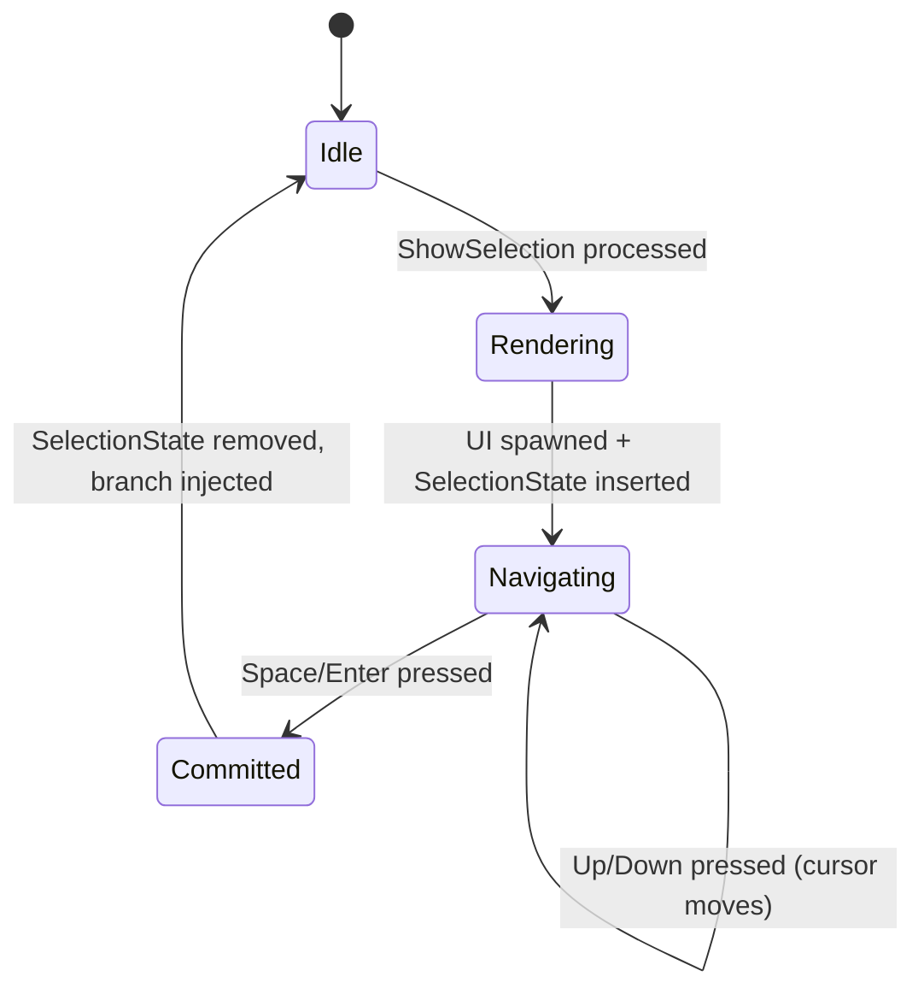

# Design Document: Dialog Selection

## Overview

This design adds a JRPG-style dialog selection system to the RPG toolkit. The feature introduces a new `ShowSelection` variant to the `EventAction` enum, enabling game designers to present players with branching choices during dialog sequences. When triggered, a styled selection prompt appears on screen with a navigable cursor, blocking the action queue until the player commits a choice. The selected branch's actions are then injected into the front of the action queue for sequential processing.

The system integrates with the existing dialog rendering pipeline, action queue resource, movement blocking, and editor tooling — following established patterns (e.g., `ShowDialog`, `Branch`, `StateCheck`) while extending them with interactive cursor navigation.

## Architecture

```mermaid
graph TD
    subgraph "rpg-toolkit-common"
        EA[EventAction::ShowSelection]
        CD[ChoiceData struct]
        EA --> CD
    end

    subgraph "rpg-toolkit-renderer"
        AQ[ActionQueue / advance_action_queue]
        SS[SelectionState resource]
        SEV[ShowSelection event handling]
        SUI[Selection UI entities]
        SIN[Selection input system]
        
        AQ -->|"fires ShowSelection"| SEV
        SEV -->|"spawns"| SUI
        SEV -->|"inserts"| SS
        SIN -->|"reads"| SS
        SIN -->|"on confirm: removes SS, injects branch"| AQ
    end

    subgraph "rpg-toolkit-editor"
        AEF[action_editor_forms::render_show_selection_form]
        AES[ActionEditorState + ShowSelection fields]
        AEU[action_editor_ui dispatch]
        AEU --> AEF
        AEF --> AES
    end
```



### Key Design Decisions

1. **`SelectionState` as a Bevy Resource**: Mirrors the `DialogState` pattern. Its presence signals that a selection prompt is active; its removal signals completion.

2. **`WaitingFor::Selection` variant**: Extends the existing `WaitingFor` enum with a new variant, providing clean integration with the `advance_action_queue` system without special-casing.

3. **Choice labels as `DialogTextData`**: Reuses the existing `DialogTextData` enum for choice labels, enabling localization via the text registry without new infrastructure.

4. **Validation at deserialization boundary**: Choice count (2–6) and label length (1–80 chars) are enforced via a custom serde deserializer using `#[serde(try_from)]`, catching invalid data at the point of entry rather than scattering checks at runtime.

5. **Cursor wrapping with modular arithmetic**: Navigation wraps using `(index + delta).rem_euclid(count)`, keeping the logic simple and testable as a pure function.

## Components and Interfaces

### rpg-toolkit-common (Data Model)

```rust
/// A single choice in a selection prompt.
#[derive(Clone, Debug, PartialEq, Serialize, Deserialize)]
pub struct ChoiceData {
    /// Display label for this choice (inline text or registry ID).
    pub label: DialogTextData,
    /// Actions to execute when this choice is selected.
    #[serde(default)]
    pub actions: Vec<EventAction>,
}

/// New variant added to EventAction enum:
#[serde(tag = "type")]
pub enum EventAction {
    // ... existing variants ...

    /// Present a selection prompt with multiple choices.
    ShowSelection {
        /// Prompt text displayed above the choices.
        prompt: DialogTextData,
        /// Dialog box configuration (position, portrait, etc.).
        config: DialogConfigData,
        /// Ordered list of choices (2–6 inclusive).
        choices: Vec<ChoiceData>,
    },
}
```

**Validation Rules** (enforced via `#[serde(try_from)]` on a helper struct or a custom deserializer):
- `choices.len()` must be in `2..=6`
- Each `ChoiceData.actions.len()` must be `<= 20`
- For inline labels: `label` string must be 1–80 characters
- For ID labels: validation deferred to runtime resolution

### rpg-toolkit-renderer (Runtime)

#### New Resource: `SelectionState`

```rust
/// Tracks an active selection prompt. Present only while the prompt is displayed.
#[derive(Resource)]
pub struct SelectionState {
    /// Index of the currently focused choice (0-based).
    pub cursor_index: usize,
    /// Total number of choices available.
    pub choice_count: usize,
    /// The resolved choice data (labels already resolved from registry).
    pub choices: Vec<ResolvedChoice>,
}

/// A choice with its label resolved to a display string.
pub struct ResolvedChoice {
    pub label: String,
    pub actions: Vec<EventAction>,
}
```

#### New UI Components (Markers)

```rust
#[derive(Component)]
pub struct SelectionBox;       // Root UI entity for the selection prompt

#[derive(Component)]
pub struct SelectionCursor;    // The "▶" cursor indicator

#[derive(Component)]
pub struct SelectionLabel {    // A choice label text entity
    pub index: usize,
}
```

#### New Systems

| System | Schedule | Purpose |
|--------|----------|---------|
| `handle_selection_event` | Update, after `advance_action_queue` | Processes `ShowSelection` from the action queue; spawns UI; inserts `SelectionState` |
| `handle_selection_input` | Update, after `handle_selection_event` | Reads Up/Down/Space/Enter; updates cursor or commits choice |

#### Integration Points

- **`advance_action_queue`**: Extended with `WaitingFor::Selection` — checks for `SelectionState` resource presence.
- **`player_movement`**: Already blocks on `DialogState`; will additionally block when `SelectionState` is present.
- **`npc_patrol_movement`**: Already freezes when `action_queue` is present (which remains during selection).
- **`read_interaction_input`**: Already suppressed when `action_queue` is present.
- **`read_input`**: `MovementIntent` will be consumed by selection navigation instead of player movement when `SelectionState` is present.

### rpg-toolkit-editor (Editor Integration)

#### New `ActionType` Variant

```rust
pub enum ActionType {
    // ... existing variants ...
    ShowSelection,
}
```

#### New Editor State Fields

```rust
pub struct ActionEditorState {
    // ... existing fields ...

    // ShowSelection fields
    pub selection_prompt_mode: DialogTextMode,
    pub selection_prompt_text: String,
    pub selection_prompt_id: String,
    pub selection_position: DialogPositionData,
    pub selection_face_portrait: Option<String>,
    pub selection_choices: Vec<EditorChoice>,
}

pub struct EditorChoice {
    pub label_mode: DialogTextMode,
    pub label_text: String,
    pub label_id: String,
    pub actions: Vec<EventAction>,
}
```

#### Form Renderer

`render_show_selection_form` will provide:
- Prompt text input (inline or registry ID, toggled by radio)
- Position combo box and face portrait selector
- Choice list with Add/Remove buttons (max 6, min 2)
- Per-choice: label input + nested action editor (same recursive pattern as Branch)
- Validation feedback (empty labels, insufficient choices)

## Data Models

### Serialization Format (JSON)

```json
{
  "type": "ShowSelection",
  "prompt": { "type": "Inline", "value": "What will you do?" },
  "config": {
    "text_speed": 30.0,
    "position": "Bottom",
    "movement_block": true,
    "attribute_dialog": false,
    "face_portrait": null
  },
  "choices": [
    {
      "label": { "type": "Inline", "value": "Fight" },
      "actions": [
        { "type": "SetState", "key": "battle_choice", "value": "fight" }
      ]
    },
    {
      "label": { "type": "Id", "value": "choice_flee" },
      "actions": [
        { "type": "ShowDialog", "text": { "type": "Inline", "value": "You ran away!" }, "config": { "text_speed": 30.0, "position": "Bottom", "movement_block": true, "attribute_dialog": false, "face_portrait": null } }
      ]
    }
  ]
}
```

### State Machine



### Resource Lifecycle

| Phase | ActionQueue.waiting_for | SelectionState | UI Entities |
|-------|------------------------|----------------|-------------|
| Before trigger | N/A | Absent | None |
| Processing ShowSelection | `Selection` | Inserted | Spawned |
| Player navigating | `Selection` | Present (cursor updating) | Visible |
| Player confirms | Cleared to `Nothing` | Removed | Despawned |
| After confirm | N/A (queue advances) | Absent | None |


## Correctness Properties

*A property is a characteristic or behavior that should hold true across all valid executions of a system — essentially, a formal statement about what the system should do. Properties serve as the bridge between human-readable specifications and machine-verifiable correctness guarantees.*

### Property 1: Serialization Round-Trip

*For any* valid `ShowSelection` action (with 2–6 choices, valid labels, and arbitrarily nested `EventAction` lists up to 3 levels deep including `Branch`, `StateCheck`, and recursive `ShowSelection`), serializing to JSON and deserializing back SHALL produce a value that is structurally equal to the original via `PartialEq`.

**Validates: Requirements 1.6, 8.1, 8.2**

### Property 2: Type Tag Presence

*For any* valid `ShowSelection` action, serializing to JSON SHALL produce a JSON object containing the field `"type": "ShowSelection"` at the top level, consistent with the `#[serde(tag = "type")]` convention used by all `EventAction` variants.

**Validates: Requirements 1.2, 8.3**

### Property 3: Choice Count Validation

*For any* attempt to deserialize a `ShowSelection` JSON object with a `choices` array of length outside the range 2–6 (inclusive), or with missing required fields (`prompt`, `choices`), the deserialization SHALL return an error rather than producing a valid value.

**Validates: Requirements 1.4, 8.4**

### Property 4: Label Length Validation

*For any* `ChoiceData` whose inline `label` string has length 0 or length greater than 80 characters, validation SHALL reject the data with a label length constraint error.

**Validates: Requirements 1.7**

### Property 5: Cursor Navigation Wrapping

*For any* `SelectionState` with `choice_count` in 2–6 and `cursor_index` in 0..choice_count, navigating Up SHALL move the cursor to `(cursor_index - 1 + choice_count) % choice_count`, and navigating Down SHALL move the cursor to `(cursor_index + 1) % choice_count`.

**Validates: Requirements 3.1, 3.2, 3.3, 3.4**

### Property 6: Selection Prompt Idempotency

*For any* state where a `SelectionState` resource is already present, attempting to process a new `ShowSelection` action SHALL leave the existing `SelectionState` unchanged and SHALL NOT spawn additional UI entities.

**Validates: Requirements 2.2**

### Property 7: Queue Blocking During Selection

*For any* `ActionQueue` in state `WaitingFor::Selection` while a `SelectionState` resource is present, calling `advance_action_queue` SHALL not pop any actions from the queue and SHALL not change the waiting state.

**Validates: Requirements 5.2**

### Property 8: Confirmation Injects Correct Branch

*For any* valid `SelectionState` with `cursor_index = i` and choices where `choices[i].actions` contains a list of `EventAction` values, confirming the selection SHALL result in those actions being inserted at the front of the `ActionQueue` in their original order, and the `SelectionState` resource SHALL be removed.

**Validates: Requirements 4.1, 4.3**

### Property 9: Editor Build Action Validation

*For any* `ActionEditorState` configured for `ShowSelection` with fewer than 2 choices or any choice having an empty inline label, `build_action()` SHALL return `None`.

**Validates: Requirements 7.5**

## Error Handling

| Scenario | Behavior |
|----------|----------|
| Prompt text uses `Id` not found in registry | Log warning, pop `ShowSelection` from queue, do not spawn UI |
| Choice label uses `Id` not found in registry | Log warning, pop `ShowSelection` from queue, do not spawn UI |
| `DialogTextRegistry` resource absent when `Id` is used | Log warning, pop `ShowSelection` from queue |
| `ShowSelection` received while `SelectionState` already present | Ignore (do not spawn); queue remains blocked |
| Deserialization with < 2 or > 6 choices | Return serde error at deserialization boundary |
| Deserialization with empty or > 80 char inline label | Return serde error at deserialization boundary |
| Choice `actions` list exceeds 20 items | Return validation error at deserialization boundary |
| Player presses action key with no `SelectionState` | No-op (handled by existing dialog input system) |

Error recovery philosophy: All validation errors are caught at data boundaries (deserialization, editor save). At runtime, missing registry IDs gracefully skip the action rather than crashing, consistent with the existing `ShowDialog` error handling in `advance_action_queue`.

## Testing Strategy

### Unit Tests (Example-Based)

- **UI Spawning**: Verify correct entity hierarchy when `ShowSelection` is processed (prompt text node, choice label nodes, cursor entity, portrait entity when configured).
- **Position Variants**: Verify Top/Center/Bottom layout properties on the selection panel.
- **Panel Styling**: Verify background color, border, width match standard dialog styling.
- **Cursor Initialization**: Verify cursor starts at index 0.
- **Movement Blocking**: Verify `player_movement` returns early when `SelectionState` is present.
- **NPC Freeze**: Verify `npc_patrol_movement` returns early when `ActionQueue` is present (existing behavior covers this).
- **Registry Resolution**: Verify prompt and label ID resolution from `DialogTextRegistry`.
- **Missing ID Handling**: Verify graceful skip when registry IDs are not found.
- **Queue State Transition**: Verify `WaitingFor::Selection` is set when processing `ShowSelection`.
- **Confirmation Cleanup**: Verify `SelectionState` removal and UI despawn on confirm.

### Property-Based Tests

Property-based tests use the `proptest` crate with a minimum of 100 iterations per property.

| Property | Generator Strategy |
|----------|-------------------|
| Round-trip (P1) | Generate nested `EventAction` trees with `ShowSelection` at arbitrary depth |
| Type tag (P2) | Generate random valid `ShowSelection` instances |
| Choice count validation (P3) | Generate choice arrays of length 0–10, verify rejection for out-of-bounds |
| Label length (P4) | Generate strings of length 0–200, verify validation boundary at 80 |
| Cursor navigation (P5) | Generate `(choice_count, cursor_index, direction)` tuples |
| Idempotency (P6) | Generate two `ShowSelection` payloads, verify second is ignored |
| Queue blocking (P7) | Generate action queues with `WaitingFor::Selection`, verify no advancement |
| Confirmation (P8) | Generate `SelectionState` with random cursor and choices, verify branch injection |
| Editor validation (P9) | Generate editor states with varying choice counts and label states |

Each property test will be tagged with:
```
// Feature: dialog-selection, Property N: <property_text>
```

### Integration Tests

- End-to-end action queue flow: trigger → ShowSelection → navigate → confirm → branch executes.
- Multi-action sequences: ShowDialog → ShowSelection → SetState verifies correct ordering.
- Nested selections: ShowSelection choice containing another ShowSelection.
