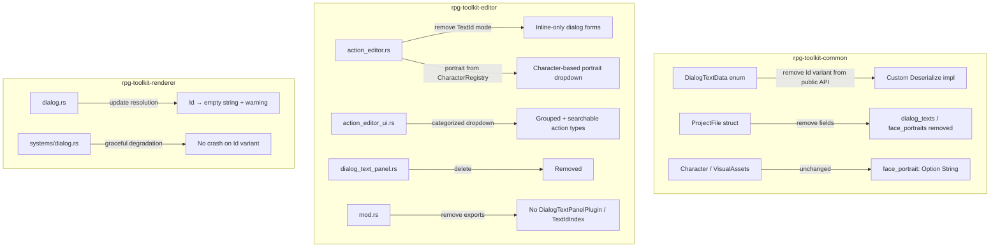

# Design Document: Dialog Simplification

## Overview

This feature simplifies the RPG toolkit's dialog system by eliminating the legacy `DialogTextData::Id` variant, removing the standalone `dialog_texts` and `face_portraits` registries from `ProjectFile`, and deleting the associated editor infrastructure (`DialogTextPanelPlugin`, `TextIdIndex`). Face portraits become the canonical property of characters via `VisualAssets::face_portrait`. The action editor UI is updated to reflect the simplified model, and a categorized searchable dropdown replaces the flat action type selector.

The design prioritizes backward compatibility: legacy project files continue to parse without error, with deprecated fields silently ignored on save and `Id` references gracefully degraded to empty strings at runtime.

## Architecture

The changes span three crates in the workspace:



**Key architectural decisions:**

1. **Custom serde for DialogTextData**: Rather than deleting the `Id` variant entirely (which would break legacy file parsing), we keep it in the enum but implement a custom `Deserialize` that converts `Id` to `Inline("")`. Serialization only writes `Inline`. This preserves the tagged enum format `{"type":"Inline","value":"..."}` on disk.

2. **Serde skip for removed ProjectFile fields**: Use `#[serde(skip_serializing)]` combined with `#[serde(default)]` to accept legacy JSON containing `dialog_texts`/`face_portraits` during deserialization but omit them when saving. The fields remain as private `Option` or hidden deserialization helpers to avoid parse errors.

3. **Portrait source consolidation**: The renderer currently resolves `face_portrait` from `ProjectFile::face_portraits` (a registry keyed by portrait ID). After this change, `DialogConfigData::face_portrait` stores the asset path directly (sourced from `Character::visual_assets::face_portrait` at edit time). The renderer no longer performs a registry lookup.

4. **Categorized dropdown**: Action types are organized into a static category mapping. Filtering uses the existing `searchable_combobox` pattern adapted to show grouped headers within a `ComboBox::show_ui` closure.

## Components and Interfaces

### DialogTextData (rpg-toolkit-common/src/map.rs)

**Current state:**
```rust
#[derive(Clone, Debug, PartialEq, Eq, Serialize, Deserialize)]
#[serde(tag = "type", content = "value")]
pub enum DialogTextData {
    Inline(String),
    Id(String),
}
```

**New state:**
```rust
#[derive(Clone, Debug, PartialEq, Eq, Serialize)]
#[serde(tag = "type", content = "value")]
pub enum DialogTextData {
    Inline(String),
}

// Custom Deserialize: accepts both "Inline" and "Id" tags,
// but converts Id → Inline("")
impl<'de> Deserialize<'de> for DialogTextData {
    fn deserialize<D>(deserializer: D) -> Result<Self, D::Error>
    where D: Deserializer<'de> {
        // Internally tagged enum helper
        #[derive(Deserialize)]
        #[serde(tag = "type", content = "value")]
        enum Raw {
            Inline(String),
            Id(String),
        }
        match Raw::deserialize(deserializer)? {
            Raw::Inline(s) => Ok(DialogTextData::Inline(s)),
            Raw::Id(_) => Ok(DialogTextData::Inline(String::new())),
        }
    }
}
```

### ProjectFile (rpg-toolkit-common/src/project.rs)

Remove `dialog_texts` and `face_portraits` from the public struct. Use a serde helper to absorb them during deserialization:

```rust
pub struct ProjectFile {
    pub maps: HashMap<MapId, MapData>,
    pub tilesets: HashMap<TilesetId, TilesetMeta>,
    // ... other fields unchanged ...

    // These fields are removed from public API:
    // - dialog_texts: HashMap<String, String>   (REMOVED)
    // - face_portraits: HashMap<String, String>  (REMOVED)

    // Hidden deserialization sink (never serialized):
    #[serde(default, skip_serializing, rename = "dialog_texts")]
    _legacy_dialog_texts: HashMap<String, String>,
    #[serde(default, skip_serializing, rename = "face_portraits")]
    _legacy_face_portraits: HashMap<String, String>,
}
```

The `new()` constructor is updated to remove `dialog_texts` and `face_portraits` parameters.

### Portrait Resolution (renderer)

**Before:** `DialogConfigData::face_portrait` holds a portrait ID → renderer looks up `ProjectFile::face_portraits[id]` → gets asset path.

**After:** `DialogConfigData::face_portrait` holds the asset path directly (set by the editor from `Character::visual_assets::face_portrait`). The renderer uses the path as-is with no registry lookup.

For the transition period, the renderer's `handle_dialog_event` system is simplified:
```rust
// Before:
if let Some(ref portrait_id) = resolved_config.face_portrait {
    let resolved_path = project_data.and_then(|pd| pd.face_portraits.get(portrait_id)).cloned();
    resolved_config.face_portrait = resolved_path;
}

// After:
// face_portrait already contains the direct asset path — no lookup needed.
// Validation: if path is non-empty but file doesn't exist, Bevy's asset server
// handles the missing texture gracefully.
```

### Action Type Categories (rpg-toolkit-editor)

A new module or constant defines the category mapping:

```rust
pub struct ActionCategory {
    pub name: &'static str,
    pub actions: &'static [(ActionType, &'static str)], // (variant, display_name)
}

pub const ACTION_CATEGORIES: &[ActionCategory] = &[
    ActionCategory { name: "Dialog", actions: &[
        (ActionType::ShowDialog, "Show Dialog"),
        (ActionType::ShowSelection, "Show Selection"),
    ]},
    ActionCategory { name: "Movement", actions: &[
        (ActionType::JumpTo, "Jump To Map"),
        (ActionType::Jump, "Jump"),
        (ActionType::SetSpeed, "Set Speed"),
        (ActionType::MoveEntity, "Move Entity"),
    ]},
    ActionCategory { name: "Camera", actions: &[
        (ActionType::CameraFollow, "Camera Follow"),
        (ActionType::CameraPan, "Camera Pan"),
    ]},
    ActionCategory { name: "Rewards", actions: &[
        (ActionType::GiveCurrency, "Give Currency"),
        (ActionType::GiveExperience, "Give Experience"),
        (ActionType::GiveItem, "Give Item"),
        (ActionType::LearnAbility, "Learn Ability"),
        (ActionType::AddPartyMember, "Add Party Member"),
    ]},
    ActionCategory { name: "State", actions: &[
        (ActionType::SetState, "Set State"),
        (ActionType::StateCheck, "State Check"),
        (ActionType::Branch, "Branch"),
        (ActionType::SaveGame, "Save Game"),
        (ActionType::ChangePhase, "Change Phase"),
    ]},
    ActionCategory { name: "Visual Effects", actions: &[
        (ActionType::ScreenShake, "Screen Shake"),
        (ActionType::StopScreenShake, "Stop Screen Shake"),
        (ActionType::FadeTransition, "Fade Transition"),
        (ActionType::SetPlayerAppearance, "Set Player Appearance"),
    ]},
    ActionCategory { name: "System", actions: &[
        (ActionType::Wait, "Wait"),
        (ActionType::OpenShop, "Open Shop"),
    ]},
];
```

The dropdown UI uses `egui::ComboBox::show_ui` with:
1. A text filter input at the top (using `egui::TextEdit::singleline`)
2. For each category: a `CollapsingHeader` containing selectable labels for matching actions
3. Empty categories are hidden when a filter is active

### Editor Form Changes

- Remove `DialogTextMode::TextId` variant
- Remove `dialog_text_mode`, `dialog_text_id`, `selection_prompt_mode`, `selection_prompt_id` fields from `ActionEditorState`
- Update `EditorChoice` to remove `label_mode` and `label_id` fields
- Portrait dropdown in ShowDialog/ShowSelection forms: query `CharacterRegistry` for characters with non-None `face_portrait`, display as `(character_name, asset_path)` pairs
- Remove all references to `DialogTextPanelPlugin` and `TextIdIndex` from `mod.rs` and plugin registration

## Data Models

### DialogTextData (simplified)

| Variant | Fields | Description |
|---------|--------|-------------|
| `Inline` | `String` | Direct text content for the dialog |

Legacy `Id(String)` values are accepted during deserialization but converted to `Inline("")`.

### ProjectFile (updated fields)

| Field | Status | Migration |
|-------|--------|-----------|
| `dialog_texts` | **Removed** | Absorbed silently on load, omitted on save |
| `face_portraits` | **Removed** | Absorbed silently on load, omitted on save |

### ActionCategory (new)

| Field | Type | Description |
|-------|------|-------------|
| `name` | `&'static str` | Display name for the category header |
| `actions` | `&'static [(ActionType, &'static str)]` | Action variants with display names |

### VisualAssets (unchanged)

| Field | Type | Description |
|-------|------|-------------|
| `spritesheet` | `Option<String>` | Path to character spritesheet |
| `face_portrait` | `Option<String>` | Path to face portrait asset (now canonical source for dialogs) |
| `status_portrait` | `Option<String>` | Path to status screen portrait |

## Correctness Properties

*A property is a characteristic or behavior that should hold true across all valid executions of a system — essentially, a formal statement about what the system should do. Properties serve as the bridge between human-readable specifications and machine-verifiable correctness guarantees.*

### Property 1: Legacy Id deserialization produces Inline empty string

*For any* string value `s`, deserializing a `DialogTextData` from JSON `{"type":"Id","value":"<s>"}` SHALL produce `DialogTextData::Inline("")` without error.

**Validates: Requirements 1.2, 1.3**

### Property 2: Character serialization round-trip

*For any* valid `Character` struct (with arbitrary `VisualAssets` including `face_portrait`), serializing to JSON and deserializing back SHALL produce an equivalent `Character`.

**Validates: Requirements 4.4**

### Property 3: Character face_portrait path trimming and truncation

*For any* non-empty string `path`, calling `set_visual_asset` with `VisualAssetType::FacePortrait` SHALL store a value that is trimmed of leading/trailing whitespace and has length at most 260 characters.

**Validates: Requirements 4.3**

### Property 4: Portrait dropdown population matches CharacterRegistry

*For any* `CharacterRegistry` containing characters with varying `face_portrait` values (Some/None), the set of characters shown in the portrait dropdown SHALL equal exactly the set of characters whose `visual_assets.face_portrait` is `Some(non-empty path)`.

**Validates: Requirements 6.3, 6.4**

### Property 5: Project file migration round-trip

*For any* valid project JSON containing legacy `dialog_texts`, `face_portraits`, and `DialogTextData::Id` values, loading the project, saving it, and loading again SHALL produce the same `ProjectFile` structure (idempotent after first migration).

**Validates: Requirements 1.4, 2.1, 2.2, 3.1, 3.2, 9.1, 9.2, 9.3**

### Property 6: Malformed legacy field tolerance

*For any* JSON value type (array, number, boolean, nested object) used in place of the expected `dialog_texts` or `face_portraits` object, deserialization of the `ProjectFile` SHALL succeed using empty defaults.

**Validates: Requirements 9.4**

### Property 7: Action type category filter returns correct matches

*For any* filter string `f`, the filtered action list SHALL contain exactly those actions whose display name contains `f` as a case-insensitive substring, and no others.

**Validates: Requirements 10.4, 10.5, 10.6**

### Property 8: Action type categories form a partition

*For all* `ActionType` variants, each variant SHALL appear in exactly one category, and the union of all categories SHALL equal the complete set of `ActionType` variants.

**Validates: Requirements 10.1, 10.7**

## Error Handling

| Scenario | Behavior |
|----------|----------|
| Legacy `DialogTextData::Id` in project file | Silently converts to `Inline("")` during deserialization |
| Legacy `dialog_texts` field in project JSON | Absorbed via `#[serde(default)]`, not propagated |
| Legacy `face_portraits` field in project JSON | Absorbed via `#[serde(default)]`, not propagated |
| Malformed `dialog_texts`/`face_portraits` (wrong JSON type) | `#[serde(default)]` produces empty HashMap, parsing continues |
| Renderer encounters `DialogText::Id` at runtime | Resolves to empty string, logs `warn!()` message |
| Missing face portrait asset file at runtime | Bevy asset server returns default/missing texture (existing behavior) |
| Character with no face_portrait selected for dialog | Portrait dropdown excludes them; no portrait shown in dialog |

## Testing Strategy

### Property-Based Tests (proptest)

Each correctness property maps to a dedicated `proptest!` test with minimum 100 iterations:

| Property | Test Location | Generator Strategy |
|----------|--------------|-------------------|
| 1: Id deserialization | `rpg-toolkit-common/tests/properties/` | Arbitrary strings for Id value |
| 2: Character round-trip | `rpg-toolkit-common/tests/properties/` | Arbitrary valid Character structs |
| 3: Face portrait trim/truncate | `rpg-toolkit-common/tests/properties/` | Arbitrary strings including whitespace-padded and >260 char |
| 4: Portrait dropdown population | `rpg-toolkit-editor` (unit test) | Random CharacterRegistry with mix of Some/None portraits |
| 5: Migration round-trip | `rpg-toolkit-common/tests/properties/` | Arbitrary legacy project JSON with dialog_texts, face_portraits, Id values |
| 6: Malformed field tolerance | `rpg-toolkit-common/tests/properties/` | Random JSON value types for legacy fields |
| 7: Category filter | `rpg-toolkit-editor` (unit test) | Arbitrary filter strings against known action list |
| 8: Category partition | `rpg-toolkit-editor` (unit test) | Exhaustive check over all ActionType variants |

**Configuration:** Each property test runs with `proptest! { #![proptest_config(ProptestConfig::with_cases(256))] ... }` (256 cases for good coverage).

**Tag format:** `// Feature: dialog-simplification, Property N: <property text>`

### Unit Tests (example-based)

| Scenario | Validates |
|----------|-----------|
| Renderer resolves `DialogText::Id("foo")` to empty string | Req 5.1 |
| Renderer resolves `DialogText::Id` in selection prompt to empty string | Req 5.2 |
| Renderer resolves `DialogText::Id` in choice label to empty string | Req 5.3 |
| Warning logged on Id encounter | Req 5.4 |
| Character deserialized without face_portrait field → None | Req 4.2 |
| Action editor form has no TextId option | Req 6.1, 6.5 |
| Category assignments match specification exactly | Req 10.8 |
| Collapsible headers render for each category | Req 10.2 |

### Smoke Tests (compile-time verification)

| Scenario | Validates |
|----------|-----------|
| Project compiles without `dialog_text_panel.rs` | Req 7.1, 7.2, 7.3 |
| Project compiles without `TextIdIndex` type | Req 8.1, 8.2, 8.3, 8.4 |
| `ProjectFile` has no public `dialog_texts` field | Req 2.3 |
| `ProjectFile` has no public `face_portraits` field | Req 3.3 |
| `DialogTextData` has no public `Id` variant | Req 1.1 |
