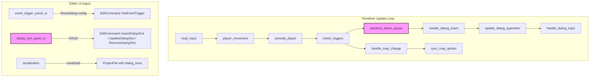
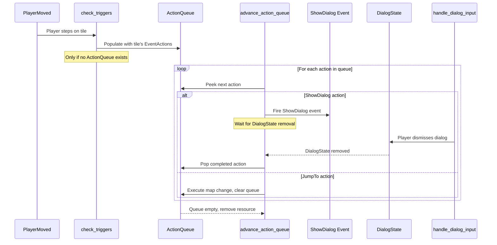

# Design Document: Editor Dialog Integration

## Overview

This design bridges the runtime dialog system (established in dialog-foundations) into the RPG toolkit editor, enabling map creators to configure dialog triggers on tiles and manage dialog text content through the editor UI.

Three capabilities are introduced:

1. A `ShowDialog` variant on the `EventAction` enum in `rpg-toolkit-common`, allowing tiles to carry dialog trigger data that the renderer processes at runtime.
2. Sequential trigger execution in the renderer via an `ActionQueue` resource, replacing the current "first JumpTo wins" behavior with ordered processing of all actions on a tile.
3. A Dialog Text Management panel in the editor for CRUD operations on `DialogTextRegistry` entries, with find-usages scanning and project file persistence.

### Current State

| Area | Current Behavior | Target Behavior |
|---|---|---|
| EventAction enum | Only `JumpTo` variant | `JumpTo` + `ShowDialog` variants |
| Trigger execution | First `JumpTo` found executes, rest ignored | Sequential processing: ShowDialog waits for dismissal, JumpTo terminates sequence |
| Dialog text management | No editor UI | CRUD panel with find-usages, undo/redo |
| Dialog text persistence | Not in ProjectFile | `dialog_texts` field in ProjectFile |
| Event Trigger Editor | Only JumpTo configuration | JumpTo + ShowDialog configuration |

### Key Design Decisions

**D1: Define serialization-compatible dialog types in `rpg-toolkit-common`, not depend on renderer types.**
The `EventAction` enum lives in `rpg-toolkit-common`. The `ShowDialog` variant needs `DialogText` and `DialogConfig` types. Rather than making `common` depend on `renderer` (which would create a circular dependency since `renderer` already depends on `common`), we define serialization-compatible mirror types (`DialogTextData`, `DialogConfigData`, `DialogPositionData`) in `common`. The renderer converts between these and its own types. This preserves the existing dependency direction: `common` ← `renderer` ← `editor`.

**D2: `ActionQueue` as an optional Bevy resource for sequential trigger execution.**
The action queue is a singleton — at most one trigger sequence is active at a time. An optional resource (`Option<Res<ActionQueue>>`) follows the same pattern as `DialogState`: its presence indicates a sequence is in progress. The `check_triggers` system populates it, and a new `advance_action_queue` system drains it one action at a time.

**D3: Dialog Text Panel as a new section in the existing left side panel, not a separate plugin.**
The panel is rendered inside `layer_panel_ui` (or a dedicated `dialog_text_panel_ui` system added to the same `SidePanel`), below the Map Browser section. This keeps the left panel as the single organizational hub. The panel is always visible regardless of editor mode, since dialog text management is a project-wide concern.

**D4: New `EditCommandKind` variants for dialog text CRUD.**
Three new variants: `InsertDialogText`, `UpdateDialogText`, `RemoveDialogText`. These operate on the `Project`'s dialog text registry (similar to how `SetSpawnPoint` operates on `Project` rather than `MapData`). The undo/redo plugin handles them at the Project level.

**D5: Find-usages via a reverse index (`TextIdIndex`) instead of on-demand scanning.**
A `TextIdIndex` resource maintains a `HashMap<String, Vec<TextIdUsage>>` mapping each Text_Id to the tiles that reference it. This gives O(1) lookup when the user selects an entry in the Dialog Text Panel, trading a small amount of editor memory for snappy interaction. The index is rebuilt from scratch on project load via `rebuild_text_id_index`, and incrementally updated whenever a `SetEventTrigger` edit command is applied or undone. Since all event trigger changes flow through `EditCommand`, there is a single choke point for keeping the index in sync. The index is runtime-only (not persisted) — it is derived data.

**D6: `dialog_texts` field on `ProjectFile` with `#[serde(default)]` for backward compatibility.**
Adding `#[serde(default)]` ensures that project files created before this feature (which lack the field) deserialize successfully with an empty registry.

## Architecture

### System Interaction Diagram



### Modified Trigger Execution Flow



### Dependency Graph

```
rpg-toolkit-common (defines EventAction::ShowDialog, DialogTextData, DialogConfigData, DialogPositionData)
    ↑
rpg-toolkit-renderer (converts common types ↔ renderer types, ActionQueue, advance_action_queue)
    ↑
rpg-toolkit-editor (Event Trigger Editor UI, Dialog Text Panel, serialization)
```

### Integration Points

| Existing Component | Integration |
|---|---|
| `EventAction` enum (common/map.rs) | Add `ShowDialog` variant with `DialogTextData` and `DialogConfigData` |
| `check_triggers` (renderer/triggers.rs) | Populate `ActionQueue` instead of executing first JumpTo directly |
| `event_trigger_panel_ui` (editor/attribute.rs) | Add ShowDialog action creation UI alongside JumpTo |
| `layer_panel_ui` (editor/layer_panel.rs) | Add Dialog Text Panel section below Map Browser |
| `ProjectFile` (common/project.rs) | Add `dialog_texts` field |
| `Project` resource (editor/data/project.rs) | Add `dialog_texts` field |
| `EditCommandKind` (editor/data/editor_state.rs) | Add dialog text CRUD variants |
| `serialization.rs` (editor) | Save/load dialog_texts to/from ProjectFile |
| `undo_redo.rs` (editor) | Handle dialog text EditCommand variants at Project level; call `update_text_id_index_for_tile` on `SetEventTrigger` apply/undo |

## Components and Interfaces

### New Types in `rpg-toolkit-common` (map.rs)

```rust
/// Serialization-compatible dialog text data for EventAction.
/// Mirrors rpg_toolkit_renderer::dialog::DialogText.
#[derive(Clone, Debug, PartialEq, Eq, Serialize, Deserialize)]
#[serde(tag = "type", content = "value")]
pub enum DialogTextData {
    Inline(String),
    Id(String),
}

/// Serialization-compatible dialog position for EventAction.
#[derive(Clone, Debug, Default, PartialEq, Eq, Serialize, Deserialize)]
pub enum DialogPositionData {
    Top,
    Center,
    #[default]
    Bottom,
}

/// Serialization-compatible dialog configuration for EventAction.
#[derive(Clone, Debug, PartialEq, Serialize, Deserialize)]
pub struct DialogConfigData {
    #[serde(default = "default_text_speed")]
    pub text_speed: f32,
    #[serde(default)]
    pub position: DialogPositionData,
    #[serde(default = "default_movement_block")]
    pub movement_block: bool,
}

fn default_text_speed() -> f32 { 30.0 }
fn default_movement_block() -> bool { true }

impl Default for DialogConfigData {
    fn default() -> Self {
        Self {
            text_speed: 30.0,
            position: DialogPositionData::Bottom,
            movement_block: true,
        }
    }
}
```

### Modified Enum: `EventAction` (common/map.rs)

```rust
#[derive(Clone, Debug, PartialEq, Serialize, Deserialize)]
#[serde(tag = "type")]
pub enum EventAction {
    JumpTo {
        target_map_id: MapId,
        target_x: u32,
        target_y: u32,
    },
    ShowDialog {
        text: DialogTextData,
        config: DialogConfigData,
    },
}
```

Note: `EventAction` changes from `PartialEq, Eq` to `PartialEq` only, because `DialogConfigData` contains `f32` (text_speed) which does not implement `Eq`.

### Modified Struct: `ProjectFile` (common/project.rs)

```rust
#[derive(Clone, Debug, Serialize, Deserialize, PartialEq)]
pub struct ProjectFile {
    pub maps: HashMap<MapId, MapData>,
    pub tilesets: HashMap<TilesetId, TilesetMeta>,
    #[serde(default)]
    pub spawn_point: Option<SpawnPoint>,
    #[serde(default)]
    pub spritesheets: HashMap<SpritesheetId, CharacterSpritesheet>,
    #[serde(default)]
    pub player_spritesheet: Option<SpritesheetId>,
    /// Dialog text entries: Text_Id → text string.
    #[serde(default)]
    pub dialog_texts: HashMap<String, String>,
}
```

The `ProjectFile::new` constructor gains a `dialog_texts: HashMap<String, String>` parameter.

### New Resource: `ActionQueue` (renderer/resources.rs or a new file)

```rust
/// Tracks the remaining EventActions in the current trigger sequence.
/// Present only while a sequence is being processed.
#[derive(Resource)]
pub struct ActionQueue {
    /// The remaining actions to process (front = next action).
    pub actions: VecDeque<EventAction>,
    /// Whether we're currently waiting for a dialog to be dismissed.
    pub waiting_for_dialog: bool,
}
```

### New System: `advance_action_queue` (renderer/systems/triggers.rs)

```rust
/// Advances the action queue: fires the next ShowDialog or JumpTo.
/// Waits for dialog dismissal before advancing past ShowDialog actions.
pub fn advance_action_queue(
    mut commands: Commands,
    action_queue: Option<ResMut<ActionQueue>>,
    dialog_state: Option<Res<DialogState>>,
    registry: Option<Res<DialogTextRegistry>>,
    mut renderer_state: ResMut<RendererState>,
    mut show_dialog: MessageWriter<ShowDialog>,
)
```

Logic:
1. If no `ActionQueue` exists, return.
2. If `waiting_for_dialog` is true and `DialogState` still exists, return (still waiting).
3. If `waiting_for_dialog` is true and `DialogState` is gone, set `waiting_for_dialog = false` and pop the completed action.
4. Peek the next action:
   - `ShowDialog`: Convert `DialogTextData`/`DialogConfigData` to renderer types, fire `ShowDialog` event, set `waiting_for_dialog = true`.
   - `JumpTo`: Set `pending_map_change` on `RendererState`, clear the queue, remove `ActionQueue` resource.
5. If queue is empty after processing, remove `ActionQueue` resource.

### Modified System: `check_triggers` (renderer/systems/triggers.rs)

```rust
/// Reacts to PlayerMoved events: populates ActionQueue with the tile's actions.
/// Does nothing if an ActionQueue already exists (sequence in progress).
pub fn check_triggers(
    mut player_moved: MessageReader<PlayerMoved>,
    project_data: Res<RendererProjectData>,
    renderer_state: Res<RendererState>,
    action_queue: Option<Res<ActionQueue>>,
    mut commands: Commands,
)
```

Changes from current behavior:
- Instead of iterating actions and executing the first JumpTo, collect all actions from all layers at the destination tile into a `VecDeque`.
- If the queue is non-empty and no `ActionQueue` currently exists, insert the `ActionQueue` resource.
- If an `ActionQueue` already exists, ignore the new trigger (sequence in progress).

### Conversion Functions (renderer)

```rust
/// Convert common DialogTextData to renderer DialogText.
pub fn dialog_text_from_data(data: &DialogTextData) -> DialogText {
    match data {
        DialogTextData::Inline(s) => DialogText::Inline(s.clone()),
        DialogTextData::Id(s) => DialogText::Id(s.clone()),
    }
}

/// Convert common DialogConfigData to renderer DialogConfig.
pub fn dialog_config_from_data(data: &DialogConfigData) -> DialogConfig {
    DialogConfig {
        text_speed: data.text_speed,
        position: match data.position {
            DialogPositionData::Top => DialogPosition::Top,
            DialogPositionData::Center => DialogPosition::Center,
            DialogPositionData::Bottom => DialogPosition::Bottom,
        },
        movement_block: data.movement_block,
    }
}
```

### Modified Resource: `Project` (editor/data/project.rs)

```rust
#[derive(Resource, Default)]
pub struct Project {
    // ... existing fields ...
    /// Dialog text entries managed by the Dialog Text Panel.
    pub dialog_texts: HashMap<String, String>,
}
```

### New `EditCommandKind` Variants (editor/data/editor_state.rs)

```rust
pub enum EditCommandKind {
    // ... existing variants ...
    InsertDialogText {
        text_id: String,
        text: String,
    },
    UpdateDialogText {
        text_id: String,
        old_text: String,
        new_text: String,
    },
    RemoveDialogText {
        text_id: String,
        old_text: String,
    },
}
```

These are applied/inverted at the Project level (like `SetSpawnPoint`), not on `MapData`.

### New UI: Dialog Text Panel (editor/plugins/dialog_text_panel.rs)

```rust
/// Plugin for the Dialog Text Management panel.
pub struct DialogTextPanelPlugin;

/// State for the Dialog Text Panel.
#[derive(Resource, Default)]
pub struct DialogTextPanelState {
    /// New entry form fields.
    pub new_text_id: String,
    pub new_text_content: String,
    /// Currently selected entry for viewing/editing.
    pub selected_text_id: Option<String>,
    /// Entry being edited (None = not editing).
    pub editing_text_id: Option<String>,
    pub edit_buffer: String,
}

/// A single usage of a Text_Id in the project.
#[derive(Clone, Debug, PartialEq)]
pub struct TextIdUsage {
    pub map_id: MapId,
    pub map_name: String,
    pub layer_index: usize,
    pub x: u32,
    pub y: u32,
}
```

### New Resource: `TextIdIndex` (editor/plugins/dialog_text_panel.rs)

```rust
/// Reverse index mapping Text_Id → list of tiles that reference it via ShowDialog actions.
/// Runtime-only (not persisted). Rebuilt on project load, incrementally updated on edits.
#[derive(Resource, Default, Clone, Debug)]
pub struct TextIdIndex {
    pub index: HashMap<String, Vec<TextIdUsage>>,
}

impl TextIdIndex {
    /// Returns the usages for a given Text_Id, or an empty slice if none.
    pub fn get(&self, text_id: &str) -> &[TextIdUsage] {
        self.index.get(text_id).map(|v| v.as_slice()).unwrap_or(&[])
    }
}
```

### Pure Function: `rebuild_text_id_index`

```rust
/// Builds the complete reverse index by scanning all maps.
/// Called once on project load and when a full rebuild is needed.
pub fn rebuild_text_id_index(
    maps: &HashMap<MapId, MapData>,
) -> TextIdIndex {
    let mut index: HashMap<String, Vec<TextIdUsage>> = HashMap::new();
    for (map_id, map) in maps {
        for (layer_index, layer) in map.layers.iter().enumerate() {
            for (y, row) in layer.attributes.cells.iter().enumerate() {
                for (x, attrs) in row.iter().enumerate() {
                    for action in &attrs.event_trigger {
                        if let EventAction::ShowDialog { text, .. } = action {
                            if let DialogTextData::Id(id) = text {
                                index.entry(id.clone()).or_default().push(TextIdUsage {
                                    map_id: map_id.clone(),
                                    map_name: map.name.clone(),
                                    layer_index,
                                    x: x as u32,
                                    y: y as u32,
                                });
                            }
                        }
                    }
                }
            }
        }
    }
    TextIdIndex { index }
}
```

### Pure Function: `update_text_id_index_for_tile`

```rust
/// Incrementally updates the reverse index when a single tile's event triggers change.
/// Removes old entries for the tile, then adds new entries based on the new trigger list.
/// Called when a SetEventTrigger EditCommand is applied or undone.
pub fn update_text_id_index_for_tile(
    index: &mut TextIdIndex,
    map_id: &MapId,
    map_name: &str,
    layer_index: usize,
    x: u32,
    y: u32,
    old_triggers: &[EventAction],
    new_triggers: &[EventAction],
) {
    // Remove old entries for this tile
    for action in old_triggers {
        if let EventAction::ShowDialog { text: DialogTextData::Id(id), .. } = action {
            if let Some(usages) = index.index.get_mut(id) {
                usages.retain(|u| !(u.map_id == *map_id && u.layer_index == layer_index && u.x == x && u.y == y));
                if usages.is_empty() {
                    index.index.remove(id);
                }
            }
        }
    }
    // Add new entries for this tile
    for action in new_triggers {
        if let EventAction::ShowDialog { text: DialogTextData::Id(id), .. } = action {
            index.index.entry(id.clone()).or_default().push(TextIdUsage {
                map_id: map_id.clone(),
                map_name: map_name.to_string(),
                layer_index,
                x,
                y,
            });
        }
    }
}
```

### Pure Function: `truncate_preview`

```rust
/// Truncates a string to at most `max_len` characters, appending "…" if truncated.
pub fn truncate_preview(s: &str, max_len: usize) -> String {
    let chars: Vec<char> = s.chars().collect();
    if chars.len() > max_len {
        let truncated: String = chars[..max_len].iter().collect();
        format!("{}…", truncated)
    } else {
        s.to_string()
    }
}
```

### Modified Event Trigger Editor UI

The `event_trigger_panel_ui` function in `attribute.rs` gains:

1. A dropdown to select action type: "JumpTo" or "ShowDialog".
2. When "ShowDialog" is selected, fields for:
   - Text source toggle: "Inline" or "Text ID"
   - Inline: multi-line text input
   - Text ID: single-line text input
   - Text Speed: numeric input (default 30)
   - Position: dropdown (Top/Center/Bottom, default Bottom)
   - Movement Block: checkbox (default true)
3. Display of existing ShowDialog actions in the action list with type label and preview.

The `EventTriggerDialog` resource gains additional fields:

```rust
#[derive(Resource, Default)]
pub struct EventTriggerDialog {
    // ... existing fields ...
    /// Type of action being added: "JumpTo" or "ShowDialog"
    pub new_action_type: ActionType,
    /// ShowDialog fields
    pub new_dialog_text_mode: DialogTextMode,
    pub new_dialog_inline_text: String,
    pub new_dialog_text_id: String,
    pub new_dialog_text_speed: String,
    pub new_dialog_position: DialogPositionData,
    pub new_dialog_movement_block: bool,
}

#[derive(Default, PartialEq)]
pub enum ActionType {
    #[default]
    JumpTo,
    ShowDialog,
}

#[derive(Default, PartialEq)]
pub enum DialogTextMode {
    #[default]
    Inline,
    TextId,
}
```

### Plugin Registration Changes

**Renderer (`ProjectRendererPlugin::build`):**
- Register `ActionQueue` handling (no init — it's inserted/removed dynamically).
- Add `advance_action_queue` system after `check_triggers` and before `handle_dialog_event`.
- Reorder: `check_triggers` → `advance_action_queue` → `handle_map_change`.

**Editor (`main.rs` or plugin registration):**
- Add `DialogTextPanelPlugin`.
- The `update_any_dialog_open` system does not need changes since the Dialog Text Panel is not a modal dialog.

### Serialization Changes

**`save_project_to_path`:** Include `dialog_texts` from `Project` when constructing `ProjectFile`.

**`load_project_with_dialog`:** Populate `Project.dialog_texts` from `ProjectFile.dialog_texts`. Call `rebuild_text_id_index` on the loaded maps and insert the `TextIdIndex` resource.

**`consume_edit_commands` (undo_redo.rs):** Handle `InsertDialogText`, `UpdateDialogText`, `RemoveDialogText` at the Project level (similar to `SetSpawnPoint`).

## Data Models

### Persistent Data (serde-compatible)

| Type | Location | Fields | Serialization |
|---|---|---|---|
| `DialogTextData` | common/map.rs | `Inline(String)` or `Id(String)` | Tagged JSON: `{"type": "Inline", "value": "..."}` |
| `DialogConfigData` | common/map.rs | `text_speed: f32`, `position: DialogPositionData`, `movement_block: bool` | JSON with serde defaults |
| `DialogPositionData` | common/map.rs | `Top`, `Center`, `Bottom` | JSON string enum |
| `EventAction::ShowDialog` | common/map.rs | `text: DialogTextData`, `config: DialogConfigData` | Tagged JSON: `{"type": "ShowDialog", ...}` |
| `ProjectFile.dialog_texts` | common/project.rs | `HashMap<String, String>` | Flat JSON object, `#[serde(default)]` |

### Runtime-Only Data (ECS)

| Type | Kind | Location | Lifecycle |
|---|---|---|---|
| `ActionQueue` | Resource | renderer | Inserted when trigger sequence starts, removed when complete |
| `DialogTextPanelState` | Resource | editor | Initialized at startup, persists for app lifetime |
| `TextIdIndex` | Resource | editor | Rebuilt on project load, incrementally updated on edits |
| `TextIdUsage` | Plain struct | editor | Stored in `TextIdIndex` entries |

### JSON Examples

**EventAction with ShowDialog (inline text):**
```json
{
  "type": "ShowDialog",
  "text": { "type": "Inline", "value": "Welcome to the village!" },
  "config": { "text_speed": 30.0, "position": "Bottom", "movement_block": true }
}
```

**EventAction with ShowDialog (text ID reference):**
```json
{
  "type": "ShowDialog",
  "text": { "type": "Id", "value": "npc_greeting_01" },
  "config": { "text_speed": 45.0, "position": "Top", "movement_block": true }
}
```

**ProjectFile dialog_texts field:**
```json
{
  "dialog_texts": {
    "npc_greeting_01": "Hello, traveler! Welcome to our village.",
    "npc_greeting_02": "The road ahead is dangerous. Be careful.",
    "sign_01": "Town Square - North"
  }
}
```

## Correctness Properties

*A property is a characteristic or behavior that should hold true across all valid executions of a system — essentially, a formal statement about what the system should do. Properties serve as the bridge between human-readable specifications and machine-verifiable correctness guarantees.*

### Property 1: EventAction list round-trip

*For any* valid `Vec<EventAction>` containing a mix of `JumpTo` and `ShowDialog` variants (with arbitrary inline text strings, text IDs, text speeds, dialog positions, and movement block flags), serializing to JSON and then deserializing SHALL produce an equivalent `Vec<EventAction>`.

**Validates: Requirements 1.3, 8.4**

### Property 2: Text preview truncation

*For any* string, applying `truncate_preview(s, 40)` SHALL produce a result where: if the original string has more than 40 characters, the result is the first 40 characters followed by "…"; otherwise the result equals the original string. The result length SHALL never exceed 41 characters (40 + ellipsis).

**Validates: Requirements 3.2**

### Property 3: Reverse index consistency with rebuild

*For any* project containing maps with `ShowDialog` EventActions that reference text IDs, the `TextIdIndex` produced by `rebuild_text_id_index(maps)` SHALL contain, for each Text_Id, exactly the set of `(map_id, layer_index, x, y)` tuples where a `ShowDialog` action with `DialogTextData::Id(text_id)` exists. There SHALL be no false positives and no false negatives. Additionally, for any single-tile edit (old_triggers → new_triggers), applying `update_text_id_index_for_tile` to a correct index SHALL produce the same result as calling `rebuild_text_id_index` on the modified project.

**Validates: Requirements 6.1, 6.4**

### Property 4: ProjectFile dialog text round-trip

*For any* valid `ProjectFile` containing a `dialog_texts` field with arbitrary `HashMap<String, String>` entries (alongside maps, tilesets, and other fields), serializing to JSON and then deserializing SHALL produce an equivalent `ProjectFile` with identical `dialog_texts` content.

**Validates: Requirements 7.5**

## Error Handling

| Scenario | Handling |
|---|---|
| `ShowDialog` action references missing Text_Id at runtime | Log warning, skip action, continue processing remaining actions in queue |
| `ActionQueue` exists when new `PlayerMoved` fires | Ignore the new trigger (sequence in progress) |
| Duplicate Text_Id in Dialog Text Panel creation | Display warning in UI, do not overwrite existing entry |
| Empty Text_Id or empty text content in creation form | Disable the "Add" button (validation in UI) |
| `dialog_texts` field missing from loaded ProjectFile JSON | `#[serde(default)]` initializes empty `HashMap` (backward compatible) |
| `ShowDialog` variant in EventAction JSON loaded by old editor version | serde will fail to deserialize unknown variant — this is expected; users should not downgrade |
| `EventAction` with `ShowDialog` where `text_speed` is negative | Renderer treats as 0 (instant reveal), consistent with dialog-foundations behavior |
| Find-usages scan on large project | Not applicable — `TextIdIndex` provides O(1) lookup; index is incrementally maintained |

All error paths are non-panicking. Systems use early returns when preconditions aren't met, consistent with the existing codebase pattern.

## Testing Strategy

### Property-Based Tests (proptest)

The project uses `proptest` for property-based testing (see `tests/properties/`). Each correctness property maps to a single property-based test with a minimum of 100 iterations.

**Library:** `proptest` (already a workspace dependency)

**Test configuration:** `ProptestConfig::with_cases(100)` minimum per property.

**Tag format:** `Feature: editor-dialog-integration, Property N: <property_text>`

| Property | Test Target | Generator Strategy |
|---|---|---|
| P1: EventAction list round-trip | `serde_json::to_string` / `from_str` on `Vec<EventAction>` | Lists of 0–10 actions mixing JumpTo (random map IDs, coords) and ShowDialog (random Inline/Id text, random config with text_speed 0.0–500.0, 3 position variants, bool movement_block) |
| P2: Text preview truncation | `truncate_preview(s, 40)` | Random strings of length 0–200, including Unicode |
| P3: Reverse index consistency | `rebuild_text_id_index` and `update_text_id_index_for_tile` | 1–5 maps with 1–4 layers, 1×1 to 4×4 tiles, random event_trigger lists with ShowDialog(Id) and ShowDialog(Inline) and JumpTo actions; verify incremental update matches full rebuild |
| P4: ProjectFile dialog text round-trip | `ProjectFile::serialize` / `deserialize` | ProjectFile with 0–3 maps, 0–10 dialog_texts entries (keys: `[a-z_]{1,20}`, values: `[a-zA-Z0-9 ]{1,100}`) |

### Unit Tests

Unit tests cover specific examples, edge cases, and error conditions:

- **ShowDialog serialization format:** Verify JSON contains `"type": "ShowDialog"` discriminator
- **Backward compatibility:** Deserialize a ProjectFile JSON with only JumpTo actions (no ShowDialog, no dialog_texts) — should succeed
- **Default DialogConfigData:** Verify `DialogConfigData::default()` has `text_speed: 30.0`, `position: Bottom`, `movement_block: true`
- **Empty find-usages:** `TextIdIndex::get("nonexistent")` returns empty slice
- **Inline text not indexed:** ShowDialog with `Inline("hello")` does not appear in the index
- **Incremental update removes old entries:** After changing a tile's triggers, old Text_Id references are removed from the index
- **Truncation edge cases:** Empty string, exactly 40 chars, 41 chars
- **Duplicate Text_Id detection:** Verify the panel logic rejects duplicate IDs

### Integration Testing

Manual/visual integration tests in the running editor and renderer:

- Event Trigger Editor shows ShowDialog option alongside JumpTo
- ShowDialog action with inline text displays correctly in action list
- ShowDialog action with Text_Id displays "ID: ..." in action list
- Multiple ShowDialog actions can be stacked on a single tile
- Dialog Text Panel appears below Map Browser in left panel
- CRUD operations on dialog text entries work with undo/redo
- Find-usages shows correct references and navigates to tiles
- Sequential trigger execution: multiple dialogs play in order
- JumpTo terminates sequence after dialogs
- Project save/load preserves dialog texts and ShowDialog actions
- Attribute overlay shows on tiles with ShowDialog triggers
