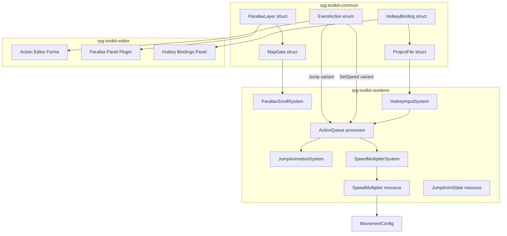

# Design Document: Editor Enhancements

## Overview

This feature bundle adds four new capabilities to the RPG toolkit: **Jump** event actions, **parallax background layers**, **hotkey bindings**, and **SetSpeed** event actions. The implementation spans three crates:

- **`rpg-toolkit-common`** — New data model structs/enums (`Jump` variant, `SetSpeed` variant, `ParallaxLayer`, `HotkeyBinding`) with serde validation
- **`rpg-toolkit-renderer`** — New Bevy ECS systems for jump animation, parallax scrolling, speed multiplier, and hotkey input handling
- **`rpg-toolkit-editor`** — New egui panels and form controls for parallax layers, hotkey bindings, and Jump/SetSpeed action editing

The design preserves backward compatibility with existing project files by using `#[serde(default)]` for new optional fields and extending the existing `EventAction` tagged enum.

## Architecture



### Processing Flow

1. **Jump**: ActionQueue dequeues a `Jump` action → inserts `JumpAnimState` resource → `jump_animation_system` updates player transform with parabolic offset each frame → on completion, updates `PlayerCharacter` grid position, removes `JumpAnimState`, and fires landing-tile triggers.

2. **SetSpeed**: ActionQueue dequeues a `SetSpeed` action → updates `SpeedMultiplier` resource → `apply_speed_multiplier_system` adjusts `MovementConfig.move_duration` → queue advances immediately (non-blocking).

3. **Parallax**: On map load, `spawn_parallax_system` reads `MapData.parallax_layers` and spawns sprite entities at negative z. Each frame, `update_parallax_system` translates sprites based on camera delta × scroll_factor.

4. **Hotkeys**: Each frame in `InGame` phase, `hotkey_input_system` checks `ButtonInput<KeyCode>` against configured bindings. If conditions are met (no dialog, no selection, no action queue), it pushes the binding's actions into a new `ActionQueue`.

## Components and Interfaces

### rpg-toolkit-common

#### New EventAction Variants

```rust
// Added to the existing EventAction enum
EventAction::Jump {
    #[serde(deserialize_with = "deserialize_jump_distance")]
    distance: u32,  // 1..=8
}

EventAction::SetSpeed {
    #[serde(default = "default_speed_multiplier", deserialize_with = "deserialize_speed_multiplier")]
    multiplier: f32,  // 0.5..=4.0, default 1.0
}
```

#### ParallaxLayer Struct

```rust
#[derive(Clone, Debug, PartialEq, Serialize, Deserialize)]
#[serde(try_from = "RawParallaxLayer")]
pub struct ParallaxLayer {
    pub image_path: String,       // 1..=256 chars
    pub scroll_factor: f32,       // 0.0..=1.0
    pub z_order: i32,             // draw order
}
```

#### HotkeyBinding Struct

```rust
#[derive(Clone, Debug, PartialEq, Serialize, Deserialize)]
#[serde(try_from = "RawHotkeyBinding")]
pub struct HotkeyBinding {
    pub key_code: String,         // 1..=64 chars, Bevy KeyCode variant name
    pub name: String,             // 1..=64 chars, human-readable label
    pub event_actions: Vec<EventAction>,  // 0..=20 entries
}
```

#### MapData Extension

```rust
// Added field to existing MapData struct
#[serde(default)]
pub parallax_layers: Vec<ParallaxLayer>,
```

#### ProjectFile Extension

```rust
// Added field to existing ProjectFile struct
#[serde(default, deserialize_with = "deserialize_hotkey_bindings")]
pub hotkey_bindings: Vec<HotkeyBinding>,  // 0..=32 entries, unique key_codes
```

### rpg-toolkit-renderer

#### New Resources

```rust
/// Speed scaling factor applied to player movement.
#[derive(Resource)]
pub struct SpeedMultiplier {
    pub value: f32,  // default 1.0
}

/// Tracks an active jump animation.
#[derive(Resource)]
pub struct JumpAnimState {
    pub start_x: u32,
    pub start_y: u32,
    pub landing_x: u32,
    pub landing_y: u32,
    pub distance: u32,
    pub duration: f32,      // total animation time
    pub elapsed: f32,       // time elapsed
}

/// Marker component for parallax layer sprite entities.
#[derive(Component)]
pub struct ParallaxSprite {
    pub scroll_factor: f32,
    pub layer_index: usize,
}
```

#### New Systems

| System | Schedule | Description |
|--------|----------|-------------|
| `jump_animation_system` | `Update` | Animates the player during a jump — applies parabolic vertical offset, advances elapsed time, completes the jump when done |
| `spawn_parallax_system` | On map load | Spawns parallax sprite entities for the active map's `parallax_layers` |
| `despawn_parallax_system` | On map change | Despawns all `ParallaxSprite` entities before new map loads |
| `update_parallax_system` | `Update` | Translates parallax sprites by `camera_delta * scroll_factor` each frame |
| `apply_speed_multiplier_system` | `Update` | Computes `move_duration = 0.15 / speed_multiplier.value` |
| `hotkey_input_system` | `Update` | Reads keyboard input and fires hotkey bindings when conditions are met |

#### Jump Animation Math

The parabolic vertical offset for a jump at progress `t ∈ [0, 1]`:

```rust
fn jump_arc_offset(t: f32, distance: u32, tile_height: f32) -> f32 {
    // Peak height scales with jump distance
    let peak = tile_height * (distance as f32) * 0.5;
    // Parabola: 4 * peak * t * (1 - t)
    // At t=0: 0, at t=0.5: peak, at t=1: 0
    4.0 * peak * t * (1.0 - t)
}
```

#### Landing Tile Computation

```rust
fn compute_landing(
    grid_x: u32, grid_y: u32,
    facing: FacingDirection,
    distance: u32,
    map_width: u32, map_height: u32,
) -> (u32, u32) {
    let (dx, dy): (i32, i32) = match facing {
        FacingDirection::Up => (0, -(distance as i32)),
        FacingDirection::Down => (0, distance as i32),
        FacingDirection::Left => (-(distance as i32), 0),
        FacingDirection::Right => (distance as i32, 0),
    };
    let new_x = (grid_x as i32 + dx).clamp(0, map_width as i32 - 1) as u32;
    let new_y = (grid_y as i32 + dy).clamp(0, map_height as i32 - 1) as u32;
    (new_x, new_y)
}
```

#### Hotkey Input System Guard Conditions

The hotkey system only fires when ALL of the following are true:
- `AppPhase` is `InGame`
- No `ActionQueue` resource exists
- No `DialogState` resource exists
- No `SelectionState` resource exists

### rpg-toolkit-editor

#### Action Editor Extensions

New form renderers added to `action_editor_forms.rs`:

```rust
pub fn render_jump_form(
    ui: &mut egui::Ui,
    actions: &mut Vec<EventAction>,
    editor_state: &mut ActionEditorState,
)

pub fn render_set_speed_form(
    ui: &mut egui::Ui,
    actions: &mut Vec<EventAction>,
    editor_state: &mut ActionEditorState,
)
```

The `ActionEditorState` struct gains new fields:
- `jump_distance: String` — defaults to `"2"`, parsed and clamped to [1, 8]
- `speed_multiplier: f32` — defaults to `1.0`, clamped to [0.5, 4.0]

#### Parallax Panel

A new `ParallaxPanel` plugin added to the map properties area:
- Lists parallax layers in order with edit controls per row
- "Add Layer" button (disabled at 16 layers) appends defaults
- "Remove" button per row removes without confirmation
- File picker for `image_path`, slider for `scroll_factor` (0.0–1.0, step 0.05), DragValue for `z_order` (-999–999)
- Validation warning (non-blocking) when `image_path` is empty on save

#### Hotkey Bindings Panel

A new panel in project settings:
- Lists bindings with drag-and-drop reordering (or ↑/↓ arrow buttons)
- "Add Binding" creates entry with empty defaults
- Key capture input: on focus, records next `KeyCode` press
- Text input for `name` with 64-char limit
- Embedded event action list editor (reuses existing pattern)
- Save disabled when `key_code` or `name` is empty
- "Remove" button deletes entry

## Data Models

### ParallaxLayer

| Field | Type | Constraints | Default |
|-------|------|-------------|---------|
| `image_path` | `String` | 1–256 chars | — (required) |
| `scroll_factor` | `f32` | 0.0–1.0 inclusive | — (required) |
| `z_order` | `i32` | any i32 | — (required) |

### HotkeyBinding

| Field | Type | Constraints | Default |
|-------|------|-------------|---------|
| `key_code` | `String` | 1–64 chars, unique across bindings | — (required) |
| `name` | `String` | 1–64 chars | — (required) |
| `event_actions` | `Vec<EventAction>` | 0–20 entries | empty vec |

### EventAction::Jump

| Field | Type | Constraints | Default |
|-------|------|-------------|---------|
| `distance` | `u32` | 1–8 inclusive | — (required) |

### EventAction::SetSpeed

| Field | Type | Constraints | Default |
|-------|------|-------------|---------|
| `multiplier` | `f32` | 0.5–4.0 inclusive | 1.0 |

### SpeedMultiplier (Bevy Resource)

| Field | Type | Constraints | Default |
|-------|------|-------------|---------|
| `value` | `f32` | 0.5–4.0 | 1.0 |

### JumpAnimState (Bevy Resource)

| Field | Type | Description |
|-------|------|-------------|
| `start_x` | `u32` | Starting grid X |
| `start_y` | `u32` | Starting grid Y |
| `landing_x` | `u32` | Computed landing grid X |
| `landing_y` | `u32` | Computed landing grid Y |
| `distance` | `u32` | Jump distance in tiles |
| `duration` | `f32` | Total animation time (scales with distance) |
| `elapsed` | `f32` | Time elapsed since animation start |

## Correctness Properties

*A property is a characteristic or behavior that should hold true across all valid executions of a system — essentially, a formal statement about what the system should do. Properties serve as the bridge between human-readable specifications and machine-verifiable correctness guarantees.*

### Property 1: Jump EventAction Serialization Round-Trip

*For any* valid `EventAction::Jump` value with `distance` in the range 1 to 8, serializing to JSON and deserializing back SHALL produce a value that is `PartialEq`-equal to the original. The serialized JSON SHALL contain `"type": "Jump"` and a `"distance"` field.

**Validates: Requirements 1.1, 1.2, 1.5, 1.6**

### Property 2: Jump Invalid Distance Rejection

*For any* `u32` value outside the range [1, 8], attempting to deserialize a JSON object `{"type": "Jump", "distance": <value>}` as an `EventAction` SHALL return a deserialization error.

**Validates: Requirements 1.3**

### Property 3: Jump Landing Computation with Bounds Clamping

*For any* valid grid position `(x, y)`, facing direction, distance in [1, 8], and map dimensions `(width, height)` where `x < width` and `y < height`, the computed landing tile SHALL have coordinates in `[0, width-1]` × `[0, height-1]`, and when the unclamped landing is within bounds it SHALL equal `(x + dx*distance, y + dy*distance)` where `(dx, dy)` is the unit vector for the facing direction.

**Validates: Requirements 2.1, 2.3**

### Property 4: Jump Parabolic Offset Invariant

*For any* progress value `t` in [0.0, 1.0] and any distance in [1, 8], the parabolic arc offset SHALL be 0.0 at `t = 0.0` and `t = 1.0`, and SHALL be strictly positive for all `t` in `(0.0, 1.0)`. The maximum offset SHALL occur at `t = 0.5`.

**Validates: Requirements 2.4**

### Property 5: ParallaxLayer Validation Acceptance

*For any* `image_path` string of length 1 to 256, `scroll_factor` in [0.0, 1.0], and any `i32` `z_order`, deserializing a ParallaxLayer SHALL succeed without error.

**Validates: Requirements 3.2, 3.3, 3.5**

### Property 6: ParallaxLayer Invalid scroll_factor Rejection

*For any* `f32` value strictly less than 0.0 or strictly greater than 1.0, deserializing a ParallaxLayer with that `scroll_factor` SHALL return a deserialization error.

**Validates: Requirements 3.6**

### Property 7: ParallaxLayer Round-Trip

*For any* valid `ParallaxLayer` value (image_path 1–256 chars, scroll_factor in [0.0, 1.0], any i32 z_order), serializing to JSON and deserializing back SHALL produce a `PartialEq`-equal value.

**Validates: Requirements 3.1, 3.4, 3.7**

### Property 8: Parallax Scroll Translation Computation

*For any* camera delta vector `(dx, dy)` and any `scroll_factor` in [0.0, 1.0], the parallax layer translation delta SHALL equal `(dx * scroll_factor, dy * scroll_factor)`.

**Validates: Requirements 4.2**

### Property 9: Parallax z-order Stable Sort

*For any* list of `ParallaxLayer` values, the assigned `Transform.translation.z` values SHALL be in ascending order when sorted by `(z_order, list_index)`, and all z values SHALL be less than 0.0.

**Validates: Requirements 4.4, 4.7**

### Property 10: HotkeyBinding Serialization Round-Trip

*For any* valid `HotkeyBinding` value with `key_code` (1–64 chars), `name` (1–64 chars), and `event_actions` (0–20 entries containing valid actions), serializing to JSON and deserializing back SHALL produce a `PartialEq`-equal value.

**Validates: Requirements 6.1, 6.2, 6.3, 6.4, 6.5, 6.8**

### Property 11: HotkeyBinding Invalid Field Rejection

*For any* string that is empty or exceeds 64 characters, deserializing a HotkeyBinding with that value as `key_code` or `name` SHALL return a deserialization error.

**Validates: Requirements 6.6, 6.7**

### Property 12: HotkeyBinding Duplicate key_code Rejection

*For any* list of two or more `HotkeyBinding` values where at least two share the same `key_code`, deserializing the `hotkey_bindings` field SHALL return a deserialization error.

**Validates: Requirements 6.9**

### Property 13: SetSpeed Serialization Round-Trip

*For any* valid `EventAction::SetSpeed` value with `multiplier` in [0.5, 4.0], serializing to JSON and deserializing back SHALL produce a `PartialEq`-equal value. The serialized JSON SHALL contain `"type": "SetSpeed"` and a `"multiplier"` field.

**Validates: Requirements 9.1, 9.2, 9.4, 9.5**

### Property 14: SetSpeed Invalid Multiplier Rejection

*For any* `f32` value strictly less than 0.5 or strictly greater than 4.0, attempting to deserialize `{"type": "SetSpeed", "multiplier": <value>}` as an `EventAction` SHALL return a deserialization error.

**Validates: Requirements 9.3**

### Property 15: Speed-Adjusted Move Duration Computation

*For any* `SpeedMultiplier.value` in [0.5, 4.0], the effective `MovementConfig.move_duration` SHALL equal `0.15 / value` (within f32 epsilon tolerance).

**Validates: Requirements 10.2**

### Property 16: Editor Value Clamping

*For any* `u32` input value, the Jump distance clamping function SHALL produce a result in [1, 8]. *For any* `f32` input value, the SetSpeed multiplier clamping function SHALL produce a result in [0.5, 4.0].

**Validates: Requirements 11.4, 11.5**

### Property 17: ProjectFile Comprehensive Round-Trip

*For any* valid `ProjectFile` containing maps with `parallax_layers`, `hotkey_bindings` with valid HotkeyBinding entries, and `EventAction` sequences mixing old and new variants (Jump, SetSpeed), serializing to JSON and deserializing back SHALL produce a `PartialEq`-equal value.

**Validates: Requirements 12.1, 12.4**

## Error Handling

### Deserialization Errors

| Scenario | Error Behavior |
|----------|---------------|
| Jump `distance` outside [1, 8] | Return serde error: "distance must be between 1 and 8 inclusive, got {value}" |
| Jump `distance` field missing | Return serde error: "missing field `distance`" |
| SetSpeed `multiplier` outside [0.5, 4.0] | Return serde error: "multiplier must be between 0.5 and 4.0 inclusive, got {value}" |
| ParallaxLayer `scroll_factor` outside [0.0, 1.0] | Return serde error: "scroll_factor must be between 0.0 and 1.0 inclusive, got {value}" |
| ParallaxLayer `image_path` empty or >256 chars | Return serde error: "image_path must be 1 to 256 characters, got {len}" |
| HotkeyBinding `key_code` empty or >64 chars | Return serde error: "key_code must be 1 to 64 characters" |
| HotkeyBinding `name` empty or >64 chars | Return serde error: "name must be 1 to 64 characters" |
| HotkeyBinding `event_actions` >20 entries | Return serde error: "event_actions must have at most 20 entries" |
| `hotkey_bindings` >32 entries | Return serde error: "hotkey_bindings must have at most 32 entries" |
| Duplicate `key_code` in hotkey_bindings | Return serde error: "duplicate key_code '{code}' in hotkey_bindings" |
| Unrecognized EventAction `"type"` tag | Return serde error (standard serde tagged enum behavior) |

### Runtime Error Handling

| Scenario | Behavior |
|----------|----------|
| Parallax image file not found | Log `warn!`, skip that layer, continue with remaining layers |
| Jump lands outside map bounds | Clamp to last in-bounds tile (never panic or error) |
| Hotkey `key_code` doesn't match any Bevy `KeyCode` | Binding is silently ignored at runtime (validated at edit-time in future iteration) |
| SpeedMultiplier somehow set outside [0.5, 4.0] | Clamp to bounds when computing move_duration |

### Editor Validation

| Scenario | Behavior |
|----------|----------|
| Jump distance out of [1, 8] | Clamp to nearest bound on Add/Update |
| SetSpeed multiplier out of [0.5, 4.0] | Clamp to nearest bound on Add/Update |
| Parallax `image_path` empty on save | Display warning, allow save to proceed |
| Hotkey `key_code` or `name` empty | Disable save button, show validation message |
| Parallax layers at max (16) | Disable "Add Layer" button |

## Testing Strategy

### Property-Based Tests (proptest)

Each correctness property maps to a property-based test with minimum 100 iterations. Tests are located in:
- `crates/rpg-toolkit-common/tests/properties/` — For data model round-trips and validation (Properties 1–3, 5–7, 10–14, 17)
- `crates/rpg-toolkit-renderer/tests/properties/` — For runtime computations (Properties 4, 8, 9, 15, 16)

Test configuration:
```rust
#![proptest_config(ProptestConfig { cases: 100, .. ProptestConfig::default() })]
```

Each test is tagged with a comment: `// Feature: editor-enhancements, Property N: <title>`

### Unit Tests (Example-Based)

| Area | Test |
|------|------|
| Jump missing `distance` field | Verify deserialization error (Req 1.4) |
| SetSpeed default multiplier | Verify multiplier defaults to 1.0 when absent (Req 9.6) |
| MapData missing `parallax_layers` | Verify defaults to empty Vec (Req 12.2) |
| ProjectFile missing `hotkey_bindings` | Verify defaults to empty Vec (Req 12.3) |
| Unknown EventAction type tag | Verify deserialization error (Req 12.5) |
| Empty parallax_layers map load | Verify no parallax entities spawned (Req 4.6) |
| Hotkey with empty `event_actions` | Verify no-op behavior (Req 7.6) |

### Integration Tests

| Area | Test |
|------|------|
| Jump animation blocking | Process Jump, verify ActionQueue waits, verify grid position after completion (Reqs 2.2, 2.5, 2.6) |
| Jump landing trigger fire | Jump onto trigger tile, verify trigger actions enqueued (Req 2.7) |
| Hotkey input guards | Verify hotkeys ignored during dialog/selection/action queue (Reqs 7.1–7.4) |
| SetSpeed non-blocking | Process SetSpeed, verify queue advances immediately (Req 10.4) |
| Parallax spawn/despawn on map change | Transition maps, verify entity lifecycle (Reqs 4.1, 4.5) |
| Parallax missing image | Configure invalid path, verify warning and graceful skip (Req 4.3) |

### Library

- **proptest** (workspace dependency, already in use) for property-based testing
- **bevy** test utilities for integration tests requiring ECS
