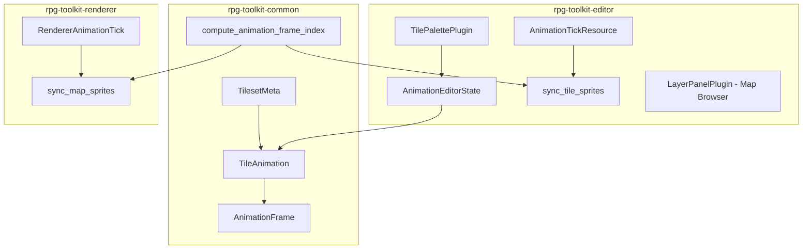

# Design Document: Editor UX Improvements

## Overview

This design covers seven related improvements to the RPG Toolkit Editor, spanning tile animation support (data model, editor UI, and rendering in both editor and game renderer) and three palette/browser UX enhancements (searchable dropdowns for maps and tilesets, plus tile scaling).

The changes touch three crates:
- **rpg-toolkit-common** — New `TileAnimation` data model on `TilesetMeta`, validation, serialization
- **rpg-toolkit-editor** — Animation editor UI, render system animation cycling, searchable dropdowns, tile scaling
- **rpg-toolkit-renderer** — Animation cycling at runtime

The core design principle is to keep animation logic as a shared pure function in `rpg-toolkit-common` so both the editor and renderer compute frame indices identically, ensuring WYSIWYG behavior.

## Architecture



### Key Architectural Decisions

1. **Shared frame computation function** — `compute_animation_frame_index(elapsed_ms, frame_duration_ms, frame_count) -> usize` lives in `rpg-toolkit-common`. Both editor and renderer call it with a global elapsed time, guaranteeing lockstep and identical behavior.

2. **Global animation clock** — A single `AnimationTick` resource tracks cumulative elapsed milliseconds. All animated tiles read from this one clock, ensuring lockstep synchronization without per-tile timers.

3. **Animation lookup by first frame** — Animations are keyed by their first frame's `(col, row)` in the tileset. When the render system encounters a tile whose `(col, row)` matches the first frame of any animation in that tileset, it treats it as animated.

4. **Searchable dropdown as a reusable widget** — A single `searchable_combobox` helper function is used for both map browser and tileset selector, reducing code duplication.

5. **Tile scaling via EditorState** — The palette zoom level is stored in `EditorState` so it persists across tileset switches within a session.

## Components and Interfaces

### rpg-toolkit-common

#### New Types

```rust
/// A single frame in a tile animation sequence.
#[derive(Clone, Debug, PartialEq, Eq, Serialize, Deserialize)]
pub struct AnimationFrame {
    pub col: u32,
    pub row: u32,
}

/// A tile animation definition: an ordered sequence of frames with a shared duration.
#[derive(Clone, Debug, PartialEq, Eq, Serialize, Deserialize)]
pub struct TileAnimation {
    /// Ordered frames in the animation cycle. Must contain >= 2 frames.
    pub frames: Vec<AnimationFrame>,
    /// Duration of each frame in milliseconds. Must be > 0.
    pub frame_duration_ms: u32,
}
```

#### Modified Types

```rust
/// TilesetMeta gains an optional animations field.
#[derive(Clone, Debug, Serialize, Deserialize, PartialEq, Eq)]
pub struct TilesetMeta {
    pub file_path: String,
    pub tile_width: u32,
    pub tile_height: u32,
    pub columns: u32,
    pub rows: u32,
    #[serde(default)]
    pub animations: Vec<TileAnimation>,
}
```

#### New Functions

```rust
/// Validates a TileAnimation against tileset bounds.
/// Returns Ok(()) if valid, Err with description otherwise.
pub fn validate_tile_animation(
    animation: &TileAnimation,
    columns: u32,
    rows: u32,
) -> Result<(), CommonError>;

/// Computes which frame index to display given elapsed time.
/// Returns an index into the animation's frames vec.
/// Pure function — no side effects, no state.
pub fn compute_animation_frame_index(
    elapsed_ms: u64,
    frame_duration_ms: u32,
    frame_count: usize,
) -> usize;
```

### rpg-toolkit-editor

#### New Resources

```rust
/// Global animation clock for the editor canvas.
/// Accumulates elapsed time each frame for animation cycling.
#[derive(Resource, Default)]
pub struct EditorAnimationTick {
    pub elapsed_ms: u64,
}

/// State for the animation editor UI mode.
#[derive(Resource, Default)]
pub struct AnimationEditorState {
    pub active: bool,
    pub frames: Vec<AnimationFrame>,
    pub frame_duration_ms: u32, // default 200
}
```

#### Modified Resources

```rust
/// EditorState gains a palette_tile_scale field.
pub struct EditorState {
    // ... existing fields ...
    /// Display tile size for the palette grid (pixels). Clamped to [16, 128].
    pub palette_tile_scale: f32,
}
```

#### New UI Helper

```rust
/// Renders a searchable combobox dropdown.
/// Returns the selected item ID if the user picks one.
fn searchable_combobox<'a>(
    ui: &mut egui::Ui,
    id_salt: &str,
    current_label: &str,
    items: &[(String, String)], // (id, display_label)
    search_buffer: &'a mut String,
) -> Option<String>;
```

#### Modified Systems

- **`sync_tile_sprites`** — After spawning sprites, checks if each tile's `(col, row)` is the first frame of an animation. If so, stores the animation reference on the sprite component. A new `animate_editor_tiles` system runs each frame to update atlas indices based on `EditorAnimationTick`.

- **`tile_palette_ui`** — Replaces the `horizontal_wrapped` tab bar with `searchable_combobox`. Adds the zoom slider. Adds the animation editor toggle and panel.

- **`render_map_browser`** (in `layer_panel.rs`) — Replaces the `ScrollArea` list with `searchable_combobox`.

### rpg-toolkit-renderer

#### New Resources

```rust
/// Global animation clock for the game renderer.
#[derive(Resource, Default)]
pub struct RendererAnimationTick {
    pub elapsed_ms: u64,
}
```

#### Modified Systems

- **`sync_map_sprites`** — Tags animated tile sprites with an `AnimatedTile` component.
- New **`animate_renderer_tiles`** system — Updates atlas indices each frame using `RendererAnimationTick` and `compute_animation_frame_index`.

### Component for Animated Tiles

```rust
/// Marker component for tiles that participate in an animation.
/// Stored on the sprite entity so the animation system can update its atlas index.
#[derive(Component)]
pub struct AnimatedTile {
    pub tileset_id: TilesetId,
    pub animation_index: usize, // index into TilesetMeta.animations
}
```

## Data Models

### TileAnimation Serialization Format (JSON)

```json
{
  "tilesets": {
    "uuid-1": {
      "file_path": "assets/tileset.png",
      "tile_width": 32,
      "tile_height": 32,
      "columns": 8,
      "rows": 8,
      "animations": [
        {
          "frames": [
            { "col": 0, "row": 5 },
            { "col": 1, "row": 5 },
            { "col": 2, "row": 5 },
            { "col": 3, "row": 5 }
          ],
          "frame_duration_ms": 150
        }
      ]
    }
  }
}
```

### Validation Rules

| Rule | Condition | Error |
|------|-----------|-------|
| Min frames | `frames.len() >= 2` | "animation must have at least 2 frames" |
| Positive duration | `frame_duration_ms > 0` | "frame duration must be greater than zero" |
| Bounds check | `frame.col < columns && frame.row < rows` for all frames | "frame (col, row) out of tileset bounds" |

### Frame Index Computation

```
frame_index = (elapsed_ms / frame_duration_ms as u64) % frame_count as u64
```

This formula:
- Advances one frame every `frame_duration_ms` milliseconds
- Wraps around via modulo, producing the looping behavior
- Is deterministic given the same `elapsed_ms`, ensuring lockstep

### Palette Tile Scale

| Parameter | Value |
|-----------|-------|
| Minimum | 16 px |
| Maximum | 128 px |
| Default | `max(tileset.tile_width, 24)` |
| Persistence | Stored in `EditorState.palette_tile_scale`, survives tileset switches |

### Searchable Filter Logic

```rust
fn matches_filter(name: &str, query: &str) -> bool {
    if query.is_empty() {
        return true;
    }
    name.to_lowercase().contains(&query.to_lowercase())
}
```

Items are always sorted alphabetically by display name. The filter is applied after sorting.

## Correctness Properties

*A property is a characteristic or behavior that should hold true across all valid executions of a system — essentially, a formal statement about what the system should do. Properties serve as the bridge between human-readable specifications and machine-verifiable correctness guarantees.*

### Property 1: Animation Serialization Round-Trip

*For any* valid `TileAnimation` (with `frame_count >= 2`, `frame_duration_ms > 0`, and all frame coordinates within tileset bounds), serializing the containing `TilesetMeta` to JSON and then deserializing it SHALL produce an equivalent `TilesetMeta` with identical animation definitions.

**Validates: Requirements 1.2, 1.3, 1.4**

### Property 2: Animation Validation Correctness

*For any* `TileAnimation` and tileset dimensions `(columns, rows)`, `validate_tile_animation` SHALL return `Ok(())` if and only if: the animation has at least 2 frames, `frame_duration_ms > 0`, and every frame satisfies `col < columns` and `row < rows`. Otherwise it SHALL return an error.

**Validates: Requirements 1.5, 1.6, 1.7**

### Property 3: Frame Cycling Correctness

*For any* valid animation with `frame_count >= 2` and `frame_duration_ms > 0`, and *for any* non-negative `elapsed_ms`, `compute_animation_frame_index(elapsed_ms, frame_duration_ms, frame_count)` SHALL return a value in `[0, frame_count)` equal to `(elapsed_ms / frame_duration_ms as u64) % frame_count as u64`.

**Validates: Requirements 3.1, 3.2, 3.3, 4.1, 4.2, 4.3**

### Property 4: Animation Lockstep Synchronization

*For any* two tile instances referencing the same `TileAnimation`, given the same global `elapsed_ms`, both SHALL compute the same frame index. (This is implied by the shared pure function, but we verify it explicitly.)

**Validates: Requirements 3.4, 4.4**

### Property 5: Case-Insensitive Substring Filter

*For any* list of names and *for any* non-empty search query, the filter function SHALL return exactly those names whose lowercase representation contains the lowercase query as a substring.

**Validates: Requirements 5.2, 6.2**

### Property 6: Alphabetical Sort with Empty Filter

*For any* list of names, when the search query is empty, the result SHALL contain all names and they SHALL be sorted in case-insensitive alphabetical order.

**Validates: Requirements 5.5, 6.5**

### Property 7: Display Tile Size Clamping

*For any* raw scale value, the computed `display_tile_size` SHALL always be in the range `[16, 128]` inclusive.

**Validates: Requirements 7.2, 7.3**

### Property 8: Default Display Tile Size Computation

*For any* tileset with `tile_width` in `{8, 16, 32, 64}`, the default `display_tile_size` SHALL equal `max(tile_width, 24)`.

**Validates: Requirements 7.6**

## Error Handling

| Scenario | Handling |
|----------|----------|
| Animation with < 2 frames submitted via editor UI | Show inline error message in animation editor panel; do not store the animation |
| Animation with frame_duration_ms = 0 | Validation rejects; show error in UI |
| Animation frame references out-of-bounds tile | Validation rejects; show error listing the invalid frame coordinates |
| Deserialization encounters invalid animation data | `ProjectFile::deserialize` returns `Err(CommonError::ProjectValidationError(...))` with descriptive message |
| Tileset with no animations | `animations` field defaults to empty vec via `#[serde(default)]`; no animation processing occurs |
| Palette scale slider at boundary | Clamped silently to [16, 128]; no error shown |
| Search query matches no items | Dropdown shows "No results" placeholder; no error |
| Legacy project files without `animations` field | `#[serde(default)]` ensures backward compatibility; animations vec is empty |

## Testing Strategy

### Property-Based Tests (proptest, minimum 100 iterations each)

The project already uses `proptest` in `tests/properties/`. New property tests will be added there:

| Test File | Properties Covered | Library |
|-----------|-------------------|---------|
| `tests/properties/tile_animation.rs` | Properties 1–4 | proptest |
| `tests/properties/searchable_filter.rs` | Properties 5–6 | proptest |
| `tests/properties/palette_scale.rs` | Properties 7–8 | proptest |

Each property test will:
- Run a minimum of 100 iterations (`ProptestConfig::with_cases(100)`)
- Be tagged with a comment referencing the design property
- Tag format: **Feature: editor-ux-improvements, Property {number}: {property_text}**

### Unit Tests (example-based)

| Area | Tests |
|------|-------|
| Animation editor state | Confirm stores animation, cancel discards, frame add/remove/reorder |
| Searchable combobox | Selection triggers callback, context menu items present |
| Palette zoom slider | Default value computation, persistence across tileset switch |
| `TilesetMeta::from_image_dimensions` | Backward compatibility (no animations field) |

### Integration Tests

| Area | Tests |
|------|-------|
| Full project round-trip | Save project with animations → load → verify animations intact |
| Editor render cycle | Place animated tile → verify sprite atlas index changes over time |
| Renderer render cycle | Load map with animated tiles → verify frame cycling |

### What Is NOT Property-Tested

- UI layout and rendering (egui widget placement, visual appearance)
- Bevy system scheduling and ECS interactions
- File I/O and asset loading
- User interaction flows (click sequences, drag behavior)

These are covered by manual testing and example-based integration tests.
