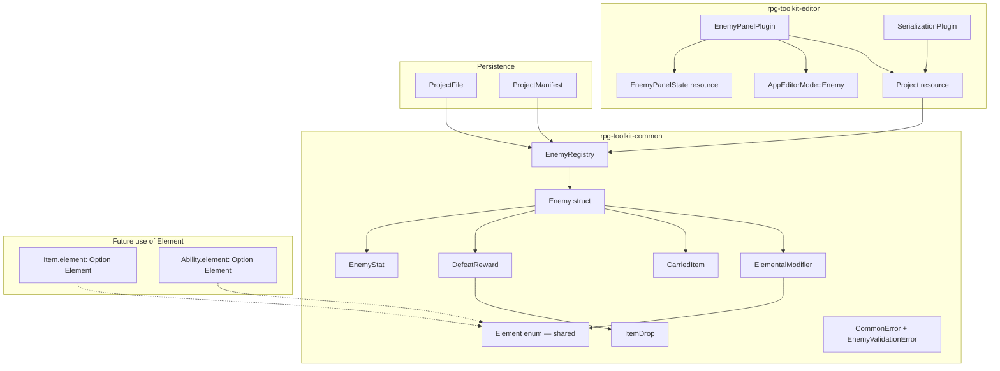

# Design Document: Enemies Editor

## Overview

The Enemies Editor feature introduces a complete enemy management system to the RPG Toolkit, consisting of:

1. **Data Model** (`rpg-toolkit-common`): An `EnemyRegistry` storing `Enemy` structs with stats, defeat rewards, carried items, and elemental modifiers.
2. **Editor Plugin** (`rpg-toolkit-editor`): An `EnemyPanelPlugin` providing a 3-panel egui interface (list, detail, preview) following the established pattern of `CharacterPanelPlugin`, `ItemPanelPlugin`, and `AbilityPanelPlugin`.
3. **Project Integration**: The `EnemyRegistry` integrates into `ProjectFile`, `ProjectManifest`, and the editor `Project` resource, with serialization handled by the existing `SerializationPlugin`.

The design reuses existing patterns for validation (returning `CommonError` variants), serialization (serde derive with `#[serde(default)]`), and editor architecture (Bevy plugin with `run_if(resource_equals(AppEditorMode::Enemy))`).

## Architecture



### System Flow

1. User switches to "Enemy" mode via the Mode menu in `AppShellPlugin`
2. `EnemyPanelPlugin` renders when `AppEditorMode::Enemy` is active
3. All CRUD operations go through `EnemyRegistry` methods on `Project.enemies`
4. Changes set `Project.has_unsaved_enemy_changes = true`
5. `SerializationPlugin` includes `enemies` when building `ProjectFile` for save
6. On load, `ProjectFile::deserialize` validates enemy registry keys match IDs

## Components and Interfaces

### Common Crate (`rpg-toolkit-common`)

#### New Module: `element.rs` (shared)

The `Element` enum is defined in its own top-level module since it is a cross-cutting concept used by enemies (strengths/weaknesses), items (elemental imbuing on weapons), and abilities (elemental damage type). Placing it at the crate root avoids circular dependencies and ensures all subsystems reference the same type.

```rust
// crates/rpg-toolkit-common/src/element.rs
use serde::{Deserialize, Serialize};

/// Elemental damage/affinity type shared across enemies, items, and abilities.
#[derive(Clone, Copy, Debug, PartialEq, Eq, Hash, Serialize, Deserialize)]
pub enum Element {
    Fire,
    Ice,
    Lightning,
    Wind,
    Earth,
    Light,
    Dark,
}

impl Element {
    /// Returns all element variants for iteration (e.g., populating combo boxes).
    pub fn all() -> &'static [Element] {
        &[
            Element::Fire,
            Element::Ice,
            Element::Lightning,
            Element::Wind,
            Element::Earth,
            Element::Light,
            Element::Dark,
        ]
    }
}
```

```rust
// Public exports added to lib.rs
pub mod element;
pub mod enemy;
pub use element::Element;
pub use enemy::{
    CarriedItem, DefeatReward, ElementalModifier, Enemy, EnemyId,
    EnemyRegistry, EnemyStat, ItemDrop,
};
```

#### New Module: `enemy.rs`

The enemy module imports `Element` from the shared `element` module rather than defining it locally. This allows items and abilities to reference the same `Element` type in future specs (e.g., `Item.element: Option<Element>` for elemental weapons, `Ability.element: Option<Element>` for elemental abilities).

#### Abilities Integration

Enemies reference abilities by `AbilityId` (the same type used in `AbilityRegistry`). The editor displays a searchable combo box populated from the project's `AbilityRegistry`, allowing designers to pick abilities to assign. This is a soft reference — the registry does not validate that ability IDs exist in the `AbilityRegistry` at data model level (they may be created later), but the editor UI will show a warning indicator for unresolved references.

#### EnemyRegistry API

| Method | Signature | Description |
|--------|-----------|-------------|
| `create_enemy` | `(&mut self, name: &str) -> Result<EnemyId, CommonError>` | Trim, validate name, generate UUID, insert with defaults |
| `delete_enemy` | `(&mut self, id: &EnemyId) -> Result<(), CommonError>` | Remove enemy by ID |
| `rename_enemy` | `(&mut self, id: &EnemyId, new_name: &str) -> Result<(), CommonError>` | Trim, validate, update display_name |
| `update_description` | `(&mut self, id: &EnemyId, desc: &str) -> Result<(), CommonError>` | Truncate to 256 chars, store |
| `add_stat` | `(&mut self, id: &EnemyId, stat_name: &str) -> Result<(), CommonError>` | Validate name (1-32 chars, unique), append with base_value 0 |
| `remove_stat` | `(&mut self, id: &EnemyId, stat_name: &str) -> Result<(), CommonError>` | Remove stat; reject removal of "HP" |
| `update_stat` | `(&mut self, id: &EnemyId, stat_name: &str, base_value: u32) -> Result<(), CommonError>` | Update existing stat value |
| `update_exp` | `(&mut self, id: &EnemyId, exp: u32) -> Result<(), CommonError>` | Set defeat_rewards.exp |
| `update_gold` | `(&mut self, id: &EnemyId, gold: u32) -> Result<(), CommonError>` | Set defeat_rewards.gold |
| `add_item_drop` | `(&mut self, id: &EnemyId, item_id: &str, drop_chance: f64) -> Result<(), CommonError>` | Validate, append (max 10) |
| `remove_item_drop` | `(&mut self, id: &EnemyId, index: usize) -> Result<(), CommonError>` | Remove by index |
| `add_carried_item` | `(&mut self, id: &EnemyId, item_id: &str, obtain_chance: f64) -> Result<(), CommonError>` | Validate, append (max 8) |
| `remove_carried_item` | `(&mut self, id: &EnemyId, index: usize) -> Result<(), CommonError>` | Remove by index |
| `add_elemental_modifier` | `(&mut self, id: &EnemyId, element: Element, multiplier: f64) -> Result<(), CommonError>` | Validate, append (no duplicate element) |
| `update_elemental_modifier` | `(&mut self, id: &EnemyId, element: Element, multiplier: f64) -> Result<(), CommonError>` | Update existing modifier |
| `remove_elemental_modifier` | `(&mut self, id: &EnemyId, element: Element) -> Result<(), CommonError>` | Remove by element |
| `add_ability` | `(&mut self, id: &EnemyId, ability_id: &str) -> Result<(), CommonError>` | Validate non-empty, no duplicates, max 10, append |
| `remove_ability` | `(&mut self, id: &EnemyId, ability_id: &str) -> Result<(), CommonError>` | Remove matching ability reference |
| `sorted_enemies` | `(&self) -> Vec<&Enemy>` | Case-insensitive sort by display_name |
| `search_enemies` | `(&self, query: &str) -> Vec<&Enemy>` | Case-insensitive substring filter, sorted |

### Editor Crate (`rpg-toolkit-editor`)

#### New Module: `plugins/enemy_panel.rs`

```rust
pub struct EnemyPanelPlugin;

impl Plugin for EnemyPanelPlugin {
    fn build(&self, app: &mut App) {
        app.init_resource::<EnemyPanelState>()
            .add_systems(
                EguiPrimaryContextPass,
                enemy_panel_ui
                    .in_set(EditorUiSet::Panels)
                    .run_if(resource_equals(AppEditorMode::Enemy)),
            );
    }
}
```

#### EnemyPanelState Resource

```rust
#[derive(Resource, Default)]
pub struct EnemyPanelState {
    pub selected_enemy: Option<EnemyId>,
    pub create_dialog_open: bool,
    pub create_name_buffer: String,
    pub create_error: Option<String>,
    pub delete_confirm_target: Option<EnemyId>,
    pub name_edit_buffer: String,
    pub name_edit_error: Option<String>,
    pub description_buffer: String,
    pub search_buffer: String,
    /// Buffer for the ability search/add combo in the abilities section.
    pub ability_search_buffer: String,
}
```

### Integration Points

#### Modified Files

| File | Change |
|------|--------|
| `common/src/element.rs` | **New file** — shared `Element` enum (Fire, Ice, Lightning, Wind, Earth, Light, Dark) |
| `common/src/lib.rs` | Add `pub mod element;`, `pub mod enemy;` and re-exports |
| `common/src/error.rs` | Add `EnemyValidationError(String)` variant |
| `common/src/project.rs` | Add `enemies: EnemyRegistry` field to `ProjectFile` |
| `common/src/manifest.rs` | Add `enemies: EnemyRegistry` field to `ProjectManifest` |
| `editor/src/data/state.rs` | Add `Enemy` variant to `AppEditorMode` |
| `editor/src/data/project.rs` | Add `enemies: EnemyRegistry` and `has_unsaved_enemy_changes: bool` |
| `editor/src/plugins/mod.rs` | Add `pub mod enemy_panel;` and `pub use enemy_panel::EnemyPanelPlugin;` |
| `editor/src/plugins/app_shell.rs` | Add "👹 Enemy Editor" to Mode menu |
| `editor/src/plugins/serialization.rs` | Include `enemies` in `to_project_file()` |
| `editor/src/main.rs` | Register `EnemyPanelPlugin` |

> **Note on `Element` placement**: `Element` is defined in `common/src/element.rs` (not inside `enemy.rs`) because it is a shared concept. Future specs for items and abilities will import `Element` from here to support elemental weapon imbuing and elemental ability damage types without creating module coupling.

## Data Models

### Enemy (`rpg-toolkit-common/src/enemy.rs`)

```rust
use std::collections::HashMap;
use serde::{Deserialize, Serialize};
use uuid::Uuid;
use crate::ability::AbilityId;
use crate::element::Element;  // shared cross-cutting type
use crate::error::CommonError;
use crate::item::ItemId;

pub type EnemyId = String;

#[derive(Clone, Debug, PartialEq, Serialize, Deserialize)]
pub struct EnemyStat {
    pub name: String,
    pub base_value: u32,
}

#[derive(Clone, Debug, PartialEq, Serialize, Deserialize)]
pub struct ItemDrop {
    pub item_id: ItemId,
    pub drop_chance: f64,
}

#[derive(Clone, Debug, PartialEq, Serialize, Deserialize)]
pub struct DefeatReward {
    pub exp: u32,
    pub gold: u32,
    pub item_drops: Vec<ItemDrop>,
}

#[derive(Clone, Debug, PartialEq, Serialize, Deserialize)]
pub struct CarriedItem {
    pub item_id: ItemId,
    pub obtain_chance: f64,
}

#[derive(Clone, Debug, PartialEq, Serialize, Deserialize)]
pub struct ElementalModifier {
    pub element: Element,
    pub multiplier: f64,
}

#[derive(Clone, Debug, PartialEq, Serialize, Deserialize)]
pub struct Enemy {
    pub id: EnemyId,
    pub display_name: String,
    pub description: String,
    pub stats: Vec<EnemyStat>,
    pub defeat_rewards: DefeatReward,
    pub carried_items: Vec<CarriedItem>,
    pub elemental_modifiers: Vec<ElementalModifier>,
    /// Ability IDs this enemy can use in combat (references AbilityRegistry entries).
    pub abilities: Vec<AbilityId>,
}

#[derive(Clone, Debug, Default, PartialEq, Serialize, Deserialize)]
pub struct EnemyRegistry {
    pub enemies: HashMap<EnemyId, Enemy>,
}
```

### Default Enemy Stats

When an enemy is created, it receives these default stats:

| Stat | Base Value |
|------|-----------|
| HP | 10 |
| Attack | 5 |
| Defense | 5 |
| Speed | 5 |

The required stat "HP" cannot be removed. Attack, Defense, and Speed are default but removable.

The `abilities` list is initialized empty. Abilities are referenced by `AbilityId` (from the `AbilityRegistry`) and can be added/removed by the designer. An enemy can have at most 10 ability references.

### Validation Rules Summary

| Field | Constraint |
|-------|-----------|
| `display_name` | 1–64 chars after trim, ≥1 non-whitespace |
| `description` | 0–256 chars (truncated on store) |
| `EnemyStat.name` | 1–32 chars after trim, unique within enemy |
| `stats` | Max 20 entries |
| `ItemDrop.item_id` | Non-empty after trim |
| `ItemDrop.drop_chance` | 0.0 ≤ x ≤ 1.0 |
| `item_drops` | Max 10 entries |
| `CarriedItem.item_id` | Non-empty after trim |
| `CarriedItem.obtain_chance` | 0.0 ≤ x ≤ 1.0 |
| `carried_items` | Max 8 entries |
| `ElementalModifier.multiplier` | 0.0 ≤ x ≤ 10.0 |
| `elemental_modifiers` | Max 1 per Element variant (7 total) |
| `abilities` | Max 10 entries, each non-empty AbilityId, no duplicates |

## Correctness Properties

*A property is a characteristic or behavior that should hold true across all valid executions of a system—essentially, a formal statement about what the system should do. Properties serve as the bridge between human-readable specifications and machine-verifiable correctness guarantees.*

### Property 1: Serialization round-trip preserves registry equality

*For any* valid `EnemyRegistry` containing between 0 and 50 enemies (each with 1–20 stats, 0–10 item drops with `drop_chance` in [0.0, 1.0], 0–8 carried items with `obtain_chance` in [0.0, 1.0], 0–7 elemental modifiers with finite `multiplier` ≥ 0.0, and 0–10 ability references), serializing to JSON and deserializing back SHALL produce a structurally equal registry (via `PartialEq`).

**Validates: Requirements 15.1, 15.4, 1.2, 1.3, 1.4, 1.5, 1.6, 1.7, 1.9, 1.10**

### Property 2: Creation produces correctly initialized enemy

*For any* valid display name (1–64 non-whitespace characters after trimming), calling `create_enemy` SHALL insert an enemy with the trimmed name, a unique UUID v4 id matching the registry key, default stats (HP=10, Attack=5, Defense=5, Speed=5), empty `item_drops`, empty `carried_items`, empty `elemental_modifiers`, empty `abilities`, empty description, and `exp=0`, `gold=0`.

**Validates: Requirements 2.1, 2.4**

### Property 3: Invalid display name is rejected without modification

*For any* string that is empty after trimming, contains only whitespace, or exceeds 64 characters after trimming, calling `create_enemy` or `rename_enemy` SHALL return an `EnemyValidationError` and the registry SHALL remain unchanged (equal to its state before the call).

**Validates: Requirements 2.2, 2.3, 4.1, 4.2**

### Property 4: Operations on non-existent enemy ID return error without modification

*For any* `EnemyId` not present in the registry, calling any mutation method (rename, update_description, add_stat, remove_stat, update_stat, add_item_drop, remove_item_drop, add_carried_item, remove_carried_item, add_elemental_modifier, update_elemental_modifier, remove_elemental_modifier, update_exp, update_gold, delete_enemy) SHALL return an `EnemyValidationError` whose message contains the missing ID, and the registry SHALL remain unchanged.

**Validates: Requirements 3.2, 4.4, 5.6, 6.9, 7.7, 8.8**

### Property 5: Sorted listing is correctly ordered

*For any* `EnemyRegistry` containing one or more enemies, calling `sorted_enemies` SHALL return all enemies sorted case-insensitively by `display_name`, with ties broken by byte-order comparison of the original `display_name`.

**Validates: Requirements 9.1, 9.2**

### Property 6: Search filter returns only matching entries

*For any* `EnemyRegistry` and any non-empty, non-whitespace search string, calling `search_enemies` SHALL return only enemies whose `display_name` contains the search string via case-insensitive substring matching, in sorted order.

**Validates: Requirements 9.3, 9.4**

### Property 7: Description truncation

*For any* string of arbitrary length, calling `update_description` SHALL store at most the first 256 Unicode codepoints, and the stored value SHALL equal the first 256 codepoints of the input.

**Validates: Requirements 4.3**

### Property 8: Validation failure preserves registry state

*For any* `EnemyRegistry` and any operation that violates a validation rule (duplicate stat name, out-of-range probability/multiplier, capacity overflow, removing required stat "HP"), the operation SHALL return an error and the registry SHALL be identical (via `PartialEq`) to its state before the call.

**Validates: Requirements 1.11, 5.3, 5.4, 5.8, 5.9, 6.4, 6.5, 6.6, 7.2, 7.3, 7.4, 8.2, 8.3**

## Error Handling

### New Error Variant

Add to `CommonError` in `crates/rpg-toolkit-common/src/error.rs`:

```rust
#[error("Enemy validation error: {0}")]
EnemyValidationError(String),
```

### Error Conditions

| Operation | Error Condition | Error Message Pattern |
|-----------|----------------|----------------------|
| `create_enemy` | Empty/whitespace name | "Display name must not be empty or whitespace-only" |
| `create_enemy` | Name > 64 chars | "Display name must not exceed 64 characters" |
| `delete_enemy` | ID not found | "Enemy not found: {id}" |
| `rename_enemy` | Invalid name | Same as create |
| `add_stat` | Name empty or > 32 chars | "Stat name must be between 1 and 32 characters" |
| `add_stat` | Duplicate name | "Duplicate stat name: {name}" |
| `add_stat` | Would exceed 20 stats | "Enemy cannot have more than 20 stats" |
| `remove_stat` | Required stat "HP" | "Cannot remove required stat: HP" |
| `remove_stat` | Stat not found | "Stat not found: {name}" |
| `add_item_drop` | Empty item_id | "Item ID must not be empty" |
| `add_item_drop` | drop_chance out of range | "Drop chance must be between 0.0 and 1.0" |
| `add_item_drop` | Would exceed 10 drops | "Enemy cannot have more than 10 item drops" |
| `add_carried_item` | Empty item_id | "Item ID must not be empty" |
| `add_carried_item` | obtain_chance out of range | "Obtain chance must be between 0.0 and 1.0" |
| `add_carried_item` | Would exceed 8 items | "Enemy cannot have more than 8 carried items" |
| `add_elemental_modifier` | Negative multiplier | "Multiplier must be greater than or equal to 0.0" |
| `add_elemental_modifier` | Duplicate element | "Elemental modifier for {element:?} already exists" |
| `add_ability` | Empty ability_id | "Ability ID must not be empty" |
| `add_ability` | Duplicate ability_id | "Ability already assigned: {ability_id}" |
| `add_ability` | Would exceed 10 abilities | "Enemy cannot have more than 10 abilities" |
| `remove_ability` | Ability not found | "Ability not found: {ability_id}" |

### Error Handling in Editor UI

The editor follows the same pattern as `CharacterPanelPlugin` and `AbilityPanelPlugin`:
- Validation errors displayed inline using `ui.colored_label(egui::Color32::RED, error_message)`
- Dialog validation errors shown within the dialog window
- Operations that fail silently log to stderr (matching existing `eprintln!` warnings)
- No panics — all fallible operations use `Result<(), CommonError>`

## Testing Strategy

### Property-Based Testing (proptest)

The `EnemyRegistry` data model is well-suited for property-based testing because it involves:
- Pure functions with clear input/output behavior
- Multiple validation constraints that should hold across all inputs
- Serialization round-trips
- Ordering invariants

**Library**: `proptest` (already a workspace dependency)
**Location**: `tests/properties/enemy_round_trip.rs` and `tests/properties/enemy_invariants.rs`
**Configuration**: Minimum 100 iterations per property

Each property test MUST be tagged with a comment referencing its design property:
```rust
// Feature: enemies-editor, Property 1: Serialization round-trip preserves registry equality
```

### Unit Testing

Unit tests in `rpg-toolkit-common/src/enemy.rs` (inline `#[cfg(test)]` module) covering:
- Specific creation examples with known names
- Each error condition individually (the required "HP" stat cannot be removed)
- Element enum variant exhaustiveness
- Boundary values (0 stats, 20 stats, 0.0 and 1.0 probabilities)

### Integration Testing

- Backward compatibility: deserializing existing project JSON (without `enemies` field) produces empty `EnemyRegistry`
- Full save/load cycle through `SerializationPlugin`
- `ProjectFile::deserialize` validates enemy key/ID consistency

### Test File Organization

| File | Purpose |
|------|---------|
| `tests/properties/enemy_round_trip.rs` | Property 1 (serialization round-trip) |
| `tests/properties/enemy_invariants.rs` | Properties 2–8 (creation, validation, sorting, search, truncation) |
| `crates/rpg-toolkit-common/src/enemy.rs` | Inline unit tests for specific examples and edge cases |
