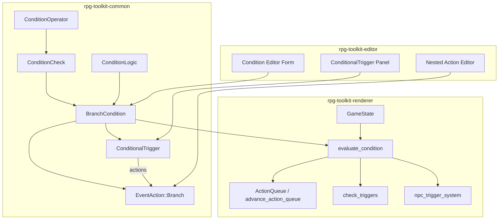
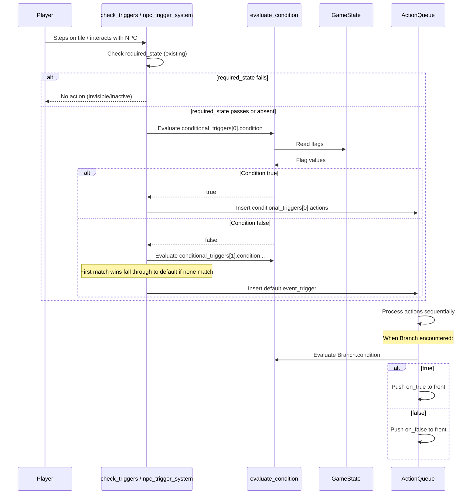
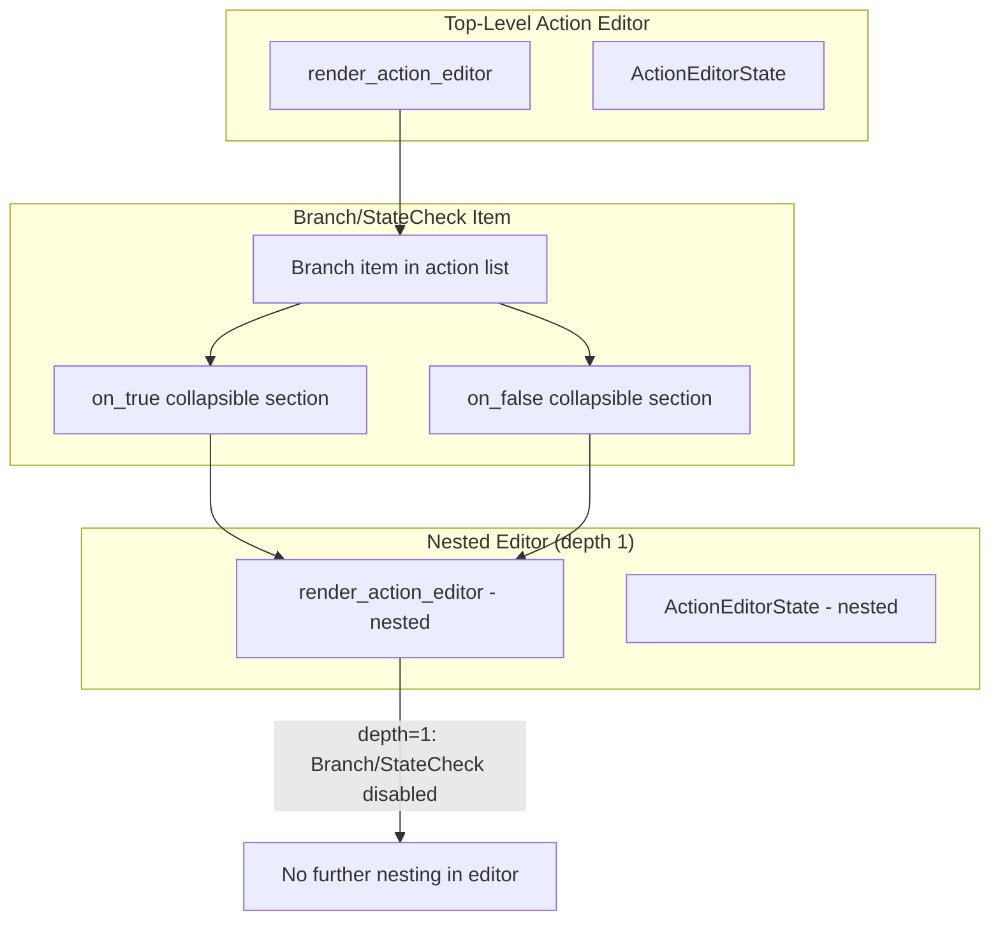
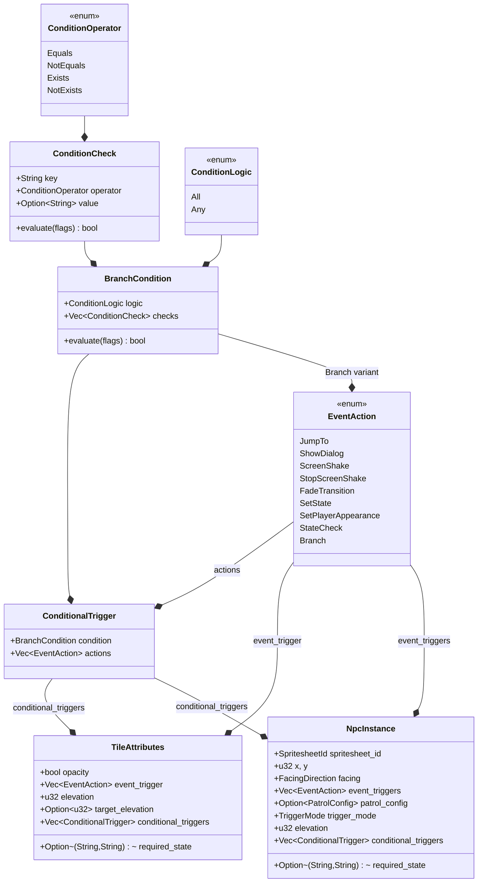

# Design Document: Event Branching

## Overview

This feature extends the RPG toolkit's event system with compound branching conditions, a new `Branch` action variant, and sequence-level conditional triggers on tiles and NPCs. The design introduces three complementary layers:

1. **Data model layer** (`rpg-toolkit-common`) — new types `BranchCondition`, `ConditionCheck`, `ConditionOperator`, `ConditionLogic`, `ConditionalTrigger`, and a new `Branch` variant on `EventAction`.
2. **Runtime evaluation layer** (`rpg-toolkit-renderer`) — condition evaluation against `GameState`, `Branch` action processing in `advance_action_queue`, and `ConditionalTrigger` resolution in `check_triggers` / `npc_trigger_system`.
3. **Editor layer** (`rpg-toolkit-editor`) — nested action editors for branch UX, a condition editor form, and conditional trigger management panels on tile/NPC dialogs.

The existing `StateCheck` variant and its runtime behavior remain untouched for backward compatibility.

## Architecture



### Evaluation Flow



## Components and Interfaces

### New Types in `rpg-toolkit-common`

#### Condition Model

```rust
/// Comparison operators for condition checks.
#[derive(Clone, Copy, Debug, PartialEq, Eq, Serialize, Deserialize)]
pub enum ConditionOperator {
    Equals,
    NotEquals,
    Exists,
    NotExists,
}

/// A single atomic condition: compare a game state key using an operator.
#[derive(Clone, Debug, PartialEq, Serialize, Deserialize)]
pub struct ConditionCheck {
    pub key: String,
    pub operator: ConditionOperator,
    /// Required for Equals/NotEquals; ignored for Exists/NotExists.
    #[serde(default)]
    pub value: Option<String>,
}

/// How multiple checks are combined.
#[derive(Clone, Copy, Debug, Default, PartialEq, Eq, Serialize, Deserialize)]
pub enum ConditionLogic {
    #[default]
    All,
    Any,
}

/// A compound condition: multiple checks combined with AND/OR logic.
#[derive(Clone, Debug, PartialEq, Serialize, Deserialize)]
pub struct BranchCondition {
    #[serde(default)]
    pub logic: ConditionLogic,
    #[serde(default)]
    pub checks: Vec<ConditionCheck>,
}
```

#### ConditionalTrigger

```rust
/// A condition-gated event trigger sequence.
#[derive(Clone, Debug, PartialEq, Serialize, Deserialize)]
pub struct ConditionalTrigger {
    pub condition: BranchCondition,
    pub actions: Vec<EventAction>,
}
```

#### New EventAction Variant

```rust
// Added to the existing EventAction enum:
Branch {
    condition: BranchCondition,
    on_true: Vec<EventAction>,
    on_false: Vec<EventAction>,
}
```

### Evaluation Function

A pure function in `rpg-toolkit-common` (or `rpg-toolkit-renderer`) providing the core evaluation logic:

```rust
impl BranchCondition {
    /// Evaluates this condition against a set of game state flags.
    /// Returns true if the condition is satisfied.
    pub fn evaluate(&self, flags: &HashMap<String, String>) -> bool;
}

impl ConditionCheck {
    /// Evaluates a single check against game state flags.
    pub fn evaluate(&self, flags: &HashMap<String, String>) -> bool;
}
```

**Design Decision**: The `evaluate` method lives on the data types themselves, taking a `&HashMap<String, String>` rather than a `&GameState` Bevy resource. This keeps the evaluation logic pure and testable without Bevy ECS dependencies. The renderer systems simply call `condition.evaluate(&game_state.flags)`.

### Modified Structs

**TileAttributes** (in `map.rs`):
```rust
pub struct TileAttributes {
    // ... existing fields ...
    #[serde(default)]
    pub conditional_triggers: Vec<ConditionalTrigger>,
}
```

**NpcInstance** (in `spritesheet.rs`):
```rust
pub struct NpcInstance {
    // ... existing fields ...
    #[serde(default)]
    pub conditional_triggers: Vec<ConditionalTrigger>,
}
```

### Renderer System Changes

**`check_triggers`** — modified to evaluate `conditional_triggers` before collecting default `event_trigger`:
- For each layer's tile attributes at the destination, check `conditional_triggers` in order.
- If a conditional trigger's condition evaluates to true, use its `actions` instead of `event_trigger`.
- If no conditional trigger matches, fall through to existing `event_trigger` behavior.

**`npc_trigger_system`** — modified similarly:
- After `required_state` passes, evaluate `conditional_triggers` in order.
- First matching trigger's `actions` replace the default `event_triggers`.
- Fall through to `event_triggers` if no match.

**`advance_action_queue`** — new match arm for `EventAction::Branch`:
- Evaluate `condition` against current `GameState`.
- Pop the `Branch` action.
- Push the matching branch (`on_true` or `on_false`) to the front of the queue.
- Identical pattern to existing `StateCheck` handling.

### Editor Components

#### Nested Action Editor Architecture



**Key Design Decisions:**

1. **Single-level nesting only (depth 1)**: `render_action_editor` gains a `depth: usize` parameter. At `depth >= 1`, the `Branch` and `StateCheck` action types are removed from the type selector dropdown, preventing any nesting. This keeps the editor simple — complex multi-tier branching is handled by stacking multiple `ConditionalTrigger` entries with priority ordering instead. The data model supports deeper nesting at runtime, so this limit can be raised later without data model or runtime changes.

2. **State management**: Each nested action editor has its own `ActionEditorState`. These are stored inline on the parent Branch/StateCheck entry rather than in a global resource, avoiding conflicts between multiple open editors.

3. **Collapsible sections via `egui::CollapsingHeader`**: The `on_true` and `on_false` branches render as collapsible headers within the action list row for a Branch/StateCheck item. When expanded, they embed a `render_action_editor` call (at depth 1) operating on the branch's action vec.

4. **Real-time mutation**: Nested editors operate directly on `&mut Vec<EventAction>` references to the parent action's `on_true`/`on_false` fields, so changes propagate immediately.

#### Condition Editor Form

Rendered when `Branch` is selected as the action type. Contains:
- A `ComboBox` for logic selection (All / Any)
- A dynamic list of `ConditionCheck` rows, each with:
  - Text field for `key`
  - `ComboBox` for `operator` (Equals, Not Equals, Exists, Not Exists)
  - Text field for `value` (disabled when operator is Exists/NotExists)
  - Remove button (✕)
- "Add Condition" button to append a new check
- Validation: button disabled unless at least one check with non-empty key exists

#### ConditionalTrigger Panel

Added to both `EventTriggerDialog` and NPC dialog, rendered above the default action list:
- Section header "Conditional Triggers" with "Add Conditional Trigger" button
- Each entry as a numbered collapsible panel (`CollapsingHeader`) showing:
  - Summary line: "Condition N: {logic} [{check_count} checks]"
  - When expanded: condition editor + nested action editor for that trigger's actions
  - Reorder buttons (▲▼) and remove button (✕)
- Evaluation order communicated by numbered labels

## Data Models

### Complete Type Hierarchy



### Serialization Format (JSON)

```json
{
  "type": "Branch",
  "condition": {
    "logic": "All",
    "checks": [
      { "key": "quest_started", "operator": "Equals", "value": "true" },
      { "key": "boss_defeated", "operator": "NotExists" }
    ]
  },
  "on_true": [
    { "type": "ShowDialog", "text": { "type": "Inline", "value": "You're ready!" }, "config": { ... } }
  ],
  "on_false": [
    { "type": "ShowDialog", "text": { "type": "Inline", "value": "Come back later." }, "config": { ... } }
  ]
}
```

```json
{
  "conditional_triggers": [
    {
      "condition": {
        "logic": "Any",
        "checks": [
          { "key": "door_unlocked", "operator": "Exists" }
        ]
      },
      "actions": [
        { "type": "JumpTo", "target_map_id": "dungeon-01", "target_x": 5, "target_y": 10 }
      ]
    }
  ]
}
```

## Correctness Properties

*A property is a characteristic or behavior that should hold true across all valid executions of a system — essentially, a formal statement about what the system should do. Properties serve as the bridge between human-readable specifications and machine-verifiable correctness guarantees.*

### Property 1: BranchCondition Evaluation Semantics

*For any* `BranchCondition` and any `GameState` flags map, evaluation SHALL return:
- When `logic` is `All`: true if and only if every `ConditionCheck` in `checks` individually evaluates to true (or `checks` is empty).
- When `logic` is `Any`: true if and only if at least one `ConditionCheck` in `checks` evaluates to true (or `checks` is empty).

**Validates: Requirements 1.6, 1.7, 1.8**

### Property 2: ConditionCheck Operator Semantics

*For any* `ConditionCheck` and any `GameState` flags map, evaluation SHALL return:
- `Equals`: true iff `value` is `Some(v)` and `flags[key] == v`
- `NotEquals`: true iff `value` is `None`, or key is absent from flags, or `flags[key] != v`
- `Exists`: true iff `key` is present in flags (regardless of `value` field)
- `NotExists`: true iff `key` is absent from flags (regardless of `value` field)

**Validates: Requirements 1.5, 2.1, 2.2, 2.3, 2.4, 2.5**

### Property 3: Branch Action Dispatches Correct Branch

*For any* `EventAction::Branch` with a given `BranchCondition`, `on_true` actions, and `on_false` actions, and *for any* `GameState`, when the `ActionQueue` processes the `Branch` action, the resulting front of the queue SHALL contain exactly the `on_true` actions (in order) when the condition evaluates to true, or exactly the `on_false` actions (in order) when the condition evaluates to false.

**Validates: Requirements 3.2, 3.3, 3.4**

### Property 4: ConditionalTrigger First-Match-Wins Selection

*For any* ordered list of `ConditionalTrigger` entries, a default action list, and *for any* `GameState`, the selected action list SHALL be:
- The `actions` of the first `ConditionalTrigger` whose `condition` evaluates to true, or
- The default action list if no `ConditionalTrigger` condition evaluates to true.

**Validates: Requirements 4.3, 4.4, 4.5, 4.6, 5.2, 5.3, 5.4, 5.5**

### Property 5: required_state Precedence Over ConditionalTriggers

*For any* tile or NPC with a `required_state` that does not match the current `GameState`, the system SHALL not evaluate `conditional_triggers` and SHALL not produce any action list from that tile/NPC.

**Validates: Requirements 10.1, 10.2**

### Property 6: Serialization Round-Trip

*For any* valid data structure containing `BranchCondition`, `EventAction::Branch`, `ConditionalTrigger`, `TileAttributes`, or `NpcInstance` values, serializing to JSON and then deserializing SHALL produce a value equal to the original.

**Validates: Requirements 1.10, 3.6, 4.8, 5.7, 9.5**

## Error Handling

| Scenario | Handling |
|----------|----------|
| `BranchCondition` with empty `checks` | Evaluates to `true` (vacuous truth). No error. |
| `ConditionCheck` with `Equals`/`NotEquals` and `value: None` | `Equals` → false, `NotEquals` → true. Logged as warning in debug builds. |
| `Branch` with empty `on_true`/`on_false` | Valid — pops Branch, pushes nothing. Queue continues with remaining actions. |
| Deserialization of unknown `EventAction` variant | Serde reports `unknown variant` error with the unrecognized type tag. Older toolkit versions surface this as a clear deserialization error. |
| Missing `conditional_triggers` in JSON | `#[serde(default)]` produces empty `Vec`. No error. |
| Editor: user tries to nest Branch inside Branch | Branch/StateCheck types removed from action type selector at depth 1. No error message needed — options simply unavailable. Complex branching uses ConditionalTrigger priority list instead. |
| Editor: empty key in ConditionCheck | Save/Add button disabled. Inline hint "Key required". |
| Editor: no ConditionChecks in Branch | Save/Add button disabled. Inline hint "Add at least one condition". |

## Testing Strategy

### Property-Based Testing

**Library**: [proptest](https://crates.io/crates/proptest) (already used pattern in the project's `tests/properties/` directory via similar random-input testing approaches)

**Configuration**: Minimum 100 iterations per property test.

**Tag format**: `// Feature: event-branching, Property {N}: {title}`

Tests will be placed in `tests/properties/` as a new file `event_branching.rs`.

**Property tests to implement:**

1. **BranchCondition evaluation semantics** — Generate arbitrary `BranchCondition` (random logic, random checks with random operators/keys/values) and arbitrary `HashMap<String, String>`. Verify evaluation matches manual computation of the expected logic.

2. **ConditionCheck operator semantics** — Generate arbitrary `ConditionCheck` and `HashMap<String, String>`. Verify evaluation matches expected operator behavior.

3. **Branch action dispatches correct branch** — Generate arbitrary `Branch` action and `GameState`. Simulate queue processing and verify correct branch is at the front.

4. **ConditionalTrigger first-match-wins** — Generate arbitrary `Vec<ConditionalTrigger>`, default actions, and `GameState`. Verify selected actions match the first-true trigger or default.

5. **required_state precedence** — Generate tile/NPC with non-matching `required_state` and arbitrary `conditional_triggers`. Verify no actions are produced.

6. **Serialization round-trip** — Generate arbitrary valid instances of all new types. Serialize to JSON, deserialize, assert equality.

### Unit Tests

- `StateCheck` continues working identically (backward compat regression)
- Empty branch condition edge cases (empty checks with All/Any)
- `ConditionCheck` with `Equals` and `value: None` edge case
- Deserialization of existing project files without new fields (defaults applied)
- Nested `Branch` inside `Branch` processing (2-level deep queue manipulation)
- `SetState` within a `ConditionalTrigger`'s actions modifies state for subsequent actions

### Integration / Manual Testing

- Editor UX: nested action editors open/close correctly, depth limit enforced
- Editor UX: condition editor form validates inputs
- Editor UX: conditional trigger panel reorder/add/remove operations
- Full gameplay: tile with conditional triggers responds to game state changes
- Full gameplay: NPC with conditional triggers changes dialog based on progression
- Serialization: save project with new features, reload, verify identical state
