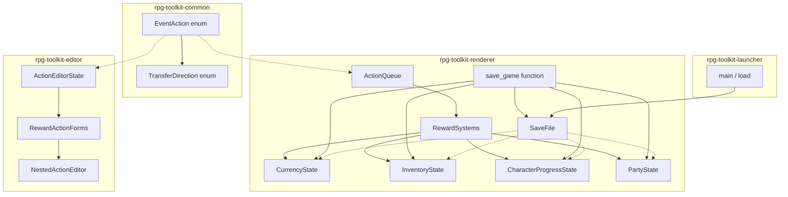
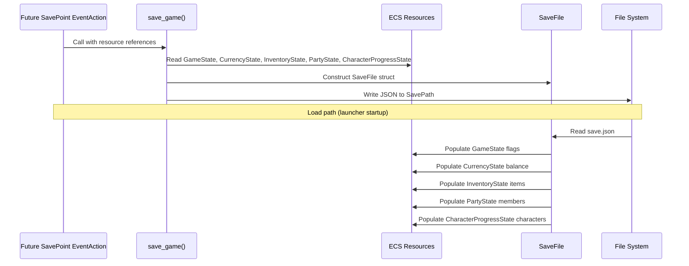
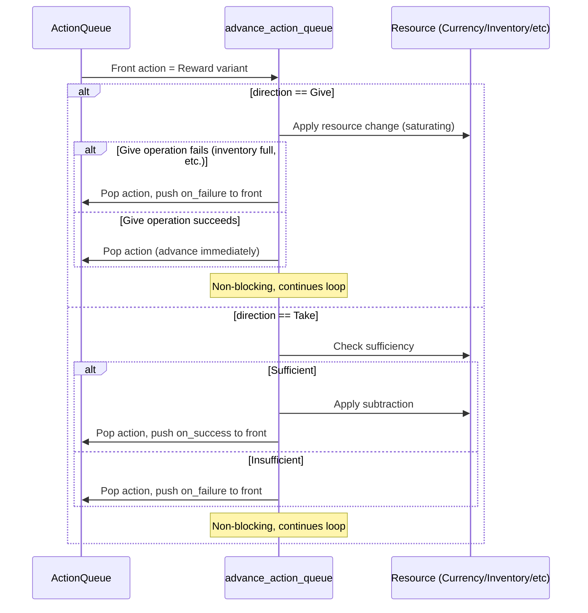

# Design Document: Event Rewards

## Overview

This design extends the rpg-toolkit event system with five reward-oriented `EventAction` variants that enable game designers to grant and take resources during gameplay events. The implementation spans three crates:

- **rpg-toolkit-common**: Data model additions (`TransferDirection` enum, five new `EventAction` variants with `direction`, `on_success`, and `on_failure` fields)
- **rpg-toolkit-renderer**: New ECS resources (`CurrencyState`, `InventoryState`, `CharacterProgressState`, `PartyState`) and systems to process reward actions within the existing `ActionQueue` loop
- **rpg-toolkit-editor**: UI extensions to the Event Trigger Editor for configuring reward actions with direction toggles and nested action editors

The design follows the established patterns: serde-tagged union format for `EventAction`, non-blocking advancement for `Give` direction, and front-of-queue branch injection for `Take` direction (mirroring `StateCheck`/`Branch` behavior). A key design decision is that **Give direction can also trigger `on_failure` branching** when the give operation cannot complete (inventory full for unstackable items, stack cap reached), rather than silently discarding the reward.

## Architecture



### Persistence Flow



### Processing Flow



## Components and Interfaces

### rpg-toolkit-common Changes

#### TransferDirection Enum

New enum added to `map.rs`:

```rust
/// Direction of a reward transfer: Give grants to the player, Take removes from the player.
#[derive(Clone, Copy, Debug, Default, PartialEq, Eq, Serialize, Deserialize)]
pub enum TransferDirection {
    #[default]
    Give,
    Take,
}
```

#### New EventAction Variants

Five new variants added to the `EventAction` enum in `map.rs`:

```rust
/// Award or deduct currency.
GiveCurrency {
    amount: u64,
    #[serde(default)]
    direction: TransferDirection,
    #[serde(default)]
    on_success: Vec<EventAction>,
    #[serde(default)]
    on_failure: Vec<EventAction>,
},
/// Award or deduct experience points.
GiveExperience {
    amount: u64,
    #[serde(default)]
    target: Option<CharacterId>,
    #[serde(default)]
    direction: TransferDirection,
    #[serde(default)]
    on_success: Vec<EventAction>,
    #[serde(default)]
    on_failure: Vec<EventAction>,
},
/// Add or remove an item from inventory.
GiveItem {
    item_id: ItemId,
    #[serde(default = "default_quantity")]
    quantity: u32,
    #[serde(default)]
    direction: TransferDirection,
    #[serde(default)]
    on_success: Vec<EventAction>,
    #[serde(default)]
    on_failure: Vec<EventAction>,
},
/// Teach or remove an ability from a character.
LearnAbility {
    ability_id: AbilityId,
    target: CharacterId,
    #[serde(default)]
    direction: TransferDirection,
    #[serde(default)]
    on_success: Vec<EventAction>,
    #[serde(default)]
    on_failure: Vec<EventAction>,
},
/// Add or remove a character from the active party.
AddPartyMember {
    character_id: CharacterId,
    #[serde(default)]
    direction: TransferDirection,
    #[serde(default)]
    on_success: Vec<EventAction>,
    #[serde(default)]
    on_failure: Vec<EventAction>,
},
```

#### Custom Deserialization Validation

Each reward variant requires custom validation during deserialization (same pattern as `ChoiceData`):

- **GiveCurrency**: `amount` must be in `[1, 9_999_999]`
- **GiveExperience**: `amount` must be in `[1, 9_999_999]`; `target` if present must be non-empty
- **GiveItem**: `item_id` must be non-empty; `quantity` must be in `[1, 999]`
- **LearnAbility**: `ability_id` must be non-empty; `target` must be non-empty
- **AddPartyMember**: `character_id` must be 1–64 characters

The validation will use a helper function pattern with `#[serde(try_from = "RawVariant")]` on intermediate structs, consistent with the existing `ChoiceData` validation approach.

#### Default Helpers

```rust
fn default_quantity() -> u32 { 1 }
```

### rpg-toolkit-renderer Changes

#### New ECS Resources

Four new Bevy `Resource` types in `resources.rs`:

```rust
/// Player's current currency balance.
#[derive(Resource, Default, Debug, Clone, PartialEq, Eq)]
pub struct CurrencyState {
    pub balance: u64,
}

/// Player's inventory: item_id → quantity held.
#[derive(Resource, Default, Debug, Clone, PartialEq, Eq)]
pub struct InventoryState {
    pub items: HashMap<ItemId, u32>,
}

/// Per-character experience and learned abilities.
#[derive(Debug, Clone, Default, PartialEq, Eq)]
pub struct CharacterProgress {
    pub experience: u64,
    pub learned_abilities: Vec<AbilityId>,
}

/// Progress state for all characters.
#[derive(Resource, Default, Debug, Clone, PartialEq, Eq)]
pub struct CharacterProgressState {
    pub characters: HashMap<CharacterId, CharacterProgress>,
}

/// Active party members (ordered list).
#[derive(Resource, Default, Debug, Clone, PartialEq, Eq)]
pub struct PartyState {
    pub members: Vec<CharacterId>,
}
```

#### Resource Initialization

All four resources are initialized at renderer startup using `init_resource::<T>()` which uses `Default` (balance=0, empty maps, empty vec). This happens in the renderer's plugin setup alongside existing resources.

#### ActionQueue Integration

The reward actions are handled within the existing `advance_action_queue` system's `'action_loop` — the same loop that processes `SetState`, `StopScreenShake`, and `Branch`. Each reward action:

1. Pops itself from the queue front
2. Evaluates the direction-specific logic
3. For **Give** direction: applies the resource change; if the operation fails (inventory constraints), pushes `on_failure` to front; otherwise advances (non-blocking)
4. For **Take** direction: checks sufficiency, applies if sufficient, pushes `on_success` or `on_failure` to front
5. Continues the `'action_loop` (never returns/blocks)

The branch injection follows the exact same pattern as `StateCheck` and `Branch`:
```rust
let branch = if success { on_success } else { on_failure };
for action in branch.into_iter().rev() {
    queue.actions.push_front(action);
}
```

#### Give Direction Failure Cases

The design explicitly treats these Give-direction situations as failures that trigger `on_failure`:

- **GiveItem** (stackable): Attempting to give items when the player already holds `stack_limit` quantity — no items added, `on_failure` branch taken
- **GiveItem** (unstackable): Attempting to give an unstackable item the player already owns — no item added, `on_failure` branch taken
- **GiveCurrency**, **GiveExperience**, **AddPartyMember**, **LearnAbility** (Give direction): These use saturating addition or idempotent behavior, so they always succeed; `on_failure` is never triggered in Give direction for these types

For **GiveItem with Give direction**, the success/failure logic is:
```rust
EventAction::GiveItem { item_id, quantity, direction: TransferDirection::Give, on_success, on_failure } => {
    let success = if let Some(item_def) = item_registry.get(&item_id) {
        if let Some(current_qty) = inventory.items.get_mut(&item_id) {
            if !item_def.stackable {
                // Unstackable item already owned — failure
                false
            } else if *current_qty >= item_def.stack_limit {
                // Already at stack cap — failure
                false
            } else {
                // Add up to stack_limit
                *current_qty = (*current_qty + quantity).min(item_def.stack_limit);
                true
            }
        } else {
            // New item — always succeeds
            inventory.items.insert(item_id, quantity.min(item_def.stack_limit));
            true
        }
    } else {
        warn!("GiveItem item_id '{}' not found in ItemRegistry; skipping", item_id);
        // Unknown item — treat as no-op, advance without branching
        queue.actions.pop_front();
        continue;
    };

    queue.actions.pop_front();
    let branch = if success { on_success } else { on_failure };
    for action in branch.into_iter().rev() {
        queue.actions.push_front(action);
    }
    continue;
}
```

### rpg-toolkit-editor Changes

#### ActionType Enum Extension

Five new variants in `ActionType`:

```rust
pub enum ActionType {
    // ... existing variants ...
    GiveCurrency,
    GiveExperience,
    GiveItem,
    LearnAbility,
    AddPartyMember,
}
```

#### ActionEditorState Extension

New fields added to `ActionEditorState`:

```rust
// Reward action shared fields
pub reward_direction: TransferDirection,
pub reward_on_success: Vec<EventAction>,
pub reward_on_failure: Vec<EventAction>,
pub reward_on_success_editor: Box<ActionEditorState>,
pub reward_on_failure_editor: Box<ActionEditorState>,

// GiveCurrency fields
pub currency_amount: String,

// GiveExperience fields
pub experience_amount: String,
pub experience_target: Option<String>, // None = all party

// GiveItem fields
pub give_item_id: String,
pub give_item_quantity: String,

// LearnAbility fields
pub learn_ability_id: String,
pub learn_ability_target: String,

// AddPartyMember fields
pub add_party_character_id: String,
```

#### UI Layout

When a reward action type is selected:

1. **Type-specific fields** are shown (amount input, item selector, etc.)
2. **Direction toggle** ("Give" / "Take") is displayed
3. **When direction is "Take"**: expandable sections for `on_success` and `on_failure` action lists appear, each with a nested action editor (recursive, same selector minus itself to prevent infinite nesting at extreme depths)
4. **When direction is "Give"**: The `on_success`/`on_failure` editors are hidden (they exist in the data model but the editor doesn't expose them for Give direction, since Give-direction failures are handled automatically by the runtime)
5. **Validation**: The Add/Update button is disabled if required fields are empty/invalid or (for Take direction) if `on_failure` is empty

The nested action editors reuse `ActionEditorState::new_nested()` pattern, matching the existing `EditorChoice` approach for `ShowSelection`.

#### Searchable Selectors

For `GiveItem`, `LearnAbility`, and `AddPartyMember`, the editor uses the existing `searchable_combobox` plugin to present filterable lists from the project's registries (`ItemRegistry`, `AbilityRegistry`, `CharacterRegistry`).

## Data Models

### TransferDirection

| Field | Type | Default | Notes |
|-------|------|---------|-------|
| (variant) | enum | `Give` | `Give` or `Take` |

### GiveCurrency

| Field | Type | Default | Validation |
|-------|------|---------|------------|
| amount | u64 | (required) | 1 ≤ amount ≤ 9,999,999 |
| direction | TransferDirection | Give | — |
| on_success | Vec\<EventAction\> | [] | — |
| on_failure | Vec\<EventAction\> | [] | — |

### GiveExperience

| Field | Type | Default | Validation |
|-------|------|---------|------------|
| amount | u64 | (required) | 1 ≤ amount ≤ 9,999,999 |
| target | Option\<CharacterId\> | None | If present, non-empty |
| direction | TransferDirection | Give | — |
| on_success | Vec\<EventAction\> | [] | — |
| on_failure | Vec\<EventAction\> | [] | — |

### GiveItem

| Field | Type | Default | Validation |
|-------|------|---------|------------|
| item_id | ItemId | (required) | Non-empty string |
| quantity | u32 | 1 | 1 ≤ quantity ≤ 999 |
| direction | TransferDirection | Give | — |
| on_success | Vec\<EventAction\> | [] | — |
| on_failure | Vec\<EventAction\> | [] | — |

### LearnAbility

| Field | Type | Default | Validation |
|-------|------|---------|------------|
| ability_id | AbilityId | (required) | Non-empty string |
| target | CharacterId | (required) | Non-empty string |
| direction | TransferDirection | Give | — |
| on_success | Vec\<EventAction\> | [] | — |
| on_failure | Vec\<EventAction\> | [] | — |

### AddPartyMember

| Field | Type | Default | Validation |
|-------|------|---------|------------|
| character_id | CharacterId | (required) | 1–64 characters |
| direction | TransferDirection | Give | — |
| on_success | Vec\<EventAction\> | [] | — |
| on_failure | Vec\<EventAction\> | [] | — |

### CurrencyState (ECS Resource)

| Field | Type | Default |
|-------|------|---------|
| balance | u64 | 0 |

### InventoryState (ECS Resource)

| Field | Type | Default |
|-------|------|---------|
| items | HashMap\<ItemId, u32\> | empty |

### CharacterProgressState (ECS Resource)

| Field | Type | Default |
|-------|------|---------|
| characters | HashMap\<CharacterId, CharacterProgress\> | empty |

### CharacterProgress

| Field | Type | Default |
|-------|------|---------|
| experience | u64 | 0 |
| learned_abilities | Vec\<AbilityId\> | [] |

### PartyState (ECS Resource)

| Field | Type | Default |
|-------|------|---------|
| members | Vec\<CharacterId\> | [] |

## Persistence Layer

This section addresses how the new ECS resources (CurrencyState, InventoryState, PartyState, CharacterProgressState) are persisted to and loaded from disk alongside the existing GameState flags.

### Design Decisions

1. **Remove per-frame `save_shutdown` system** — The current implementation runs a `save_shutdown` system in the `Last` schedule every frame, writing to disk whenever `GameState` changes. This is removed entirely. Persistence becomes on-demand only, triggered by a future "save point" EventAction (out of scope for this feature).

2. **Typed save file fields** — Rather than encoding all state into the generic `BTreeMap<String, String>` flags map, each resource gets a dedicated typed field in `SaveFile`. This provides schema clarity, makes save files human-readable, and allows the serde layer to enforce type correctness on load.

3. **Standalone `save_game` function** — Saving is a public function rather than a Bevy system. This gives future "save point" EventAction implementations a simple call target without requiring system parameter wiring at plugin registration time.

### CharacterProgressData (Serialization Struct)

A dedicated struct for serialization that mirrors the runtime `CharacterProgress` but with serde derives:

```rust
/// Serializable representation of a character's progress for the save file.
#[derive(Clone, Debug, Default, PartialEq, Eq, Serialize, Deserialize)]
pub struct CharacterProgressData {
    #[serde(default)]
    pub experience: u64,
    #[serde(default)]
    pub learned_abilities: Vec<String>,
}
```

This lives in `save.rs` alongside `SaveFile`. The separation from the runtime `CharacterProgress` type (which uses `AbilityId` type alias and lives in `resources.rs`) keeps the persistence layer decoupled from ECS imports.

### Expanded SaveFile

The `SaveFile` struct in `crates/rpg-toolkit-renderer/src/save.rs` is expanded with typed fields:

```rust
use std::collections::BTreeMap;
use std::path::Path;
use serde::{Deserialize, Serialize};

/// Serializable representation of a character's progress for the save file.
#[derive(Clone, Debug, Default, PartialEq, Eq, Serialize, Deserialize)]
pub struct CharacterProgressData {
    #[serde(default)]
    pub experience: u64,
    #[serde(default)]
    pub learned_abilities: Vec<String>,
}

/// On-disk save file format.
#[derive(Clone, Debug, Default, PartialEq, Serialize, Deserialize)]
pub struct SaveFile {
    /// Game state flags (key-value string pairs).
    #[serde(default)]
    pub state: BTreeMap<String, String>,

    /// Player's currency balance.
    #[serde(default)]
    pub currency: u64,

    /// Player's inventory: item_id → quantity.
    #[serde(default)]
    pub inventory: BTreeMap<String, u32>,

    /// Active party member character IDs (ordered).
    #[serde(default)]
    pub party: Vec<String>,

    /// Per-character progress: character_id → progress data.
    #[serde(default)]
    pub character_progress: BTreeMap<String, CharacterProgressData>,
}
```

All new fields use `#[serde(default)]` so that existing save files (which only contain `state`) load without error — missing fields default to zero/empty. This maintains backward compatibility with saves created before this feature.

### Removing `save_shutdown`

The `save_shutdown` system registered in `ProjectRendererPlugin::build()` via `.add_systems(Last, save_shutdown)` is removed entirely. The function definition is also deleted from `lib.rs`.

**Rationale**: Per-frame persistence is wasteful (disk I/O every frame that state changes) and inappropriate for a game that should save at explicit save points. The new `save_game` function provides on-demand persistence that a future "save point" EventAction will invoke.

### `save_game` Public Function

A standalone public function in `crates/rpg-toolkit-renderer/src/save.rs`:

```rust
use crate::resources::{
    CharacterProgressState, CurrencyState, GameState, InventoryState, PartyState, SavePath,
};

/// Serialize all game state resources into a SaveFile and write to disk.
///
/// This is NOT a Bevy system — it is a standalone function intended to be called
/// by a future "save point" EventAction handler.
pub fn save_game(
    game_state: &GameState,
    currency: &CurrencyState,
    inventory: &InventoryState,
    party: &PartyState,
    character_progress: &CharacterProgressState,
    save_path: &SavePath,
) -> Result<(), String> {
    let save_file = SaveFile {
        state: game_state
            .flags
            .iter()
            .map(|(k, v)| (k.clone(), v.clone()))
            .collect(),
        currency: currency.balance,
        inventory: inventory
            .items
            .iter()
            .map(|(k, v)| (k.clone(), *v))
            .collect(),
        party: party.members.clone(),
        character_progress: character_progress
            .characters
            .iter()
            .map(|(id, progress)| {
                (
                    id.clone(),
                    CharacterProgressData {
                        experience: progress.experience,
                        learned_abilities: progress.learned_abilities.clone(),
                    },
                )
            })
            .collect(),
    };

    save_file.save(&save_path.path)
}
```

### Updated Load Path (Launcher)

When the launcher loads a `SaveFile`, it now populates ALL ECS resources, not just `GameState` flags. The relevant section of `main()` in `crates/rpg-toolkit-launcher/src/main.rs` changes from:

```rust
// Before (only flags):
.insert_resource(GameState {
    flags: save_file.state.into_iter().collect(),
})
```

To:

```rust
use rpg_toolkit_renderer::{
    CharacterProgress, CharacterProgressState, CurrencyState,
    InventoryState, PartyState,
};

// Load save file (defaults to empty state if not found)
let save_file = SaveFile::load(&save_path);

// ... in the app builder:
.insert_resource(GameState {
    flags: save_file.state.into_iter().collect(),
})
.insert_resource(CurrencyState {
    balance: save_file.currency,
})
.insert_resource(InventoryState {
    items: save_file.inventory.into_iter().collect(),
})
.insert_resource(PartyState {
    members: save_file.party,
})
.insert_resource(CharacterProgressState {
    characters: save_file
        .character_progress
        .into_iter()
        .map(|(id, data)| {
            (
                id,
                CharacterProgress {
                    experience: data.experience,
                    learned_abilities: data.learned_abilities,
                },
            )
        })
        .collect(),
})
```

With this change, when the launcher inserts these resources before adding `ProjectRendererPlugin`, the plugin's `init_resource::<T>()` calls become no-ops (Bevy's `init_resource` does not overwrite an existing resource). This means:
- Fresh game (no save file): `SaveFile::default()` produces zeros/empty → resources initialize to default
- Existing save: Resources are populated from the save file's typed fields

### Backward Compatibility

- **Old saves loading in new code**: The `#[serde(default)]` annotations on all new `SaveFile` fields mean an old save file with only `state` will deserialize successfully, with `currency=0`, `inventory={}`, `party=[]`, `character_progress={}`.
- **New saves loading in old code**: An old launcher that only reads `save_file.state` will ignore the new fields (serde default behavior with `deny_unknown_fields` not enabled). The game loads with just flags — reward state is lost, but it doesn't crash.

## Correctness Properties

*A property is a characteristic or behavior that should hold true across all valid executions of a system — essentially, a formal statement about what the system should do. Properties serve as the bridge between human-readable specifications and machine-verifiable correctness guarantees.*

### Property 1: Reward action serialization round-trip

*For any* valid `EventAction` value that is a reward variant (GiveCurrency, GiveExperience, GiveItem, LearnAbility, or AddPartyMember) with any valid combination of direction, on_success (containing arbitrary nested EventActions), and on_failure (containing arbitrary nested EventActions), serializing to JSON and deserializing back SHALL produce a value equal to the original.

**Validates: Requirements 1.5, 3.8, 5.8, 7.7, 9.5, 13.3, 13.6**

### Property 2: Give direction applies resource change with correct saturation semantics

*For any* reward action with direction `Give`, any initial resource state (currency balance, experience totals, inventory quantities), and any valid action parameters, the Give operation SHALL increase the target resource by the specified amount using saturating arithmetic (capping at the resource's maximum), and the action SHALL be non-blocking (queue advances immediately).

**Validates: Requirements 2.1, 2.2, 4.1, 4.2, 4.5, 6.1, 6.5, 8.1, 8.5, 10.1, 10.4**

### Property 3: Take direction performs atomic sufficiency check and branches correctly

*For any* reward action with direction `Take`, any initial resource state, and any valid action parameters: if the resource has sufficient quantity, the action SHALL subtract the specified amount and push the `on_success` actions to the front of the queue; if the resource is insufficient, the action SHALL leave the resource unchanged and push the `on_failure` actions to the front of the queue.

**Validates: Requirements 2.5, 2.6, 2.7, 2.8, 4.8, 4.9, 4.10, 4.11, 4.12, 4.13, 4.14, 4.15, 6.7, 6.8, 6.9, 6.10, 6.11, 8.7, 8.8, 8.9, 8.10, 8.11, 10.7, 10.8, 10.9, 10.10, 10.11**

### Property 4: GiveItem inventory constraints trigger on_failure for Give direction

*For any* GiveItem action with direction `Give`, if the target item is unstackable and already exists in inventory, OR if the target item is stackable and the current quantity equals the stack_limit, the action SHALL NOT modify the inventory and SHALL push the `on_failure` actions to the front of the queue.

**Validates: Requirements 6.2, 6.3**

### Property 5: Deserialization rejects invalid reward action parameters

*For any* JSON input claiming to be a reward action where the `amount` is outside `[1, 9_999_999]`, or `quantity` is outside `[1, 999]`, or `item_id`/`ability_id`/`target`/`character_id` is empty (when required), deserialization SHALL return an error.

**Validates: Requirements 1.2, 1.3, 3.2, 3.3, 3.6, 5.3, 5.5, 7.3, 7.5, 9.3**

### Property 6: SaveFile serialization round-trip preserves all resource state

*For any* valid `SaveFile` value containing arbitrary `state` flags, a non-negative `currency` balance, an `inventory` map with valid item_id keys and positive u32 quantities, a `party` list of character IDs, and a `character_progress` map with valid CharacterProgressData entries, serializing to JSON and deserializing back SHALL produce a value equal to the original.

**Validates: Requirements 2.4, 4.7, 10.5**

## Error Handling

### Deserialization Errors

- Invalid `amount` (0, negative, or > 9,999,999): serde returns error with descriptive message about the valid range
- Invalid `quantity` (0 or > 999): serde returns error with valid range message
- Empty required string fields: serde returns error indicating the field must not be empty
- Unknown `direction` value: serde returns error about unrecognized variant
- Unknown `type` tag: serde returns error including the unrecognized tag value (requirement 13.2)

### Runtime Warnings (Logged, Non-Fatal)

- `item_id` not found in `ItemRegistry`: log warning, advance queue (no-op)
- `ability_id` not found in `AbilityRegistry`: log warning, advance queue (no-op)
- `character_id` not found in `CharacterRegistry`: log warning, advance queue (no-op)
- `target` CharacterId not in `CharacterProgressState`: log warning, skip that character
- Unstackable item already owned (Give direction): triggers `on_failure` branch (not just a warning)
- Stack limit reached (Give direction): triggers `on_failure` branch

### Saturating Arithmetic

- `CurrencyState` balance uses `u64::saturating_add` — caps at `u64::MAX`, never panics
- `CharacterProgressState` experience uses `u64::saturating_add` — same behavior
- `InventoryState` quantity caps at `stack_limit` for stackable items

## Testing Strategy

### Property-Based Testing

The project uses **proptest** (already a dev-dependency of rpg-toolkit-common). Property tests will be added as separate test files in `crates/rpg-toolkit-common/tests/properties/`, following the existing pattern (`item_granted_abilities.rs`, `ability_category_filter.rs`).

**Configuration**: Each property test runs with minimum 100 iterations via `ProptestConfig { cases: 100, .. }`.

**Test file**: `crates/rpg-toolkit-common/tests/properties/event_reward_actions.rs`

Property tests to implement:

1. **Feature: event-rewards, Property 1: Reward action serialization round-trip** — Generate arbitrary valid reward EventAction values (all 5 types, both directions, with nested actions up to depth 2), serialize to JSON, deserialize back, assert equality.

2. **Feature: event-rewards, Property 5: Deserialization rejects invalid parameters** — Generate amounts outside valid ranges, empty strings for required fields, verify deserialization produces errors.

Properties 2, 3, and 4 require the renderer ECS context and will be tested via unit tests in the renderer crate that simulate the `advance_action_queue` logic. These are better tested with focused unit tests due to the ECS resource dependencies, but the core logic (sufficiency check, saturation arithmetic, branch selection) can be extracted into pure functions and property-tested.

### Unit Tests

**rpg-toolkit-common** (in `map.rs` or dedicated test module):
- Each reward variant serializes with correct `"type"` tag
- Direction field defaults to `Give` when absent
- `on_success`/`on_failure` default to empty when absent
- Pre-existing action types still deserialize correctly (backward compatibility)
- Invalid direction string produces error

**rpg-toolkit-renderer** (in `systems/triggers.rs` tests or dedicated module):
- GiveCurrency Give: adds to balance, non-blocking
- GiveCurrency Take: subtracts when sufficient, no-op when insufficient
- GiveExperience Give: adds to all party members / specific target
- GiveExperience Take: atomic check across party members
- GiveItem Give: new item, stackable increment, unstackable duplicate triggers on_failure
- GiveItem Give: stack cap triggers on_failure
- GiveItem Take: removes quantity, removes entry at zero
- LearnAbility Give: adds to learned list, idempotent
- LearnAbility Take: removes from list, failure when not known
- AddPartyMember Give: appends, idempotent
- AddPartyMember Take: removes, failure when not in party
- Branch injection pushes on_success/on_failure correctly
- Non-blocking actions chain within single frame

**rpg-toolkit-renderer** (persistence in `save.rs` tests):
- `SaveFile` with all fields serializes and deserializes correctly (round-trip)
- Old save file (only `state`) deserializes into new `SaveFile` with defaults for new fields
- `save_game` function produces a `SaveFile` that matches the input resource state
- `CharacterProgressData` serialization preserves experience and learned_abilities
- Empty resources produce a valid minimal save file

**rpg-toolkit-launcher** (load path):
- Loading a save with `currency`, `inventory`, `party`, and `character_progress` populates the corresponding ECS resources
- Loading an old save (only `state`) results in default values for new resources
- Missing save file results in all-default resources

**rpg-toolkit-editor** (manual/integration testing):
- Reward action type selection shows correct fields
- Direction toggle shows/hides branch editors
- Validation disables Add button for invalid inputs
- Nested action editors function recursively
- Save/load round-trip preserves editor state
