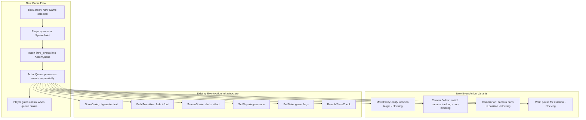
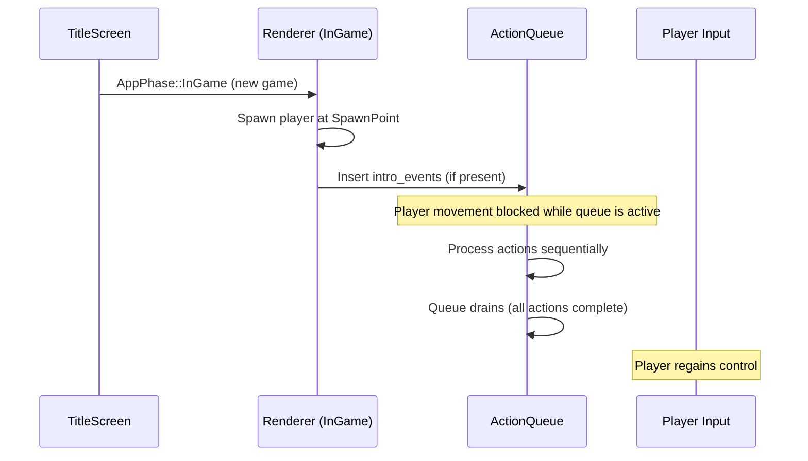

# Design Document: Game Intro Narration

## Overview

The Game Intro Narration system enables game designers to choreograph a cinematic opening sequence that plays when the player starts a new game. Rather than introducing a separate cutscene screen or AppPhase, the system leverages the existing `EventAction` infrastructure: the intro is simply a list of `EventAction` items stored on the `ProjectManifest` that fire automatically when the player spawns on a new game.

To support cinematic choreography (entity movement, camera control, and timing), the system adds four new `EventAction` variants:

- **`MoveEntity`** — Moves either the player character or an NPC to a target grid position with a tile-by-tile walk animation (blocking)
- **`CameraFollow`** — Switches which entity the camera tracks (non-blocking, sticky)
- **`CameraPan`** — Smoothly pans the camera to a static grid position over a duration (blocking)
- **`Wait`** — Pauses the action queue for a specified duration (blocking)

A shared `EntityTarget` enum distinguishes between the player character and specific NPCs, used by both `MoveEntity` and `CameraFollow`.

The feature spans three crates:
- **rpg-toolkit-common**: New `EventAction` variants (`MoveEntity`, `CameraFollow`, `CameraPan`, `Wait`), the `EntityTarget` enum, and the `intro_events` field on `ProjectManifest`
- **rpg-toolkit-renderer**: Runtime handling of the new action variants, plus the intro event trigger system that fires on new-game spawn
- **rpg-toolkit-editor**: A section in project settings to edit the `intro_events` list, reusing the existing action editor

This approach means the intro sequence benefits from all existing actions — `ShowDialog` (typewriter text), `FadeTransition`, `ScreenShake`, `SetPlayerAppearance`, `SetState`, `Branch`, etc. — combined with the new movement and camera actions.

## Architecture



### Action Queue Execution Model

The existing `ActionQueue` processes actions from front to back. Each action is either:
- **Non-blocking**: Executes immediately, queue advances to the next action in the same frame
- **Blocking**: Queue sets `WaitingFor` state and waits until the action completes before advancing

The new actions fit into this model:
- `MoveEntity` — **Blocking**: Queue waits until the entity reaches the target position
- `CameraFollow` — **Non-blocking**: Executes immediately, camera starts tracking the new target
- `CameraPan` — **Blocking**: Queue waits until the pan duration elapses
- `Wait` — **Blocking**: Queue waits until the specified duration elapses

### Camera Behavior Model

The camera system uses a layered priority model:

1. **Default**: Camera follows the player entity
2. **CameraFollow (sticky)**: Switches the camera to track any entity (player or NPC). Persists until another `CameraFollow` changes the target. `CameraFollow { target: Player }` restores the default behavior.
3. **CameraPan (one-shot, blocking)**: Overrides the follow target to pan to a static position. When the pan completes, the camera stays at the pan target — it does NOT snap back. A subsequent `CameraFollow` action is needed to resume entity tracking.

Typical cinematic pattern:
```
CameraFollow(Npc "elder") → camera tracks elder
MoveEntity(Npc "elder", ...) → elder walks, camera follows along
CameraPan(12, 3, 2.5s) → camera pans to reveal a location
Wait(1.0s) → hold on the revealed location
CameraFollow(Player) → camera returns to tracking player
```

### Intro Event Trigger Flow



## Components and Interfaces

### EntityTarget Enum (rpg-toolkit-common/src/map.rs)

```rust
/// Identifies either the player character or a specific NPC as the target
/// of movement or camera actions.
#[derive(Clone, Debug, PartialEq, Serialize, Deserialize)]
#[serde(tag = "type")]
pub enum EntityTarget {
    Player,
    Npc { npc_id: String },
}
```

### New EventAction Variants (rpg-toolkit-common/src/map.rs)

```rust
/// Added to the existing EventAction enum:

/// Move an entity (player or NPC) to a target grid position with
/// tile-by-tile walk animation.
/// Blocking: the queue waits until the entity reaches the target.
MoveEntity {
    /// The entity to move — player character or a specific NPC.
    target: EntityTarget,
    /// Target grid X coordinate.
    target_x: u32,
    /// Target grid Y coordinate.
    target_y: u32,
    /// Movement speed in tiles per second (0.1–10.0, default 2.0).
    #[serde(default = "default_entity_move_speed")]
    speed: f32,
},

/// Switch which entity the camera follows.
/// Non-blocking: executes immediately, camera starts tracking the target.
/// Sticky: persists until another CameraFollow changes it.
CameraFollow {
    /// The entity the camera should track.
    target: EntityTarget,
},

/// Smoothly pan the camera to a static grid position.
/// Blocking: the queue waits until the pan completes.
/// After completion, the camera remains at the pan target until
/// a CameraFollow action redirects it.
CameraPan {
    /// Target grid X coordinate to pan to.
    target_x: u32,
    /// Target grid Y coordinate to pan to.
    target_y: u32,
    /// Duration of the pan in seconds (0.1–10.0).
    duration: f32,
},

/// Pause the action queue for a specified duration.
/// Blocking: the queue waits until the duration elapses.
Wait {
    /// Duration to wait in seconds (0.1–30.0).
    duration: f32,
},
```

### Default Value Helpers

```rust
fn default_entity_move_speed() -> f32 {
    2.0
}
```

### ProjectManifest Extension (rpg-toolkit-common/src/manifest.rs)

```rust
/// In ProjectManifest struct — new field:
/// Optional list of EventActions to execute when a new game starts
/// (player has spawned at the spawn point on the first map).
#[serde(default)]
pub intro_events: Option<Vec<EventAction>>,
```

### WaitingFor Extension (rpg-toolkit-renderer/src/resources.rs)

```rust
/// Extended WaitingFor enum:
#[derive(Default, Debug, Clone, PartialEq, Eq)]
pub enum WaitingFor {
    #[default]
    Nothing,
    Dialog,
    Selection,
    ScreenShake,
    Fade,
    EntityMove,   // ← new: waiting for MoveEntity to complete
    CameraPan,    // ← new: waiting for CameraPan to complete
    Wait,         // ← new: waiting for Wait duration to elapse
}
```

Note: `CameraFollow` does NOT add a `WaitingFor` variant — it is non-blocking.

### New Runtime Resources (rpg-toolkit-renderer/src/resources.rs)

```rust
/// Tracks an active entity forced-move in progress.
#[derive(Resource)]
pub struct EntityMoveState {
    /// The entity being moved.
    pub target: EntityTarget,
    /// Target grid position.
    pub target_x: u32,
    pub target_y: u32,
    /// Movement speed in tiles per second.
    pub speed: f32,
    /// Current interpolated position (in pixels or fractional tiles).
    pub current_x: f32,
    pub current_y: f32,
    /// Whether the entity has reached the target.
    pub complete: bool,
}

/// Tracks the current camera follow target.
/// When this resource exists, the camera tracks the specified entity
/// instead of the default player.
/// This is sticky — it persists until explicitly changed.
#[derive(Resource)]
pub struct CameraFollowTarget {
    /// The entity the camera is currently following.
    pub target: EntityTarget,
}

/// Tracks an active camera pan in progress.
#[derive(Resource)]
pub struct CameraPanState {
    /// Starting camera position (grid coordinates).
    pub start_x: f32,
    pub start_y: f32,
    /// Target camera position (grid coordinates).
    pub target_x: f32,
    pub target_y: f32,
    /// Total pan duration.
    pub duration: f32,
    /// Elapsed time since pan started.
    pub elapsed: f32,
}

/// Tracks a Wait action in progress.
#[derive(Resource)]
pub struct WaitState {
    /// Total wait duration.
    pub duration: f32,
    /// Elapsed time since wait started.
    pub elapsed: f32,
}

/// Marker resource indicating that intro events are currently playing.
/// While this is present, player movement input is suppressed.
#[derive(Resource)]
pub struct IntroEventsActive;
```

### is_blocking_action Update (rpg-toolkit-renderer/src/effects.rs)

```rust
pub fn is_blocking_action(action: &EventAction) -> bool {
    match action {
        EventAction::ScreenShake { mode, duration, .. } => {
            *mode == ScreenShakeMode::Timed && *duration > 0.0
        }
        EventAction::FadeTransition { duration, .. } => *duration > 0.0,
        EventAction::ShowDialog { .. } => true,
        EventAction::ShowSelection { .. } => true,
        EventAction::MoveEntity { .. } => true,    // ← new: blocking
        EventAction::CameraFollow { .. } => false,  // ← new: non-blocking
        EventAction::CameraPan { .. } => true,      // ← new: blocking
        EventAction::Wait { .. } => true,           // ← new: blocking
        _ => false,
    }
}
```

### CameraFollow Action Handler (rpg-toolkit-renderer)

```rust
/// System that handles the CameraFollow action when it's at the front of the queue.
/// Since CameraFollow is non-blocking, this executes immediately and the queue advances.
fn handle_camera_follow(
    mut commands: Commands,
    action_queue: Option<ResMut<ActionQueue>>,
) {
    let Some(mut queue) = action_queue else { return };
    
    if let Some(EventAction::CameraFollow { target }) = queue.actions.front() {
        // Insert or update the CameraFollowTarget resource
        commands.insert_resource(CameraFollowTarget {
            target: target.clone(),
        });
        
        // Remove the CameraPanState if active — CameraFollow overrides static pan
        commands.remove_resource::<CameraPanState>();
        
        // Advance the queue (non-blocking)
        queue.actions.pop_front();
    }
}
```

### Camera System Update (rpg-toolkit-renderer)

```rust
/// Camera positioning priority:
/// 1. If CameraPanState exists → interpolate toward pan target
/// 2. Else if CameraFollowTarget exists → track that entity
/// 3. Else → track player (default)
fn update_camera_position(
    pan_state: Option<Res<CameraPanState>>,
    follow_target: Option<Res<CameraFollowTarget>>,
    // ... entity queries for player and NPCs
) {
    if let Some(pan) = pan_state {
        // Interpolating toward pan target (handled by pan system)
        return;
    }
    
    if let Some(follow) = follow_target {
        match &follow.target {
            EntityTarget::Player => { /* follow player position */ }
            EntityTarget::Npc { npc_id } => { /* follow NPC position */ }
        }
    } else {
        // Default: follow player
    }
}
```

### Intro Event Trigger System (rpg-toolkit-renderer)

```rust
/// System that fires intro_events when a new game starts.
/// Runs once on the first frame after transitioning to InGame from a new game.
///
/// Conditions:
/// - AppPhase just entered InGame
/// - No ActionQueue currently exists (avoids re-triggering)
/// - NewGameFlag resource is present (set by title screen on new game)
/// - intro_events is Some with non-empty vec
///
/// Actions:
/// 1. Insert ActionQueue with the intro_events
/// 2. Insert IntroEventsActive marker
/// 3. Remove NewGameFlag
fn trigger_intro_events(
    mut commands: Commands,
    manifest: Res<ProjectManifestRes>,
    new_game_flag: Option<Res<NewGameFlag>>,
    action_queue: Option<Res<ActionQueue>>,
) {
    // Only fire on fresh new game with no existing action queue
    if new_game_flag.is_none() || action_queue.is_some() {
        return;
    }

    if let Some(ref events) = manifest.intro_events {
        if !events.is_empty() {
            commands.insert_resource(ActionQueue {
                actions: VecDeque::from(events.clone()),
                waiting_for: WaitingFor::Nothing,
            });
            commands.insert_resource(IntroEventsActive);
        }
    }

    commands.remove_resource::<NewGameFlag>();
}

/// Marker resource set by title screen to signal a fresh new game.
#[derive(Resource)]
pub struct NewGameFlag;
```

### Skip Handler Update

```rust
/// When Escape is pressed during intro, drain the queue and reset camera.
fn handle_intro_skip(
    mut commands: Commands,
    // ...
) {
    // Drain ActionQueue
    // Remove IntroEventsActive
    // Remove CameraPanState (if active)
    // Reset CameraFollowTarget to Player (or remove it)
    commands.insert_resource(CameraFollowTarget {
        target: EntityTarget::Player,
    });
    // Remove EntityMoveState (if active)
    // Remove WaitState (if active)
}
```

### Title Screen Modification

```rust
// In handle_new_game (title_screen.rs):
// After setting renderer state, also insert NewGameFlag:
commands.insert_resource(NewGameFlag);
next_phase.set(AppPhase::InGame);
```

### Editor: Intro Events Section (rpg-toolkit-editor)

The intro events editor is a section within Project Settings that reuses the existing `ActionEditor` component. It edits the `intro_events: Option<Vec<EventAction>>` field on the manifest.

```rust
/// In project settings panel, add a collapsible section:
/// "Game Start Events"
///
/// - Displays an ordered list of EventActions
/// - Reuses ActionEditor for adding/editing/removing actions
/// - Supports all EventAction types including new MoveEntity, CameraFollow, CameraPan, Wait
/// - Saves changes to manifest.intro_events
```

The `ActionType` enum in the editor gains four new variants:

```rust
pub enum ActionType {
    // ... existing variants ...
    MoveEntity,
    CameraFollow,
    CameraPan,
    Wait,
}
```

The `action_editor_forms.rs` module provides form fields for the new action types:
- **MoveEntity**: Entity target selector (Player radio or NPC ID dropdown), target X/Y grid inputs, speed slider
- **CameraFollow**: Entity target selector (Player radio or NPC ID dropdown)
- **CameraPan**: Target X/Y grid inputs, duration slider
- **Wait**: Duration slider

## Data Models

### EntityTarget

```rust
#[derive(Clone, Debug, PartialEq, Serialize, Deserialize)]
#[serde(tag = "type")]
pub enum EntityTarget {
    Player,
    Npc { npc_id: String },
}
```

### ProjectManifest (updated)

```rust
#[derive(Clone, Debug, Serialize, Deserialize, PartialEq)]
pub struct ProjectManifest {
    pub maps: Vec<String>,
    pub tilesets: HashMap<TilesetId, TilesetMeta>,
    #[serde(default)]
    pub spawn_point: Option<SpawnPoint>,
    #[serde(default)]
    pub spritesheets: HashMap<SpritesheetId, CharacterSpritesheet>,
    #[serde(default)]
    pub player_spritesheet: Option<SpritesheetId>,
    #[serde(default)]
    pub dialog_texts: HashMap<String, String>,
    #[serde(default)]
    pub face_portraits: HashMap<String, String>,
    #[serde(default)]
    pub characters: CharacterRegistry,
    #[serde(default)]
    pub items: ItemRegistry,
    #[serde(default)]
    pub abilities: AbilityRegistry,
    #[serde(default)]
    pub enemies: EnemyRegistry,
    #[serde(default)]
    pub shops: ShopRegistry,
    /// Event actions to execute when a new game starts (after player spawns).
    #[serde(default)]
    pub intro_events: Option<Vec<EventAction>>,
}
```

### Serialized JSON Example

```json
{
  "maps": ["map-village"],
  "tilesets": {},
  "spawn_point": { "map_id": "map-village", "x": 5, "y": 10 },
  "intro_events": [
    { "type": "FadeTransition", "fade_type": "FadeIn", "duration": 2.0, "color": [0,0,0,1] },
    { "type": "CameraFollow", "target": { "type": "Npc", "npc_id": "elder" } },
    { "type": "MoveEntity", "target": { "type": "Npc", "npc_id": "elder" }, "target_x": 6, "target_y": 10, "speed": 1.5 },
    { "type": "CameraPan", "target_x": 12, "target_y": 3, "duration": 2.5 },
    { "type": "Wait", "duration": 1.0 },
    { "type": "CameraFollow", "target": { "type": "Player" } },
    { "type": "MoveEntity", "target": { "type": "Player" }, "target_x": 7, "target_y": 10, "speed": 2.0 },
    { "type": "ShowDialog", "text": { "type": "Inline", "value": "Welcome, young one..." }, "config": { "text_speed": 30.0, "position": "Bottom", "movement_block": true, "attribute_dialog": false, "face_portrait": "elder_face" } },
    { "type": "SetState", "key": "intro_complete", "value": "true" }
  ]
}
```

### Validation Rules

| Field | Constraint |
|-------|-----------|
| `EntityTarget::Npc.npc_id` | Non-empty string |
| `MoveEntity.target_x`, `target_y` | Within map bounds (validated at runtime) |
| `MoveEntity.speed` | 0.1–10.0 tiles/sec (default 2.0) |
| `CameraFollow.target` | Valid EntityTarget (npc_id non-empty if Npc) |
| `CameraPan.target_x`, `target_y` | Within map bounds (validated at runtime) |
| `CameraPan.duration` | 0.1–10.0 seconds |
| `Wait.duration` | 0.1–30.0 seconds |
| `intro_events` | Optional; when present, max 100 actions |

## Correctness Properties

*A property is a characteristic or behavior that should hold true across all valid executions of a system — essentially, a formal statement about what the system should do. Properties serve as the bridge between human-readable specifications and machine-verifiable correctness guarantees.*

### Property 1: EventAction serialization round-trip (extended)

*For any* valid `EventAction` value (including the new `MoveEntity`, `CameraFollow`, `CameraPan`, and `Wait` variants with fields within their valid ranges), serializing to JSON and then deserializing SHALL produce a value that is structurally equal (`PartialEq`) to the original.

**Validates: Requirements 9.1, 9.6**

### Property 2: New action variant validation rejects invalid fields

*For any* new `EventAction` variant (`MoveEntity`, `CameraFollow`, `CameraPan`, or `Wait`) where at least one field violates its valid range (`EntityTarget::Npc.npc_id` is empty, `MoveEntity.speed` outside 0.1–10.0, `CameraPan.duration` outside 0.1–10.0, or `Wait.duration` outside 0.1–30.0), deserialization SHALL return an error identifying the violated constraint.

**Validates: Requirements 2.6, 2.7, 3.6, 4.3, 5.3**

### Property 3: Camera pan interpolation is bounded

*For any* camera pan with start position (sx, sy), target position (tx, ty), duration > 0, and elapsed time `t` in [0, duration], the interpolated camera position SHALL always be within the axis-aligned bounding box defined by min/max of (sx, tx) and min/max of (sy, ty), inclusive.

**Validates: Requirements 4.4**

### Property 4: is_blocking_action classifies new actions correctly

*For any* `EventAction` of type `MoveEntity`, `CameraPan`, or `Wait`, `is_blocking_action` SHALL return `true`. *For any* `EventAction` of type `CameraFollow`, `is_blocking_action` SHALL return `false`.

**Validates: Requirements 2.3, 3.2, 4.2, 5.2**

### Property 5: EntityTarget serialization round-trip

*For any* valid `EntityTarget` value (either `Player` or `Npc` with a non-empty `npc_id`), serializing to JSON and then deserializing SHALL produce a value structurally equal to the original.

**Validates: Requirements 2.2, 9.1**

## Error Handling

| Scenario | Behavior |
|----------|----------|
| `intro_events` field absent in manifest JSON | Deserializes as `None` (serde default), no intro fires |
| `intro_events` is empty `[]` | No ActionQueue inserted, player gains control immediately |
| `MoveEntity` references nonexistent `npc_id` | Log `warn!()`, skip action, advance queue |
| `MoveEntity` target is out of map bounds | Log `warn!()`, skip action, advance queue |
| `MoveEntity` target is unreachable (blocked) | Entity walks as close as possible, then action completes |
| `CameraFollow` references nonexistent `npc_id` | Log `warn!()`, skip action, advance queue |
| `CameraPan` target is out of map bounds | Clamp target to map bounds, log `warn!()` |
| `CameraPan` duration is 0 or negative | Snap camera instantly to target (treat as non-blocking) |
| `Wait` duration is 0 or negative | Skip immediately (treat as non-blocking) |
| `NewGameFlag` absent when `trigger_intro_events` runs | System no-ops, no intro fires |
| `ActionQueue` already exists when intro would fire | System no-ops, existing queue takes priority |
| Player presses Escape during intro events | Remove `IntroEventsActive`, drain ActionQueue, reset `CameraFollowTarget` to Player, restore camera to player |
| Deserialization of `MoveEntity` with empty `npc_id` in Npc target | Return serde error (non-empty validation) |
| Deserialization of `CameraFollow` with empty `npc_id` in Npc target | Return serde error (non-empty validation) |
| Deserialization of `MoveEntity` with speed outside 0.1–10.0 | Return serde error with range info |
| Deserialization of `CameraPan` with duration outside 0.1–10.0 | Return serde error with range info |
| Deserialization of `Wait` with duration outside 0.1–30.0 | Return serde error with range info |

## Testing Strategy

### Property-Based Tests

The feature uses **proptest** (already a workspace dev-dependency) for property-based testing. Tests live in `crates/rpg-toolkit-common/tests/properties/`.

**Configuration:**
- Minimum 100 iterations per property test (`ProptestConfig { cases: 100, .. }`)
- Each test tagged with a comment referencing its design property
- Tag format: `Feature: game-intro-narration, Property {N}: {title}`

**Properties to implement:**

| Property | Function Under Test | Generator Strategy |
|----------|--------------------|--------------------|
| 1 | `EventAction` serde round-trip (new variants) | Random `MoveEntity`, `CameraFollow`, `CameraPan`, `Wait` with valid field ranges; random `EntityTarget` values |
| 2 | New action variant deserialization validation | Random `MoveEntity`, `CameraFollow`, `CameraPan`, `Wait` with intentionally invalid fields (empty npc_id, out-of-range speed/duration) |
| 3 | Camera pan interpolation boundedness | Random start/target positions and elapsed times in [0, duration] |
| 4 | `is_blocking_action` for new variants | Random `MoveEntity`, `CameraFollow`, `CameraPan`, `Wait` instances |
| 5 | `EntityTarget` serde round-trip | Random `EntityTarget::Player` and `EntityTarget::Npc` with valid npc_id strings |

### Unit Tests (Example-Based)

- `MoveEntity` with Player target serializes/deserializes correctly
- `MoveEntity` with Npc target serializes/deserializes correctly
- `MoveEntity` with `speed` field omitted uses default 2.0
- `CameraFollow` with Player target serializes/deserializes correctly
- `CameraFollow` with Npc target serializes/deserializes correctly
- `CameraPan` with valid fields serializes/deserializes correctly
- `Wait` with valid fields serializes/deserializes correctly
- `EntityTarget::Player` serializes as `{ "type": "Player" }`
- `EntityTarget::Npc` serializes as `{ "type": "Npc", "npc_id": "..." }`
- `intro_events` field absent in manifest JSON deserializes as `None`
- `intro_events` with mixed action types round-trips correctly
- `trigger_intro_events` no-ops when `NewGameFlag` is absent
- `trigger_intro_events` no-ops when `ActionQueue` already exists
- `trigger_intro_events` inserts queue when `NewGameFlag` present and intro_events non-empty
- `is_blocking_action` returns `true` for `MoveEntity`, `CameraPan`, `Wait`
- `is_blocking_action` returns `false` for `CameraFollow`
- Editor `ActionType` enum includes new variants (`MoveEntity`, `CameraFollow`, `CameraPan`, `Wait`)

### Integration Tests

- Full flow: new game → player spawns → intro_events fire → actions complete → player regains control
- Escape during intro events drains the queue, resets camera to player, restores control
- `MoveEntity` with invalid NPC ID logs warning and advances queue
- `CameraFollow` switches camera target; subsequent `MoveEntity` on that NPC results in camera tracking the movement
- `CameraPan` completes → camera stays at pan target → `CameraFollow(Player)` returns camera to player
- Camera pan interpolation reaches exact target at `elapsed == duration`
- `CameraFollow` with nonexistent `npc_id` logs warning and advances queue
