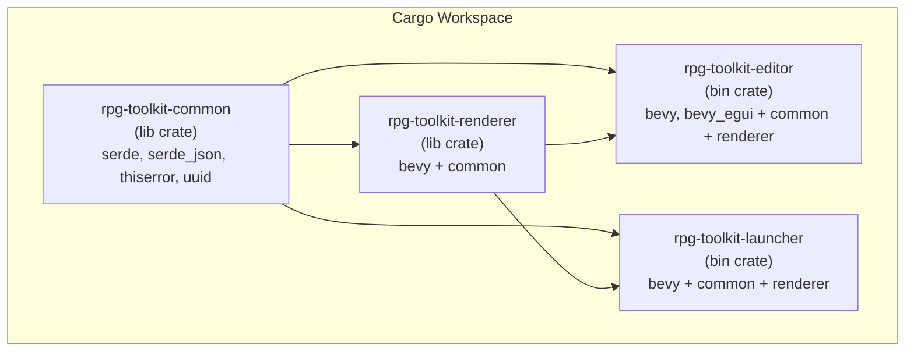
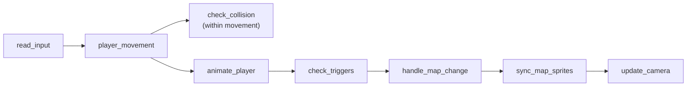

# Design Document: Game Renderer

## Overview

This design covers restructuring the RPG Toolkit into a Cargo workspace monorepo and building a `ProjectRendererPlugin` — a standalone Bevy plugin that renders a loaded project as a playable game world with player movement, collision detection, event triggers, and a following camera.

The workspace consists of three crates plus a launcher binary:

1. **rpg-toolkit-common** — Pure data types extracted from `src/data/`, with no Bevy dependency. Both the renderer and editor depend on this crate.
2. **rpg-toolkit-renderer** — The `ProjectRendererPlugin` Bevy plugin that takes project data and renders a playable game.
3. **rpg-toolkit-editor** — The existing editor binary, refactored to import types from common (out of scope for implementation, but must compile).
4. **rpg-toolkit-launcher** — A minimal binary that loads a `.rpg` file and runs the renderer plugin.

The renderer plugin is designed as a composable Bevy plugin: it exposes resources, components, and events so that consumers (the editor's future Play mode, the launcher, or third-party apps) can hook into the game world.

## Architecture



### Workspace Layout

```
rpg-toolkit/
├── Cargo.toml                    # workspace root
├── crates/
│   ├── rpg-toolkit-common/
│   │   ├── Cargo.toml
│   │   └── src/
│   │       ├── lib.rs
│   │       ├── map.rs            # MapData, MapId, TileRef, Layer, etc.
│   │       ├── tileset.rs        # TilesetMeta
│   │       ├── project.rs        # ProjectFile, SpawnPoint
│   │       └── error.rs          # CommonError (replaces EditorError for common)
│   ├── rpg-toolkit-renderer/
│   │   ├── Cargo.toml
│   │   └── src/
│   │       ├── lib.rs            # ProjectRendererPlugin
│   │       ├── resources.rs      # RendererState, TilesetRegistry
│   │       ├── components.rs     # PlayerCharacter, TileSprite, GameCamera
│   │       ├── events.rs         # MapChanged, PlayerMoved
│   │       ├── systems/
│   │       │   ├── mod.rs
│   │       │   ├── map_render.rs # spawn/despawn tile sprites
│   │       │   ├── player.rs     # spawn, movement, animation
│   │       │   ├── collision.rs  # opacity-based blocking
│   │       │   ├── triggers.rs   # event trigger execution
│   │       │   └── camera.rs     # follow player, clamp to bounds
│   │       └── input.rs          # keyboard input → movement intent
│   ├── rpg-toolkit-editor/
│   │   ├── Cargo.toml
│   │   └── src/                  # existing editor code, refactored imports
│   └── rpg-toolkit-launcher/
│       ├── Cargo.toml
│       └── src/
│           └── main.rs           # CLI arg parsing, load project, run app
├── tests/
│   ├── properties/               # property-based tests (workspace-level)
│   └── unit/                     # unit tests (workspace-level)
└── README.md
```

### System Execution Order (Bevy Schedule)

All renderer systems run in the `Update` schedule with explicit ordering:



The movement system incorporates collision checking inline — it reads input, computes the target tile, checks collision, and either starts the animation or rejects the move. This avoids a frame delay between intent and collision response.

## Components and Interfaces

### rpg-toolkit-common

This crate is a pure data library. It re-exports the types that both the renderer and editor need.

```rust
// crates/rpg-toolkit-common/src/lib.rs
pub mod error;
pub mod map;
pub mod project;
pub mod tileset;

pub use error::CommonError;
pub use map::{EventAction, Layer, MapData, MapId, TileAttributes, TileAttributeLayer, TileRef, TilesetId, SpawnPoint};
pub use project::ProjectFile;
pub use tileset::TilesetMeta;
```

Key design decision: `CommonError` replaces `EditorError` for serialization/validation concerns. The editor crate will define its own `EditorError` that wraps `CommonError` for editor-specific failures.

```rust
// crates/rpg-toolkit-common/src/error.rs
#[derive(Debug, thiserror::Error)]
pub enum CommonError {
    #[error("Invalid map dimensions: width and height must be between 1 and 256")]
    InvalidDimensions,
    #[error("Invalid tile size: must be one of 8, 16, 32, 64")]
    InvalidTileSize,
    #[error("Failed to parse project file: {0}")]
    ProjectParseError(String),
    #[error("Invalid project data: {0}")]
    ProjectValidationError(String),
}
```

### rpg-toolkit-renderer

#### Plugin Entry Point

```rust
// crates/rpg-toolkit-renderer/src/lib.rs
pub struct ProjectRendererPlugin;

impl Plugin for ProjectRendererPlugin {
    fn build(&self, app: &mut App) {
        app
            // Resources
            .init_resource::<RendererState>()
            // Events
            .add_event::<MapChanged>()
            .add_event::<PlayerMoved>()
            // Systems (ordered)
            .add_systems(Update, (
                read_input,
                player_movement.after(read_input),
                animate_player.after(player_movement),
                check_triggers.after(animate_player),
                handle_map_change.after(check_triggers),
                sync_map_sprites.after(handle_map_change),
                update_camera.after(sync_map_sprites),
            ));
    }
}
```

#### Resources

```rust
/// Input resource: consumers insert this before adding the plugin.
/// Contains the deserialized project data and tileset texture handles.
#[derive(Resource)]
pub struct RendererProjectData {
    pub project_file: ProjectFile,
    pub tileset_textures: HashMap<TilesetId, Handle<Image>>,
    pub tileset_atlas_layouts: HashMap<TilesetId, Handle<TextureAtlasLayout>>,
}

/// Runtime state managed by the plugin.
#[derive(Resource, Default)]
pub struct RendererState {
    pub active_map_id: Option<MapId>,
    /// Set to Some(map_id) when a map transition is requested.
    pub pending_map_change: Option<MapId>,
}
```

#### Components

```rust
/// Marker + state for the player character entity.
#[derive(Component)]
pub struct PlayerCharacter {
    /// Current grid position (tile coordinates).
    pub grid_x: u32,
    pub grid_y: u32,
    /// Movement animation state.
    pub move_animation: Option<MoveAnimation>,
}

pub struct MoveAnimation {
    pub from: Vec2,       // world-space start
    pub to: Vec2,         // world-space target
    pub elapsed: f32,     // seconds elapsed
    pub duration: f32,    // total animation duration (configurable)
}

/// Marker for tile sprites spawned by the renderer.
#[derive(Component)]
pub struct RendererTileSprite {
    pub layer_index: usize,
    pub x: u32,
    pub y: u32,
}

/// Marker for the game camera (distinct from the editor camera).
#[derive(Component)]
pub struct GameCamera;
```

#### Events

```rust
/// Fired when the active map changes (via JumpTo or initial load).
#[derive(Event)]
pub struct MapChanged {
    pub previous_map_id: Option<MapId>,
    pub new_map_id: MapId,
}

/// Fired when the player completes a move to a new tile.
#[derive(Event)]
pub struct PlayerMoved {
    pub from: (u32, u32),
    pub to: (u32, u32),
}
```

### rpg-toolkit-launcher

Minimal binary:

```rust
fn main() {
    let args: Vec<String> = std::env::args().collect();
    let path = args.get(1).unwrap_or_else(|| {
        eprintln!("Usage: rpg-toolkit-launcher <path-to-project.rpg>");
        std::process::exit(1);
    });

    // 1. Read and deserialize ProjectFile using common crate
    // 2. Load tileset images relative to project file directory
    // 3. Build RendererProjectData resource
    // 4. Create Bevy App with DefaultPlugins + ProjectRendererPlugin
    // 5. Insert RendererProjectData resource
    // 6. Run
}
```

## Data Models

### Type Migration: Common Crate

The following types move from `src/data/` to `rpg-toolkit-common` unchanged (preserving all serde attributes):

| Type | Source File | Notes |
|------|------------|-------|
| `MapId` (type alias) | `map.rs` | `String` |
| `TilesetId` (type alias) | `map.rs` | `String` |
| `EventAction` | `map.rs` | `#[serde(tag = "type")]` preserved |
| `TileAttributes` | `map.rs` | `opacity: bool`, `event_trigger: Vec<EventAction>` |
| `TileAttributeLayer` | `map.rs` | `cells: Vec<Vec<TileAttributes>>` |
| `SpawnPoint` | `map.rs` | `map_id`, `x`, `y` |
| `TileRef` | `map.rs` | `tileset_id`, `col`, `row` |
| `Layer` | `map.rs` | `name`, `visible`, `tiles`, `attributes` |
| `MapData` | `map.rs` | All fields + `new()`, `validate()` |
| `TilesetMeta` | `tileset.rs` | All fields + `from_image_dimensions()` |
| `ProjectFile` | `project.rs` | `maps`, `tilesets`, `spawn_point` + `serialize()`/`deserialize()` |

Types that stay in the editor crate (NOT moved to common):
- `EditorState`, `EditorTool`, `EditorMode`, `AttributeTool`
- `EditCommand`, `EditCommandKind`, `UndoHistory`
- `StampBrushSelection`, `LineDragState`
- `EditorError` (editor keeps its own error type, wrapping `CommonError`)
- `TilesetEntry` (contains Bevy `Handle` types)
- `Project` (contains Bevy `Resource`, `Handle` types, editor tab state)

### Renderer-Specific Data

The renderer introduces these Bevy-specific types (not in common):

```rust
/// Configuration for player movement animation.
pub struct MovementConfig {
    /// Duration of tile-to-tile animation in seconds.
    pub move_duration: f32,  // default: 0.15
}

/// The player's visual representation.
/// A solid colored rectangle, one tile in size.
pub struct PlayerVisual {
    pub color: Color,  // default: Color::srgb(0.2, 0.6, 1.0)
}
```

### Coordinate System

The renderer uses the same coordinate convention as the existing editor:

- **Grid coordinates**: `(x, y)` where `x` is column (left-to-right), `y` is row (top-to-bottom). `tiles[y][x]` in row-major storage.
- **World coordinates**: `world_x = x * tile_width + tile_width / 2.0`, `world_y = -(y * tile_height + tile_height / 2.0)`. Bevy's Y-up means row 0 is at the top (most positive Y).
- **Z-ordering**: Layer index determines Z. Player character renders at `z = num_layers + 1` to appear above all map layers.

### Collision Model

Collision is checked per-tile across all layers:

```
fn is_tile_blocked(map: &MapData, x: u32, y: u32) -> bool {
    map.layers.iter().any(|layer| {
        layer.attributes.cells
            .get(y as usize)
            .and_then(|row| row.get(x as usize))
            .map(|attrs| attrs.opacity)
            .unwrap_or(false)
    })
}
```

A tile is blocked if ANY layer has `opacity = true` at that position. This check runs before movement animation starts.

### Event Trigger Model

Event triggers are collected from ALL layers at the destination tile after the player arrives:

```
fn collect_triggers(map: &MapData, x: u32, y: u32) -> Vec<EventAction> {
    map.layers.iter().flat_map(|layer| {
        layer.attributes.cells
            .get(y as usize)
            .and_then(|row| row.get(x as usize))
            .map(|attrs| attrs.event_trigger.clone())
            .unwrap_or_default()
    }).collect()
}
```

The first `JumpTo` action found is executed. If the target map doesn't exist, a warning is logged and the action is skipped.

### Camera Clamping

The camera follows the player but is clamped so the viewport doesn't show areas outside the map:

```
let map_pixel_w = map.width as f32 * map.tile_width as f32;
let map_pixel_h = map.height as f32 * map.tile_height as f32;
let half_vp_w = viewport_width / 2.0;
let half_vp_h = viewport_height / 2.0;

// Map spans x: [0, map_pixel_w], y: [-map_pixel_h, 0]
let cam_x = player_world_x.clamp(half_vp_w, map_pixel_w - half_vp_w);
let cam_y = player_world_y.clamp(-map_pixel_h + half_vp_h, -half_vp_h);
```

When the map is smaller than the viewport, the camera centers on the map instead.


## Correctness Properties

These properties define the formal correctness guarantees of the system. Each property is testable via property-based testing (PBT) using the `proptest` crate.

### Property 1: Serialization Round-Trip (Req 11)

**Property**: For all valid `ProjectFile` values, serializing to JSON and deserializing back produces a structurally equivalent `ProjectFile`.

```
∀ pf: ProjectFile where pf is valid,
  ProjectFile::deserialize(pf.serialize().unwrap()).unwrap() == pf
```

**Generator strategy**: Generate arbitrary `ProjectFile` values with random maps (1–4 maps, dimensions 1–16, 1–3 layers), random tilesets (1–3), random tile placements referencing valid tileset IDs, random tile attributes (opacity flags, event triggers with valid map IDs), and optional spawn points referencing valid maps.

**Test location**: `tests/properties/serialization_roundtrip.rs`

### Property 2: MapData Validation Consistency (Req 1)

**Property**: A `MapData` constructed via `MapData::new()` always passes `validate()`.

```
∀ name: String, w: 1..=256, h: 1..=256, tw: {8,16,32,64}, th: {8,16,32,64},
  MapData::new(name, w, h, tw, th).unwrap().validate().is_ok()
```

**Generator strategy**: Generate valid dimension ranges and tile sizes from the allowed sets.

**Test location**: `tests/properties/map_validation.rs`

### Property 3: Player Stays In Bounds (Req 5, AC 5)

**Property**: After any sequence of movement inputs on a valid map, the player's grid position remains within the map boundaries.

```
∀ map: MapData, spawn: (x, y) within bounds, moves: Vec<Direction>,
  after applying all moves:
    player.grid_x < map.width ∧ player.grid_y < map.height
```

**Generator strategy**: Generate a valid map (small dimensions 2–16 for efficiency), a valid spawn position, and a random sequence of 1–100 movement directions (Up, Down, Left, Right).

**Test location**: `tests/properties/player_bounds.rs`

### Property 4: Collision Blocks Movement (Req 6)

**Property**: If a tile has `opacity = true` on any layer, the player cannot move to that tile.

```
∀ map: MapData, player_pos: (x, y), direction: Direction,
  let target = player_pos + direction
  if any layer at target has opacity == true:
    player position after move attempt == player_pos (unchanged)
```

**Generator strategy**: Generate a small map with random opacity flags, place the player adjacent to an opaque tile, attempt to move into it, verify position unchanged.

**Test location**: `tests/properties/collision.rs`

### Property 5: Spawn Point Clamping (Req 4, AC 5)

**Property**: If a spawn point references coordinates outside the map bounds, the player's initial position is clamped to the nearest valid tile.

```
∀ map: MapData, spawn_x: u32, spawn_y: u32,
  let clamped_x = min(spawn_x, map.width - 1)
  let clamped_y = min(spawn_y, map.height - 1)
  initial player position == (clamped_x, clamped_y)
```

**Generator strategy**: Generate valid maps and spawn points where coordinates may exceed map dimensions.

**Test location**: `tests/properties/spawn_clamping.rs`

### Property 6: JumpTo Target Clamping (Req 7, AC 5)

**Property**: When a JumpTo action specifies out-of-bounds target coordinates, the player position is clamped to the nearest valid tile on the target map.

```
∀ target_map: MapData, target_x: u32, target_y: u32,
  let clamped_x = min(target_x, target_map.width - 1)
  let clamped_y = min(target_y, target_map.height - 1)
  player position after JumpTo == (clamped_x, clamped_y)
```

**Generator strategy**: Generate a project with two maps, place a JumpTo trigger on the first map with potentially out-of-bounds target coordinates, verify clamping on the target map.

**Test location**: `tests/properties/jumpto_clamping.rs`

### Property 7: Tile Position Correctness (Req 3, AC 4)

**Property**: Every tile sprite's world position corresponds exactly to its grid position given the map's tile dimensions.

```
∀ map: MapData, layer_idx: usize, x: u32, y: u32 where tile exists,
  sprite.world_x == x * map.tile_width + map.tile_width / 2
  sprite.world_y == -(y * map.tile_height + map.tile_height / 2)
```

**Generator strategy**: Generate small maps with random tile placements, verify each spawned sprite's transform matches the expected world coordinate.

**Test location**: `tests/properties/tile_positioning.rs`

### Property 8: Movement Animation Exclusivity (Req 5, AC 4)

**Property**: While a movement animation is in progress, no new movement can be initiated — the player's target tile does not change mid-animation.

```
∀ move_animation in progress, input: Direction,
  player.move_animation.to remains unchanged
```

**Generator strategy**: Start a movement, inject additional input events before the animation completes, verify the animation target is unchanged.

**Test location**: `tests/properties/movement_exclusivity.rs`

## Traceability Matrix

| Requirement | Design Section | Properties |
|---|---|---|
| Req 1: Common Crate Extraction | Common Crate types, CommonError, Type Migration table | P2 (MapData validation) |
| Req 2: Workspace Structure | Architecture diagram, Workspace Layout | — (structural, verified by compilation) |
| Req 3: Map Rendering | System Execution Order, sync_map_sprites, Coordinate System | P7 (tile positioning) |
| Req 4: Player Spawning | PlayerCharacter component, PlayerVisual, Coordinate System | P5 (spawn clamping) |
| Req 5: Player Movement | read_input, player_movement, animate_player, MoveAnimation | P3 (bounds), P8 (animation exclusivity) |
| Req 6: Collision Detection | Collision Model, is_tile_blocked | P4 (collision blocks) |
| Req 7: Event Triggers | Event Trigger Model, check_triggers, handle_map_change | P6 (JumpTo clamping) |
| Req 8: Game Camera | update_camera, Camera Clamping | — (visual, verified by integration test) |
| Req 9: Plugin API Surface | Resources, Components, Events, Plugin Entry Point | — (API shape, verified by compilation + integration) |
| Req 10: Launcher Binary | rpg-toolkit-launcher section | — (integration, verified by smoke test) |
| Req 11: Serialization Round-Trip | ProjectFile in Common Crate | P1 (round-trip) |
