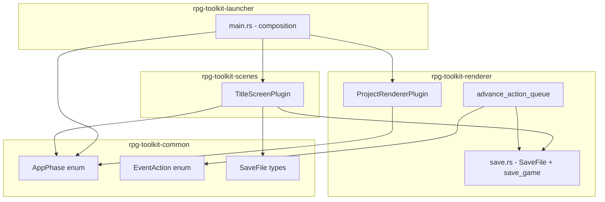
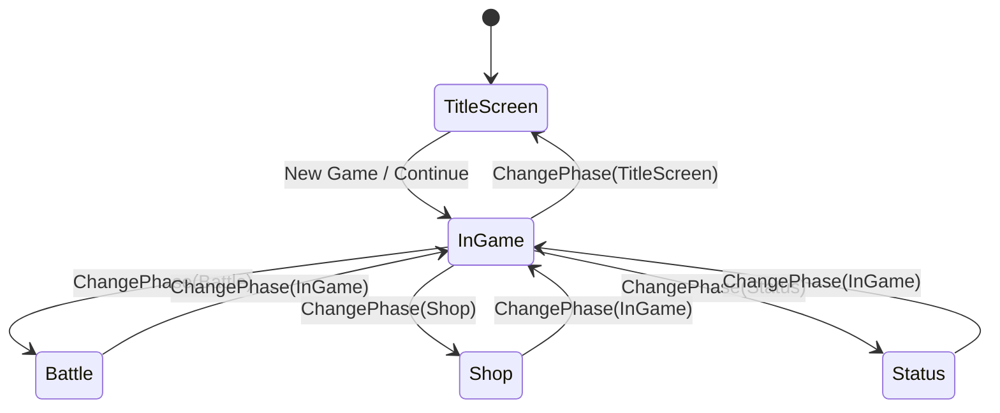

# Design Document: Game State Management

## Overview

This feature adds application phase management, save file location persistence, and a title screen to the rpg-toolkit. The core coordination primitive is an `AppPhase` Bevy `States` enum defined in `rpg-toolkit-common`, enabling composable scene plugins to declare which phase they operate in. The renderer gates all Update systems behind `AppPhase::InGame`, a new `rpg-toolkit-scenes` crate houses the `TitleScreenPlugin`, and the launcher composes everything.

Key changes:
- `AppPhase` enum in `rpg-toolkit-common` (requires adding `bevy` as a dependency)
- `SaveFile` extended with `map_id`, `position`, `elevation` fields
- Two new `EventAction` variants: `SaveGame` and `ChangePhase`
- `save_game()` extended with location parameters
- `ProjectRendererPlugin` Update systems gated on `AppPhase::InGame` via `run_condition`
- New `rpg-toolkit-scenes` crate with `TitleScreenPlugin`
- Launcher refactored to start in `TitleScreen` phase and defer save loading to the title screen

## Architecture



The dependency graph flows: `launcher → scenes → common`, `launcher → renderer → common`. The `scenes` crate does NOT depend on `renderer` — it imports `SaveFile` types from `common` or accesses the save file directly via the `SavePath` resource and the standalone `SaveFile` struct.

**Design Decision:** The `SaveFile` struct and its `load`/`save` methods will be moved to or re-exported from `rpg-toolkit-common` so that `rpg-toolkit-scenes` can use them without depending on `rpg-toolkit-renderer`. Alternatively, `rpg-toolkit-scenes` can depend on `rpg-toolkit-renderer` as a library for the `SaveFile` type only — but this creates coupling. The cleaner approach is to keep `SaveFile` in `rpg-toolkit-renderer` and have `rpg-toolkit-scenes` depend on `rpg-toolkit-renderer` for the `SaveFile` + `save_game` exports only (no plugin coupling). The renderer already re-exports `SaveFile` and `save_game` from its crate root.

**Revised Decision:** Per Requirement 7.4, `rpg-toolkit-scenes` SHALL NOT depend on `rpg-toolkit-renderer`. Therefore, `SaveFile` and its serialization logic must live in (or be accessible from) `rpg-toolkit-common`. We'll move the `SaveFile` struct, `CharacterProgressData`, and `SaveFile::load`/`SaveFile::save` methods to `rpg-toolkit-common`, and re-export them from `rpg-toolkit-renderer` for backward compatibility. The `save_game()` function (which depends on Bevy resources) stays in the renderer.

## Components and Interfaces

### AppPhase (rpg-toolkit-common)

```rust
use bevy::prelude::*;
use serde::{Serialize, Deserialize};

#[derive(States, Clone, Debug, Default, PartialEq, Eq, Hash, Serialize, Deserialize)]
pub enum AppPhase {
    #[default]
    TitleScreen,
    InGame,
    Battle,
    Shop,
    Status,
}
```

This requires adding `bevy` as a workspace dependency to `rpg-toolkit-common`. Only the `bevy_state` and `bevy_ecs` sub-features are truly needed, but using the workspace `bevy` dependency keeps things consistent.

### EventAction New Variants (rpg-toolkit-common/src/map.rs)

```rust
#[derive(Clone, Debug, PartialEq, Serialize, Deserialize)]
#[serde(tag = "type")]
pub enum EventAction {
    // ... existing variants ...
    
    /// Persist all game state to disk at the current location.
    SaveGame,
    
    /// Transition to a different application phase.
    ChangePhase {
        phase: AppPhase,
    },
}
```

`SaveGame` is a unit variant (no fields). `ChangePhase` contains the target `AppPhase`. Both follow the existing `#[serde(tag = "type")]` convention.

### SaveFile Extension (rpg-toolkit-common)

```rust
#[derive(Clone, Debug, Default, PartialEq, Serialize, Deserialize)]
pub struct SaveFile {
    #[serde(default)]
    pub state: BTreeMap<String, String>,
    #[serde(default)]
    pub currency: u64,
    #[serde(default)]
    pub inventory: BTreeMap<String, u32>,
    #[serde(default)]
    pub party: Vec<String>,
    #[serde(default)]
    pub character_progress: BTreeMap<String, CharacterProgressData>,
    
    // New location fields
    #[serde(default)]
    pub map_id: Option<String>,
    #[serde(default)]
    pub position: Option<(u32, u32)>,
    #[serde(default)]
    pub elevation: Option<u32>,
}
```

All new fields use `#[serde(default)]` so that existing save files without these fields deserialize with `None` values.

### save_game Function Extension (rpg-toolkit-renderer/src/save.rs)

```rust
pub fn save_game(
    game_state: &GameState,
    currency: &CurrencyState,
    inventory: &InventoryState,
    party: &PartyState,
    character_progress: &CharacterProgressState,
    save_path: &SavePath,
    map_id: Option<&str>,
    position: Option<(u32, u32)>,
    elevation: Option<u32>,
) -> Result<(), String> {
    let save_file = SaveFile {
        // ... existing fields ...
        map_id: map_id.map(|s| s.to_string()),
        position,
        elevation,
    };
    save_file.save(&save_path.path)
}
```

### TitleScreenPlugin (rpg-toolkit-scenes)

```rust
pub struct TitleScreenPlugin;

impl Plugin for TitleScreenPlugin {
    fn build(&self, app: &mut App) {
        app
            .add_systems(OnEnter(AppPhase::TitleScreen), spawn_title_screen)
            .add_systems(OnExit(AppPhase::TitleScreen), despawn_title_screen)
            .add_systems(Update, title_screen_input.run_in_state(AppPhase::TitleScreen));
    }
}
```

The plugin uses Bevy's `OnEnter`/`OnExit` schedules for lifecycle management and `run_in_state` (or `in_state` run condition) for Update gating.

### ProjectRendererPlugin Gating

```rust
impl Plugin for ProjectRendererPlugin {
    fn build(&self, app: &mut App) {
        app
            // Startup systems run unconditionally (resources must be ready)
            .add_systems(Startup, (load_spritesheet_assets, spawn_player, spawn_camera).chain())
            // Update systems gated on InGame
            .add_systems(
                Update,
                (
                    read_input,
                    player_movement.after(read_input),
                    // ... all other systems ...
                ).run_if(in_state(AppPhase::InGame)),
            );
    }
}
```

The `fire_initial_map_changed` system moves from `Startup` to `OnEnter(AppPhase::InGame)` so it fires when the phase first enters InGame rather than at app startup.

### advance_action_queue Changes

The `advance_action_queue` system handles the two new variants:

```rust
EventAction::SaveGame => {
    // Non-blocking: gather current location and persist
    let map_id = renderer_state.active_map_id.as_deref();
    let (pos, elev) = player_query.single()
        .map(|p| (Some((p.grid_x, p.grid_y)), Some(p.elevation)))
        .unwrap_or((None, None));
    
    if let Some(save_path) = save_path_res {
        if let Err(e) = save_game(&game_state, &currency, &inventory, &party, &progress, &save_path, map_id, pos, elev) {
            warn!("SaveGame failed: {}", e);
        }
    } else {
        warn!("SaveGame: no SavePath resource present; skipping");
    }
    queue.actions.pop_front();
    continue;
}

EventAction::ChangePhase { phase } => {
    let current = app_phase_state.get();
    if *current == phase {
        // No-op: already in target phase
        queue.actions.pop_front();
        continue;
    }
    // Transition state — the queue is preserved (not removed)
    // Systems stop running due to run_condition, effectively pausing
    next_app_phase.set(phase);
    queue.actions.pop_front();
    return; // Stop processing this frame
}
```

### Launcher Composition Changes

```rust
fn main() {
    // ... project loading unchanged ...
    
    let mut app = App::new();
    app.add_plugins(DefaultPlugins.set(/* ... */));
    
    // Initialize AppPhase state (starts at TitleScreen by default)
    app.init_state::<AppPhase>();
    
    // Insert resources with defaults (not from save file)
    app.init_resource::<GameState>();
    app.init_resource::<CurrencyState>();
    app.init_resource::<InventoryState>();
    app.init_resource::<PartyState>();
    app.init_resource::<CharacterProgressState>();
    
    // Save path still configured at startup
    app.insert_resource(SavePath { path: save_path });
    
    // Project data loaded at startup (needed by both plugins)
    app.insert_resource(RendererProjectData { /* ... */ });
    
    // Compose plugins
    app.add_plugins(TitleScreenPlugin);
    app.add_plugins(ProjectRendererPlugin);
    
    app.run();
}
```

## Data Models

### AppPhase State Machine



### SaveFile JSON Schema (extended)

```json
{
  "state": { "key": "value" },
  "currency": 1000,
  "inventory": { "potion": 5 },
  "party": ["hero", "mage"],
  "character_progress": {
    "hero": { "experience": 1500, "learned_abilities": ["slash"] }
  },
  "map_id": "550e8400-e29b-41d4-a716-446655440000",
  "position": [10, 15],
  "elevation": 0
}
```

### EventAction JSON Examples

```json
{ "type": "SaveGame" }
```

```json
{ "type": "ChangePhase", "phase": "Battle" }
```

## Correctness Properties

*A property is a characteristic or behavior that should hold true across all valid executions of a system — essentially, a formal statement about what the system should do. Properties serve as the bridge between human-readable specifications and machine-verifiable correctness guarantees.*

### Property 1: SaveFile serialization round-trip with location

*For any* valid SaveFile (with arbitrary combinations of state flags, currency, inventory, party, character progress, and location fields where map_id is Option<String>, position is Option<(u32, u32)> with coordinates 0–255, and elevation is Option<u32>), serializing to JSON and then deserializing SHALL produce a SaveFile equal to the original.

**Validates: Requirements 2.5, 2.6, 3.4, 10.2, 10.3, 10.4**

### Property 2: New EventAction variants serialization round-trip

*For any* EventAction that is either `SaveGame` or `ChangePhase { phase }` (where `phase` is any valid `AppPhase` variant), serializing to JSON and then deserializing SHALL produce an EventAction equal to the original.

**Validates: Requirements 1.3, 4.3, 9.6**

## Error Handling

| Scenario | Handling |
|----------|----------|
| `SaveGame` action with missing `SavePath` resource | Log warning, skip action, continue queue |
| `SaveGame` action and `save_game()` returns `Err` | Log warning with reason, continue queue |
| `ChangePhase` to current phase | Treat as no-op, pop action, continue |
| Save file corrupt/unparseable on Continue | Treat as no save file, disable Continue |
| Save file missing `map_id`/`position` on Continue | Fall back to project spawn point |
| No spawn point configured (New Game or fallback) | Display error message, don't transition |
| `ChangePhase` away from InGame with remaining actions | Preserve ActionQueue, resume on return to InGame |

All error paths use `warn!()` logging and graceful degradation — no panics in the action queue processing loop.

## Testing Strategy

### Property-Based Tests (proptest)

The project already uses `proptest` with 100 iterations per test. Two new property test files:

1. **`save_file_location_round_trip`** — Generates arbitrary `SaveFile` instances (including all combinations of `Some`/`None` location fields) and verifies JSON round-trip.
2. **`event_action_new_variants`** — Generates `SaveGame` and `ChangePhase` with all `AppPhase` variants and verifies JSON round-trip.

**Library:** `proptest` (already a workspace dependency)
**Configuration:** 100 iterations per property, consistent with existing tests.
**Tagging format:** `Feature: game-state-management, Property {N}: {description}`

### Unit Tests

- `AppPhase::default()` returns `TitleScreen`
- Old save JSON without location fields deserializes to `None` values
- `save_game()` with `None` location omits fields from output
- `save_game()` with invalid path returns `Err` without panicking
- `ChangePhase` serializes with `"type": "ChangePhase"` tag
- `SaveGame` serializes as `{"type": "SaveGame"}`

### Integration Tests

- Bevy test app verifying `advance_action_queue` handles `SaveGame` (non-blocking)
- Bevy test app verifying `advance_action_queue` handles `ChangePhase` (state transition)
- TitleScreen lifecycle: spawn/despawn on phase enter/exit
- Renderer systems don't run while `AppPhase != InGame`
- `fire_initial_map_changed` defers until first `OnEnter(InGame)`

### Manual/Visual Tests

- Title screen renders correctly with New Game / Continue options
- Continue disabled when no save file exists
- Full flow: Title → New Game → play → SaveGame event → quit → relaunch → Continue → restored position
