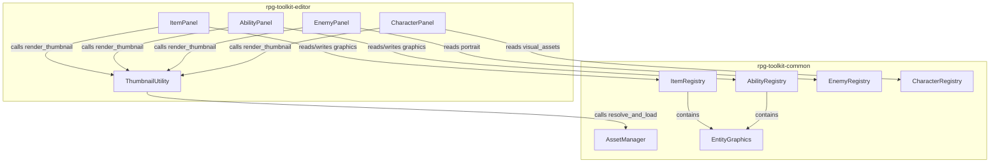
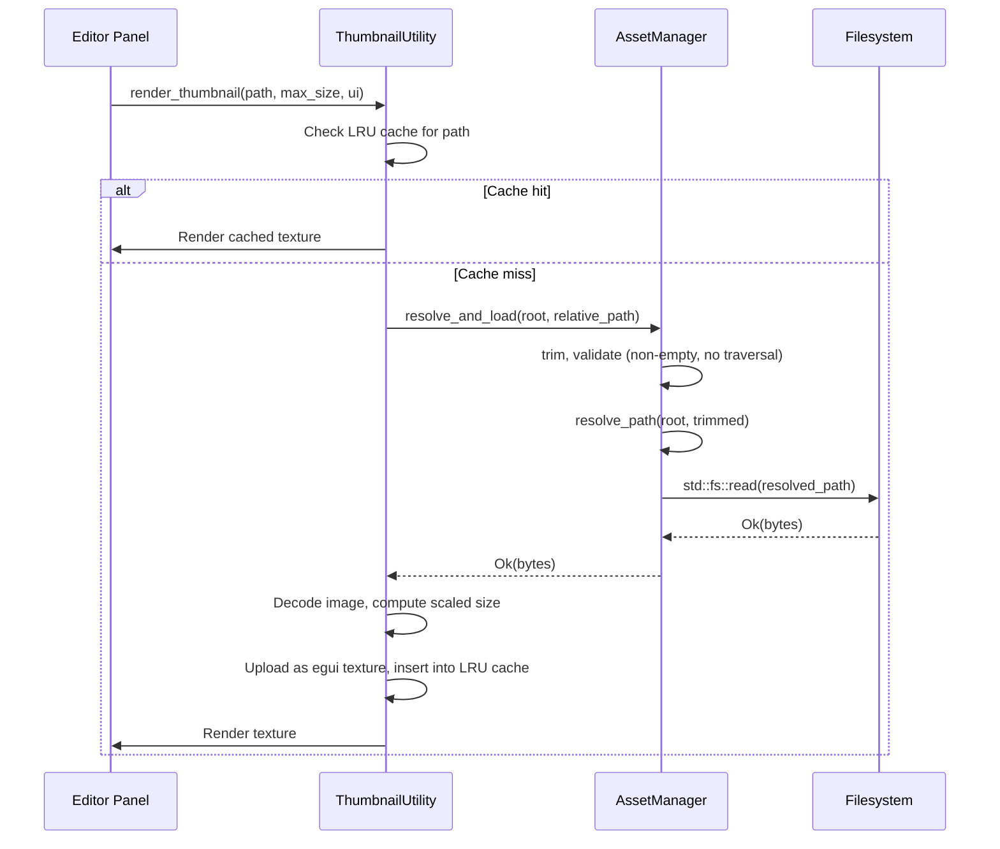

# Design Document: Graphics Database Editor

## Overview

This feature introduces four interconnected capabilities to the RPG Toolkit:

1. **AssetManager File Loading Extensions** — New methods on the existing `AssetManager` in `rpg-toolkit-common` that add file-existence checking and byte loading on top of the existing `resolve_path`. This keeps all asset operations in one place.

2. **EntityGraphics Struct** — A shared struct in `rpg-toolkit-common` for attaching per-entity graphics to items and abilities. Designed for future extensibility when category-level graphics are added via a category editor feature.

3. **Item & Ability Graphics Fields** — An `EntityGraphics` field added to both the `Item` and `Ability` structs, with corresponding registry methods (`set_icon`, `clear_icon`) following the same trim/truncate/validate pattern used by `Enemy::portrait` and `Character::VisualAssets`.

4. **Thumbnail Rendering Utility** — A shared module in `rpg-toolkit-editor` that loads an image from disk via `AssetManager`, decodes it with the `image` crate, uploads it as an egui texture, caches up to 128 textures with LRU eviction, and renders aspect-ratio-preserving previews within a 64×64 bounding box. This utility is called from the Item, Ability, Enemy, and Character editor panels.

### Design Rationale

- **Extend, don't wrap**: Instead of creating a separate service that just delegates to `AssetManager`, we add `file_exists`, `load_file_bytes`, and `resolve_and_load` directly to `AssetManager`. One module, one API surface.
- **Shared struct for extensibility**: `EntityGraphics` is its own struct (not a bare `Option<String>`) so that when category-level graphics are introduced in a future category editor feature, the struct can be extended without migrating data.
- **Consistent patterns**: The icon field follows the exact same trim/260-char truncation/`Option<String>` pattern used by enemy portrait and character visual assets.
- **LRU texture cache**: Avoids unbounded memory growth while preventing redundant disk reads on every frame. 128 entries is generous for a typical project.
- **Rendering concern stays in editor**: Texture caching and egui integration live in the editor crate, not common. The common crate only provides resolution + raw I/O.

### Future Extensions

- **Category Graphics**: Category-level graphics (e.g., a default "Weapon" icon shared by all weapon items) are deferred to a future category editor feature. The `EntityGraphics` struct can be extended with a `category_icon` field or the category editor can maintain its own graphics registry.
- **Portrait Migration**: Once characters (playable and NPC) own their face portraits via `VisualAssets`, the project-level `face_portraits` map and the map event action's portrait ID lookup can be replaced by referencing character/NPC IDs directly. This simplifies the map editor action system but requires an NPC registry and data migration — deferred to a separate feature.

## Architecture



### Data Flow (Thumbnail Rendering)



## Components and Interfaces

### 1. AssetManager Extensions (rpg-toolkit-common)

**File**: `crates/rpg-toolkit-common/src/asset.rs` (additions to existing `impl AssetManager`)

```rust
impl AssetManager {
    // --- Existing methods remain unchanged ---

    /// Checks whether a path points to an existing regular file.
    pub fn file_exists(path: &Path) -> bool {
        path.is_file()
    }

    /// Loads raw bytes from a resolved absolute path.
    ///
    /// Returns an error if:
    /// - The path does not exist
    /// - The path is a directory
    /// - The file cannot be read
    pub fn load_file_bytes(path: &Path) -> Result<Vec<u8>, CommonError> {
        if !path.exists() {
            return Err(CommonError::AssetPathError(format!(
                "file does not exist: {}", path.display()
            )));
        }
        if path.is_dir() {
            return Err(CommonError::AssetPathError(format!(
                "path is a directory, not a file: {}", path.display()
            )));
        }
        std::fs::read(path).map_err(|e| {
            CommonError::AssetPathError(format!(
                "failed to read file {}: {}", path.display(), e
            ))
        })
    }

    /// Convenience method: trims a relative path, resolves it against root,
    /// validates the target is a regular file, and loads its bytes.
    ///
    /// Combines trim → resolve_path → file validation → read in one call.
    pub fn resolve_and_load(root: &Path, relative_path: &str) -> Result<Vec<u8>, CommonError> {
        let trimmed = relative_path.trim();
        if trimmed.is_empty() {
            return Err(CommonError::AssetPathError(
                "file path is empty or whitespace-only".to_string(),
            ));
        }
        let resolved = Self::resolve_path(root, trimmed)?;
        Self::load_file_bytes(&resolved)
    }
}
```

No new module or file needed — these are added to the existing `AssetManager` impl block in `asset.rs`.

### 2. EntityGraphics Struct (rpg-toolkit-common)

**File**: `crates/rpg-toolkit-common/src/graphics.rs` (new file)

```rust
use serde::{Deserialize, Serialize};

/// Graphics associated with a game entity (items, abilities).
///
/// Currently holds a single icon field. Designed for future extensibility
/// when category-level graphics are added via the category editor feature.
#[derive(Clone, Debug, Default, PartialEq, Eq, Serialize, Deserialize)]
pub struct EntityGraphics {
    /// Per-instance icon graphic (relative path within the project).
    /// Maximum 260 characters after trimming. None = no icon assigned.
    #[serde(default)]
    pub icon: Option<String>,
}

impl EntityGraphics {
    /// Sets the icon path. Trims whitespace, rejects empty-after-trim,
    /// truncates to 260 characters.
    pub fn set_icon(&mut self, path: &str) -> Result<(), crate::error::CommonError> {
        let trimmed = path.trim();
        if trimmed.is_empty() {
            return Err(crate::error::CommonError::AssetPathError(
                "Icon path must not be empty or whitespace-only".to_string(),
            ));
        }
        let truncated: String = trimmed.chars().take(260).collect();
        self.icon = Some(truncated);
        Ok(())
    }

    /// Clears the icon path, setting it to None.
    pub fn clear_icon(&mut self) {
        self.icon = None;
    }

    /// Returns true if an icon path is set.
    pub fn has_icon(&self) -> bool {
        self.icon.is_some()
    }
}
```

**Module registration**: Add `pub mod graphics;` to `lib.rs` and re-export `EntityGraphics`.

### 3. Item Graphics Field (rpg-toolkit-common)

**File**: `crates/rpg-toolkit-common/src/item.rs` (modifications)

```rust
use crate::graphics::EntityGraphics;

#[derive(Clone, Debug, PartialEq, Eq, Serialize, Deserialize)]
pub struct Item {
    // ... existing fields ...
    #[serde(default)]
    pub graphics: EntityGraphics,
}
```

**New methods on `ItemRegistry`**:

```rust
impl ItemRegistry {
    /// Sets the icon graphic for an item via its EntityGraphics field.
    pub fn set_icon(&mut self, id: &ItemId, path: &str) -> Result<(), CommonError> {
        let item = self.items.get_mut(id).ok_or_else(|| {
            CommonError::ItemValidationError(format!("Item with id '{}' not found", id))
        })?;
        item.graphics.set_icon(path)
    }

    /// Clears the icon graphic for an item.
    pub fn clear_icon(&mut self, id: &ItemId) -> Result<(), CommonError> {
        let item = self.items.get_mut(id).ok_or_else(|| {
            CommonError::ItemValidationError(format!("Item with id '{}' not found", id))
        })?;
        item.graphics.clear_icon();
        Ok(())
    }
}
```

The `create_item` method initializes `graphics: EntityGraphics::default()`.

### 4. Ability Graphics Field (rpg-toolkit-common)

**File**: `crates/rpg-toolkit-common/src/ability.rs` (modifications)

```rust
use crate::graphics::EntityGraphics;

#[derive(Clone, Debug, PartialEq, Eq, Serialize, Deserialize)]
pub struct Ability {
    pub id: AbilityId,
    pub display_name: String,
    pub description: String,
    pub category: AbilityCategory,
    pub cost_type: CostType,
    pub cost_value: u32,
    pub power: u32,
    pub target_type: TargetType,
    pub sources: Vec<AbilitySource>,
    #[serde(default)]
    pub graphics: EntityGraphics,
}
```

**New methods on `AbilityRegistry`**:

```rust
impl AbilityRegistry {
    /// Sets the icon graphic for an ability via its EntityGraphics field.
    pub fn set_icon(&mut self, id: &AbilityId, path: &str) -> Result<(), CommonError> {
        let ability = self.abilities.get_mut(id).ok_or_else(|| {
            CommonError::AbilityValidationError(format!("Ability with id '{}' not found", id))
        })?;
        ability.graphics.set_icon(path)
    }

    /// Clears the icon graphic for an ability.
    pub fn clear_icon(&mut self, id: &AbilityId) -> Result<(), CommonError> {
        let ability = self.abilities.get_mut(id).ok_or_else(|| {
            CommonError::AbilityValidationError(format!("Ability with id '{}' not found", id))
        })?;
        ability.graphics.clear_icon();
        Ok(())
    }
}
```

### 5. ThumbnailUtility (rpg-toolkit-editor)

**File**: `crates/rpg-toolkit-editor/src/plugins/thumbnail.rs`

```rust
use std::collections::HashMap;
use std::path::Path;
use bevy_egui::egui;
use rpg_toolkit_common::asset::AssetManager;

/// LRU texture cache entry.
struct CacheEntry {
    texture: egui::TextureHandle,
    last_used: u64,
}

/// Shared thumbnail rendering utility with LRU caching.
pub struct ThumbnailCache {
    entries: HashMap<String, CacheEntry>,
    max_entries: usize,
    frame_counter: u64,
}

impl ThumbnailCache {
    pub fn new(max_entries: usize) -> Self { ... }

    /// Renders a thumbnail for the given relative path.
    ///
    /// - Resolves and loads bytes via AssetManager::resolve_and_load
    /// - Checks LRU cache; on miss, loads/decodes/uploads texture
    /// - Renders aspect-ratio-preserving image within max_size × max_size
    /// - On failure, renders "Image not found" placeholder label
    pub fn render_thumbnail(
        &mut self,
        ui: &mut egui::Ui,
        project_root: &Path,
        relative_path: &str,
        max_size: u32,
    ) { ... }

    /// Invalidates a specific cache entry (called when path changes).
    pub fn invalidate(&mut self, path: &str) { ... }

    /// Advances the frame counter (called once per frame).
    pub fn tick(&mut self) { self.frame_counter += 1; }
}

impl Default for ThumbnailCache {
    fn default() -> Self {
        Self::new(128)
    }
}
```

**Scaling logic**:
```rust
fn compute_scaled_size(width: u32, height: u32, max_size: u32) -> (f32, f32) {
    let max = max_size as f32;
    let scale = (max / width as f32).min(max / height as f32).min(1.0);
    (width as f32 * scale, height as f32 * scale)
}
```

The `.min(1.0)` ensures images smaller than 64×64 are displayed at their native size.

### 6. Editor Panel Modifications

**Item Panel** — Add an "Icon" section:
- Text input bound to `icon_buffer`
- "Browse..." button opening `rfd::FileDialog` filtered to `["png", "jpg", "jpeg"]`
- "Clear" button
- `ThumbnailCache::render_thumbnail(...)` call when `graphics.icon.is_some()`
- "No icon assigned" label when `graphics.icon.is_none()`

**Ability Panel** — Add an "Icon" section (same pattern as item panel):
- Text input, "Browse...", "Clear", thumbnail preview

**Enemy Panel** — Add `ThumbnailCache::render_thumbnail(...)` call in the Portrait section when `portrait.is_some()`.

**Character Panel** — Add `ThumbnailCache::render_thumbnail(...)` calls for each of the three visual asset slots when the respective field is `Some`.

The `ThumbnailCache` will be stored as a Bevy `Resource` so it is shared across all panels.

## Data Models

### EntityGraphics (new)

| Field | Type | Default | Serde |
|-------|------|---------|-------|
| icon | `Option<String>` | `None` | `#[serde(default)]` |

Constraints:
- Max 260 characters after trimming
- Stores relative path (forward-slash separators)
- `None` = no icon assigned

### Item (modified)

| Field | Type | Default | Serde |
|-------|------|---------|-------|
| graphics | `EntityGraphics` | `EntityGraphics::default()` | `#[serde(default)]` |

### Ability (modified)

| Field | Type | Default | Serde |
|-------|------|---------|-------|
| graphics | `EntityGraphics` | `EntityGraphics::default()` | `#[serde(default)]` |

### ThumbnailCache (new, editor-only)

| Field | Type | Description |
|-------|------|-------------|
| entries | `HashMap<String, CacheEntry>` | Keyed by absolute path string |
| max_entries | `usize` | Capacity limit (128) |
| frame_counter | `u64` | Monotonic frame counter for LRU tracking |

### CacheEntry (new, editor-only)

| Field | Type | Description |
|-------|------|-------------|
| texture | `egui::TextureHandle` | Uploaded GPU texture |
| last_used | `u64` | Frame number of last access |

## Correctness Properties

### Property 1: AssetManager resolution round-trip

*For any* valid relative file path (non-empty, no `.` or `..` components, ≤260 characters, forward-slash separators) and any project root path, resolving through `AssetManager::resolve_path` and then stripping the project root prefix from the result SHALL reproduce the original relative path exactly.

**Validates: Requirements 10.1, 10.4**

### Property 2: AssetManager resolution idempotence

*For any* valid relative file path and project root, calling `AssetManager::resolve_path` two or more consecutive times with the same arguments SHALL produce identical absolute paths on each invocation.

**Validates: Requirements 10.3**

### Property 3: EntityGraphics serialization round-trip

*For any* valid `EntityGraphics` value (icon is None or Some(string) where string is 1–260 characters after trimming with no path traversal), serializing to JSON and deserializing back SHALL produce an identical value (icon matches byte-for-byte, None remains None).

**Validates: Requirements 2.5, 10.2**

### Property 4: Item graphics serialization round-trip

*For any* valid `ItemRegistry` containing items with arbitrary EntityGraphics values, serializing the registry to JSON and deserializing back SHALL produce an identical registry.

**Validates: Requirements 3.10, 10.2**

### Property 5: Ability graphics serialization round-trip

*For any* valid `AbilityRegistry` containing abilities with arbitrary EntityGraphics values, serializing the registry to JSON and deserializing back SHALL produce an identical registry.

**Validates: Requirements 4.10, 10.2**

### Property 6: Invalid paths rejected by AssetManager

*For any* string that is empty, whitespace-only, or contains `.` or `..` path components, `AssetManager::resolve_and_load` SHALL return an error (never successfully load bytes).

**Validates: Requirements 1.5, 1.6**

### Property 7: EntityGraphics icon trim and truncation

*For any* string input to `EntityGraphics::set_icon`, the stored icon value SHALL equal the input trimmed of leading/trailing whitespace and truncated to 260 characters. If the trimmed input is empty, the operation SHALL return an error and the icon SHALL remain unchanged.

**Validates: Requirements 3.7, 4.7**

### Property 8: Thumbnail scaling preserves aspect ratio

*For any* image dimensions (width > 0, height > 0) and max bounding box size (> 0), the computed display dimensions SHALL satisfy: (a) both width and height ≤ max_size, (b) the aspect ratio (width/height) of the result equals the aspect ratio of the input (within floating-point tolerance), and (c) images already smaller than max_size in both dimensions are displayed at their original size.

**Validates: Requirements 5.4, 6.4, 7.4, 8.4, 9.2**

## Error Handling

| Scenario | Component | Behavior |
|----------|-----------|----------|
| Empty/whitespace path to `resolve_and_load` | AssetManager | Returns `CommonError::AssetPathError` |
| Path traversal (`..` or `.`) in relative path | AssetManager | Returns `CommonError::AssetPathError` |
| Resolved path is a directory | AssetManager | `load_file_bytes` returns `CommonError::AssetPathError` |
| File does not exist at resolved path | AssetManager | `load_file_bytes` returns `CommonError::AssetPathError`; `file_exists` returns `false` |
| File read I/O error | AssetManager | Returns `CommonError::AssetPathError` with OS error message |
| Empty/whitespace path to `EntityGraphics::set_icon` | EntityGraphics | Returns `CommonError::AssetPathError` |
| Image decode failure (corrupt/unsupported format) | ThumbnailUtility | Renders "Image not found" placeholder label |
| Texture upload failure | ThumbnailUtility | Renders "Image not found" placeholder label |
| Cache at capacity (128 entries) | ThumbnailUtility | Evicts least-recently-used entry before inserting new one |
| Item/Ability not found for `set_icon`/`clear_icon` | ItemRegistry/AbilityRegistry | Returns validation error |
| File picker cancelled | Editor Panels | No change to the field — existing buffer preserved |

## Testing Strategy

### Property-Based Tests (proptest)

Each correctness property above maps to a property-based test with ≥100 iterations using the `proptest` crate (already a dev-dependency in both crates).

| Property | Test Location | Generator Strategy |
|----------|--------------|-------------------|
| 1 (resolution round-trip) | `rpg-toolkit-common/tests/properties/` | Random valid relative paths + random root paths |
| 2 (idempotence) | `rpg-toolkit-common/tests/properties/` | Same as above (call resolve twice) |
| 3 (EntityGraphics round-trip) | `rpg-toolkit-common/tests/properties/` | Random EntityGraphics with random icon values |
| 4 (Item graphics round-trip) | `rpg-toolkit-common/tests/properties/` | Random ItemRegistry with random EntityGraphics |
| 5 (Ability graphics round-trip) | `rpg-toolkit-common/tests/properties/` | Random AbilityRegistry with random EntityGraphics |
| 6 (invalid paths rejected) | `rpg-toolkit-common/tests/properties/` | Whitespace strings, strings with `..`/`.` segments |
| 7 (trim and truncation) | `rpg-toolkit-common/tests/properties/` | Random strings (including padded whitespace, long strings) |
| 8 (aspect ratio scaling) | `rpg-toolkit-editor` tests | Random (width, height, max_size) tuples |

**Configuration**: Each test uses `ProptestConfig { cases: 100, .. ProptestConfig::default() }`.

**Tag format**: `// Feature: graphics-database-editor, Property N: <title>`

### Unit Tests (example-based)

| Test | Scope | Purpose |
|------|-------|---------|
| `AssetManager::resolve_and_load` with real temp file | common | Integration with fs |
| `AssetManager::load_file_bytes` on directory | common | Verify directory rejection |
| `AssetManager::file_exists` with existing and missing paths | common | Boolean existence check |
| `EntityGraphics::set_icon` with valid path | common | Basic setter correctness |
| `EntityGraphics::set_icon` with whitespace-only path | common | Rejection case |
| `EntityGraphics::clear_icon` | common | Reset to None |
| `ItemRegistry::set_icon` then `clear_icon` | common | Registry delegation |
| `AbilityRegistry::set_icon` then `clear_icon` | common | Registry delegation |
| `Item` serde with missing `graphics` field (backward compat) | common | Verify `#[serde(default)]` |
| `Ability` serde with missing `graphics` field (backward compat) | common | Verify `#[serde(default)]` |
| `compute_scaled_size` with 100×50, max 64 | editor | Concrete scaling example |
| `compute_scaled_size` with 32×32, max 64 | editor | No-upscale case |
| `ThumbnailCache` eviction at capacity | editor | LRU eviction correctness |

### Integration Approach

- Editor panel tests are manual/visual (Bevy + egui UI testing is not automated in this project).
- The `ThumbnailCache` internal logic (scaling, caching) is tested via unit tests on the pure functions.
- End-to-end flow (file picker → model → thumbnail display) is verified through manual QA.
