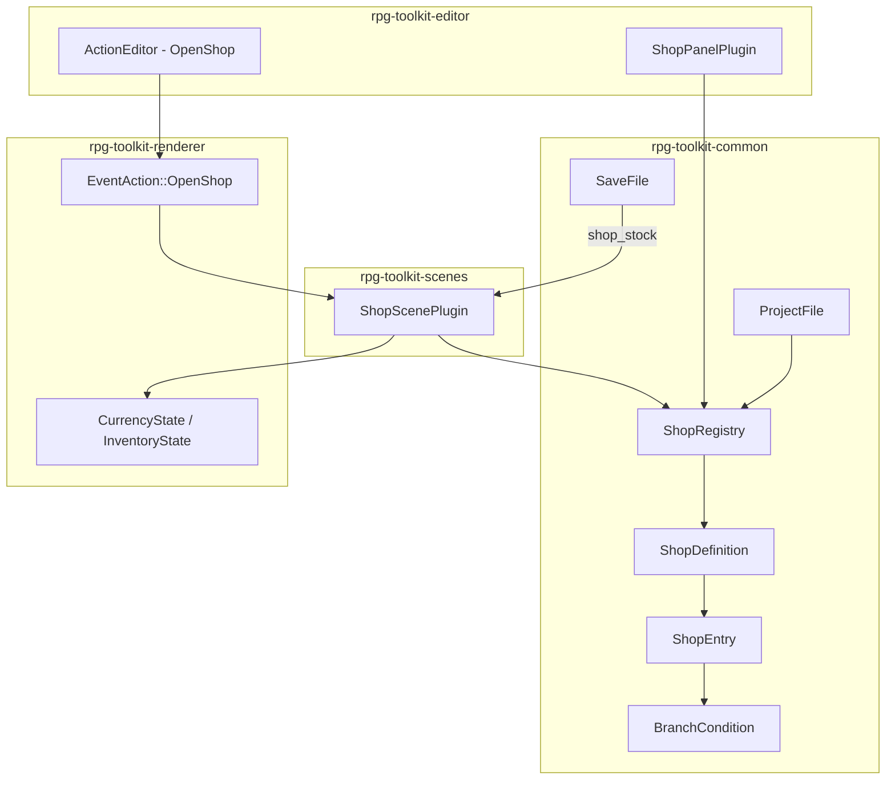
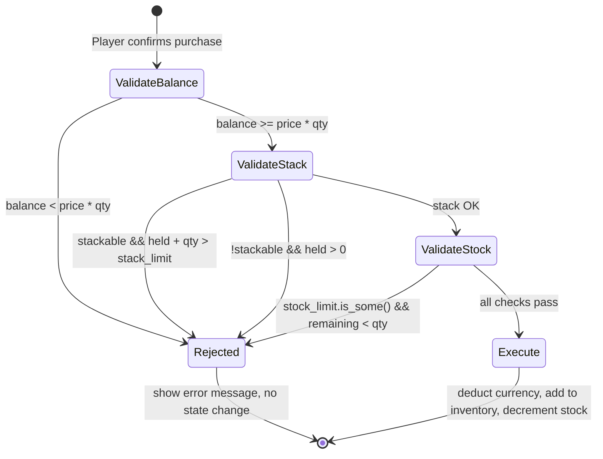

# Design Document: In-Game Shops

## Overview

This feature adds a complete in-game shop system to the RPG toolkit, spanning three layers:

1. **Data Model** (`rpg-toolkit-common`): A `ShopRegistry` holding `ShopDefinition` entries with inventory entries (`ShopEntry`), validation, and serialization.
2. **Editor UI** (`rpg-toolkit-editor`): A `ShopPanelPlugin` for authoring shop definitions, following the same patterns as `ItemPanelPlugin` and `EnemyPanelPlugin`.
3. **Runtime Scene** (`rpg-toolkit-scenes`): A `ShopScenePlugin` for player buy/sell interactions, following the `TitleScreenPlugin` pattern with `AppPhase::Shop`.
4. **Event Integration** (`rpg-toolkit-renderer`): An `EventAction::OpenShop` variant that transitions the game to the shop scene.

The shop system reuses existing infrastructure: `BranchCondition` for conditional item availability, `SaveFile` for stock persistence, `CurrencyState`/`InventoryState` for transaction state, and `ItemRegistry` for item metadata.

## Architecture



### Lifecycle Flow

1. **Design time**: Game designer creates shops in `ShopPanelPlugin`, entries reference items from `ItemRegistry`.
2. **Trigger**: An NPC or tile `EventAction::OpenShop { shop_id }` transitions `AppPhase` to `Shop`.
3. **Runtime**: `ShopScenePlugin` reads the `ShopDefinition`, evaluates `BranchCondition`s against `GameState`, displays available items, and handles buy/sell transactions against `CurrencyState`/`InventoryState`.
4. **Persistence**: On save, remaining stock values are written to `SaveFile.shop_stock`. On load, they're restored and clamped to configured limits.

## Components and Interfaces

### ShopRegistry (rpg-toolkit-common/src/shop.rs)

```rust
pub type ShopId = String;

#[derive(Clone, Debug, PartialEq, Serialize, Deserialize)]
pub struct ShopEntry {
    pub item_id: ItemId,
    pub buy_price: u32,
    pub sell_price: Option<u32>,
    pub stock_limit: Option<u32>,       // 1–9999 when Some
    pub condition: Option<BranchCondition>,
}

#[derive(Clone, Debug, PartialEq, Serialize, Deserialize)]
pub struct ShopDefinition {
    pub id: ShopId,
    pub display_name: String,
    pub entries: Vec<ShopEntry>,
}

#[derive(Clone, Debug, Default, PartialEq, Serialize, Deserialize)]
pub struct ShopRegistry {
    pub shops: HashMap<ShopId, ShopDefinition>,
}
```

**Key methods on ShopRegistry:**
- `create_shop(name: &str) -> Result<ShopId, CommonError>` — validates name, generates UUID, inserts definition.
- `delete_shop(id: &ShopId) -> Result<(), CommonError>` — removes by ID.
- `rename_shop(id: &ShopId, name: &str) -> Result<(), CommonError>` — validates 1–64 char trimmed name.
- `add_entry(shop_id: &ShopId, entry: ShopEntry) -> Result<(), CommonError>` — rejects duplicates, enforces max 256 entries.
- `remove_entry(shop_id: &ShopId, item_id: &ItemId) -> Result<(), CommonError>` — removes by item ID.
- `update_entry(shop_id: &ShopId, item_id: &ItemId, ...) -> Result<(), CommonError>` — updates price/stock/condition.
- `sorted_shops() -> Vec<&ShopDefinition>` — returns shops sorted case-insensitively by display name.
- `search_shops(query: &str) -> Vec<&ShopDefinition>` — filter by name substring match.

### EventAction::OpenShop (rpg-toolkit-common/src/map.rs)

```rust
// Added to the existing EventAction enum:
EventAction::OpenShop {
    #[serde(deserialize_with = "deserialize_non_empty_string")]
    shop_id: ShopId,
}
```

### ShopScenePlugin (rpg-toolkit-scenes/src/shop_scene.rs)

```rust
/// Resource inserted by the renderer when transitioning to AppPhase::Shop.
#[derive(Resource)]
pub struct ActiveShopId {
    pub shop_id: ShopId,
}

/// Runtime stock tracking for the current shop session.
#[derive(Resource, Default)]
pub struct ShopStockState {
    pub remaining: HashMap<ItemId, u32>,  // only entries with stock limits
}

pub struct ShopScenePlugin;

impl Plugin for ShopScenePlugin {
    fn build(&self, app: &mut App) {
        app.add_systems(OnEnter(AppPhase::Shop), spawn_shop_ui)
           .add_systems(OnExit(AppPhase::Shop), despawn_shop_ui)
           .add_systems(Update, shop_input.run_if(in_state(AppPhase::Shop)));
    }
}
```

**Transaction logic (pure functions for testability):**

```rust
/// Computes the effective sell price for an item.
pub fn compute_sell_price(entry: &ShopEntry, item: &Item) -> u32 {
    entry.sell_price.unwrap_or(item.value / 2)
}

/// Computes maximum purchasable quantity given constraints.
pub fn max_buy_quantity(
    balance: u64,
    buy_price: u32,
    remaining_stock: Option<u32>,
    is_stackable: bool,
    stack_limit: u32,
    currently_held: u32,
) -> u32 { ... }

/// Validates and executes a buy transaction, returning new state or error.
pub fn execute_buy(
    balance: u64,
    inventory_qty: u32,
    buy_price: u32,
    quantity: u32,
    remaining_stock: Option<u32>,
    is_stackable: bool,
    stack_limit: u32,
) -> Result<BuyResult, ShopError> { ... }

/// Validates and executes a sell transaction, returning new state or error.
pub fn execute_sell(
    balance: u64,
    inventory_qty: u32,
    sell_price: u32,
    quantity: u32,
) -> Result<SellResult, ShopError> { ... }

/// Filters shop entries by condition evaluation against game state.
pub fn visible_entries(
    entries: &[ShopEntry],
    flags: &HashMap<String, String>,
    item_registry: &ItemRegistry,
) -> Vec<&ShopEntry> { ... }

/// Filters inventory items eligible for selling.
pub fn sellable_items(
    inventory: &HashMap<ItemId, u32>,
    item_registry: &ItemRegistry,
    shop_entries: &[ShopEntry],
) -> Vec<(ItemId, u32, u32)> { ... }  // (item_id, quantity, sell_price)
```

### ShopPanelPlugin (rpg-toolkit-editor/src/plugins/shop_panel.rs)

Follows the same pattern as `EnemyPanelPlugin`:
- Left panel: scrollable shop list with search, create/delete buttons.
- Central panel: selected shop's details — name editing, entry list with inline editing.
- Right panel: preview of selected entry's item details.

### SaveFile Extension (rpg-toolkit-common/src/save.rs)

```rust
// Added to SaveFile:
#[serde(default)]
pub shop_stock: BTreeMap<String, BTreeMap<String, u32>>,
// Outer key: shop_id, inner key: item_id, value: remaining stock
```

### ProjectFile Extension (rpg-toolkit-common/src/project.rs)

```rust
// Added to ProjectFile:
#[serde(default)]
pub shops: ShopRegistry,
```

With corresponding validation in `ProjectFile::deserialize()`:
- Verify each shop's ID matches its registry key.
- Warn (don't error) on shop entries referencing non-existent items.

## Data Models

### Core Types

| Type | Location | Description |
|------|----------|-------------|
| `ShopId` | common/shop.rs | Type alias for `String` (UUID v4) |
| `ShopEntry` | common/shop.rs | Item reference + price/stock/condition |
| `ShopDefinition` | common/shop.rs | Named shop with entry list |
| `ShopRegistry` | common/shop.rs | HashMap<ShopId, ShopDefinition> |
| `ActiveShopId` | scenes/shop_scene.rs | Bevy Resource for current shop |
| `ShopStockState` | scenes/shop_scene.rs | Runtime remaining stock |
| `BuyResult` | scenes/shop_scene.rs | Outcome of buy transaction |
| `SellResult` | scenes/shop_scene.rs | Outcome of sell transaction |
| `ShopError` | common/error.rs | Error variants for shop operations |

### Transaction Result Types

```rust
pub struct BuyResult {
    pub new_balance: u64,
    pub new_inventory_qty: u32,
    pub new_remaining_stock: Option<u32>,
}

pub struct SellResult {
    pub new_balance: u64,
    pub new_inventory_qty: u32,
}

pub enum ShopError {
    InsufficientFunds,
    InventoryFull,      // stack limit exceeded or non-stackable duplicate
    InsufficientStock,
    InsufficientInventory,
    InvalidQuantity,
}
```

### State Flow for Buy Transaction



## Correctness Properties

*A property is a characteristic or behavior that should hold true across all valid executions of a system — essentially, a formal statement about what the system should do. Properties serve as the bridge between human-readable specifications and machine-verifiable correctness guarantees.*

### Property 1: Shop name validation

*For any* string input, the shop name validator SHALL accept it if and only if the trimmed string has length between 1 and 64 characters (inclusive), and reject it otherwise without modifying the registry.

**Validates: Requirements 1.3, 2.10**

### Property 2: No duplicate items per shop

*For any* shop definition and any sequence of add_entry operations, the resulting entry list SHALL never contain two entries with the same ItemId, and attempting to insert a duplicate SHALL return an error leaving the entry list unchanged.

**Validates: Requirements 1.7, 2.9**

### Property 3: Default sell price calculation

*For any* item base value (u32), when a ShopEntry has no explicit sell price, the computed sell price SHALL equal the item's base value divided by 2 using integer division (value / 2).

**Validates: Requirements 1.5, 6.3**

### Property 4: Shop list case-insensitive sorting

*For any* collection of ShopDefinitions with arbitrary display names, the sorted output SHALL be in non-decreasing case-insensitive lexicographic order.

**Validates: Requirements 2.2**

### Property 5: OpenShop action serialization round-trip

*For any* non-empty shop ID string, serializing an EventAction::OpenShop to JSON and deserializing it back SHALL produce a value equal to the original. Empty strings SHALL be rejected during deserialization.

**Validates: Requirements 3.1**

### Property 6: Buy transaction correctness

*For any* valid buy transaction (sufficient funds, within stack limit, within stock), executing the purchase SHALL result in: (a) new balance = old balance - (buy_price × quantity), (b) new inventory quantity = old quantity + quantity, and (c) new remaining stock = old stock - quantity (when stock limit exists).

**Validates: Requirements 5.1, 5.5**

### Property 7: Purchase rejection preserves state

*For any* purchase attempt that violates at least one guard condition (insufficient funds, stack overflow, non-stackable duplicate, or insufficient stock), the transaction SHALL be rejected and the currency balance, inventory, and stock state SHALL remain unchanged.

**Validates: Requirements 5.2, 5.3, 5.4, 4.6**

### Property 8: Maximum buy quantity computation

*For any* combination of (balance, buy_price, remaining_stock, is_stackable, stack_limit, currently_held), the computed max buy quantity SHALL equal min(floor(balance / buy_price), remaining_stock_or_max, available_stack_space) where available_stack_space is (stack_limit - currently_held) if stackable, or (1 - min(currently_held, 1)) if non-stackable, and the result SHALL be at least 0.

**Validates: Requirements 5.6**

### Property 9: Sell transaction correctness

*For any* valid sell transaction (player holds sufficient quantity), executing the sale SHALL result in: (a) new balance = old balance + (sell_price × quantity), saturating at u64::MAX, and (b) new inventory quantity = old quantity - quantity.

**Validates: Requirements 6.1**

### Property 10: Sell rejection preserves state

*For any* sell attempt where the player holds fewer items than the requested quantity (or holds zero), the transaction SHALL be rejected and the currency balance and inventory SHALL remain unchanged.

**Validates: Requirements 6.2**

### Property 11: Sell list filtering

*For any* inventory state and item registry, the sellable items list SHALL include only items that are: (a) present in the inventory with quantity > 0, (b) NOT of category KeyItem, and (c) have a computed sell price > 0.

**Validates: Requirements 6.5**

### Property 12: Condition-based item visibility

*For any* set of ShopEntries and any GameState flags map, a shop entry SHALL appear in the visible items list if and only if: (a) it has no condition (None), (b) its condition has an empty checks list, or (c) its BranchCondition evaluates to true against the flags. Entries failing their condition SHALL be omitted entirely.

**Validates: Requirements 7.1, 7.2, 7.3, 7.4**

### Property 13: Shop registry serialization round-trip

*For any* valid ShopRegistry (all IDs match keys, names valid, entries valid), serializing as part of a ProjectFile to JSON and deserializing back SHALL produce a structurally equal ShopRegistry.

**Validates: Requirements 8.1, 8.3**

### Property 14: Shop ID mismatch validation

*For any* JSON where a ShopDefinition's `id` field does not equal its HashMap key in the registry, deserialization SHALL return a ProjectValidationError.

**Validates: Requirements 8.2**

### Property 15: Shop stock persistence round-trip

*For any* SaveFile containing a shop_stock map with valid shop IDs and item IDs mapped to u32 remaining stock values, serializing to JSON and deserializing back SHALL produce a structurally equal shop_stock map.

**Validates: Requirements 9.1, 9.2, 9.5**

### Property 16: Stock value clamping on load

*For any* saved remaining stock value that exceeds the configured stock limit for a ShopEntry, the restored runtime value SHALL be clamped to the configured stock limit. Values within the configured limit SHALL be preserved as-is.

**Validates: Requirements 9.4**

## Error Handling

| Scenario | Handling |
|----------|----------|
| Shop name empty or > 64 chars | Return `CommonError::ShopValidationError` with descriptive message |
| Duplicate item in shop entries | Return `CommonError::ShopValidationError`, entry list unchanged |
| Shop entry count exceeds 256 | Return `CommonError::ShopValidationError` |
| Stock limit outside 1–9999 | Return `CommonError::ShopValidationError` |
| OpenShop with invalid shop ID at runtime | Log warning, skip action, no phase transition |
| Shop entry references missing item at runtime | Skip entry, log warning with item ID |
| Insufficient funds for purchase | Display message to player, reject transaction |
| Stack limit exceeded | Display "inventory full" message, reject transaction |
| Non-stackable item already held | Display "inventory full" message, reject transaction |
| Sell attempt exceeds held quantity | Display "insufficient inventory" message, reject transaction |
| Currency overflow on sell | Saturating addition at u64::MAX |
| Shop ID key/value mismatch on deserialization | Return `CommonError::ProjectValidationError` |
| Missing item reference on deserialization | Log warning, continue (non-fatal) |

## Testing Strategy

### Property-Based Testing

The project uses `proptest` (already a workspace dependency) for property-based testing. Property tests live in `tests/properties/` as separate test binaries.

**New test files:**
- `tests/properties/shop_round_trip.rs` — Properties 5, 13, 15 (serialization round-trips)
- `tests/properties/shop_transactions.rs` — Properties 6, 7, 8, 9, 10 (buy/sell logic)
- `tests/properties/shop_invariants.rs` — Properties 1, 2, 3, 4, 11, 12, 14, 16 (validation and filtering)

Each property test runs a minimum of 100 iterations with `ProptestConfig::with_cases(100)`.

Each test is tagged with a comment referencing its design property:
```rust
// Feature: in-game-shops, Property 6: Buy transaction correctness
```

### Unit Tests

Unit tests complement property tests with specific examples and edge cases:
- Boundary values for stock limit (1, 9999)
- Empty shop name, whitespace-only name
- Currency at u64::MAX during sell (saturation)
- All condition operators with shop entry visibility
- OpenShop deserialization with empty string (rejection)
- Buy quantity of 0 (rejected)
- Non-stackable item with quantity > 1 (rejected)

Unit tests live alongside the implementation in each module's `#[cfg(test)]` block.

### Integration Tests

Integration scenarios (not property-based):
- Full buy/sell flow with Bevy ECS resources
- OpenShop event triggering phase transition
- Save/load with shop stock data
- Editor panel create/edit/delete workflows

### Test Organization

```
tests/properties/
├── shop_round_trip.rs        # Serialization round-trip properties
├── shop_transactions.rs      # Buy/sell transaction properties
└── shop_invariants.rs        # Validation and filtering properties

crates/rpg-toolkit-common/src/shop.rs          # Unit tests in #[cfg(test)]
crates/rpg-toolkit-scenes/src/shop_scene.rs    # Unit tests in #[cfg(test)]
```
