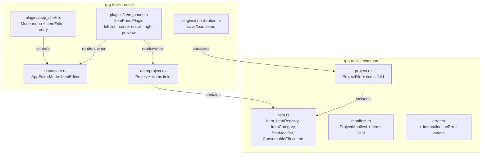

# Design Document: Items Editor

## Overview

The Items Editor adds a comprehensive item data model to `rpg-toolkit-common` and a corresponding editor mode to `rpg-toolkit-editor` for creating, editing, deleting, and browsing game items. Items are classified into five categories (Weapon, Armor, Accessory, Consumable, Key_Item), each with type-specific properties, stat modifiers, rarity tiers, and equipment slot assignments.

**Key design decision: Follow the Character Editor pattern.** The Items Editor reuses the same architectural approach as the existing Character Editor — a dedicated `AppEditorMode::ItemEditor` variant, a full-viewport three-panel layout (left list, center editor, right preview), and a Bevy plugin that only renders when the mode is active. This keeps the implementation consistent, predictable, and non-disruptive to existing modes.

**Key design decision: Tagged enum for category properties.** Rather than storing all possible category fields on every item (with most being None), category-specific properties are modeled as a serde-tagged enum (`ItemCategoryData`). This provides compile-time safety, clean serialization, and eliminates impossible states (e.g., a Key_Item with attack_power).

**Scope boundary:** This spec introduces the `ItemEditor` mode and the `item` module in common. It does NOT implement inventory, shops, loot tables, or equipment screens — those are downstream consumers of the item data model.

## Architecture

The feature spans two crates, following the same pattern as the Character Editor:



### Plugin Integration

The `ItemPanelPlugin` is a new Bevy plugin registered in `main.rs`. It renders **only** when `AppEditorMode` is set to `ItemEditor`. When active, it takes over the full viewport with its own panel layout (left list with filtering, center editor with category-specific forms, right preview).

All existing map editor and character editor plugins already have mode-gating run conditions and require no changes.

### Mode Switching

The existing "Mode" menu in `AppShellPlugin` gains a third entry: "⚔ Item Editor". This updates the `AppEditorMode` resource to `ItemEditor`, causing only the `ItemPanelPlugin` systems to run.

## Components and Interfaces

### `rpg-toolkit-common::item` (new module)

```rust
use std::collections::HashMap;
use serde::{Deserialize, Serialize};
use uuid::Uuid;
use crate::error::CommonError;

pub type ItemId = String;

/// Rarity tier for items.
#[derive(Clone, Copy, Debug, PartialEq, Eq, Serialize, Deserialize)]
pub enum Rarity {
    Common,
    Uncommon,
    Rare,
    Epic,
    Legendary,
}

/// Equipment slots available for items.
#[derive(Clone, Copy, Debug, PartialEq, Eq, Serialize, Deserialize)]
pub enum EquipmentSlot {
    MainHand,
    OffHand,
    Head,
    Body,
    Legs,
    Feet,
    Accessory1,
    Accessory2,
}

/// A named stat modifier on an item.
#[derive(Clone, Debug, PartialEq, Eq, Serialize, Deserialize)]
pub struct StatModifier {
    pub stat_name: String,
    pub value: i32,
}

/// Target stat for buff effects.
#[derive(Clone, Copy, Debug, PartialEq, Eq, Serialize, Deserialize)]
pub enum BuffTargetStat {
    Strength,
    Stamina,
    Speed,
    Luck,
    Wisdom,
    Intelligence,
}

/// Target status for cure effects.
#[derive(Clone, Copy, Debug, PartialEq, Eq, Serialize, Deserialize)]
pub enum CureTargetStatus {
    Poison,
    Paralysis,
    Sleep,
    Confusion,
    Silence,
    All,
}

/// The type of effect a consumable applies.
#[derive(Clone, Debug, PartialEq, Eq, Serialize, Deserialize)]
#[serde(tag = "effect_type")]
pub enum ConsumableEffectType {
    RestoreHP,
    RestoreMP,
    CureStatus { target_status: CureTargetStatus },
    BuffStat { target_stat: BuffTargetStat, duration: u32 },
}

/// A single consumable effect with type and potency.
#[derive(Clone, Debug, PartialEq, Eq, Serialize, Deserialize)]
pub struct ConsumableEffect {
    pub effect: ConsumableEffectType,
    pub potency: u32,
}

/// Category-specific data, stored as a serde-tagged enum.
#[derive(Clone, Debug, PartialEq, Eq, Serialize, Deserialize)]
#[serde(tag = "category")]
pub enum ItemCategoryData {
    Weapon {
        attack_power: u32,
        equipment_slot: EquipmentSlot,
    },
    Armor {
        defense_power: u32,
        equipment_slot: EquipmentSlot,
    },
    Accessory {
        equipment_slot: EquipmentSlot,
    },
    Consumable {
        effects: Vec<ConsumableEffect>,
    },
    KeyItem,
}

/// A game item with all its properties.
#[derive(Clone, Debug, PartialEq, Eq, Serialize, Deserialize)]
pub struct Item {
    pub id: ItemId,
    pub display_name: String,
    pub description: String,
    pub category_data: ItemCategoryData,
    pub value: u32,
    pub rarity: Rarity,
    pub stackable: bool,
    pub stack_limit: u32,
    pub stat_modifiers: Vec<StatModifier>,
}

/// Project-level collection of items.
#[derive(Clone, Debug, Default, PartialEq, Eq, Serialize, Deserialize)]
pub struct ItemRegistry {
    pub items: HashMap<ItemId, Item>,
}
```

**Key methods on `ItemRegistry`:**

| Method | Description |
|--------|-------------|
| `create_item(name: &str, category: ItemCategory) -> Result<ItemId, CommonError>` | Validates name, generates UUID, creates item with category defaults |
| `delete_item(id: &ItemId) -> Result<(), CommonError>` | Removes item from registry |
| `update_display_name(id: &ItemId, name: &str) -> Result<(), CommonError>` | Validates and updates display name |
| `update_description(id: &ItemId, desc: &str) -> Result<(), CommonError>` | Updates description, truncating at 256 chars |
| `change_category(id: &ItemId, new_category: ItemCategory) -> Result<(), CommonError>` | Replaces category data with defaults, enforces category constraints |
| `add_stat_modifier(id: &ItemId, stat_name: &str, value: i32) -> Result<(), CommonError>` | Adds modifier, rejects duplicates, enforces max 20 |
| `remove_stat_modifier(id: &ItemId, stat_name: &str) -> Result<(), CommonError>` | Removes modifier by stat name |
| `update_stat_modifier(id: &ItemId, stat_name: &str, value: i32) -> Result<(), CommonError>` | Updates existing modifier value |
| `set_stackable(id: &ItemId, stackable: bool) -> Result<(), CommonError>` | Toggles stackable, adjusts stack_limit accordingly |
| `set_stack_limit(id: &ItemId, limit: u32) -> Result<(), CommonError>` | Sets stack_limit with bounds [2, 999] for stackable items |
| `add_consumable_effect(id: &ItemId, effect: ConsumableEffect) -> Result<(), CommonError>` | Adds effect, max 4 |
| `remove_consumable_effect(id: &ItemId, index: usize) -> Result<(), CommonError>` | Removes effect, rejects if last |
| `sorted_items(&self) -> Vec<&Item>` | Returns items sorted case-insensitively by display name |
| `filtered_items(&self, category: Option<ItemCategory>) -> Vec<&Item>` | Returns sorted items filtered by category |
| `format_modifier_value(value: i32) -> String` | Returns "+N", "-N", or "+0" |

**`ItemCategory` enum (for API/UI use, separate from data):**

```rust
/// Enum used for filtering and creation UI (not stored on the item).
#[derive(Clone, Copy, Debug, PartialEq, Eq, Serialize, Deserialize)]
pub enum ItemCategory {
    Weapon,
    Armor,
    Accessory,
    Consumable,
    KeyItem,
}

impl Item {
    /// Returns the category enum for this item.
    pub fn category(&self) -> ItemCategory { ... }
}
```

### `rpg-toolkit-common::error` — New Variant

```rust
#[error("Item validation error: {0}")]
ItemValidationError(String),
```

### `rpg-toolkit-editor::data::state` — AppEditorMode Extension

```rust
#[derive(Clone, Copy, Debug, Default, PartialEq, Eq, Resource)]
pub enum AppEditorMode {
    #[default]
    MapEditor,
    CharacterEditor,
    ItemEditor,
}
```

### `rpg-toolkit-editor::plugins::item_panel` (new module)

```rust
/// Bevy plugin for the item editor mode.
/// Renders a full-viewport layout when AppEditorMode::ItemEditor is active.
pub struct ItemPanelPlugin;

/// Local UI state for the item panel.
#[derive(Resource, Default)]
pub struct ItemPanelState {
    pub selected_item: Option<ItemId>,
    pub category_filter: Option<ItemCategory>,
    pub create_dialog_open: bool,
    pub create_name_buffer: String,
    pub create_category: Option<ItemCategory>,
    pub create_error: Option<String>,
    pub delete_confirm_target: Option<ItemId>,
    pub add_stat_dialog_open: bool,
    pub add_stat_name_buffer: String,
    pub add_stat_value_buffer: String,
    pub add_stat_error: Option<String>,
    pub name_edit_buffer: String,
    pub name_edit_error: Option<String>,
}
```

The plugin registers an `EguiPrimaryContextPass` system gated on `AppEditorMode::ItemEditor` that renders:

1. **Left SidePanel** — Item list with:
   - "New Item" button
   - Category filter combo box
   - Scrollable alphabetical list with rarity color indicators
   - Selection highlighting and delete buttons

2. **Right SidePanel** — Item preview with:
   - Rarity badge (color-coded)
   - Equipment slot display
   - Stat modifiers list with +/- formatting
   - Consumable effects list
   - Stack limit (if stackable)

3. **CentralPanel** — Item detail editor with:
   - Display name text field
   - Description multiline field (truncated at 256)
   - Category combo box (triggers category change)
   - Category-specific fields (attack_power, defense_power, equipment_slot, effects)
   - Rarity combo box
   - Value drag input
   - Stackable toggle + stack_limit input
   - Stat modifier management (add/remove/edit)

### Serialization Integration

`ProjectFile` and `ProjectManifest` gain an `items` field:

```rust
/// Item registry: all items defined in this project.
#[serde(default)]
pub items: ItemRegistry,
```

The `serde(default)` attribute ensures backward compatibility — existing projects without items deserialize to an empty registry.

The `ProjectFile::new()` constructor gains an `items: ItemRegistry` parameter. The `to_manifest()` method copies items to the manifest. The `deserialize()` method validates Item_Id consistency (key matches value).

### Project Resource Extension

The `Project` struct in the editor gains:

```rust
pub items: ItemRegistry,
pub has_unsaved_item_changes: bool,
```

## Data Models

### Item

| Field | Type | Constraints |
|-------|------|-------------|
| `id` | `String` (UUID v4) | Generated on creation, immutable |
| `display_name` | `String` | 1–64 chars (trimmed), at least 1 non-whitespace |
| `description` | `String` | 0–256 chars |
| `category_data` | `ItemCategoryData` | Tagged enum with category-specific properties |
| `value` | `u32` | 0–4,294,967,295 (Key_Item forced to 0) |
| `rarity` | `Rarity` | One of Common/Uncommon/Rare/Epic/Legendary |
| `stackable` | `bool` | Consumable forced true, Key_Item forced false |
| `stack_limit` | `u32` | 1 if !stackable, 2–999 if stackable |
| `stat_modifiers` | `Vec<StatModifier>` | 0–20 entries, unique stat names |

### StatModifier

| Field | Type | Constraints |
|-------|------|-------------|
| `stat_name` | `String` | 1–32 chars, at least 1 non-whitespace, unique per item |
| `value` | `i32` | Full i32 range |

### ConsumableEffect

| Field | Type | Constraints |
|-------|------|-------------|
| `effect` | `ConsumableEffectType` | Tagged enum |
| `potency` | `u32` | 1–4,294,967,295 |

### ConsumableEffectType variants

| Variant | Extra Fields | Constraints |
|---------|-------------|-------------|
| `RestoreHP` | none | — |
| `RestoreMP` | none | — |
| `CureStatus` | `target_status: CureTargetStatus` | One of Poison/Paralysis/Sleep/Confusion/Silence/All |
| `BuffStat` | `target_stat: BuffTargetStat, duration: u32` | duration 1–99 |

### Equipment Slot Validity per Category

| Category | Valid Slots |
|----------|------------|
| Weapon | MainHand, OffHand |
| Armor | Head, Body, Legs, Feet |
| Accessory | Accessory1, Accessory2 |
| Consumable | N/A (no equipment slot) |
| Key_Item | N/A (no equipment slot) |

### Category Default Values (on creation / category change)

| Category | Defaults |
|----------|----------|
| Weapon | attack_power=0, equipment_slot=MainHand, stackable=false, value=0, rarity=Common |
| Armor | defense_power=0, equipment_slot=Body, stackable=false, value=0, rarity=Common |
| Accessory | equipment_slot=Accessory1, stackable=false, value=0, rarity=Common |
| Consumable | stackable=true, stack_limit=99, value=0, rarity=Common, effects=[RestoreHP(potency=10)] |
| Key_Item | stackable=false, value=0, rarity=Common |

### Rarity Display Colors

| Rarity | Color |
|--------|-------|
| Common | White (`#FFFFFF`) |
| Uncommon | Green (`#00FF00`) |
| Rare | Blue (`#4488FF`) |
| Epic | Purple (`#AA44FF`) |
| Legendary | Gold (`#FFD700`) |

## Correctness Properties

*A property is a characteristic or behavior that should hold true across all valid executions of a system — essentially, a formal statement about what the system should do. Properties serve as the bridge between human-readable specifications and machine-verifiable correctness guarantees.*

### Property 1: Item serialization round-trip

*For any* valid `ItemRegistry` containing zero or more items with arbitrary categories, stat modifiers, consumable effects, rarity values, and stack configurations, serializing to JSON (as part of a `ProjectFile`) and then deserializing should produce an equivalent `ItemRegistry` with identical items, categories, stat modifiers, and field values.

**Validates: Requirements 3.2, 3.6**

### Property 2: Stack limit invariant

*For any* item in the registry, if `stackable` is true then `stack_limit` must be in the range [2, 999], and if `stackable` is false then `stack_limit` must equal 1.

**Validates: Requirements 1.8, 1.9**

### Property 3: Category-specific invariants

*For any* item in the registry: if the item's category is Consumable then `stackable` must be true; if the item's category is Key_Item then `stackable` must be false and `value` must be 0.

**Validates: Requirements 2.7, 2.8, 2.9**

### Property 4: Equipment slot validity per category

*For any* item with a Weapon category, the equipment slot must be MainHand or OffHand. *For any* item with an Armor category, the equipment slot must be Head, Body, Legs, or Feet. *For any* item with an Accessory category, the equipment slot must be Accessory1 or Accessory2.

**Validates: Requirements 2.2, 2.4, 2.5**

### Property 5: Display name validation

*For any* string that is empty after trimming, composed entirely of whitespace, or exceeds 64 characters after trimming, `create_item` and `update_display_name` shall return an error and leave the registry unchanged. *For any* string with 1–64 non-whitespace characters after trimming, creation with a valid category shall succeed.

**Validates: Requirements 1.2, 1.13, 4.3, 5.3**

### Property 6: Duplicate stat modifier rejection

*For any* item with existing stat modifiers and any stat name that already exists on that item, calling `add_stat_modifier` with that name shall return an error and leave the item's stat modifiers unchanged.

**Validates: Requirements 1.11, 6.4**

### Property 7: Consumable effects bounded

*For any* consumable item, the effects collection must contain between 1 and 4 entries (inclusive). Removing the last effect shall be rejected. Adding a 5th effect shall be rejected. Every effect must have potency ≥ 1.

**Validates: Requirements 2.6, 2.11, 5.8, 5.9**

### Property 8: Stat modifier display formatting

*For any* signed 32-bit integer value, `format_modifier_value` shall return a string prefixed with "+" for positive values, prefixed with "-" for negative values, and displaying "+0" for zero.

**Validates: Requirements 6.8**

### Property 9: Item list ordering

*For any* `ItemRegistry` containing multiple items, `sorted_items()` shall return items in stable case-insensitive alphabetical order by display name.

**Validates: Requirements 8.1**

### Property 10: Category filter correctness

*For any* `ItemRegistry` and any category filter value, `filtered_items(category)` shall return only items matching the specified category, and the returned items shall be in case-insensitive alphabetical order by display name.

**Validates: Requirements 8.5**

### Property 11: Category change preserves common properties

*For any* item and any target category, calling `change_category` shall preserve the item's display name, description, stat modifiers, and rarity. The value shall be preserved except when changing to Key_Item (which forces value to 0). The stackable/stack_limit shall be set according to category constraints.

**Validates: Requirements 5.6**

## Error Handling

### CommonError Extensions

New variant added to `CommonError`:

```rust
#[error("Item validation error: {0}")]
ItemValidationError(String),
```

### Error Scenarios

| Operation | Error Condition | Behavior |
|-----------|----------------|----------|
| Create item | Empty/whitespace name | Return `ItemValidationError`, no state change |
| Create item | Name exceeds 64 chars | Return `ItemValidationError`, no state change |
| Create item | Description exceeds 256 chars | Return `ItemValidationError`, no state change |
| Update display name | Empty/whitespace name | Return `ItemValidationError`, retain previous name |
| Update display name | Name exceeds 64 chars | Return `ItemValidationError`, retain previous name |
| Add stat modifier | Duplicate stat name | Return `ItemValidationError`, no state change |
| Add stat modifier | Stat name empty or > 32 chars | Return `ItemValidationError`, no state change |
| Add stat modifier | Already at 20 modifiers | Return `ItemValidationError`, no state change |
| Remove consumable effect | Last effect | Return `ItemValidationError`, retain effect |
| Add consumable effect | Already at 4 effects | Return `ItemValidationError`, no state change |
| Set stack_limit | Value < 2 or > 999 (stackable) | Return `ItemValidationError`, no state change |
| Change category to Consumable | — | Forces stackable=true, stack_limit=99, adds default effect |
| Change category to Key_Item | — | Forces stackable=false, stack_limit=1, value=0 |
| Delete item | Item not found | Return `ItemValidationError`, no state change |
| Deserialize | Duplicate Item_Id | Return `ProjectValidationError` |
| Deserialize | Item_Id key ≠ value.id | Return `ProjectValidationError` |

### UI Error Display

Validation errors are displayed inline (red text below the offending field), consistent with the Character Editor pattern. No modal dialogs for validation errors.

The delete confirmation uses a modal dialog (same pattern as `CharacterPanelPlugin`'s delete confirmation).

## Testing Strategy

### Property-Based Tests (proptest)

Property-based testing is well-suited to this feature because:
- The item data model has clear input/output behavior (pure functions with validation)
- Universal properties hold across a wide input space (any item name, any stat values, any category combination)
- The serialization round-trip pattern is proven effective in this codebase (see character editor)
- Complex invariants (category constraints, stack limits, equipment slots) benefit from exhaustive random testing

**Configuration:**
- Library: `proptest` (already in workspace dependencies)
- Minimum 100 iterations per property test
- Tag format: **Feature: items-editor, Property {number}: {property_text}**

Each correctness property maps to a single property-based test:

| Property | Test Strategy |
|----------|---------------|
| 1: Serialization round-trip | Generate arbitrary `ItemRegistry` with random items across all categories, serialize/deserialize `ProjectFile`, assert equality |
| 2: Stack limit invariant | Generate random items, apply random stackable toggle operations, assert invariant holds after each operation |
| 3: Category-specific invariants | Generate random items across all categories, apply random operations, assert consumable→stackable and key_item→!stackable and value=0 |
| 4: Equipment slot validity | Generate random equippable items, verify slot is in the valid set for the item's category |
| 5: Display name validation | Generate random strings (valid and invalid), attempt creation/rename, verify accept/reject matches criteria |
| 6: Duplicate stat modifier rejection | Generate items with random stat modifiers, attempt duplicate add, verify error and unchanged state |
| 7: Consumable effects bounded | Generate consumable items, apply random add/remove sequences, verify bounds hold |
| 8: Stat modifier formatting | Generate random i32 values, verify format_modifier_value output matches expected pattern |
| 9: Item list ordering | Generate registry with random names, verify sorted_items produces case-insensitive alphabetical order |
| 10: Category filter correctness | Generate registry with mixed categories, apply filter, verify only matching items returned in order |
| 11: Category change preserves common properties | Generate random items, change category, verify common fields preserved |

### Unit Tests

Unit tests complement property tests for specific scenarios:

- Creating items with each category and verifying exact default values
- Backward-compatible deserialization of a project file with no "items" key
- UI state transitions (selecting item after creation, selecting first after deletion)
- Edge case: adding 20 stat modifiers then attempting a 21st
- Edge case: setting stack_limit to boundary values (2, 999)
- Edge case: description truncation at exactly 256 characters
- Category change from Consumable to Key_Item (testing constraint enforcement)
- Deserialization with mismatched Item_Id key/value
- Deserialization with duplicate Item_Ids
- Mode switching: verify `AppEditorMode::ItemEditor` activates item panel

### Integration Tests

- Full save/load cycle with items included in project directory format
- Full save/load cycle with items in single-file JSON format
- Legacy JSON project loading defaults to empty item registry
- Project with items serialized to manifest format and loaded back
