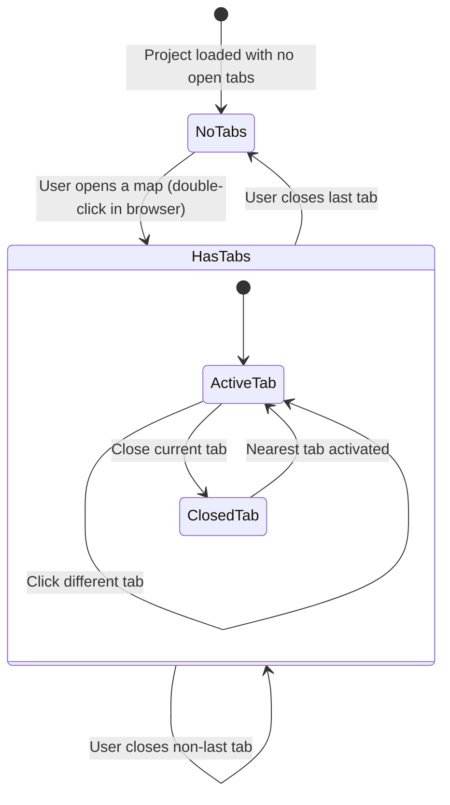

# Design Document: Multi-Map Multi-Tileset

## Overview

This design transforms the RPG Toolkit editor from a single-map, single-tileset model into a project that owns collections of maps and tilesets. The canvas remains focused on one map at a time (the Active Map), while a Map Tab Bar and Map Browser let the user switch between scenes. The Tile Palette gains a Tileset Tab Bar so the user can pick tiles from any loaded sprite sheet. Each placed tile becomes a `TileRef` that carries the originating `TilesetId`, making cross-tileset painting unambiguous. Undo/redo history is scoped per-map. No backward compatibility with the previous single-map format is required.

The key architectural change is replacing the singleton `Res<MapData>` and `Res<TilesetData>` Bevy resources with a `Res<Project>` resource that holds `HashMap`-based registries of maps and tilesets, plus an `ActiveMapId` resource that selects which map the canvas renders and edits.

## Architecture

### Current Architecture

```
┌──────────────┐     ┌────────────────┐
│ Res<MapData> │     │Res<TilesetData>│
│  (singleton) │     │  (singleton)   │
└──────┬───────┘     └──────┬─────────┘
       │                    │
       ▼                    ▼
  ┌─────────┐          ┌──────────┐
  │ Canvas  │◄────────►│ Palette  │
  │ Render  │          │   UI     │
  └─────────┘          └──────────┘
       ▲
       │
  ┌─────────┐
  │ Painting│──► EditCommand ──► UndoHistory (global)
  └─────────┘
```

### Target Architecture

```
┌─────────────────────────────────────────────┐
│                Res<Project>                 │
│  maps: HashMap<MapId, MapData>              │
│  tilesets: HashMap<TilesetId, TilesetEntry> │
│  open_tabs: Vec<MapId>                      │
│  active_tab: Option<usize>                  │
│  undo_histories: HashMap<MapId, UndoHistory>│
└──────────────────┬──────────────────────────┘
                   │
        ┌──────────┼──────────┐
        ▼          ▼          ▼
  ┌──────────┐ ┌────────┐ ┌──────────┐
  │Map Tab   │ │Map     │ │Tileset   │
  │Bar UI    │ │Browser │ │Tab Bar   │
  └──────────┘ │Panel   │ │in Palette│
               └────────┘ └──────────┘
        │          │          │
        ▼          ▼          ▼
  ┌──────────────────────────────────┐
  │         Active Map View          │
  │  Canvas + Grid + Tile Sprites    │
  └──────────────────────────────────┘
        ▲
        │
  ┌──────────┐
  │ Painting │──► EditCommand ──► per-map UndoHistory
  └──────────┘
```

### Design Decisions

1. **Single `Project` resource vs. multiple singleton resources**: Consolidating into one `Res<Project>` avoids the need for multiple `Option<Res<...>>` queries and makes it straightforward to iterate over all maps/tilesets. The trade-off is that any system touching the project needs `ResMut<Project>`, but since most writes are already serialized through UI events this is acceptable.

2. **`HashMap` keyed by ID strings**: Using `HashMap<MapId, MapData>` and `HashMap<TilesetId, TilesetEntry>` gives O(1) lookup by ID. IDs are UUID v4 strings generated at creation time, ensuring uniqueness without a central counter.

3. **Tab state lives inside `Project`**: `open_tabs: Vec<MapId>` and `active_tab: Option<usize>` are stored in `Project` so they serialize naturally and survive save/load cycles. The active map index into `open_tabs` determines which `MapId` the canvas renders.

4. **Per-map undo history inside `Project`**: `undo_histories: HashMap<MapId, UndoHistory>` keeps each map's history isolated. When the active map changes, the undo/redo plugin simply indexes into the correct history.

5. **`TileRef` replaces `TileIndex`**: Every placed tile cell becomes `Option<TileRef>` where `TileRef { tileset_id, col, row }`. This is the minimal change needed to support cross-tileset painting.

6. **Clean-break serialization**: The on-disk format is the new multi-map format. No backward compatibility with the previous single-map format is maintained.

## Components and Interfaces

### New / Modified Types

```
┌─────────────────────────────────────────────────────────┐
│ Project (Resource)                                      │
├─────────────────────────────────────────────────────────┤
│ + maps: HashMap<MapId, MapData>                         │
│ + tilesets: HashMap<TilesetId, TilesetEntry>            │
│ + open_tabs: Vec<MapId>                                 │
│ + active_tab: Option<usize>                             │
│ + undo_histories: HashMap<MapId, UndoHistory>           │
│ + next_map_name_counter: u32                            │
├─────────────────────────────────────────────────────────┤
│ + active_map_id() -> Option<&MapId>                     │
│ + active_map() -> Option<&MapData>                      │
│ + active_map_mut() -> Option<&mut MapData>              │
│ + active_undo_history_mut() -> Option<&mut UndoHistory> │
│ + add_map(name, w, h) -> Result<MapId, EditorError>     │
│ + remove_map(id) -> Result<(), EditorError>             │
│ + add_tileset(meta, texture, layout) -> TilesetId       │
│ + remove_tileset(id) -> Result<(), EditorError>         │
│ + open_map_tab(id)                                      │
│ + close_map_tab(idx)                                    │
│ + set_active_tab(idx)                                   │
└─────────────────────────────────────────────────────────┘

┌──────────────────────────────────┐
│ TilesetEntry                     │
├──────────────────────────────────┤
│ + meta: TilesetMeta              │
│ + texture: Handle<Image>         │
│ + atlas_layout: Handle<...>      │
└──────────────────────────────────┘

┌──────────────────────────────────┐
│ TileRef (replaces TileIndex)     │
├──────────────────────────────────┤
│ + tileset_id: TilesetId          │
│ + col: u32                       │
│ + row: u32                       │
└──────────────────────────────────┘
```

### ID Types

```rust
pub type MapId = String;      // UUID v4
pub type TilesetId = String;  // UUID v4
```

### Plugin Changes

| Plugin | Change |
|---|---|
| `AppShellPlugin` | "New Map" adds to `Project.maps` instead of replacing `Res<MapData>`. "Load Tileset" adds to `Project.tilesets`. Menu gains "Delete Map" awareness. |
| `CanvasPlugin` | Reads `Project.active_map()` instead of `Res<MapData>`. Grid and zoom-to-fit use the active map's `tile_width`/`tile_height` and grid dimensions. |
| `TilePalettePlugin` | Renders a `Tileset_Tab_Bar` iterating `Project.tilesets`. Selecting a tile sets `EditorState.active_brush` to a `TileRef`. |
| `PaintingPlugin` | Writes `TileRef` (with `tileset_id`) into the active map's layer grid. Validates that the selected tileset's tile size matches the active map's `tile_width`/`tile_height` before placing. |
| `LayerPanelPlugin` | Reads layers from `Project.active_map()` instead of `Res<MapData>`. |
| `UndoRedoPlugin` | Indexes into `Project.undo_histories` by active map ID. |
| `SerializationPlugin` | Serializes/deserializes the full `Project`. |

### New UI Components

| Component | Location | Description |
|---|---|---|
| `MapTabBar` | Top of canvas area, below menu bar | Horizontal tabs for open maps. Click to switch, middle-click or × to close. Modified indicator (●) for unsaved maps. |
| `MapBrowserPanel` | Left panel (above or replacing layer panel section) | Lists all maps in the project. Double-click to open. Right-click context menu: Open, Rename, Delete. |
| `TilesetTabBar` | Top of Tile Palette panel | Tabs for each tileset. Click to switch the displayed tile grid. |

## Data Models

### `TileRef`

Replaces `TileIndex`. Stored in each cell of a layer's tile grid.

```rust
#[derive(Clone, Copy, Debug, PartialEq, Eq, Hash, Serialize, Deserialize)]
pub struct TileRef {
    pub tileset_id: TilesetId,
    pub col: u32,
    pub row: u32,
}
```

### `Layer` (modified)

```rust
#[derive(Clone, Debug, Serialize, Deserialize, PartialEq)]
pub struct Layer {
    pub name: String,
    pub visible: bool,
    /// Row-major grid: tiles[y][x]. Now stores TileRef instead of TileIndex.
    pub tiles: Vec<Vec<Option<TileRef>>>,
}
```

### `MapData` (modified)

```rust
#[derive(Clone, Debug, Serialize, Deserialize, PartialEq)]
pub struct MapData {
    pub name: String,
    pub width: u32,        // grid columns, 1..=256
    pub height: u32,       // grid rows, 1..=256
    pub tile_width: u32,   // pixels per tile, e.g. 16, 32
    pub tile_height: u32,  // pixels per tile, e.g. 16, 32
    pub layers: Vec<Layer>,
    pub active_layer_index: usize,
}
```

`MapData` is no longer a Bevy `Resource`. It lives inside `Project.maps`. The `tile_width` and `tile_height` fields are the authoritative tile dimensions for the map — the canvas uses these for grid spacing and sprite placement. Tilesets must have matching tile sizes to be used for painting on a given map.

### `TilesetEntry`

Runtime tileset data. The `meta` portion serializes; `texture` and `atlas_layout` are runtime handles reconstructed on load.

```rust
pub struct TilesetEntry {
    pub meta: TilesetMeta,
    pub texture: Handle<Image>,
    pub atlas_layout: Handle<TextureAtlasLayout>,
}
```

### `Project` (new, replaces `ProjectFile` + singleton resources)

```rust
#[derive(Resource)]
pub struct Project {
    pub maps: HashMap<MapId, MapData>,
    pub tilesets: HashMap<TilesetId, TilesetEntry>,
    pub open_tabs: Vec<MapId>,
    pub active_tab: Option<usize>,
    pub undo_histories: HashMap<MapId, UndoHistory>,
    pub has_unsaved_changes: HashMap<MapId, bool>,
}
```

### `ProjectFile` (serialization envelope)

```rust
#[derive(Serialize, Deserialize)]
pub struct ProjectFile {
    pub maps: HashMap<MapId, MapData>,
    pub tilesets: HashMap<TilesetId, TilesetMeta>,
}
```

Runtime handles (`texture`, `atlas_layout`) are not serialized. On load, the deserializer reconstructs `TilesetEntry` from `TilesetMeta` by re-loading images through the Bevy asset server.

### `EditCommand` (modified)

`EditCommandKind::PlaceTile` and `EraseTile` change from `TileIndex` to `TileRef`. `AddLayer`/`DeleteLayer` remain the same but `Layer` now uses `TileRef` internally.

```rust
pub enum EditCommandKind {
    PlaceTile {
        layer_index: usize,
        x: u32,
        y: u32,
        old_tile: Option<TileRef>,
        new_tile: TileRef,
    },
    EraseTile {
        layer_index: usize,
        x: u32,
        y: u32,
        old_tile: Option<TileRef>,
    },
    AddLayer { layer_index: usize, name: String },
    DeleteLayer { layer_index: usize, layer_data: Layer },
}
```

### `EditorState` (modified)

```rust
#[derive(Resource)]
pub struct EditorState {
    pub active_brush: Option<TileRef>,  // was Option<TileIndex>
    pub active_tileset_tab: Option<TilesetId>,  // runtime-only, not persisted
    pub zoom_level: f32,
    pub camera_offset: Vec2,
    pub current_save_path: Option<PathBuf>,
}
```

`has_unsaved_changes` moves to `Project.has_unsaved_changes` (per-map). The global `EditorState` retains camera/zoom state and the active brush. `active_tileset_tab` tracks which tileset tab is selected at runtime — unlike map tabs, all tilesets are always visible as tabs so there is no open/close lifecycle, and this state does not need to be persisted to disk.

### State Diagram: Map Tab Lifecycle



## Correctness Properties

*A property is a characteristic or behavior that should hold true across all valid executions of a system — essentially, a formal statement about what the system should do. Properties serve as the bridge between human-readable specifications and machine-verifiable correctness guarantees.*

### Property 1: Adding a map grows the registry and preserves existing maps

*For any* valid Project and any valid map name/width/height, calling `add_map` should increase `maps.len()` by 1, the returned `MapId` should be present in `maps`, and all previously existing maps should remain unchanged.

**Validates: Requirements 1.1, 1.2, 11.1**

### Property 2: Removing a map shrinks the registry

*For any* Project with at least 2 maps and any `MapId` present in the project, calling `remove_map` should decrease `maps.len()` by 1 and the removed ID should no longer be present in `maps`.

**Validates: Requirements 1.3**

### Property 3: Adding a tileset grows the registry and preserves existing tilesets

*For any* valid Project and any valid `TilesetMeta`, calling `add_tileset` should increase `tilesets.len()` by 1, the returned `TilesetId` should be present in `tilesets`, and all previously existing tilesets should remain unchanged.

**Validates: Requirements 3.1, 3.2**

### Property 4: Removing a tileset shrinks the registry

*For any* Project with at least 1 tileset and any `TilesetId` present in the project, calling `remove_tileset` should decrease `tilesets.len()` by 1 and the removed ID should no longer be present in `tilesets`.

**Validates: Requirements 3.3**

### Property 5: Tileset-in-use detection

*For any* Project where at least one map contains a `TileRef` referencing a given `TilesetId`, the tileset-in-use check should return true for that ID. Conversely, for any `TilesetId` not referenced by any tile in any map, the check should return false.

**Validates: Requirements 3.4**

### Property 6: Tileset compatibility validation

*For any* map with `tile_width` W and `tile_height` H, and any tileset with `tile_width` != W or `tile_height` != H, attempting to place a tile from that tileset should fail validation and not modify the map.

**Validates: Requirements 2.2**

### Property 7: Placing a tile stores the correct TileRef

*For any* valid map, layer index, tile position (x, y), and active brush `TileRef`, calling `place_tile` should store a `TileRef` at `layers[layer_index].tiles[y][x]` whose `tileset_id`, `col`, and `row` match the brush.

**Validates: Requirements 4.1, 4.2, 7.3**

### Property 8: TileRefs with missing tileset IDs produce no sprites

*For any* map containing `TileRef` values whose `tileset_id` does not exist in the project's tileset registry, the render resolution function should exclude those tiles from the sprite output.

**Validates: Requirements 4.3**

### Property 9: Setting the active tab selects the correct map

*For any* Project with `open_tabs` of length N > 0 and any valid index `i` in `0..N`, calling `set_active_tab(i)` should make `active_map_id()` return `open_tabs[i]`.

**Validates: Requirements 5.2**

### Property 10: Opening a map adds a tab and activates it

*For any* Project and any `MapId` present in `maps` but not in `open_tabs`, calling `open_map_tab(id)` should add the ID to `open_tabs`, increase `open_tabs.len()` by 1, and set `active_map_id()` to that ID. If the ID is already in `open_tabs`, it should just activate it without adding a duplicate.

**Validates: Requirements 5.3, 6.2, 11.2**

### Property 11: Closing a tab removes it

*For any* Project with at least 1 open tab and any valid tab index, calling `close_map_tab(idx)` should decrease `open_tabs.len()` by 1 and the map ID that was at that index should no longer be at that position.

**Validates: Requirements 5.4**

### Property 12: Closing the active tab activates the nearest remaining tab

*For any* Project with at least 2 open tabs where the active tab is at index `i`, closing tab `i` should result in `active_tab` pointing to a valid index (clamped to the new bounds), or `None` if no tabs remain.

**Validates: Requirements 5.5**

### Property 13: Renaming a map updates its name

*For any* Project and any `MapId` present in `maps`, and any non-empty new name string, renaming the map should result in `maps[id].name` equaling the new name, with all other map fields unchanged.

**Validates: Requirements 6.4**

### Property 14: Only the active map's tiles are included in render output

*For any* Project with multiple maps, the set of `TileRef` values resolved for rendering should be exactly the set of non-None tiles from the active map's visible layers, and should contain no tiles from any other map.

**Validates: Requirements 8.1, 8.2**

### Property 15: TileRef atlas index resolution

*For any* `TileRef` with a valid `tileset_id` whose tileset has `columns` columns, the computed atlas index should equal `row * columns + col`.

**Validates: Requirements 8.3**

### Property 16: Per-map undo isolation

*For any* Project with at least 2 maps, performing an edit on map A, switching to map B, and performing an undo should not modify map A's data or undo history. Map A's undo history should still contain the edit command.

**Validates: Requirements 9.1, 9.2, 9.3**

### Property 17: Serialization round-trip

*For any* valid `ProjectFile` value, serializing to JSON and then deserializing should produce an equivalent `ProjectFile` value (maps and tilesets match by ID and content).

**Validates: Requirements 10.1, 10.2, 10.3**

### Property 18: Invalid JSON returns a descriptive error

*For any* string that is not valid JSON or does not conform to the project schema, the deserializer should return an `Err` variant and never panic.

**Validates: Requirements 10.4**

## Error Handling

| Scenario | Handling |
|---|---|
| Delete last map | `remove_map` returns `Err(EditorError::ProjectValidationError)`. UI shows error dialog. |
| Remove tileset in use | UI shows confirmation dialog with warning. If confirmed, tiles referencing the removed tileset become orphaned `TileRef`s (rendered as empty per Property 7). |
| Invalid map dimensions in New Map dialog | `MapData::new` returns `Err(EditorError::InvalidDimensions)`. UI shows error dialog. |
| Tileset tile size mismatch | Painting plugin checks tileset `tile_width`/`tile_height` against active map's. If mismatched, the paint operation is rejected and a warning is displayed. |
| TileRef references missing tileset | Render system skips the tile, logs `warn!`. No crash. |
| Corrupt/invalid JSON on Open | `ProjectFile::deserialize` returns `Err(EditorError::ProjectParseError)`. UI shows error dialog. Current project state is untouched. |
| Tileset image file missing on load | Bevy asset server returns a placeholder/error texture. `TilesetMeta` is still stored so re-saving preserves the path for later recovery. |
| Close active tab with no other tabs | `active_tab` becomes `None`. Canvas shows empty state ("No map open"). |
| Undo on empty history | `UndoHistory::undo` returns `false`. No-op. |

## Testing Strategy

### Property-Based Testing

The project already includes `proptest = "1"` in dev-dependencies. All correctness properties (1–18) will be implemented as `proptest` tests.

Configuration:
- Minimum 100 iterations per property test (via `proptest! { #![proptest_config(ProptestConfig::with_cases(100))] ... }`)
- Each test tagged with a comment: `// Feature: multi-map-multi-tileset, Property N: <title>`
- Each correctness property maps to exactly one `proptest` test function

Generators needed:
- `arb_map_data()`: generates `MapData` with random name, valid dimensions (1..=32 for speed), 1–4 layers, and random `Option<TileRef>` cells
- `arb_tileset_meta()`: generates `TilesetMeta` with valid tile sizes from `{8, 16, 32, 64}`, random columns/rows (1..=16), and a placeholder file path
- `arb_project_file()`: generates `ProjectFile` with 1–5 maps and 1–3 tilesets, ensuring `TileRef`s reference valid tileset IDs
- `arb_tile_ref(tileset_ids)`: generates a `TileRef` with a tileset ID chosen from the provided set

### Unit Testing

Unit tests complement property tests for specific examples and edge cases:
- Deleting the last map returns an error (edge case from 1.4)
- Closing the only open tab results in `active_tab = None`
- Rename with empty string is rejected
- `TilesetMeta::from_image_dimensions` with invalid tile sizes returns error

### Test Organization

```
tests/
  properties/
    project_properties.rs    -- Properties 1-5 (map/tileset registry)
    tile_ref_properties.rs   -- Properties 6-8 (tileset compat, TileRef storage/rendering)
    tab_properties.rs        -- Properties 9-13 (tab bar/browser)
    render_properties.rs     -- Properties 14-15 (canvas rendering)
    undo_properties.rs       -- Property 16 (per-map undo)
    serialization_properties.rs -- Properties 17-18 (round-trip, errors)
  unit/
    project_unit.rs
    serialization_unit.rs
```
