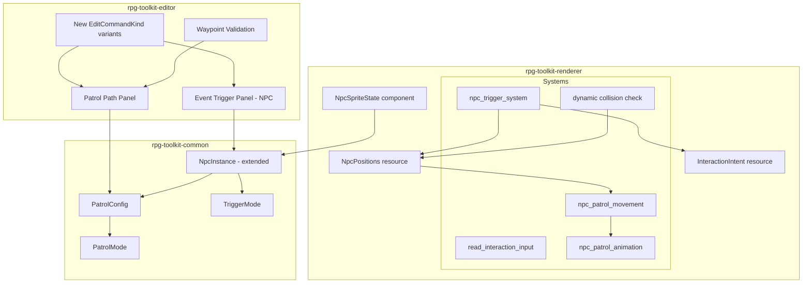
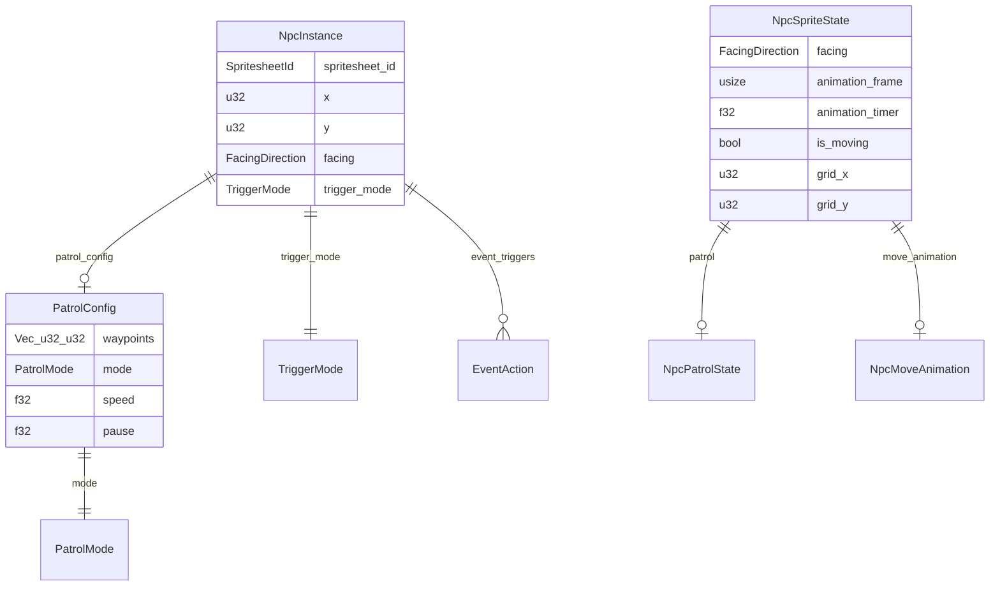

# Design Document: NPC Behaviors

## Overview

This feature activates the NPC behavior systems that were deferred in the character-spritesheets specification (Requirement 9). The existing `NpcInstance` data model already has forward-compatible `event_triggers: Vec<EventAction>` and `patrol_path: Vec<(u32, u32)>` fields, but neither is read at runtime. This design covers three pillars:

1. **Patrol movement** — NPCs walk waypoint paths with configurable mode (Loop/PingPong/OneShot), speed, and pause duration, using the same walk animation system as the player.
2. **Event triggers** — NPCs fire `EventAction` sequences (ShowDialog, JumpTo) into the existing `ActionQueue` when the player collides with or interacts with them via a new action key.
3. **Editor tooling** — The NPC placement dialog is extended with patrol path configuration (visual waypoint placement, mode/speed/pause controls) and event trigger configuration (reusing the existing `EventTriggerDialog` UI pattern).

Key design decisions:

1. **Replace `patrol_path: Vec<(u32, u32)>` with `patrol_config: Option<PatrolConfig>`**. The flat waypoint list cannot express mode, speed, or pause. The new struct wraps waypoints alongside behavior parameters. `#[serde(default)]` ensures backward compatibility — old project files deserialize with `patrol_config: None`.
2. **Dynamic NPC collision via an ECS resource, not static map data**. The current `is_tile_blocked` reads NPC positions from `MapData::npcs`, which are static. Moving NPCs need a runtime `NpcPositions` resource that tracks current grid positions and is updated each frame. The collision function gains a new parameter.
3. **Per-NPC `NpcSpriteState` component** (analogous to `PlayerSpriteState`). Each NPC entity gets its own facing direction, animation timer, and movement state so NPCs animate independently.
4. **Interaction input as a new system** inserted into the existing system chain. The action key (Space/Enter) is read in a dedicated `read_interaction_input` system that writes to an `InteractionIntent` resource, checked by the trigger system.
5. **Editor patrol path editing uses click-to-append workflow** with undo/redo via new `EditCommandKind` variants. Waypoints are validated against map bounds on addition.

## Architecture



### System Ordering

The new systems integrate into the existing renderer update chain:

```
read_input
read_interaction_input          ← NEW: reads Space/Enter
player_movement                 ← MODIFIED: uses dynamic NPC collision
npc_patrol_movement             ← NEW: advances NPC patrol state
animate_player
animate_player_sprite
npc_patrol_animation            ← NEW: updates NPC sprite atlas indices
check_triggers                  ← EXISTING: tile-based triggers
npc_trigger_system              ← NEW: NPC collision + interaction triggers
advance_action_queue
handle_map_change
sync_map_sprites
spawn_npc_sprites               ← MODIFIED: spawns NpcSpriteState components
```

## Components and Interfaces

### rpg-toolkit-common — New Types

| Type | Purpose |
|------|---------|
| `PatrolMode` | Enum: `Loop`, `PingPong`, `OneShot` |
| `PatrolConfig` | Struct: `waypoints`, `mode`, `speed`, `pause` |
| `TriggerMode` | Enum: `Collision`, `Interaction` (default: `Interaction`) |

### rpg-toolkit-common — Modified Types

| Type | Change |
|------|--------|
| `NpcInstance` | Replace `patrol_path: Vec<(u32, u32)>` with `patrol_config: Option<PatrolConfig>`. Add `trigger_mode: TriggerMode` with `#[serde(default)]`. Keep `event_triggers` as-is. |

### rpg-toolkit-renderer — New Components & Resources

| Type | Kind | Purpose |
|------|------|---------|
| `NpcSpriteState` | Component | Per-NPC animation state: facing, frame, timer, movement progress, patrol state |
| `NpcPositions` | Resource | Runtime grid positions for all NPCs on the active map, indexed by npc_index |
| `InteractionIntent` | Resource | Signals that the player pressed the action key this frame |
| `NpcMoveAnimation` | Struct (field of NpcSpriteState) | Tracks in-progress tile-to-tile interpolation for one NPC |

### rpg-toolkit-renderer — New Systems

| System | Purpose |
|--------|---------|
| `read_interaction_input` | Reads Space/Enter, writes `InteractionIntent` |
| `npc_patrol_movement` | Advances patrol state machines, initiates tile moves, updates `NpcPositions` |
| `npc_patrol_animation` | Updates `NpcSpriteState` animation timers and sprite atlas indices |
| `npc_trigger_system` | Checks collision and interaction triggers, fires into `ActionQueue` |
| `init_npc_positions` | On `MapChanged`, rebuilds `NpcPositions` from map data |

### rpg-toolkit-renderer — Modified Systems

| System | Change |
|--------|--------|
| `player_movement` | Use `NpcPositions` resource for NPC collision instead of static `map.npcs` |
| `spawn_npc_sprites` | Attach `NpcSpriteState` component to each NPC entity |
| `is_tile_blocked` | Add `npc_positions: Option<&NpcPositions>` parameter for dynamic check |

### rpg-toolkit-editor — New Components

| Type | Purpose |
|------|---------|
| `NpcConfigDialog` | Extended NPC dialog resource with patrol path and event trigger panels |
| `EditCommandKind::UpdateNpcPatrol` | Undo/redo for patrol config changes |
| `EditCommandKind::UpdateNpcTriggers` | Undo/redo for event trigger + trigger mode changes |

### Key Interfaces

**Patrol next waypoint calculation:**
```rust
fn next_waypoint_index(current: usize, waypoint_count: usize, mode: PatrolMode, forward: bool) -> (usize, bool) {
    match mode {
        PatrolMode::Loop => ((current + 1) % waypoint_count, true),
        PatrolMode::PingPong => {
            if forward {
                if current + 1 < waypoint_count { (current + 1, true) }
                else { (current.saturating_sub(1), false) }
            } else {
                if current > 0 { (current - 1, false) }
                else { (1.min(waypoint_count - 1), true) }
            }
        }
        PatrolMode::OneShot => {
            if current + 1 < waypoint_count { (current + 1, true) }
            else { (current, true) } // stay at last
        }
    }
}
```

**Dynamic collision check (extended):**
```rust
fn is_tile_blocked(map: &MapData, x: u32, y: u32, npc_positions: Option<&NpcPositions>) -> bool {
    let opacity_blocked = map.layers.iter().any(|layer| /* existing */);
    let npc_blocked = match npc_positions {
        Some(positions) => positions.is_occupied(x, y),
        None => map.npcs.iter().any(|npc| npc.x == x && npc.y == y), // fallback
    };
    opacity_blocked || npc_blocked
}
```

**Interaction check:**
```rust
fn faced_tile(player_x: u32, player_y: u32, facing: FacingDirection) -> Option<(u32, u32)> {
    match facing {
        FacingDirection::Up => player_y.checked_sub(1).map(|y| (player_x, y)),
        FacingDirection::Down => Some((player_x, player_y + 1)),
        FacingDirection::Left => player_x.checked_sub(1).map(|x| (x, player_y)),
        FacingDirection::Right => Some((player_x + 1, player_y)),
    }
}
```

## Data Models

### PatrolMode

```rust
#[derive(Clone, Copy, Debug, Default, PartialEq, Eq, Serialize, Deserialize)]
pub enum PatrolMode {
    #[default]
    Loop,
    PingPong,
    OneShot,
}
```

### PatrolConfig

```rust
#[derive(Clone, Debug, PartialEq, Serialize, Deserialize)]
pub struct PatrolConfig {
    /// Ordered waypoint grid positions.
    pub waypoints: Vec<(u32, u32)>,
    /// Behavior at path endpoints.
    #[serde(default)]
    pub mode: PatrolMode,
    /// Seconds per tile movement (default 0.3).
    #[serde(default = "default_patrol_speed")]
    pub speed: f32,
    /// Seconds to pause at each waypoint (default 0.5).
    #[serde(default = "default_patrol_pause")]
    pub pause: f32,
}

fn default_patrol_speed() -> f32 { 0.3 }
fn default_patrol_pause() -> f32 { 0.5 }
```

### TriggerMode

```rust
#[derive(Clone, Copy, Debug, Default, PartialEq, Eq, Serialize, Deserialize)]
pub enum TriggerMode {
    Collision,
    #[default]
    Interaction,
}
```

### NpcInstance (modified)

```rust
#[derive(Clone, Debug, PartialEq, Serialize, Deserialize)]
pub struct NpcInstance {
    pub spritesheet_id: SpritesheetId,
    pub x: u32,
    pub y: u32,
    pub facing: FacingDirection,
    #[serde(default)]
    pub event_triggers: Vec<EventAction>,
    /// Replaces the old `patrol_path: Vec<(u32, u32)>` field.
    #[serde(default)]
    pub patrol_config: Option<PatrolConfig>,
    #[serde(default)]
    pub trigger_mode: TriggerMode,
}
```

**Migration note:** The old `patrol_path` field is removed. Since it was `#[serde(default)]` and never written by any existing code path, no migration is needed — old project files simply won't have the field, and `patrol_config` defaults to `None`.

### NpcSpriteState (new renderer component)

```rust
#[derive(Component)]
pub struct NpcSpriteState {
    pub facing: FacingDirection,
    pub animation_frame: usize,
    pub animation_timer: f32,
    pub is_moving: bool,
    /// Current grid position (updated as NPC moves).
    pub grid_x: u32,
    pub grid_y: u32,
    /// In-progress movement animation, if any.
    pub move_animation: Option<NpcMoveAnimation>,
    /// Patrol state machine.
    pub patrol: Option<NpcPatrolState>,
    /// Y offset for sprite alignment (same concept as PlayerSpriteState).
    pub y_offset: f32,
}

pub struct NpcMoveAnimation {
    pub from: Vec2,
    pub to: Vec2,
    pub from_grid: (u32, u32),
    pub to_grid: (u32, u32),
    pub elapsed: f32,
    pub duration: f32,
}

pub struct NpcPatrolState {
    pub current_waypoint_index: usize,
    pub forward: bool,  // direction of traversal (for PingPong)
    pub pause_timer: f32,
    pub paused: bool,
    pub finished: bool, // true when OneShot reaches the end
}
```

### NpcPositions (new renderer resource)

```rust
#[derive(Resource, Default)]
pub struct NpcPositions {
    /// Maps npc_index → current grid position.
    pub positions: Vec<(u32, u32)>,
}

impl NpcPositions {
    pub fn is_occupied(&self, x: u32, y: u32) -> bool {
        self.positions.iter().any(|&(px, py)| px == x && py == y)
    }

    pub fn is_occupied_by_other(&self, x: u32, y: u32, exclude_index: usize) -> bool {
        self.positions.iter().enumerate()
            .any(|(i, &(px, py))| i != exclude_index && px == x && py == y)
    }
}
```

### InteractionIntent (new renderer resource)

```rust
#[derive(Resource, Default)]
pub struct InteractionIntent {
    pub pressed: bool,
}
```

### Editor — New EditCommandKind Variants

```rust
pub enum EditCommandKind {
    // ... existing variants ...
    UpdateNpcPatrol {
        npc_index: usize,
        old_config: Option<PatrolConfig>,
        new_config: Option<PatrolConfig>,
    },
    UpdateNpcTriggers {
        npc_index: usize,
        old_trigger_mode: TriggerMode,
        new_trigger_mode: TriggerMode,
        old_event_triggers: Vec<EventAction>,
        new_event_triggers: Vec<EventAction>,
    },
}
```

### Data Model Relationships



## Correctness Properties

*A property is a characteristic or behavior that should hold true across all valid executions of a system — essentially, a formal statement about what the system should do. Properties serve as the bridge between human-readable specifications and machine-verifiable correctness guarantees.*

### Property 1: NpcInstance serialization round-trip

*For any* valid `NpcInstance` containing a `PatrolConfig` (with random waypoints, mode, speed, pause), a `TriggerMode`, and a list of `event_triggers`, serializing to JSON and deserializing the result SHALL produce an equivalent `NpcInstance`.

**Validates: Requirements 1.3, 6.2**

### Property 2: Backward-compatible deserialization

*For any* valid `NpcInstance` JSON that omits the `patrol_config`, `trigger_mode`, and `event_triggers` fields, deserialization SHALL succeed and produce an `NpcInstance` with `patrol_config: None`, `trigger_mode: Interaction`, and `event_triggers: []`. Re-serializing and deserializing again SHALL be stable.

**Validates: Requirements 1.4, 6.3**

### Property 3: Patrol mode next waypoint calculation

*For any* waypoint count ≥ 2 and *for any* current waypoint index within bounds:
- In **Loop** mode going forward, the next index after the last waypoint SHALL be 0 (wrap around), and for non-last waypoints SHALL be `current + 1`.
- In **PingPong** mode going forward, the next index after the last waypoint SHALL be `count - 2` with direction reversed, and going backward at index 0 SHALL be 1 with direction reversed.
- In **OneShot** mode, the next index after the last waypoint SHALL remain at the last index with `finished = true`, and for non-last waypoints SHALL be `current + 1`.

**Validates: Requirements 2.4, 2.5, 2.6**

### Property 4: Empty or absent patrol config produces no movement

*For any* `NpcInstance` where `patrol_config` is `None` or where `patrol_config.waypoints` is empty, the patrol movement system SHALL produce no movement intent and the NPC SHALL remain at its initial grid position.

**Validates: Requirements 1.2**

### Property 5: NPC grid position updates to destination at move start

*For any* NPC moving from tile A to tile B, the `NpcPositions` resource SHALL reflect position B (not A) for that NPC from the moment the move begins. Tile B SHALL be reported as occupied and tile A SHALL NOT be reported as occupied by that NPC.

**Validates: Requirements 2.7, 4.2**

### Property 6: NPC patrol pauses when next tile is blocked

*For any* NPC whose next patrol waypoint step would land on a tile that is blocked (by opacity attributes, another NPC, or the player), the patrol system SHALL not initiate movement and SHALL keep the NPC at its current position until the tile becomes unblocked.

**Validates: Requirements 4.3, 4.4**

### Property 7: Collision trigger fires event_triggers into ActionQueue

*For any* NPC with `trigger_mode: Collision` and a non-empty `event_triggers` list, when the player attempts to move onto the NPC's tile, the system SHALL populate the `ActionQueue` with the NPC's `event_triggers` in order, instead of silently blocking the move.

**Validates: Requirements 5.2**

### Property 8: Interaction trigger fires event_triggers into ActionQueue

*For any* NPC with `trigger_mode: Interaction` and a non-empty `event_triggers` list, when the player presses the action key while facing the NPC's tile, the system SHALL populate the `ActionQueue` with the NPC's `event_triggers` in order.

**Validates: Requirements 5.3**

### Property 9: Empty event_triggers blocks regardless of TriggerMode

*For any* NPC with an empty `event_triggers` list, regardless of whether `trigger_mode` is `Collision` or `Interaction`, the NPC SHALL block the player's movement onto its tile without firing any triggers.

**Validates: Requirements 5.4**

### Property 10: Active ActionQueue suppresses new NPC triggers

*For any* NPC trigger event (collision or interaction) that occurs while an `ActionQueue` resource already exists, the system SHALL ignore the new trigger and leave the existing `ActionQueue` unchanged.

**Validates: Requirements 5.5**

### Property 11: NPC faces player on interaction trigger

*For any* player position adjacent to an NPC, when an interaction trigger fires, the NPC's `FacingDirection` SHALL be updated to face toward the player's tile before the `event_triggers` are executed. Specifically: if the player is above the NPC, the NPC faces Up; below → Down; left → Left; right → Right.

**Validates: Requirements 5.6**

### Property 12: Faced tile calculation

*For any* player grid position `(x, y)` within map bounds and *for any* `FacingDirection`, the `faced_tile` function SHALL return the adjacent tile in that direction: Up → `(x, y-1)`, Down → `(x, y+1)`, Left → `(x-1, y)`, Right → `(x+1, y)`. For boundary positions where the adjacent tile would be out of bounds (e.g., y=0 facing Up), the function SHALL return `None`.

**Validates: Requirements 9.2**

### Property 13: Waypoint bounds validation

*For any* map with dimensions `(width, height)` and *for any* waypoint position `(wx, wy)`, the validation function SHALL accept the waypoint if and only if `wx < width` and `wy < height`. All other positions SHALL be rejected.

**Validates: Requirements 10.1, 10.2**

### Property 14: NPC facing matches movement direction

*For any* NPC that begins moving toward an adjacent tile, the NPC's `FacingDirection` SHALL be updated to match the movement direction before the walk animation starts: moving up → `Up`, down → `Down`, left → `Left`, right → `Right`.

**Validates: Requirements 3.2**

### Property 15: Waypoint pause timing

*For any* positive `pause` duration in a `PatrolConfig`, after an NPC arrives at a waypoint, the NPC SHALL remain stationary for at least `pause` seconds before initiating movement toward the next waypoint. For any elapsed time less than `pause`, the NPC SHALL not move.

**Validates: Requirements 2.3**

## Error Handling

| Scenario | Behavior | Crate |
|----------|----------|-------|
| NPC has `patrol_config: None` or empty waypoints | Treat as stationary; no error | renderer |
| NPC patrol waypoint is out of map bounds at runtime | Skip waypoint, log warning, advance to next | renderer |
| NPC patrol path would move onto blocked tile | Pause patrol until tile is unblocked; no error | renderer |
| NPC patrol path would move onto player's tile | Pause patrol until player moves; no error | renderer |
| NPC references non-existent spritesheet | Existing behavior: log warning, skip NPC sprite spawn | renderer |
| Editor: waypoint placed outside map bounds | Reject with descriptive error message in UI | editor |
| Editor: NPC patrol config with 0 or 1 waypoints | Allow (0 = stationary, 1 = NPC walks to that point then idles) | editor |
| Player presses action key with no adjacent NPC | No-op; no error | renderer |
| Player presses action key during active dialog/ActionQueue | Ignored; no error | renderer |
| Collision trigger on NPC with empty event_triggers | Fall back to default block behavior | renderer |
| Old project file missing `patrol_config` and `trigger_mode` fields | `serde(default)` provides `None` and `Interaction`; no error | common |
| NPC movement speed ≤ 0 | Clamp to minimum (0.01s) to prevent division by zero | renderer |
| NPC pause duration < 0 | Clamp to 0 (no pause) | renderer |

## Testing Strategy

### Unit Tests

Unit tests cover specific examples, edge cases, and integration points:

- **PatrolConfig defaults**: Verify default speed (0.3) and pause (0.5) values.
- **TriggerMode default**: Verify default is `Interaction`.
- **PatrolMode variants**: Test each mode with a 3-waypoint path at boundary indices.
- **NpcPositions resource**: Test `is_occupied` and `is_occupied_by_other` with specific positions.
- **InteractionIntent**: Verify Space and Enter both set `pressed = true`.
- **NPC sprite spawn**: Verify `NpcSpriteState` is attached with correct initial values (idle frame 1, facing from NpcInstance).
- **Editor waypoint append**: Verify clicking a tile appends coordinates to waypoints list.
- **Editor waypoint remove**: Verify removing by index updates the list correctly.
- **Editor undo/redo for patrol**: Verify `UpdateNpcPatrol` command apply/apply_inverse cycle.
- **Editor undo/redo for triggers**: Verify `UpdateNpcTriggers` command apply/apply_inverse cycle.
- **NPC trigger with NPC facing player**: Verify the facing direction update for all four relative positions.
- **Collision trigger with empty triggers**: Verify player is blocked, no ActionQueue created.

### Property-Based Tests

Property-based tests use the `proptest` crate (already in workspace dependencies) with a minimum of 100 iterations per property. Each test references its design document property.

| Test | Property | Generator Strategy |
|------|----------|--------------------|
| `test_npc_instance_round_trip` | Property 1 | Random `NpcInstance` with optional `PatrolConfig` (0–5 waypoints, random mode/speed/pause), random `TriggerMode`, 0–3 `EventAction` entries |
| `test_backward_compat_deserialization` | Property 2 | Random `NpcInstance` JSON with `patrol_config`, `trigger_mode`, `event_triggers` fields omitted |
| `test_patrol_mode_next_waypoint` | Property 3 | Random waypoint count (2–10), random current index, all three `PatrolMode` variants, both forward/backward directions |
| `test_empty_patrol_no_movement` | Property 4 | Random `NpcInstance` with `patrol_config: None` or empty waypoints |
| `test_npc_position_updates_to_destination` | Property 5 | Random NPC index, random from/to grid positions |
| `test_npc_patrol_pauses_when_blocked` | Property 6 | Random map with opacity attributes and NPC positions, random patrol paths |
| `test_collision_trigger_fires` | Property 7 | Random NPCs with `Collision` mode and 1–3 event triggers, random player positions |
| `test_interaction_trigger_fires` | Property 8 | Random NPCs with `Interaction` mode and 1–3 event triggers, random adjacent player positions |
| `test_empty_triggers_block` | Property 9 | Random NPCs with empty triggers, both trigger modes |
| `test_active_queue_suppresses_triggers` | Property 10 | Random existing ActionQueue contents, random NPC trigger events |
| `test_npc_faces_player_on_interaction` | Property 11 | Random adjacent player/NPC positions (all four relative directions) |
| `test_faced_tile_calculation` | Property 12 | Random player positions (0–255), all four `FacingDirection` variants |
| `test_waypoint_bounds_validation` | Property 13 | Random map dimensions (1–256), random waypoint positions (0–300) |
| `test_npc_facing_matches_movement` | Property 14 | Random NPC positions and movement directions |
| `test_waypoint_pause_timing` | Property 15 | Random pause durations (0.01–5.0), random elapsed times (0.0–10.0) |

Each property test will be tagged with a comment:
```rust
// Feature: npc-behaviors, Property N: <property title>
```

### Test Organization

- Property tests go in `tests/properties/` (workspace-level integration tests)
- Unit tests go in `tests/unit/` or as `#[cfg(test)]` modules within the relevant crate
- The `proptest` crate is already declared in `[workspace.dependencies]`
