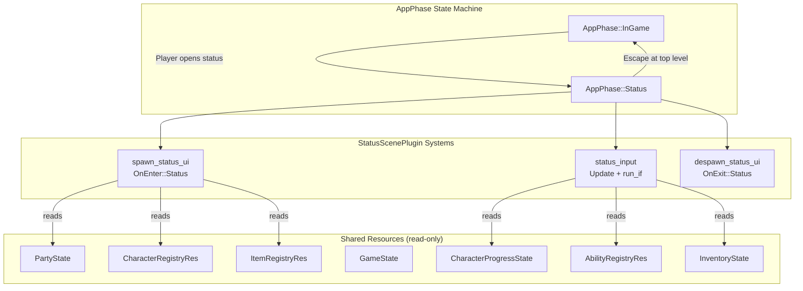
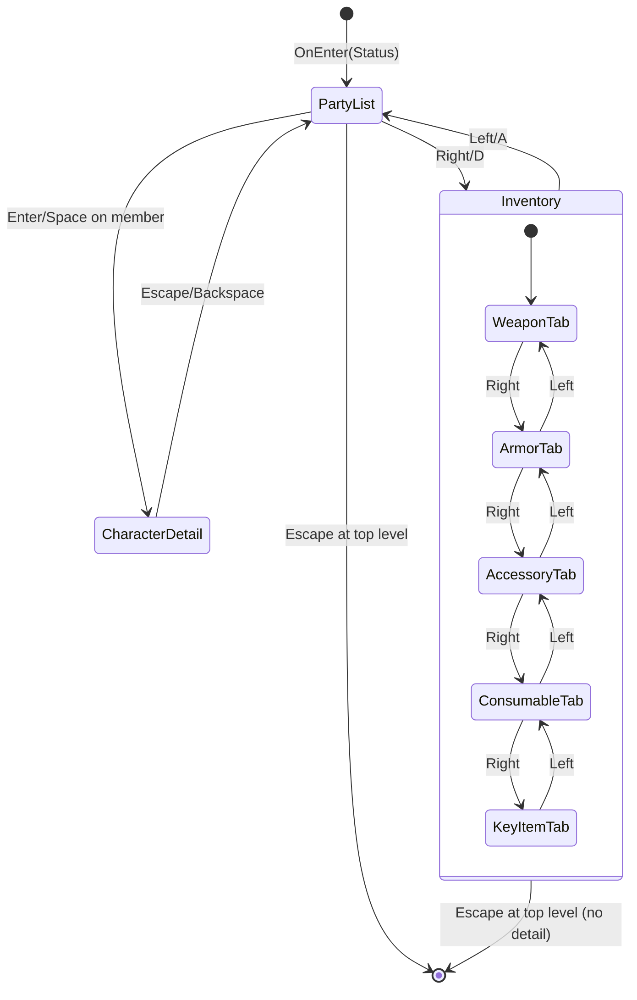

# Design Document: Player Status Page

## Overview

The Player Status Page is a read-only Bevy scene plugin (`StatusScenePlugin`) that activates when the game transitions to `AppPhase::Status`. It provides a menu-driven UI for inspecting party members, viewing character details (stats, equipment, abilities), and browsing the player's inventory organized by category tabs.

The plugin follows the same architectural pattern established by `ShopScenePlugin`:
- `OnEnter(AppPhase::Status)` spawns the UI hierarchy and inserts internal state resources
- `Update` with `run_if(in_state(AppPhase::Status))` handles keyboard input and UI updates
- `OnExit(AppPhase::Status)` despawns all marked entities and removes internal resources

The scene is strictly read-only — no mutations to game state occur. It resolves data from existing shared resources (`CharacterRegistryRes`, `ItemRegistryRes`, `AbilityRegistryRes`, `PartyState`, `InventoryState`, `CharacterProgressState`) without redefining them.

## Architecture



### Navigation State Machine



## Components and Interfaces

### Plugin Entry Point

```rust
// crates/rpg-toolkit-scenes/src/status_scene.rs

pub struct StatusScenePlugin;

impl Plugin for StatusScenePlugin {
    fn build(&self, app: &mut App) {
        app.add_systems(OnEnter(AppPhase::Status), spawn_status_ui)
            .add_systems(OnExit(AppPhase::Status), despawn_status_ui)
            .add_systems(Update, status_input.run_if(in_state(AppPhase::Status)));
    }
}
```

### Registry Wrapper Resources

```rust
/// Wrapper for CharacterRegistry as a Bevy Resource.
#[derive(Resource, Clone, Debug, Default)]
pub struct CharacterRegistryRes {
    pub registry: CharacterRegistry,
}

/// Wrapper for AbilityRegistry as a Bevy Resource.
#[derive(Resource, Clone, Debug, Default)]
pub struct AbilityRegistryRes {
    pub registry: AbilityRegistry,
}
```

`ItemRegistryRes` is already defined in `shop_scene.rs` and re-exported from the crate root.

### System Signatures

```rust
fn spawn_status_ui(
    mut commands: Commands,
    party: Option<Res<PartyState>>,
    character_registry: Option<Res<CharacterRegistryRes>>,
    item_registry: Option<Res<ItemRegistryRes>>,
    ability_registry: Option<Res<AbilityRegistryRes>>,
    inventory: Option<Res<InventoryState>>,
    progress: Option<Res<CharacterProgressState>>,
);

fn despawn_status_ui(
    mut commands: Commands,
    query: Query<Entity, With<StatusSceneMarker>>,
);

fn status_input(
    keyboard: Res<ButtonInput<KeyCode>>,
    mut ui_state: ResMut<StatusUiState>,
    mut next_phase: ResMut<NextState<AppPhase>>,
    party: Option<Res<PartyState>>,
    character_registry: Option<Res<CharacterRegistryRes>>,
    item_registry: Option<Res<ItemRegistryRes>>,
    ability_registry: Option<Res<AbilityRegistryRes>>,
    inventory: Option<Res<InventoryState>>,
    progress: Option<Res<CharacterProgressState>>,
    // ... UI entity queries for text/color updates
);
```

## Data Models

### Internal State Resource

```rust
/// The active top-level sub-page.
#[derive(Debug, Clone, Copy, PartialEq, Eq)]
pub enum StatusMode {
    PartyList,
    Inventory,
}

/// Whether a detail view is active.
#[derive(Debug, Clone, Copy, PartialEq, Eq)]
pub enum DetailView {
    None,
    CharacterDetail,   // Viewing a single character from party list
}

/// Category tabs for the inventory browser.
#[derive(Debug, Clone, Copy, PartialEq, Eq)]
pub enum InventoryTab {
    Weapon,
    Armor,
    Accessory,
    Consumable,
    KeyItem,
}

/// The full internal UI state for the status scene.
#[derive(Resource, Debug, Clone)]
pub struct StatusUiState {
    /// Current top-level sub-page.
    pub mode: StatusMode,
    /// Active detail view (None means we're at top level).
    pub detail_view: DetailView,
    /// Selection index for the party list.
    pub party_selection: usize,
    /// Selection index for the inventory item list.
    pub inventory_selection: usize,
    /// Currently active inventory category tab.
    pub inventory_tab: InventoryTab,
    /// Cached resolved party data for display.
    pub party_data: Vec<PartyMemberDisplayData>,
    /// Cached inventory items per tab.
    pub inventory_data: Vec<InventoryItemDisplayData>,
}
```

### Constants

```rust
/// Maximum number of party members displayed in the party list view.
/// The active party is capped at this size for display purposes.
/// This may become a configurable parameter in a future iteration.
pub const MAX_PARTY_DISPLAY: usize = 4;
```

### Display Data Structs (Cached at spawn time or on tab switch)

```rust
/// Resolved display data for a party member row.
#[derive(Debug, Clone)]
pub struct PartyMemberDisplayData {
    pub character_id: String,
    pub display_name: String,
    pub level: u32,
    pub effective_hp: u32,
    pub has_portrait: bool,
    pub portrait_path: Option<String>,
}

/// Resolved display data for an inventory item.
#[derive(Debug, Clone)]
pub struct InventoryItemDisplayData {
    pub item_id: String,
    pub display_name: String,
    pub quantity: u32,
    pub has_icon: bool,
    pub icon_path: Option<String>,
    pub description: String,
    pub stat_modifiers: Vec<(String, i32)>,
}
```

### Marker Components

```rust
/// Top-level marker on every entity spawned by the status scene.
#[derive(Component)]
pub struct StatusSceneMarker;

/// Marker for the party list container node.
#[derive(Component)]
struct PartyListContainer;

/// Marker for individual party member row text nodes.
#[derive(Component)]
struct PartyMemberRow(usize);

/// Marker for the character detail panel root.
#[derive(Component)]
struct CharacterDetailPanel;

/// Marker for the inventory list container.
#[derive(Component)]
struct InventoryListContainer;

/// Marker for the inventory detail/description panel.
#[derive(Component)]
struct InventoryDetailPanel;

/// Marker for tab indicator text.
#[derive(Component)]
struct InventoryTabIndicator;
```

### Helper Functions (Pure Logic)

```rust
/// Computes the effective stat value: base_value + growth_value * (level - 1).
/// Uses saturating arithmetic to prevent overflow.
pub fn compute_effective_stat(base_value: u32, growth_value: u32, level: u32) -> u32 {
    let level_factor = level.saturating_sub(1);
    base_value.saturating_add(growth_value.saturating_mul(level_factor))
}

/// Resolves party member display data from registries and progress state.
/// Skips members whose CharacterId cannot be found in the registry.
/// Truncates the result to at most MAX_PARTY_DISPLAY (4) entries.
pub fn resolve_party_display_data(
    party: &[String],
    character_registry: &CharacterRegistry,
    progress: &HashMap<String, CharacterProgress>,
) -> Vec<PartyMemberDisplayData> {
    // ... resolve logic ...
    // Final step: truncate to MAX_PARTY_DISPLAY
    resolved.truncate(MAX_PARTY_DISPLAY);
    resolved
}

/// Resolves inventory items for a given category tab.
/// Skips items not found in the registry. Sorts case-insensitively by display name.
pub fn resolve_inventory_tab_data(
    inventory: &HashMap<String, u32>,
    item_registry: &ItemRegistry,
    tab: InventoryTab,
) -> Vec<InventoryItemDisplayData> { /* ... */ }

/// Maps InventoryTab enum to ItemCategory for filtering.
pub fn tab_to_category(tab: InventoryTab) -> ItemCategory {
    match tab {
        InventoryTab::Weapon => ItemCategory::Weapon,
        InventoryTab::Armor => ItemCategory::Armor,
        InventoryTab::Accessory => ItemCategory::Accessory,
        InventoryTab::Consumable => ItemCategory::Consumable,
        InventoryTab::KeyItem => ItemCategory::KeyItem,
    }
}

/// Clamps a selection index to valid bounds [0, len-1].
/// Returns 0 if len is 0.
pub fn clamp_selection(index: usize, len: usize) -> usize {
    if len == 0 { 0 } else { index.min(len - 1) }
}

/// Returns the next tab in the fixed order, or stays if at the end.
pub fn next_tab(tab: InventoryTab) -> InventoryTab { /* ... */ }

/// Returns the previous tab in the fixed order, or stays if at the start.
pub fn prev_tab(tab: InventoryTab) -> InventoryTab { /* ... */ }
```

### UI Hierarchy

**Party List Sub-Page:**
```
Root Node (StatusSceneMarker, full-screen column)
├── Header Text ("Status")
├── Sub-page Tab Indicator ("Party | Inventory")
├── Party List Container (PartyListContainer)
│   ├── Row 0: [Portrait/Placeholder] [Name] [Lv X] [HP: Y]  (PartyMemberRow(0))
│   ├── Row 1: ...
│   └── Row N: ...
└── Footer ("Escape: Back | Enter: Detail | ←→: Switch Page")
```

**Character Detail View (replaces Party List content):**
```
Root Node (same root, children swapped)
├── Header Text ("Status - Character Detail")
├── Detail Panel (CharacterDetailPanel)
│   ├── Left Column: Face Portrait / Placeholder
│   └── Right Column:
│       ├── Name + Level
│       ├── Stats List (excluding "Level" row)
│       ├── Equipment List (resolved display names)
│       └── Abilities List (resolved display names)
└── Footer ("Escape: Back to Party List")
```

**Inventory Sub-Page:**
```
Root Node (same root, children swapped)
├── Header Text ("Status - Inventory")
├── Tab Bar: [Weapon] [Armor] [Accessory] [Consumable] [KeyItem]  (InventoryTabIndicator)
├── Item List Container (InventoryListContainer)
│   ├── Row 0: [Icon/Placeholder] [Name] [x Qty]
│   ├── Row 1: ...
│   └── Row N: ...  (or "No items in this category")
├── Detail Panel (InventoryDetailPanel)
│   ├── Item Description
│   └── Stat Modifiers ("+5 Strength", "-3 Speed")
└── Footer ("Escape: Back | ←→: Switch Tab | ↑↓: Navigate")
```


## Correctness Properties

*A property is a characteristic or behavior that should hold true across all valid executions of a system — essentially, a formal statement about what the system should do. Properties serve as the bridge between human-readable specifications and machine-verifiable correctness guarantees.*

### Property 1: Effective stat computation is correct

*For any* base_value (u32), growth_value (u32), and level (u32 ≥ 1), `compute_effective_stat(base_value, growth_value, level)` SHALL equal `base_value + growth_value * (level - 1)` using saturating arithmetic (i.e., clamped to u32::MAX on overflow).

**Validates: Requirements 2.2, 3.3, 3.4**

### Property 2: Party member resolution filters unresolvable IDs, truncates to cap, and computes correct display data

*For any* PartyState member list, CharacterRegistry, and CharacterProgressState, `resolve_party_display_data` SHALL produce an output where:
- The output length is at most `MAX_PARTY_DISPLAY` (4), regardless of the number of resolvable members in the input
- Every entry corresponds to a CharacterId present in the CharacterRegistry
- No entry corresponds to a CharacterId absent from the CharacterRegistry
- The output preserves the relative order of resolvable members from the input list (first 4 resolvable members retained)
- Each entry's `effective_hp` equals `compute_effective_stat(hp_base, hp_growth, level)` where level is the character's Level stat base_value from progress state
- Each entry's `has_portrait` is true if and only if the character's `visual_assets.face_portrait` is Some

**Validates: Requirements 2.2, 2.3, 2.4, 2.5, 2.6, 2.9**

### Property 3: Ordered ID resolution preserves order and filters missing entries

*For any* ordered list of string IDs and a registry (HashMap), resolving the list SHALL produce an output containing only IDs that exist in the registry, in the same relative order as the input. This applies to both equipment resolution (starting_equipment against ItemRegistry) and ability resolution (learned_abilities against AbilityRegistry).

**Validates: Requirements 3.5, 3.6, 3.7, 3.8**

### Property 4: Inventory tab resolution filters unresolvable items and sorts case-insensitively

*For any* InventoryState (item_id → quantity map), ItemRegistry, and InventoryTab, `resolve_inventory_tab_data` SHALL produce an output where:
- Every entry's item_id exists in the ItemRegistry and matches the tab's category
- No entry has an item_id absent from the registry
- The output is sorted case-insensitively by display_name (i.e., for consecutive elements a[i] and a[i+1], a[i].display_name.to_lowercase() ≤ a[i+1].display_name.to_lowercase())
- Each entry's quantity matches the InventoryState value for that item_id

**Validates: Requirements 4.1, 4.3, 4.8**

### Property 5: Tab navigation follows the fixed ordering

*For any* InventoryTab, calling `next_tab` then `prev_tab` SHALL return the original tab. Additionally, the full order SHALL be Weapon → Armor → Accessory → Consumable → KeyItem, where `next_tab(KeyItem)` returns KeyItem (clamped) and `prev_tab(Weapon)` returns Weapon (clamped).

**Validates: Requirements 4.6**

### Property 6: Selection index clamping stays within valid bounds

*For any* index (usize) and list length (usize), `clamp_selection(index, len)` SHALL return a value in [0, len-1] when len > 0, and 0 when len == 0. The result SHALL never exceed len-1 and SHALL never wrap around.

**Validates: Requirements 5.6, 5.8**

### Property 7: Sub-page selection indices are preserved independently

*For any* StatusUiState, changing the `mode` field (switching sub-pages) SHALL NOT modify `party_selection` or `inventory_selection`. That is, for any sequence of mode transitions, the selection index of a sub-page remains unchanged unless an explicit Up/Down navigation occurs while that sub-page is active.

**Validates: Requirements 5.7**

## Error Handling

| Scenario | Behavior |
|----------|----------|
| `CharacterRegistryRes` not present at scene entry | Log warning via `warn!()`, skip UI spawning, do not insert `StatusUiState` |
| `ItemRegistryRes` not present at scene entry | Log warning, skip UI spawning |
| `AbilityRegistryRes` not present at scene entry | Log warning, skip UI spawning |
| `PartyState` empty or all members unresolvable | Display "No party members" empty indicator |
| `CharacterId` not in registry | Skip that member silently (no panic, no error log) |
| `ItemId` in starting_equipment not in ItemRegistry | Omit from equipment list silently |
| `AbilityId` in learned_abilities not in AbilityRegistry | Omit from abilities list silently |
| `ItemId` in InventoryState not in ItemRegistry | Omit from inventory display silently |
| Inventory category tab has zero items | Display "No items" indicator, disable vertical navigation |
| Overflow in stat computation | Use saturating arithmetic (clamp to u32::MAX) |
| `StatusUiState` not present during Update (race condition) | Early return from input system |

## Testing Strategy

### Property-Based Tests

The feature uses **proptest** (already a dev-dependency in the workspace, used in `rpg-toolkit-common` tests) for property-based testing.

**Configuration:**
- Minimum 100 iterations per property test (proptest default is 256)
- Each property test tagged with a comment referencing its design property
- Tag format: `Feature: player-status-page, Property {N}: {title}`

**Properties to implement:**

| Property | Function Under Test | Generator Strategy |
|----------|--------------------|--------------------|
| 1 | `compute_effective_stat` | Random u32 triples (base, growth, level≥1) |
| 2 | `resolve_party_display_data` | Random party lists (including >4 resolvable members), character registries with varied stats/portraits, progress maps |
| 3 | `resolve_ordered_ids` | Random ID lists + random HashMaps with subset of IDs present |
| 4 | `resolve_inventory_tab_data` | Random inventory maps, item registries with mixed categories |
| 5 | `next_tab` / `prev_tab` | All 5 InventoryTab variants |
| 6 | `clamp_selection` | Random usize pairs (index, len) |
| 7 | `StatusUiState` mode transitions | Random sequences of mode changes interleaved with selection changes |

### Unit Tests (Example-Based)

- Initial state: verify `StatusUiState` defaults (mode=PartyList, party_selection=0, inventory_tab=Weapon)
- Escape at top level triggers `AppPhase::InGame` transition
- Enter on party member sets detail_view to CharacterDetail
- Escape in CharacterDetail returns to PartyList preserving selection
- Missing registry resources → no panic, no StatusUiState inserted
- Empty party → empty indicator
- Empty category tab → empty indicator, navigation disabled
- Stat modifier formatting (already tested in item.rs, integration confirmed)

### Integration Tests

- Full ECS round-trip: insert resources → run spawn system → verify entities exist → run despawn system → verify cleanup
- Verify `StatusSceneMarker` on all spawned entities
