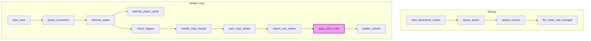

# Design Document: Renderer Polish

## Overview

This design addresses six renderer polish requirements that bring the RPG toolkit's game view from a raw prototype to a visually coherent retro-styled experience. The changes span three areas:

1. **Pixel scaling** — A camera-based zoom system that scales the entire game world by an integer factor, with a zoom-to-fit default that automatically picks the largest integer scale at which the full map is visible.
2. **Sprite scaling** — Uniform transform scaling on character sprites so they fit proportionally within the tile grid, regardless of raw spritesheet pixel dimensions.
3. **Animation refinement** — A four-step walk cycle `[0, 1, 2, 1]`, clean idle-pose transitions, and configurable frame duration with clamping.

All changes are confined to the `rpg-toolkit-renderer` crate (resources, components, and systems) and a single function in `rpg-toolkit-common` (`walk_animation_frame`). No data model changes are needed in the project file format.

### Current State

| Area | Current Behavior | Target Behavior |
|---|---|---|
| Screen scaling | 1:1 pixel ratio; tiny on modern displays | Integer pixel scale via camera projection; zoom-to-fit default |
| Character sprites | Raw 24×32 rendered at native size | Scaled to match tile width (e.g., `tile_width / 24`) |
| Walk animation | Cycles `[0, 1, 2]` continuously | Cycles `[0, 1, 2, 1]` (left-center-right-center) |
| Idle pose | Uses frame 1, but no timer reset guarantee | Frame 1 with timer reset within one frame of stopping |
| Animation speed | `AnimationConfig` exists, defaults 0.15s | Same, plus clamped minimum of 0.01s |
| Camera bounds | Clamps to raw window size | Clamps to scaled viewport (`window_size / pixel_scale`) |

## Architecture

### System Interaction Diagram



The key architectural change is inserting an **`apply_pixel_scale`** system between `spawn_npc_sprites` and `update_camera`. This system sets the camera's `OrthographicProjection.scale` based on the current `PixelScaleConfig` resource. The `update_camera` system is then modified to use the effective viewport (window size divided by pixel scale) for its bounds clamping.

### Design Decisions

**D1: Camera projection scaling vs. transform scaling for pixel zoom.**
We use `OrthographicProjection.scale = 1.0 / pixel_scale` on the camera rather than scaling every entity's transform. This is the standard Bevy approach for pixel-art games — one projection change zooms the entire scene uniformly, avoids per-entity bookkeeping, and is compatible with Bevy's built-in rendering pipeline.

**D2: Sprite scaling via transform rather than custom_size.**
Character sprites use `Transform.scale` (uniform XY) instead of `Sprite.custom_size`. This preserves the texture atlas slicing — `custom_size` overrides atlas cell dimensions and can cause rendering artifacts with atlas-based sprites. Transform scaling works correctly with texture atlases.

**D3: Walk cycle pattern in common crate.**
The `walk_animation_frame` function lives in `rpg-toolkit-common` because it is pure logic with no Bevy dependency. The existing function returns `elapsed / frame_duration % 3`; we change it to index into `[0, 1, 2, 1]` using `% 4`, keeping the function signature identical.

**D4: Pixel scale as a separate resource, not part of existing configs.**
A new `PixelScaleConfig` resource keeps scaling concerns isolated from `MovementConfig` and `AnimationConfig`. The resource stores both the mode (zoom-to-fit vs. fixed) and the currently-computed effective scale, so downstream systems can read the effective value without recomputing.

## Components and Interfaces

### New Resource: `PixelScaleConfig`

```rust
/// Determines how the game world is scaled on screen.
#[derive(Resource)]
pub struct PixelScaleConfig {
    /// The scaling mode: zoom-to-fit or fixed integer.
    pub mode: PixelScaleMode,
    /// The currently computed effective integer scale (always >= 1).
    /// Updated each frame by `apply_pixel_scale`.
    pub effective_scale: u32,
}

#[derive(Clone, Debug, PartialEq, Eq)]
pub enum PixelScaleMode {
    /// Automatically compute the largest integer scale where the
    /// entire map fits in the window.
    ZoomToFit,
    /// Use a fixed integer scale (clamped to >= 1).
    Fixed(u32),
}

impl Default for PixelScaleConfig {
    fn default() -> Self {
        Self {
            mode: PixelScaleMode::ZoomToFit,
            effective_scale: 1,
        }
    }
}
```

### Modified Resource: `AnimationConfig`

The existing `AnimationConfig` gets a validation method:

```rust
impl AnimationConfig {
    /// Returns the frame duration, clamped to a minimum of 0.01 seconds.
    pub fn clamped_frame_duration(&self) -> f32 {
        self.frame_duration.max(0.01)
    }
}
```

### New System: `apply_pixel_scale`

```rust
/// Computes and applies pixel scaling to the camera projection.
/// Runs after sprite spawning, before camera bounds clamping.
pub fn apply_pixel_scale(
    mut pixel_scale: ResMut<PixelScaleConfig>,
    project_data: Res<RendererProjectData>,
    renderer_state: Res<RendererState>,
    windows: Query<&Window, With<PrimaryWindow>>,
    mut camera_query: Query<&mut Projection, With<GameCamera>>,
)
```

### Modified System: `update_camera`

The camera system gains a dependency on `PixelScaleConfig` and computes viewport halves as:

```rust
let scale = pixel_scale.effective_scale as f32;
let half_vp_w = window.width() / scale / 2.0;
let half_vp_h = window.height() / scale / 2.0;
```

### Modified System: `spawn_player`

When a spritesheet is available, applies a uniform transform scale:

```rust
let sprite_scale = map.tile_width as f32 / ss.sprite_width as f32;
Transform::from_xyz(world_pos.x, world_pos.y, z)
    .with_scale(Vec3::splat(sprite_scale))
```

### Modified System: `spawn_npc_sprites`

Same sprite scale logic as `spawn_player`:

```rust
let sprite_scale = map.tile_width as f32 / spritesheet.sprite_width as f32;
```

### Modified System: `handle_map_change`

When repositioning the player on map transition, recalculates and applies sprite scale for the new map's tile dimensions.

### Modified Function: `walk_animation_frame` (common crate)

```rust
const WALK_PATTERN: [usize; 4] = [0, 1, 2, 1];

pub fn walk_animation_frame(elapsed: f32, frame_duration: f32) -> usize {
    let step = (elapsed / frame_duration).floor() as usize % 4;
    WALK_PATTERN[step]
}
```

### Modified System: `animate_player_sprite`

Uses `animation_config.clamped_frame_duration()` and the updated `walk_animation_frame` (which now returns `[0,1,2,1]` pattern frames).

## Data Models

No changes to the persistent data model (`ProjectFile`, `MapData`, `CharacterSpritesheet`, etc.). All new state is runtime-only ECS resources.

### Runtime Resource Summary

| Resource | Status | Purpose |
|---|---|---|
| `PixelScaleConfig` | **New** | Pixel scale mode + effective computed scale |
| `AnimationConfig` | **Modified** | Adds `clamped_frame_duration()` method |
| `RendererProjectData` | Unchanged | Project data and asset handles |
| `RendererState` | Unchanged | Active map, pending transitions |
| `MovementConfig` | Unchanged | Move duration |
| `PlayerVisual` | Unchanged | Fallback color |
| `MovementIntent` | Unchanged | Input state |

### Component Summary

| Component | Status | Purpose |
|---|---|---|
| `PlayerCharacter` | Unchanged | Grid position + move animation |
| `PlayerSpriteState` | Unchanged | Facing, frame, timer, is_moving |
| `GameCamera` | Unchanged | Camera marker |
| `RendererTileSprite` | Unchanged | Tile sprite marker |
| `NpcSprite` | Unchanged | NPC sprite marker |


## Correctness Properties

*A property is a characteristic or behavior that should hold true across all valid executions of a system — essentially, a formal statement about what the system should do. Properties serve as the bridge between human-readable specifications and machine-verifiable correctness guarantees.*

### Property 1: Zoom-to-fit computes the largest fitting integer scale

*For any* window dimensions `(win_w, win_h)` and map pixel dimensions `(map_w, map_h)` where all are positive, the zoom-to-fit function SHALL return the largest integer `s >= 1` such that `map_w * s <= win_w` AND `map_h * s <= win_h`. If no integer greater than 1 satisfies both constraints, the function SHALL return 1.

**Validates: Requirements 1.2, 1.8**

### Property 2: Fixed pixel scale produces correct projection

*For any* integer pixel scale value `n`, the effective scale SHALL be `max(n, 1)`, and the resulting camera projection scale SHALL equal `1.0 / max(n, 1)`.

**Validates: Requirements 1.4, 1.7**

### Property 3: Camera clamping keeps viewport within map bounds

*For any* player position `(px, py)`, map pixel dimensions `(map_w, map_h)`, and effective viewport dimensions `(vp_w, vp_h)` where map dimensions and viewport dimensions are positive: if `map_dim > vp_dim` on a given axis, then the clamped camera position SHALL satisfy `cam - vp_dim/2 >= 0` and `cam + vp_dim/2 <= map_dim`. If `map_dim <= vp_dim` on a given axis, the camera SHALL be centered at `map_dim / 2` (horizontal) or `-map_dim / 2` (vertical, due to Y-down convention).

**Validates: Requirements 1.6, 6.1, 6.2, 6.3**

### Property 4: Sprite scale preserves tile-width proportionality

*For any* map tile width `tw > 0` and spritesheet sprite width `sw > 0`, the computed sprite scale SHALL equal `tw / sw`, and applying this scale uniformly (same value for both X and Y axes) SHALL result in the rendered sprite width being equal to the tile width.

**Validates: Requirements 2.1, 2.3, 2.4**

### Property 5: Walk animation frame follows [0, 1, 2, 1] pattern

*For any* non-negative elapsed time and positive frame duration, `walk_animation_frame(elapsed, frame_duration)` SHALL return `[0, 1, 2, 1][floor(elapsed / frame_duration) % 4]`, and the returned value SHALL always be one of 0, 1, or 2.

**Validates: Requirements 3.1, 3.4, 3.5**

### Property 6: Smaller frame duration produces faster animation

*For any* non-negative elapsed time and two positive frame durations `fd1 < fd2`, the number of walk cycle steps completed with `fd1` SHALL be greater than or equal to the number completed with `fd2`. Formally: `floor(elapsed / fd1) >= floor(elapsed / fd2)`.

**Validates: Requirements 5.2, 5.3**

### Property 7: Frame duration clamping

*For any* `f32` value `d`, `clamped_frame_duration(d)` SHALL return `max(d, 0.01)`. In particular, for all `d <= 0.0`, the result SHALL be `0.01`, and for all `d >= 0.01`, the result SHALL be `d`.

**Validates: Requirements 5.4**

## Error Handling

| Scenario | Handling |
|---|---|
| Fixed pixel scale < 1 | Clamp to 1 in `apply_pixel_scale` system |
| Zoom-to-fit produces scale < 1 (map larger than window) | Use scale of 1, allow scrolling |
| Frame duration ≤ 0 | `clamped_frame_duration()` returns 0.01 |
| No active map when computing zoom-to-fit | Early return; keep previous effective_scale |
| No primary window available | Early return; keep previous effective_scale |
| Sprite width is 0 in spritesheet data | Should not occur (validated at project load); if it does, skip scale application and log warning |
| Map with 0 tile width | Should not occur (MapData validates tile sizes); if it does, skip sprite scaling |

All error paths are non-panicking — systems use early returns when preconditions aren't met, consistent with the existing codebase pattern.

## Testing Strategy

### Property-Based Tests (proptest)

The project already uses `proptest` for property-based testing (see `tests/properties/`). Each correctness property above maps to a single property-based test with a minimum of 100 iterations.

**Library:** `proptest` (already a workspace dependency)

**Test configuration:** `ProptestConfig::with_cases(100)` minimum per property.

**Tag format:** `Feature: renderer-polish, Property N: <property_text>`

| Property | Test Target | Generator Strategy |
|---|---|---|
| P1: Zoom-to-fit | `compute_zoom_to_fit(win_w, win_h, map_w, map_h) -> u32` | `win_w/h` in 100..4000, `map_w/h` in 1..10000 |
| P2: Fixed scale projection | `effective_scale_for_fixed(n) -> u32` | `n` in -10..100 (i32, covers negative edge) |
| P3: Camera clamping | `clamp_camera(player_pos, map_size, viewport_size) -> f32` | All positive floats in reasonable ranges |
| P4: Sprite scale | `compute_sprite_scale(tile_width, sprite_width) -> f32` | `tile_width` in {8,16,32,64}, `sprite_width` in 1..128 |
| P5: Walk frame pattern | `walk_animation_frame(elapsed, frame_duration) -> usize` | `elapsed` in 0.0..100.0, `frame_duration` in 0.01..2.0 |
| P6: Faster animation | `walk_animation_frame` with two durations | `elapsed` in 0.0..100.0, `fd1 < fd2` both in 0.01..2.0 |
| P7: Duration clamping | `clamped_frame_duration(d) -> f32` | `d` in -10.0..10.0 |

Note: The existing `tests/properties/walk_animation.rs` tests the old `[0, 1, 2]` cycle. It will be updated to validate the new `[0, 1, 2, 1]` pattern as part of Property 5.

### Unit Tests

Unit tests cover specific examples, integration points, and state transitions:

- **Default resource values:** `PixelScaleConfig::default()` is `ZoomToFit` with `effective_scale: 1`; `AnimationConfig::default().frame_duration == 0.15`
- **Idle pose per direction:** For each of the 4 `FacingDirection` values, `sprite_atlas_index(facing, 1)` returns the correct idle atlas index
- **Walk cycle start:** `walk_animation_frame(0.0, any_positive)` returns 0 (left step)
- **Move-to-idle transition:** When `is_moving` transitions `true → false`, `animation_timer` resets to 0 and `animation_frame` is 1
- **NPC idle frame:** NPCs spawn with `sprite_atlas_index(npc.facing, 1)` (already implemented, verify preserved)

### Integration Testing

Manual/visual integration tests in the running renderer:

- Window resize triggers zoom-to-fit recomputation
- Camera stays within map bounds at all zoom levels
- Character sprites are proportional to tiles across different map tile sizes
- Walk animation displays natural stepping pattern
- Idle pose is clean and immediate when movement stops
