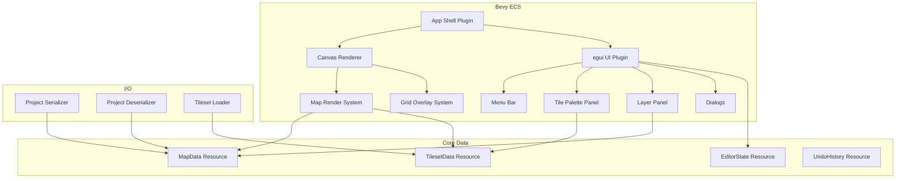
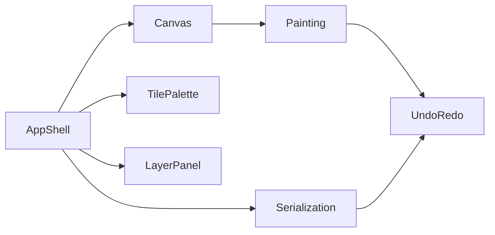
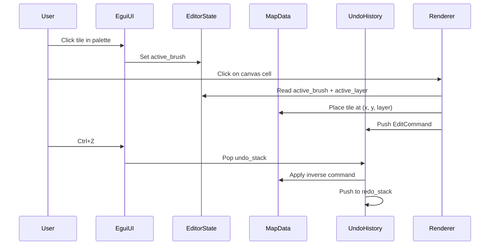

# Design Document: RPG Toolkit — Map Editor Foundation

## Overview

The RPG Toolkit is a cross-platform desktop application for creating retro-style RPG games with a no-code / minimal-code approach. The full toolkit will encompass map editing, NPC management, scene transitions, dialogs, and storyboards. It is built with **Bevy 0.18** as the game engine / application framework and **egui 0.39** (via `bevy_egui`) for the immediate-mode UI layer.

This first iteration establishes the toolkit's application foundation and delivers the map editing module — the most frequently used component. It covers: application shell, map creation, tileset loading, tile painting, layer management, canvas navigation (pan/zoom), project save/load, and undo/redo.

### Key Technology Choices

| Concern | Choice | Rationale |
|---|---|---|
| Engine | Bevy 0.18 | ECS architecture, cross-platform rendering, asset pipeline |
| UI | egui 0.39 via `bevy_egui` | Immediate-mode GUI, easy panels/dialogs, no layout files |
| Serialization | `serde` + `serde_json` | Idiomatic Rust, human-readable JSON output |
| File dialogs | `rfd` (Rusty File Dialogs) | Native OS dialogs on Windows/macOS/Linux |
| Image loading | Bevy's built-in asset loader + `image` crate | PNG/JPEG support out of the box |
| Property testing | `proptest` | Mature Rust PBT library |

### High-Level Architecture Diagram



## Architecture

The application follows Bevy's ECS (Entity-Component-System) pattern with a plugin-based architecture. Each major feature area is encapsulated in a Bevy plugin.

### Plugin Structure

```
rpg_map_editor
├── main.rs                  # App entry point, plugin registration
├── plugins/
│   ├── app_shell.rs         # Window config, menu bar, layout
│   ├── canvas.rs            # Map rendering, grid overlay, pan/zoom
│   ├── tile_palette.rs      # Tileset display, tile selection
│   ├── layer_panel.rs       # Layer list UI, add/delete/toggle
│   ├── painting.rs          # Brush state, tile placement/erasure
│   ├── undo_redo.rs         # Command history, undo/redo systems
│   └── serialization.rs     # Save/load project, tileset loading
├── data/
│   ├── map.rs               # MapData, Layer, Tile types
│   ├── tileset.rs           # TilesetData, TileIndex
│   ├── project.rs           # ProjectFile (serde), serialization logic
│   └── editor_state.rs      # EditorState, BrushState, CameraState
└── systems/
    ├── input.rs             # Mouse/keyboard input handling
    ├── render.rs            # Sprite rendering for tiles
    └── camera.rs            # Camera transform, zoom, pan
```

### Plugin Dependency Graph



### System Execution Order

1. **Input systems** — read mouse/keyboard events
2. **UI systems** — egui panels, menus, dialogs (reads/writes `EditorState`)
3. **Painting systems** — apply brush to map based on input + editor state
4. **Undo/Redo systems** — process undo/redo commands, mutate `MapData`
5. **Render systems** — update sprite transforms/textures from `MapData`
6. **Camera systems** — apply zoom/pan transforms

## Components and Interfaces

### Plugins

#### `AppShellPlugin`
- Configures the Bevy window (title, minimum size 800×600)
- Registers the egui context
- Renders the menu bar (File: New Map, Load Tileset, Save Project, Open Project; Edit: Undo, Redo)
- Manages dialog state (new map dialog, error dialogs, unsaved changes prompt)

#### `CanvasPlugin`
- Spawns a 2D camera entity with `Camera2d`
- Renders the tile grid overlay as a mesh or line batch
- Handles zoom (mouse wheel) and pan (middle-mouse drag)
- Converts screen coordinates to tile coordinates for painting

#### `TilePalettePlugin`
- Renders an egui side panel showing the loaded tileset as a scrollable grid of tile images
- Handles tile selection → updates `EditorState.active_brush`
- Displays tile size configuration when loading a tileset

#### `LayerPanelPlugin`
- Renders an egui panel listing layers with name, visibility toggle, and selection highlight
- Add Layer / Delete Layer buttons
- Reorders layers (future iteration) — not in scope for v1

#### `PaintingPlugin`
- Reads mouse input over the canvas area
- On left-click/drag: places `active_brush` tile at the hovered cell on the active layer
- On right-click: erases tile at hovered cell on active layer
- Emits `EditCommand` events for undo/redo tracking

#### `UndoRedoPlugin`
- Maintains `UndoHistory` resource (Vec of `EditCommand`, capped at 50)
- On Ctrl+Z: pops last command, applies inverse
- On Ctrl+Y: re-applies last undone command
- Clears redo stack on new edit

#### `SerializationPlugin`
- Save: serializes `MapData` + tileset paths → JSON via `serde_json` with pretty printing
- Load: deserializes JSON → validates → populates `MapData` and triggers tileset reload
- Uses `rfd` for native file dialogs

### Key Interfaces

```rust
/// Emitted when a tile edit occurs, consumed by UndoRedoPlugin
pub struct EditCommand {
    pub kind: EditCommandKind,
}

pub enum EditCommandKind {
    PlaceTile { layer_index: usize, x: u32, y: u32, old_tile: Option<TileIndex>, new_tile: TileIndex },
    EraseTile { layer_index: usize, x: u32, y: u32, old_tile: Option<TileIndex> },
    AddLayer { layer_index: usize, name: String },
    DeleteLayer { layer_index: usize, layer_data: Layer },
}
```

## Data Models

### Core Types

```rust
/// A coordinate identifying a tile graphic within a tileset image.
#[derive(Clone, Copy, Debug, PartialEq, Eq, Hash, Serialize, Deserialize)]
pub struct TileIndex {
    pub col: u32,
    pub row: u32,
}

/// A single layer of the map, containing a 2D grid of optional tile references.
#[derive(Clone, Debug, Serialize, Deserialize, PartialEq)]
pub struct Layer {
    pub name: String,
    pub visible: bool,
    /// Row-major grid: tiles[y][x]
    pub tiles: Vec<Vec<Option<TileIndex>>>,
}

/// The complete map data.
#[derive(Clone, Debug, Serialize, Deserialize, PartialEq)]
pub struct MapData {
    pub name: String,
    pub width: u32,   // 1..=256
    pub height: u32,  // 1..=256
    pub layers: Vec<Layer>,
    pub active_layer_index: usize,
}

/// Metadata about a loaded tileset.
#[derive(Clone, Debug, Serialize, Deserialize, PartialEq)]
pub struct TilesetMeta {
    pub file_path: String,
    pub tile_width: u32,  // 8, 16, 32, or 64
    pub tile_height: u32, // 8, 16, 32, or 64
    pub columns: u32,
    pub rows: u32,
}

/// Runtime tileset data (not serialized — the texture handle is runtime-only).
pub struct TilesetData {
    pub meta: TilesetMeta,
    pub texture: Handle<Image>,
    /// Pre-computed atlas layout for each tile
    pub atlas_layout: Handle<TextureAtlasLayout>,
}

/// The on-disk project format.
#[derive(Clone, Debug, Serialize, Deserialize, PartialEq)]
pub struct ProjectFile {
    pub version: u32,  // schema version, starts at 1
    pub map: MapData,
    pub tileset: Option<TilesetMeta>,
}
```

### Editor State (Bevy Resources)

```rust
#[derive(Clone, Copy, Debug, PartialEq, Eq)]
pub enum ToolMode {
    Paint,
    Erase,
}

#[derive(Resource)]
pub struct EditorState {
    pub active_brush: Option<TileIndex>,
    pub tool_mode: ToolMode,
    pub zoom_level: f32,        // 0.25..=8.0
    pub camera_offset: Vec2,
    pub has_unsaved_changes: bool,
    pub current_save_path: Option<PathBuf>,
}

#[derive(Resource)]
pub struct UndoHistory {
    pub undo_stack: Vec<EditCommand>,
    pub redo_stack: Vec<EditCommand>,
    pub max_history: usize, // 50
}
```

### Data Flow Diagram



### Validation Rules

| Field | Constraint |
|---|---|
| `MapData.width` | 1 ≤ w ≤ 256 |
| `MapData.height` | 1 ≤ h ≤ 256 |
| `TilesetMeta.tile_width` | ∈ {8, 16, 32, 64} |
| `TilesetMeta.tile_height` | ∈ {8, 16, 32, 64} |
| `EditorState.zoom_level` | 0.25 ≤ z ≤ 8.0 |
| `Layer.tiles` dimensions | Must match `MapData.width × MapData.height` |
| `MapData.active_layer_index` | < `MapData.layers.len()` |
| `UndoHistory` size | ≤ 50 entries |


## Correctness Properties

*A property is a characteristic or behavior that should hold true across all valid executions of a system — essentially, a formal statement about what the system should do. Properties serve as the bridge between human-readable specifications and machine-verifiable correctness guarantees.*

### Property 1: Map dimension validation

*For any* pair of integers (w, h), the map creation function should accept them if and only if both w and h are in the range [1, 256]. Inputs outside this range should be rejected with an error.

**Validates: Requirements 2.3, 2.4**

### Property 2: New map is correctly initialized

*For any* valid map dimensions (w, h), creating a new map should produce a MapData with exactly one layer named "Ground", where the layer's tile grid has dimensions w × h and every cell is `None` (empty).

**Validates: Requirements 2.2, 5.1**

### Property 3: Tileset grid partitioning

*For any* image dimensions (img_w, img_h) and valid tile size (tile_w, tile_h) where tile_w and tile_h are in {8, 16, 32, 64}, the computed tileset grid should have columns = img_w / tile_w and rows = img_h / tile_h, and columns * rows should equal the total number of selectable tiles in the palette.

**Validates: Requirements 3.2**

### Property 4: Tile placement writes to correct cell

*For any* valid MapData, layer index, tile position (x, y) within bounds, and TileIndex, placing that tile should result in `map.layers[layer].tiles[y][x] == Some(tile_index)`, and all other cells should remain unchanged.

**Validates: Requirements 4.2, 4.3**

### Property 5: Tile erasure clears the cell

*For any* valid MapData with a tile placed at position (x, y) on a given layer, erasing that cell should result in `map.layers[layer].tiles[y][x] == None`, and all other cells should remain unchanged.

**Validates: Requirements 4.5**

### Property 6: Add layer increases layer count

*For any* valid MapData with N layers, adding a new layer should result in exactly N+1 layers, where the new layer has an empty tile grid matching the map dimensions and all pre-existing layers retain their data unchanged.

**Validates: Requirements 5.3**

### Property 7: Delete layer decreases layer count

*For any* valid MapData with N > 1 layers, deleting a layer at a valid index should result in exactly N-1 layers, and the remaining layers should retain their original data and relative order.

**Validates: Requirements 5.7**

### Property 8: Layer visibility toggle is an involution

*For any* layer, toggling visibility twice should restore the original visibility state. Formally: for any layer L, `toggle(toggle(L.visible)) == L.visible`.

**Validates: Requirements 5.6**

### Property 9: Zoom level clamping

*For any* float value z, applying it as a zoom level should produce a result clamped to the range [0.25, 8.0]. Values below 0.25 should become 0.25, values above 8.0 should become 8.0, and values within range should be unchanged.

**Validates: Requirements 6.2**

### Property 10: Project serialization round-trip

*For any* valid ProjectFile, serializing to JSON and then deserializing should produce a ProjectFile equal to the original.

**Validates: Requirements 7.1, 7.2, 7.3, 7.5**

### Property 11: Pretty-printed JSON contains indentation

*For any* valid ProjectFile, the serialized JSON string should contain newline characters and leading whitespace (indentation), confirming human-readable formatting.

**Validates: Requirements 7.4**

### Property 12: Undo/redo round-trip preserves map state

*For any* valid MapData and any single EditCommand (tile placement, tile erasure, layer addition, or layer deletion), applying the command and then undoing it should restore the MapData to its original state. Furthermore, redoing after undo should restore the post-command state.

**Validates: Requirements 8.1, 8.2, 8.5**

### Property 13: Undo history respects maximum size

*For any* sequence of N edit commands where N > 50, the undo stack should contain at most 50 entries, retaining only the 50 most recent commands.

**Validates: Requirements 8.3**

### Property 14: New edit clears redo stack

*For any* editor state where the redo stack is non-empty, performing a new edit command should result in an empty redo stack.

**Validates: Requirements 8.4**

## Error Handling

### Error Categories

| Category | Trigger | Response |
|---|---|---|
| Invalid map dimensions | User enters w or h outside [1, 256] | Show egui error dialog with valid range message. Do not create map. |
| Unsupported image format | User selects non-PNG/JPEG file | Show error dialog listing supported formats (PNG, JPEG). |
| Corrupted/unreadable image | Image file cannot be decoded | Show error dialog with the underlying I/O or decode error message. |
| Malformed project file | JSON parse failure or schema mismatch | Show error dialog describing the parse error. Do not modify current project. |
| Invalid project data | Deserialized data fails validation (e.g., dimensions out of range, layer grid size mismatch) | Show error dialog describing which field is invalid. Do not load project. |
| Last layer deletion | User attempts to delete the only remaining layer | Disable the Delete Layer button. No error dialog needed. |

### Error Propagation Strategy

- All I/O and deserialization operations return `Result<T, EditorError>`.
- `EditorError` is an enum with variants for each error category.
- Systems that encounter errors write to an `ErrorState` resource, which the UI system reads to display dialogs.
- Errors never panic — all are handled gracefully and surfaced to the user.

```rust
#[derive(Debug, thiserror::Error)]
pub enum EditorError {
    #[error("Invalid map dimensions: width and height must be between 1 and 256")]
    InvalidDimensions,
    #[error("Unsupported image format. Supported: PNG, JPEG")]
    UnsupportedFormat,
    #[error("Failed to read image: {0}")]
    ImageReadError(String),
    #[error("Failed to parse project file: {0}")]
    ProjectParseError(String),
    #[error("Invalid project data: {0}")]
    ProjectValidationError(String),
}
```

## Testing Strategy

### Dual Testing Approach

This project uses both unit tests and property-based tests for comprehensive coverage.

- **Unit tests**: Verify specific examples, edge cases, integration points, and error conditions.
- **Property-based tests**: Verify universal correctness properties across randomly generated inputs.

### Property-Based Testing Configuration

- **Library**: `proptest` (Rust)
- **Minimum iterations**: 100 per property test (configured via `proptest! { config: ProptestConfig::with_cases(100), ... }`)
- **Each property test references its design property** using the tag format:
  `// Feature: rpg-map-editor, Property {N}: {title}`
- **Each correctness property is implemented by a single property-based test.**

### Test Organization

```
tests/
├── properties/
│   ├── map_creation_props.rs    # Properties 1, 2
│   ├── tileset_props.rs         # Property 3
│   ├── painting_props.rs        # Properties 4, 5
│   ├── layer_props.rs           # Properties 6, 7, 8
│   ├── camera_props.rs          # Property 9
│   ├── serialization_props.rs   # Properties 10, 11
│   └── undo_redo_props.rs       # Properties 12, 13, 14
└── unit/
    ├── map_creation_test.rs     # New map dialog examples, edge cases
    ├── tileset_test.rs          # Tile size options, format rejection
    ├── painting_test.rs         # Specific paint/erase scenarios
    ├── layer_test.rs            # Default layer name, last-layer guard
    ├── serialization_test.rs    # Malformed JSON, missing fields
    └── undo_redo_test.rs        # Specific undo/redo sequences
```

### Unit Test Focus Areas

- New map creation with specific dimension values (1×1, 256×256, boundary values)
- Tileset loading with each valid tile size (8, 16, 32, 64)
- Error dialogs for unsupported formats and corrupted files
- Layer deletion guard when only one layer remains
- Deserialization of malformed JSON strings
- Specific undo/redo sequences (undo all, redo all, interleaved edits)

### Property Test Coverage Map

| Property | Test File | Generator Strategy |
|---|---|---|
| 1: Map dimension validation | `map_creation_props.rs` | Random (u32, u32) pairs across full u32 range |
| 2: New map initialization | `map_creation_props.rs` | Random valid dimensions (1..=256, 1..=256) |
| 3: Tileset grid partitioning | `tileset_props.rs` | Random image dimensions, random tile size from {8,16,32,64} |
| 4: Tile placement | `painting_props.rs` | Random MapData, random valid position, random TileIndex |
| 5: Tile erasure | `painting_props.rs` | Random MapData with tiles placed, random valid position |
| 6: Add layer | `layer_props.rs` | Random MapData with 1..10 layers |
| 7: Delete layer | `layer_props.rs` | Random MapData with 2..10 layers, random valid index |
| 8: Visibility toggle involution | `layer_props.rs` | Random boolean |
| 9: Zoom clamping | `camera_props.rs` | Random f32 values including extremes |
| 10: Serialization round-trip | `serialization_props.rs` | Random valid ProjectFile instances |
| 11: Pretty-printed JSON | `serialization_props.rs` | Random valid ProjectFile instances |
| 12: Undo/redo round-trip | `undo_redo_props.rs` | Random MapData + random EditCommand |
| 13: Undo history max size | `undo_redo_props.rs` | Random sequences of 51..200 EditCommands |
| 14: New edit clears redo | `undo_redo_props.rs` | Random state with non-empty redo stack + new EditCommand |

### Dependencies (Cargo.toml)

```toml
[dependencies]
bevy = "0.18"
bevy_egui = { version = "0.39" }  # egui 0.39 integration
serde = { version = "1", features = ["derive"] }
serde_json = "1"
rfd = "0.15"
thiserror = "2"

[dev-dependencies]
proptest = "1"
```
