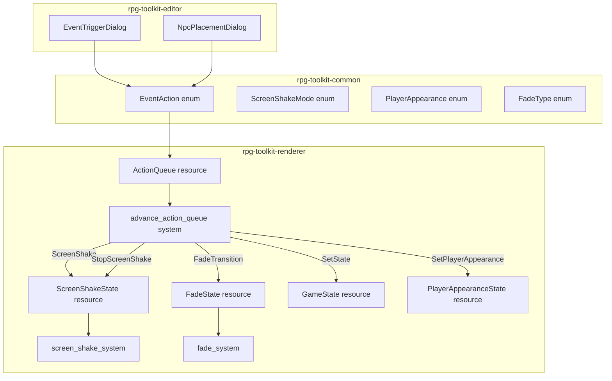
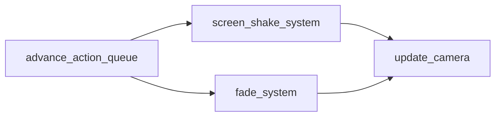

# Design Document: Special Event Triggers

## Overview

This feature extends the existing `EventAction` enum in `rpg-toolkit-common` with five new variants — `ScreenShake`, `StopScreenShake`, `FadeTransition`, `SetState`, and `SetPlayerAppearance` — and adds corresponding runtime systems in `rpg-toolkit-renderer` plus editor UI support in `rpg-toolkit-editor`.

The design follows the established patterns:
- Data models live in `rpg-toolkit-common` with serde serialization
- Runtime state is managed via Bevy ECS resources and systems in `rpg-toolkit-renderer`
- The `ActionQueue` resource drives sequential processing with blocking/non-blocking semantics
- Editor UI uses `bevy_egui` windows with the existing `EventTriggerDialog` and `NpcPlacementDialog` patterns

### Key Design Decisions

1. **Blocking vs Non-blocking**: `ScreenShake(Timed)` and `FadeTransition` block the queue (like `ShowDialog`). `ScreenShake(Continuous)`, `StopScreenShake`, `SetState`, and `SetPlayerAppearance` are non-blocking (advance immediately).
2. **Pure computation functions**: Shake offset generation and fade interpolation are extracted as pure functions for testability, following the `compute_visible_chars` pattern from the dialog system.
3. **Resource-based state**: Each active effect gets its own Bevy `Resource` (`ScreenShakeState`, `FadeState`), inserted when the action starts and removed when it completes — matching the `DialogState` pattern.
4. **Additive ActionQueue flags**: The existing `waiting_for_dialog` bool is generalized to a `waiting_for` enum to track which blocking action type the queue is waiting on.

## Architecture



### System Ordering

New systems integrate into the existing `Update` schedule:



The `screen_shake_system` runs after `advance_action_queue` (which may insert `ScreenShakeState`) and before `update_camera` (so the shake offset is applied before camera clamping). The `fade_system` runs after `advance_action_queue` to update the overlay opacity each frame.

## Components and Interfaces

### New EventAction Variants (rpg-toolkit-common)

```rust
/// Mode for screen shake effect.
#[derive(Clone, Copy, Debug, Default, PartialEq, Eq, Serialize, Deserialize)]
pub enum ScreenShakeMode {
    #[default]
    Timed,
    Continuous,
}

/// Type of fade transition.
#[derive(Clone, Copy, Debug, PartialEq, Eq, Serialize, Deserialize)]
pub enum FadeType {
    FadeIn,
    FadeOut,
}

/// Player visual appearance state.
#[derive(Clone, Debug, PartialEq, Serialize, Deserialize)]
#[serde(tag = "type")]
pub enum PlayerAppearance {
    Hidden,
    Spritesheet { path: String },
    Default,
}

/// Extended EventAction enum (additions to existing variants).
#[serde(tag = "type")]
pub enum EventAction {
    // ... existing JumpTo, ShowDialog ...
    ScreenShake {
        intensity: f32,
        duration: f32,
        #[serde(default)]
        mode: ScreenShakeMode,
    },
    StopScreenShake,
    FadeTransition {
        fade_type: FadeType,
        duration: f32,
        #[serde(default = "default_fade_color")]
        color: [f32; 4],
    },
    SetState {
        key: String,
        value: String,
    },
    SetPlayerAppearance {
        appearance: PlayerAppearance,
    },
}
```

### New Resources (rpg-toolkit-renderer)

```rust
/// Tracks an active screen shake effect.
#[derive(Resource)]
pub struct ScreenShakeState {
    pub intensity: f32,
    pub mode: ScreenShakeMode,
    pub duration: f32,    // Only meaningful for Timed mode
    pub elapsed: f32,
}

/// Tracks an active fade transition.
#[derive(Resource)]
pub struct FadeState {
    pub fade_type: FadeType,
    pub duration: f32,
    pub elapsed: f32,
    pub color: [f32; 4],
}

/// Persistent game state flags (key-value store).
#[derive(Resource, Default)]
pub struct GameState {
    pub flags: HashMap<String, String>,
}

/// Tracks the player's original spritesheet for restoration.
#[derive(Resource)]
pub struct PlayerAppearanceState {
    pub original_spritesheet_id: Option<SpritesheetId>,
}
```

### New Marker Components

```rust
/// Marker for the fade overlay UI entity.
#[derive(Component)]
pub struct FadeOverlay;
```

### ActionQueue Changes

The `ActionQueue` resource gains a `waiting_for` field replacing the boolean `waiting_for_dialog`:

```rust
#[derive(Default, PartialEq)]
pub enum WaitingFor {
    #[default]
    Nothing,
    Dialog,
    ScreenShake,
    Fade,
}

#[derive(Resource)]
pub struct ActionQueue {
    pub actions: VecDeque<EventAction>,
    pub waiting_for: WaitingFor,
}
```

### Pure Computation Functions

```rust
/// Computes a shake offset for a given intensity.
/// Returns (dx, dy) where |dx| <= intensity and |dy| <= intensity.
pub fn compute_shake_offset(intensity: f32, seed_x: f32, seed_y: f32) -> (f32, f32) {
    let dx = (seed_x * 2.0 - 1.0) * intensity;
    let dy = (seed_y * 2.0 - 1.0) * intensity;
    (dx, dy)
}

/// Returns true if a timed shake has completed.
pub fn is_shake_complete(elapsed: f32, duration: f32, mode: ScreenShakeMode) -> bool {
    match mode {
        ScreenShakeMode::Timed => elapsed >= duration,
        ScreenShakeMode::Continuous => false,
    }
}

/// Computes the fade overlay opacity for the current elapsed time.
/// Returns a value in [0.0, 1.0].
pub fn compute_fade_opacity(elapsed: f32, duration: f32, fade_type: FadeType) -> f32 {
    if duration <= 0.0 {
        return match fade_type {
            FadeType::FadeOut => 1.0,
            FadeType::FadeIn => 0.0,
        };
    }
    let t = (elapsed / duration).clamp(0.0, 1.0);
    match fade_type {
        FadeType::FadeOut => t,
        FadeType::FadeIn => 1.0 - t,
    }
}

/// Returns true if a fade transition has completed.
pub fn is_fade_complete(elapsed: f32, duration: f32) -> bool {
    elapsed >= duration
}

/// Classifies an EventAction as blocking or non-blocking.
pub fn is_blocking_action(action: &EventAction) -> bool {
    match action {
        EventAction::ScreenShake { mode, duration, .. } => {
            *mode == ScreenShakeMode::Timed && *duration > 0.0
        }
        EventAction::FadeTransition { duration, .. } => *duration > 0.0,
        EventAction::ShowDialog { .. } => true,
        _ => false,
    }
}
```

### New Systems (rpg-toolkit-renderer)

#### `screen_shake_system`

Runs each frame while `ScreenShakeState` is present:
1. Increments `elapsed` by `delta_secs()`
2. If `is_shake_complete()`, removes the resource and resets camera offset
3. Otherwise, generates random offset using `compute_shake_offset()` and applies to camera transform

#### `fade_system`

Runs each frame while `FadeState` is present:
1. Increments `elapsed` by `delta_secs()`
2. Computes opacity via `compute_fade_opacity()`
3. Updates the `FadeOverlay` entity's `BackgroundColor` alpha
4. If `is_fade_complete()`:
   - For `FadeOut`: removes `FadeState` but leaves overlay at full opacity
   - For `FadeIn`: removes `FadeState` and despawns the overlay entity

#### `advance_action_queue` (modified)

Extended to handle new action types:
- `ScreenShake(Timed)`: Insert `ScreenShakeState`, set `waiting_for = WaitingFor::ScreenShake`
- `ScreenShake(Continuous)`: Insert `ScreenShakeState`, pop action, continue (non-blocking)
- `StopScreenShake`: Remove `ScreenShakeState`, reset camera, pop action, continue
- `FadeTransition`: Insert `FadeState`, spawn overlay, set `waiting_for = WaitingFor::Fade`
- `SetState`: Insert/update `GameState`, pop action, continue
- `SetPlayerAppearance`: Apply appearance change, pop action, continue

Wait conditions:
- `WaitingFor::ScreenShake`: Wait until `ScreenShakeState` is removed
- `WaitingFor::Fade`: Wait until `FadeState` is removed
- `WaitingFor::Dialog`: Wait until `DialogState` is removed (existing behavior)

#### `handle_map_change` (modified)

When processing a `JumpTo` that clears the queue, also remove `ScreenShakeState` if present and reset camera offset.

## Data Models

### ScreenShakeMode

| Variant | Behavior |
|---------|----------|
| `Timed` (default) | Shake runs for `duration` seconds, blocks queue |
| `Continuous` | Shake runs indefinitely, non-blocking, stopped by `StopScreenShake` |

### FadeType

| Variant | Start Opacity | End Opacity |
|---------|--------------|-------------|
| `FadeOut` | 0.0 (transparent) | 1.0 (opaque) |
| `FadeIn` | 1.0 (opaque) | 0.0 (transparent) |

### PlayerAppearance

| Variant | Effect |
|---------|--------|
| `Hidden` | Sets `Visibility::Hidden` on player entity |
| `Spritesheet { path }` | Loads new spritesheet, replaces texture/atlas, ensures visible |
| `Default` | Restores original spritesheet, ensures visible |

### GameState

A `HashMap<String, String>` resource. Keys are game designer-defined identifiers (e.g., `"talked_to_elder"`), values are arbitrary strings (e.g., `"true"`, `"3"`, `"completed"`).

### Serialization Format Examples

```json
{"type": "ScreenShake", "intensity": 8.0, "duration": 1.5, "mode": "Timed"}
{"type": "ScreenShake", "intensity": 3.0, "duration": 0.0, "mode": "Continuous"}
{"type": "StopScreenShake"}
{"type": "FadeTransition", "fade_type": "FadeOut", "duration": 2.0, "color": [0.0, 0.0, 0.0, 1.0]}
{"type": "FadeTransition", "fade_type": "FadeIn", "duration": 1.0}
{"type": "SetState", "key": "boss_defeated", "value": "true"}
{"type": "SetPlayerAppearance", "appearance": {"type": "Hidden"}}
{"type": "SetPlayerAppearance", "appearance": {"type": "Spritesheet", "path": "assets/disguise.png"}}
{"type": "SetPlayerAppearance", "appearance": {"type": "Default"}}
```

## Correctness Properties

*A property is a characteristic or behavior that should hold true across all valid executions of a system — essentially, a formal statement about what the system should do. Properties serve as the bridge between human-readable specifications and machine-verifiable correctness guarantees.*

### Property 1: EventAction Serialization Round-Trip

*For any* valid `EventAction` value (including all new variants: `ScreenShake` with any valid intensity/duration/mode, `StopScreenShake`, `FadeTransition` with any valid fade_type/duration/color, `SetState` with any non-empty key and any value, and `SetPlayerAppearance` with any `PlayerAppearance` variant), serializing to JSON and then deserializing SHALL produce an equivalent value.

**Validates: Requirements 1.8, 1.9, 3.2, 3.3, 5.6, 7.4, 9.6, 9.7**

### Property 2: ProjectFile Round-Trip with New Variants

*For any* valid `ProjectFile` containing maps with tile attributes that include any combination of `EventAction` variants (both existing and new), serializing to JSON and then deserializing SHALL produce an equivalent `ProjectFile`.

**Validates: Requirements 13.1, 13.3**

### Property 3: Screen Shake Offset Bounded by Intensity

*For any* intensity value in [0.0, 50.0] and any random seed values in [0.0, 1.0], the `compute_shake_offset` function SHALL produce an offset `(dx, dy)` where `|dx| <= intensity` and `|dy| <= intensity`.

**Validates: Requirements 2.3**

### Property 4: Timed Shake Completion

*For any* duration `d` in [0.0, 10.0] and elapsed time `e` where `e >= d`, the function `is_shake_complete(e, d, ScreenShakeMode::Timed)` SHALL return `true`. Conversely, for any `e < d` where `d > 0`, it SHALL return `false`.

**Validates: Requirements 2.6, 2.7**

### Property 5: Continuous Shake Never Self-Completes

*For any* duration value and any elapsed time (no matter how large), the function `is_shake_complete(elapsed, duration, ScreenShakeMode::Continuous)` SHALL return `false`.

**Validates: Requirements 1.4, 2.8**

### Property 6: Fade Opacity Interpolation

*For any* duration `d > 0` and elapsed time `t` in [0.0, d], the function `compute_fade_opacity(t, d, FadeType::FadeOut)` SHALL return `t / d` (within floating-point tolerance), and `compute_fade_opacity(t, d, FadeType::FadeIn)` SHALL return `1.0 - t / d`. The result SHALL always be in [0.0, 1.0].

**Validates: Requirements 6.2, 6.3**

### Property 7: SetState Overwrite Semantics

*For any* sequence of `SetState` actions applied to a `GameState`, the final state for each key SHALL equal the value from the last `SetState` action with that key. Formally: for any key `k` and values `v1, v2, ..., vN`, after processing `SetState{k, v1}, SetState{k, v2}, ..., SetState{k, vN}` in order, `GameState.get(k)` SHALL equal `Some(vN)`.

**Validates: Requirements 8.1, 8.4**

### Property 8: Action Blocking Classification

*For any* `EventAction`, the function `is_blocking_action` SHALL return `true` if and only if the action is `ScreenShake` with mode `Timed` and duration > 0, `FadeTransition` with duration > 0, or `ShowDialog`. All other actions (`ScreenShake(Continuous)`, `StopScreenShake`, `SetState`, `SetPlayerAppearance`, `JumpTo`) SHALL return `false`.

**Validates: Requirements 2.4, 2.5, 4.2, 6.4, 8.2, 10.5, 12.2, 12.3**

## Error Handling

| Scenario | Handling |
|----------|----------|
| `StopScreenShake` with no active shake | No-op, advance queue |
| `FadeTransition` with duration 0.0 | Apply final state instantly (full overlay or no overlay) |
| `ScreenShake` with duration 0.0 and mode Timed | Treat as instantly complete, advance queue |
| `SetPlayerAppearance(Spritesheet)` with invalid path | Log warning, leave appearance unchanged, advance queue |
| `SetState` with empty key | Should be prevented by editor validation; if encountered at runtime, log warning and advance |
| Unknown `EventAction` type in JSON | serde returns deserialization error with the unknown type name |
| `JumpTo` while continuous shake active | Remove `ScreenShakeState`, reset camera, proceed with map change |
| `FadeTransition` while another fade is active | Replace existing `FadeState` with new one (last write wins) |

## Testing Strategy

### Property-Based Tests (proptest)

The project uses `proptest` (already configured in `tests/properties/Cargo.toml`). Each property test runs a minimum of 100 iterations.

**Test file**: `tests/properties/special_event_triggers.rs`

| Property | Test Name | Tag |
|----------|-----------|-----|
| 1 | `event_action_round_trip` | Feature: special-event-triggers, Property 1: EventAction serialization round-trip |
| 2 | `project_file_round_trip_with_new_variants` | Feature: special-event-triggers, Property 2: ProjectFile round-trip with new variants |
| 3 | `shake_offset_bounded_by_intensity` | Feature: special-event-triggers, Property 3: Screen shake offset bounded by intensity |
| 4 | `timed_shake_completion` | Feature: special-event-triggers, Property 4: Timed shake completion |
| 5 | `continuous_shake_never_completes` | Feature: special-event-triggers, Property 5: Continuous shake never self-completes |
| 6 | `fade_opacity_interpolation` | Feature: special-event-triggers, Property 6: Fade opacity interpolation |
| 7 | `set_state_overwrite_semantics` | Feature: special-event-triggers, Property 7: SetState overwrite semantics |
| 8 | `action_blocking_classification` | Feature: special-event-triggers, Property 8: Action blocking classification |

**Configuration**: Each test uses `ProptestConfig::with_cases(100)` minimum.

### Unit Tests (example-based)

| Test | Validates |
|------|-----------|
| `screenshake_mode_defaults_to_timed` | Req 1.5 |
| `fade_color_defaults_to_black` | Req 5.5 |
| `stop_screenshake_noop_when_no_shake` | Req 4.3 |
| `fade_duration_zero_instant_complete` | Req 6.8 |
| `jumpto_clears_continuous_shake` | Req 12.5 |
| `unknown_action_type_error` | Req 13.2 |
| `empty_key_rejected_by_validation` | Req 11.11 |
| `empty_path_rejected_by_validation` | Req 11.12 |

### Integration Tests

| Test | Validates |
|------|-----------|
| `screenshake_timed_blocks_queue` | Req 2.4 |
| `screenshake_continuous_non_blocking` | Req 2.5 |
| `fade_blocks_queue_until_complete` | Req 6.4 |
| `set_player_appearance_hidden` | Req 10.1 |
| `set_player_appearance_default_restores` | Req 10.4 |
| `movement_works_while_hidden` | Req 10.6 |

### Generators for Property Tests

```rust
fn arb_screen_shake_mode() -> impl Strategy<Value = ScreenShakeMode> {
    prop_oneof![Just(ScreenShakeMode::Timed), Just(ScreenShakeMode::Continuous)]
}

fn arb_fade_type() -> impl Strategy<Value = FadeType> {
    prop_oneof![Just(FadeType::FadeIn), Just(FadeType::FadeOut)]
}

fn arb_player_appearance() -> impl Strategy<Value = PlayerAppearance> {
    prop_oneof![
        Just(PlayerAppearance::Hidden),
        Just(PlayerAppearance::Default),
        "[a-z/]{3,20}\\.png".prop_map(|path| PlayerAppearance::Spritesheet { path }),
    ]
}

fn arb_event_action() -> impl Strategy<Value = EventAction> {
    prop_oneof![
        // Existing variants
        ("[a-z\\-]{3,10}", 0u32..16, 0u32..16).prop_map(|(id, x, y)| EventAction::JumpTo { ... }),
        (arb_dialog_text_data(), arb_dialog_config()).prop_map(|(t, c)| EventAction::ShowDialog { ... }),
        // New variants
        (0.0f32..=50.0, 0.0f32..=10.0, arb_screen_shake_mode())
            .prop_map(|(intensity, duration, mode)| EventAction::ScreenShake { intensity, duration, mode }),
        Just(EventAction::StopScreenShake),
        (arb_fade_type(), 0.0f32..=10.0, prop::array::uniform4(0.0f32..=1.0))
            .prop_map(|(fade_type, duration, color)| EventAction::FadeTransition { fade_type, duration, color }),
        ("[a-z_]{1,20}", "[a-z0-9_]{0,20}")
            .prop_map(|(key, value)| EventAction::SetState { key, value }),
        arb_player_appearance()
            .prop_map(|appearance| EventAction::SetPlayerAppearance { appearance }),
    ]
}
```
