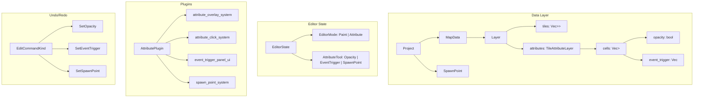

# Design Document: Tile Attributes

## Overview

This feature adds an attribute editing mode to the RPG map editor, allowing designers to annotate tiles with gameplay metadata: opacity (impassable), event triggers (ordered sequences of actions, starting with scene-jump transitions), and a project-wide player spawn point. The design extends the existing data model with a parallel `TileAttributeLayer` grid per layer, adds new `EditCommandKind` variants for undo/redo, introduces an `EditorMode` toggle to the `EditorState`, and extends serialization to persist all attribute data.

The attribute overlay renders on the canvas using Bevy gizmos, reusing the existing grid coordinate system. A new `AttributePlugin` handles the attribute-mode UI (toolbar toggle, opacity click, event trigger panel, spawn point tool) and a `SpawnPointConfirmDialog` resource manages the confirmation modal.

## Architecture



The feature integrates with the existing architecture:
- `EditorState` gains an `EditorMode` enum and an `AttributeTool` enum
- `Layer` gains a `TileAttributeLayer` field (parallel grid)
- `Project` gains an `Option<SpawnPoint>` field
- `EditCommandKind` gains three new variants for attribute undo/redo
- `ProjectFile` gains a `spawn_point` field; `Layer` serialization includes attributes
- The painting system checks `EditorMode` and short-circuits when in attribute mode
- A new `AttributePlugin` handles all attribute-mode interactions and rendering

## Components and Interfaces

### EditorMode (added to EditorState)

```rust
#[derive(Clone, Copy, Debug, Default, PartialEq, Eq)]
pub enum EditorMode {
    #[default]
    Paint,
    Attribute,
}
```

Added as a field on `EditorState`:
```rust
pub editor_mode: EditorMode,
pub attribute_tool: AttributeTool,
pub previous_tool: Option<EditorTool>, // restored when leaving attribute mode
```

### AttributeTool

```rust
#[derive(Clone, Copy, Debug, Default, PartialEq, Eq)]
pub enum AttributeTool {
    #[default]
    Opacity,
    EventTrigger,
    SpawnPoint,
}
```

### Painting System Gate

The existing `painting_system` adds an early return:
```rust
if editor_state.editor_mode == EditorMode::Attribute {
    return;
}
```

### AttributePlugin

New plugin registered in `main.rs`:
```rust
pub struct AttributePlugin;

impl Plugin for AttributePlugin {
    fn build(&self, app: &mut App) {
        app.init_resource::<SpawnPointConfirmDialog>()
            .init_resource::<EventTriggerDialog>()
            .add_systems(EguiPrimaryContextPass, attribute_mode_toolbar_ui)
            .add_systems(Update, (
                attribute_click_system,
                attribute_overlay_system,
            ));
    }
}
```

### Toolbar Integration

The existing toolbar UI gains a mode toggle button. When attribute mode is active, the tool buttons switch to show attribute tools (Opacity, Event Trigger, Spawn Point) instead of painting tools.

### Event Trigger Configuration Panel

An egui window that opens when the user right-clicks (or uses the event trigger tool on) a tile in attribute mode. It shows:
- The ordered list of `EventAction` items for this tile, with drag-to-reorder support
- An "Add Action" button with a dropdown to select action type (currently only JumpTo)
- For JumpTo: a map selector dropdown and x/y coordinate fields
- Remove button per action, Save / Cancel buttons for the whole sequence

### Spawn Point Confirmation Dialog

```rust
#[derive(Resource, Default)]
pub struct SpawnPointConfirmDialog {
    pub open: bool,
    pub new_map_id: Option<MapId>,
    pub new_x: u32,
    pub new_y: u32,
}
```

## Data Models

### TileAttributes

```rust
#[derive(Clone, Debug, Default, PartialEq, Serialize, Deserialize)]
pub struct TileAttributes {
    pub opacity: bool,
    #[serde(default)]
    pub event_trigger: Vec<EventAction>,
}
```

### EventAction

```rust
#[derive(Clone, Debug, PartialEq, Eq, Serialize, Deserialize)]
#[serde(tag = "type")]
pub enum EventAction {
    JumpTo {
        target_map_id: MapId,
        target_x: u32,
        target_y: u32,
    },
    // Future variants: ShowDialog, MoveNpc, ShakeCamera, PlaySound, etc.
}
```

The event trigger on a tile is a `Vec<EventAction>` — an ordered sequence of actions that execute sequentially when the player collides with the tile. An empty vec means no trigger. The `#[serde(tag = "type")]` attribute produces clean JSON like `{"type": "JumpTo", "target_map_id": "...", ...}` which is forward-compatible with new action types.

### TileAttributeLayer

```rust
#[derive(Clone, Debug, PartialEq, Serialize, Deserialize)]
pub struct TileAttributeLayer {
    /// Row-major grid: cells[y][x], same dimensions as Layer.tiles
    pub cells: Vec<Vec<TileAttributes>>,
}

impl TileAttributeLayer {
    pub fn new(width: u32, height: u32) -> Self {
        Self {
            cells: vec![vec![TileAttributes::default(); width as usize]; height as usize],
        }
    }
}
```

### Layer Extension

The existing `Layer` struct gains an `attributes` field:
```rust
pub struct Layer {
    pub name: String,
    pub visible: bool,
    pub tiles: Vec<Vec<Option<TileRef>>>,
    pub attributes: TileAttributeLayer, // NEW
}
```

The `Layer` is constructed with `TileAttributeLayer::new(width, height)` wherever layers are created (in `MapData::new`, `MapData::add_layer`, and `EditCommandKind::AddLayer::apply`).

For backward compatibility during deserialization, `attributes` uses `#[serde(default)]` so that project files without attribute data load with all-default attributes.

### SpawnPoint

```rust
#[derive(Clone, Debug, PartialEq, Eq, Serialize, Deserialize)]
pub struct SpawnPoint {
    pub map_id: MapId,
    pub x: u32,
    pub y: u32,
}
```

Added to `Project`:
```rust
pub spawn_point: Option<SpawnPoint>,
```

Added to `ProjectFile`:
```rust
#[serde(default)]
pub spawn_point: Option<SpawnPoint>,
```

### New EditCommandKind Variants

```rust
pub enum EditCommandKind {
    // ... existing variants ...
    SetOpacity {
        layer_index: usize,
        x: u32,
        y: u32,
        old_value: bool,
        new_value: bool,
    },
    SetEventTrigger {
        layer_index: usize,
        x: u32,
        y: u32,
        old_trigger: Vec<EventAction>,
        new_trigger: Vec<EventAction>,
    },
    SetSpawnPoint {
        old_spawn: Option<SpawnPoint>,
        new_spawn: Option<SpawnPoint>,
    },
}
```

`SetSpawnPoint` is special: its `apply` and `apply_inverse` operate on `Project.spawn_point` rather than on `MapData`. The undo/redo system needs a small extension to handle this — the `consume_edit_commands` system checks for `SetSpawnPoint` commands and applies them to the project directly, while other commands continue to operate on the active map.


## Correctness Properties

*A property is a characteristic or behavior that should hold true across all valid executions of a system — essentially, a formal statement about what the system should do. Properties serve as the bridge between human-readable specifications and machine-verifiable correctness guarantees.*

### Property 1: Opacity toggle inverts value

*For any* tile cell on any layer with any current opacity value (true or false), toggling the opacity attribute should produce the logical negation of the current value.

**Validates: Requirements 2.1, 2.2, 2.3**

### Property 2: New layers have all-default attributes

*For any* valid map dimensions (width 1–256, height 1–256), a newly created `TileAttributeLayer` should have all cells with `opacity == false` and `event_trigger` as an empty vec.

**Validates: Requirements 2.5, 2.6, 3.8**

### Property 3: Event trigger storage round-trip

*For any* valid tile coordinate on any layer and any valid `Vec<EventAction>` value, storing the action sequence in the `TileAttributeLayer` and then reading it back should return an identical sequence (preserving order and contents).

**Validates: Requirements 3.1, 3.5**

### Property 4: Spawn point placement stores correct location

*For any* map in the project and any valid tile coordinate (x, y) within that map's bounds, placing a spawn point should set `project.spawn_point` to `Some(SpawnPoint { map_id, x, y })` where `map_id` is the current map, regardless of which layer is currently active.

**Validates: Requirements 4.2, 4.3, 4.5, 4.9**

### Property 5: Spawn point confirmation guard

*For any* project that already has a spawn point set, attempting to place a new spawn point should require confirmation (the system should detect the existing spawn point). If the placement is canceled, the spawn point should remain unchanged from its original value.

**Validates: Requirements 4.4, 4.6**

### Property 6: Attribute grid dimensions match tile grid

*For any* layer in any map, the `TileAttributeLayer.cells` grid should have exactly `height` rows and each row should have exactly `width` columns, matching the corresponding `Layer.tiles` dimensions.

**Validates: Requirements 5.1**

### Property 7: Resize preserves existing attributes

*For any* map with existing tile attributes and any new valid dimensions (new_width, new_height), resizing the map should preserve all attribute values at coordinates (x, y) where `x < min(old_width, new_width)` and `y < min(old_height, new_height)`.

**Validates: Requirements 5.3**

### Property 8: ProjectFile serialization round-trip

*For any* valid `ProjectFile` containing maps with `TileAttributeLayer` data and an optional `SpawnPoint`, serializing to JSON and then deserializing should produce an equivalent `ProjectFile`.

**Validates: Requirements 6.1, 6.2, 6.5**

### Property 9: Backward-compatible deserialization defaults

*For any* valid project JSON that omits `TileAttributeLayer` data from its layers, deserializing should produce layers where all attribute cells have `opacity == false` and `event_trigger` as an empty vec.

**Validates: Requirements 6.3**

### Property 10: Dangling map references preserved on load

*For any* project JSON containing a `JumpTo` trigger that references a `target_map_id` not present in the project's map set, deserializing should preserve the trigger data with the original `target_map_id` and coordinates intact.

**Validates: Requirements 6.4**

### Property 11: Attribute edit undo/redo round-trip

*For any* attribute edit command (SetOpacity, SetEventTrigger, or SetSpawnPoint), applying the command and then applying its inverse should restore the original state. Furthermore, applying, undoing, then redoing should produce the same state as applying once.

**Validates: Requirements 7.1, 7.2, 7.3, 7.4, 7.5**

### Property 12: Attribute mode disables painting

*For any* editor state where `EditorMode` is `Attribute`, the painting system should not modify any tile data regardless of which `EditorTool` is selected or what mouse input occurs.

**Validates: Requirements 1.2**

### Property 13: Mode toggle restores previous tool

*For any* initial `EditorTool` value, switching to attribute mode and then back to paint mode should restore the `EditorTool` to its original value.

**Validates: Requirements 1.4**

## Error Handling

| Scenario | Handling |
|---|---|
| Toggle opacity on out-of-bounds coordinate | Return `EditorError::ProjectValidationError` with descriptive message; no state change |
| Set event trigger on out-of-bounds coordinate | Return `EditorError::ProjectValidationError`; no state change |
| JumpTo trigger references non-existent map on save | Serialize as-is (data preservation); no error |
| JumpTo trigger references non-existent map on load | Log warning via `warn!()`, preserve trigger data unchanged |
| Place spawn point on out-of-bounds coordinate | Return `EditorError::ProjectValidationError`; no state change |
| Place spawn point when no map is active | No-op; spawn point tool requires an active map |
| Deserialize project file missing attribute fields | `#[serde(default)]` provides all-false opacity and empty event_trigger vecs |
| Undo stack empty when undo requested | No-op, return false (existing behavior) |
| Attribute mode activated with no active map | Attribute overlay renders nothing; click handlers short-circuit |
| Map deleted that contains the spawn point | Clear `project.spawn_point` to `None` (extend `remove_map`) |
| Map deleted that is referenced by a JumpTo trigger | Preserve trigger data; log warning. Triggers with dangling references are the designer's responsibility to fix |

## Testing Strategy

### Unit Tests

Unit tests cover specific examples and edge cases:

- Creating a `TileAttributeLayer` with specific dimensions (e.g., 1×1, 256×256) and verifying defaults
- Setting and reading back a `JumpTo` trigger with known values
- Placing a spawn point on a fresh project (no confirmation needed)
- Attempting to toggle opacity at an out-of-bounds coordinate
- Deserializing a legacy project file (no attribute fields) and verifying defaults
- Deleting a map that contains the spawn point clears it
- `EditorMode` toggle with no active map (no crash)

### Property-Based Tests

Property-based tests use the `proptest` crate (already in `dev-dependencies`) with a minimum of 100 iterations per property. Each test is tagged with a comment referencing its design property.

Tests to implement:

1. **Feature: tile-attributes, Property 1: Opacity toggle inverts value** — Generate random TileAttributeLayer, random coordinate, verify toggle inverts.
2. **Feature: tile-attributes, Property 2: New layers have all-default attributes** — Generate random valid dimensions, verify all cells are default.
3. **Feature: tile-attributes, Property 3: Event trigger storage round-trip** — Generate random action sequences (Vec<EventAction>), store and read back, verify order and contents preserved.
4. **Feature: tile-attributes, Property 4: Spawn point placement stores correct location** — Generate random map/coordinate, verify spawn point stored correctly.
5. **Feature: tile-attributes, Property 6: Attribute grid dimensions match tile grid** — Generate random maps with layers, verify attribute grid dimensions match.
6. **Feature: tile-attributes, Property 7: Resize preserves existing attributes** — Generate random attributed maps, resize, verify preserved cells.
7. **Feature: tile-attributes, Property 8: ProjectFile serialization round-trip** — Generate random ProjectFile with attributes and spawn point, serialize/deserialize, verify equality.
8. **Feature: tile-attributes, Property 9: Backward-compatible deserialization defaults** — Generate project JSON without attribute fields, deserialize, verify defaults.
9. **Feature: tile-attributes, Property 10: Dangling map references preserved on load** — Generate project with dangling JumpTo references, deserialize, verify preservation.
10. **Feature: tile-attributes, Property 11: Attribute edit undo/redo round-trip** — Generate random attribute edit commands, apply/undo/redo, verify state restoration.
11. **Feature: tile-attributes, Property 13: Mode toggle restores previous tool** — Generate random EditorTool, toggle mode round-trip, verify restoration.

Properties 5 and 12 are tested via unit tests since they involve UI-level gating logic (confirmation dialog state, painting system early return) that is better verified with specific scenarios than random generation.

### Test Configuration

- Library: `proptest` (already configured in `Cargo.toml` under `[dev-dependencies]`)
- Minimum iterations: 100 per property test (via `proptest! { #![proptest_config(ProptestConfig::with_cases(100))] ... }`)
- Each property test references its design document property in a comment tag
- Tag format: `// Feature: tile-attributes, Property {N}: {title}`
