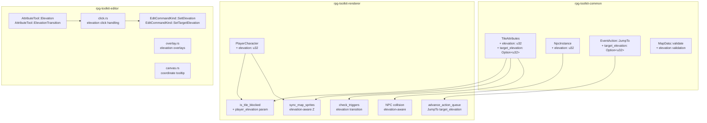

# Design Document: Tile Elevation System

## Overview

This design introduces a tile elevation (z-level) system that operates independently of the existing visual layer system. The elevation system enables scenarios like bridges, multi-story buildings, and terrain height differences where the player can walk under or over structures depending on their current elevation level.

The feature touches four crates:
- **rpg-toolkit-common**: New fields on `TileAttributes`, `NpcInstance`, and `EventAction::JumpTo`; validation logic.
- **rpg-toolkit-editor**: Two new attribute tools (elevation, elevation transition), visual overlays, coordinate tooltip, and undo support.
- **rpg-toolkit-renderer**: Elevation-aware collision, draw-order adjustments, player elevation state, and transition handling.

Key design decisions:
1. **Elevation is per-tile-per-layer** — stored in `TileAttributes` alongside `opacity` and `event_trigger`, so each layer at a given (x, y) can have its own elevation value.
2. **Player elevation is a simple integer on `PlayerCharacter`** — no complex state machine; transitions are driven by tile data.
3. **Collision filtering by elevation** — the existing `is_tile_blocked` function gains an elevation parameter, comparing player elevation against tile elevation before applying the opacity check.
4. **Draw order uses Bevy's Z coordinate** — tiles above the player's elevation get a Z value above the player sprite; tiles at or below get Z below the player.

## Architecture



## Components and Interfaces

### rpg-toolkit-common Changes

**TileAttributes** (map.rs):
- Add `elevation: u32` field with `#[serde(default)]` for backward compatibility.
- Add `target_elevation: Option<u32>` field with `#[serde(default)]` for elevation transitions.

**NpcInstance** (spritesheet.rs):
- Add `elevation: u32` field with `#[serde(default)]`.

**EventAction::JumpTo** (map.rs):
- Add `target_elevation: Option<u32>` field with `#[serde(default)]`.

**MapData::validate** (map.rs):
- Add validation that all `elevation` values are non-negative (guaranteed by `u32`).
- Add validation that all `target_elevation` values (when `Some`) are valid (non-negative, guaranteed by `u32`; the `u32` type inherently prevents negative values, so validation focuses on structural integrity).

### rpg-toolkit-renderer Changes

**PlayerCharacter** (components.rs):
- Add `elevation: u32` field, defaulting to 0 at spawn.

**is_tile_blocked** (systems/collision.rs):
- New signature: `is_tile_blocked(map, x, y, player_elevation, npc_positions, npc_elevations)`.
- Only applies opacity blocking when the tile's elevation matches the player's elevation.
- NPC blocking also checks elevation match.

**sync_map_sprites** (systems/map_render.rs):
- Compute Z values based on tile elevation relative to player elevation.
- Tiles with `elevation > player_elevation` render above the player Z.
- Tiles with `elevation <= player_elevation` render below the player Z.
- Requires a system that re-sorts Z values when player elevation changes.

**check_triggers / advance_action_queue** (systems/triggers.rs):
- After player movement animation completes onto a tile with `target_elevation`, update `PlayerCharacter.elevation`.
- On `JumpTo` with `target_elevation: Some(e)`, set player elevation to `e` after map transition.

**NpcPositions** (resources.rs):
- Extend to track elevation per NPC: `positions: Vec<(u32, u32, u32)>` where the third element is elevation.

### rpg-toolkit-editor Changes

**AttributeTool enum** (data/state.rs):
- Add `Elevation` and `ElevationTransition` variants.

**EditCommandKind** (data/commands.rs):
- Add `SetElevation { layer_index, x, y, old_value: u32, new_value: u32 }`.
- Add `SetTargetElevation { layer_index, x, y, old_value: Option<u32>, new_value: Option<u32> }`.

**attribute/click.rs**:
- Handle `AttributeTool::Elevation`: open a small input dialog to set elevation value.
- Handle `AttributeTool::ElevationTransition`: open a small input dialog to set target elevation.

**attribute/overlay.rs**:
- When `Elevation` tool is active: draw elevation level numbers/colors on tiles.
- When `ElevationTransition` tool is active: draw distinct markers (e.g., arrow glyph or different color) on tiles with `target_elevation` set.

**canvas.rs**:
- Add a coordinate tooltip system that displays `(x, y)` at the cursor position when hovering over the map canvas, regardless of active tool.

**action_editor.rs / action_editor_forms.rs**:
- Add `target_elevation` field to `ActionEditorState`.
- Add a "Target Elevation" input in the JumpTo form.

## Data Models

### TileAttributes (updated)

```rust
#[derive(Clone, Debug, Default, PartialEq, Serialize, Deserialize)]
pub struct TileAttributes {
    pub opacity: bool,
    #[serde(default)]
    pub event_trigger: Vec<EventAction>,
    /// Logical elevation level of this tile (0 = ground level).
    #[serde(default)]
    pub elevation: u32,
    /// If set, stepping on this tile transitions the player to this elevation.
    #[serde(default)]
    pub target_elevation: Option<u32>,
}
```

### NpcInstance (updated)

```rust
#[derive(Clone, Debug, PartialEq, Serialize, Deserialize)]
pub struct NpcInstance {
    pub spritesheet_id: SpritesheetId,
    pub x: u32,
    pub y: u32,
    pub facing: FacingDirection,
    #[serde(default)]
    pub event_triggers: Vec<EventAction>,
    #[serde(default)]
    pub patrol_config: Option<PatrolConfig>,
    #[serde(default)]
    pub trigger_mode: TriggerMode,
    /// Elevation level at which this NPC exists.
    #[serde(default)]
    pub elevation: u32,
}
```

### EventAction::JumpTo (updated)

```rust
EventAction::JumpTo {
    target_map_id: MapId,
    target_x: u32,
    target_y: u32,
    /// If set, player elevation is updated to this value after the map transition.
    #[serde(default)]
    target_elevation: Option<u32>,
}
```

### PlayerCharacter (updated)

```rust
#[derive(Component)]
pub struct PlayerCharacter {
    pub grid_x: u32,
    pub grid_y: u32,
    pub move_animation: Option<MoveAnimation>,
    /// Current elevation level (0 = ground).
    pub elevation: u32,
}
```

### EditCommandKind (new variants)

```rust
EditCommandKind::SetElevation {
    layer_index: usize,
    x: u32,
    y: u32,
    old_value: u32,
    new_value: u32,
}

EditCommandKind::SetTargetElevation {
    layer_index: usize,
    x: u32,
    y: u32,
    old_value: Option<u32>,
    new_value: Option<u32>,
}
```

### NpcPositions (updated)

```rust
#[derive(Resource, Default)]
pub struct NpcPositions {
    /// Maps npc_index → (grid_x, grid_y, elevation).
    pub positions: Vec<(u32, u32, u32)>,
}
```

### RendererState (updated)

```rust
#[derive(Resource, Default)]
pub struct RendererState {
    pub active_map_id: Option<MapId>,
    pub pending_map_change: Option<MapId>,
    pub pending_target_coords: Option<(u32, u32)>,
    /// Target elevation for pending map change (from JumpTo).
    pub pending_target_elevation: Option<u32>,
}
```

