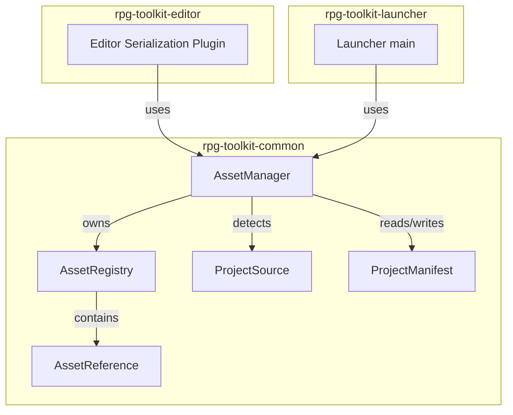

# Design Document: Unified Asset Management

## Overview

This feature introduces a unified asset management layer in the `rpg-toolkit-common` crate that consolidates all image-referenced asset operations (registration, path resolution, loading, saving, and validation) into a single module. Currently, both `rpg-toolkit-editor` and `rpg-toolkit-launcher` independently implement project format detection, asset path resolution, and file I/O — leading to duplicated logic and drift risk. The unified layer eliminates this duplication while also removing the legacy flat JSON format that is no longer the canonical storage mechanism.

The design centers on an `AssetManager` struct that owns an `AssetRegistry` (a map from string identifiers to `AssetReference` entries) and exposes a small set of operations: register, retrieve, resolve paths, load project, save project, and validate. The `AssetCategory` is represented as a plain `String` so new asset types can be introduced without code changes.

## Architecture



**Key architectural decisions:**

1. **Lives in `rpg-toolkit-common`** — Both editor and launcher already depend on this crate. Placing the asset manager here means zero new dependency edges.

2. **Trait-free, concrete struct** — The project has no trait-based abstractions today. A concrete `AssetManager` with methods matches the existing style (see `CharacterRegistry`, `ShopRegistry`, `ProjectManifest`).

3. **Open category set via `String`** — Rather than an enum that requires code changes for new asset types, `AssetCategory` is a type alias for `String`. The well-known categories (`tileset`, `spritesheet`, `face_portrait`) are provided as constants.

4. **No legacy JSON** — The `ProjectSource` enum has exactly two variants: `Directory` and `Zip`. The editor and launcher remove all `LegacyJson` code paths.

## Components and Interfaces

### `AssetCategory` (type alias)

```rust
/// Open set of asset categories represented as strings.
/// Well-known constants are provided for common types.
pub type AssetCategory = String;

pub const CATEGORY_TILESET: &str = "tileset";
pub const CATEGORY_SPRITESHEET: &str = "spritesheet";
pub const CATEGORY_FACE_PORTRAIT: &str = "face_portrait";
```

### `AssetReference`

```rust
/// A record associating a logical asset identifier with a relative file path
/// and an asset category.
#[derive(Clone, Debug, PartialEq, Eq, Serialize, Deserialize)]
pub struct AssetReference {
    /// Unique identifier (1–128 characters).
    pub id: String,
    /// Relative path within the project (forward-slash separated, no leading slash).
    pub relative_path: String,
    /// Classification tag (open string set).
    pub category: AssetCategory,
}
```

### `AssetRegistry`

```rust
/// Registry of all image-referenced assets in a project, keyed by unique identifier.
#[derive(Clone, Debug, Default, PartialEq, Eq, Serialize, Deserialize)]
pub struct AssetRegistry {
    entries: HashMap<String, AssetReference>,
}

impl AssetRegistry {
    pub fn register(&mut self, entry: AssetReference) -> Result<(), CommonError>;
    pub fn get(&self, id: &str) -> Result<&AssetReference, CommonError>;
    pub fn remove(&mut self, id: &str) -> Result<AssetReference, CommonError>;
    pub fn iter(&self) -> impl Iterator<Item = (&String, &AssetReference)>;
    pub fn len(&self) -> usize;
    pub fn is_empty(&self) -> bool;
}
```

### `ProjectSource`

```rust
/// Supported project storage formats.
#[derive(Clone, Debug, PartialEq, Eq)]
pub enum ProjectSource {
    Directory(PathBuf),
    Zip(PathBuf),
}
```

### `AssetManager`

```rust
/// Unified entry point for loading, saving, and resolving project assets.
pub struct AssetManager {
    registry: AssetRegistry,
    /// Configurable mapping from AssetCategory to subdirectory name.
    category_dirs: HashMap<AssetCategory, String>,
}

impl AssetManager {
    /// Create a new AssetManager with default category→directory mappings.
    pub fn new() -> Self;

    /// Configure a category→subdirectory mapping.
    pub fn set_category_dir(&mut self, category: &str, dir: &str);

    /// Detect ProjectSource from a filesystem path.
    pub fn detect_source(path: &Path) -> Result<ProjectSource, CommonError>;

    /// Load a project from the given source, populating the registry.
    /// Returns the loaded ProjectFile and a list of validation warnings.
    pub fn load_project(path: &Path) -> Result<(ProjectFile, Vec<AssetValidationError>), CommonError>;

    /// Save a project to the given target path.
    /// Returns warnings for assets that could not be written.
    pub fn save_project(
        &self,
        project: &ProjectFile,
        target: &Path,
        source_dir: &Path,
    ) -> Result<Vec<AssetWarning>, CommonError>;

    /// Resolve a single relative path against a project root.
    /// Validates no path traversal escapes the root.
    pub fn resolve_path(
        root: &Path,
        relative: &str,
    ) -> Result<PathBuf, CommonError>;

    /// Resolve all asset references in the registry against a root directory.
    /// Returns resolved paths and warnings for empty/invalid entries.
    pub fn resolve_all(
        &self,
        root: &Path,
    ) -> (HashMap<String, PathBuf>, Vec<AssetWarning>);

    /// Validate that all resolved asset paths point to existing files.
    pub fn validate_assets(
        &self,
        root: &Path,
    ) -> Vec<AssetValidationError>;

    /// Access the underlying registry.
    pub fn registry(&self) -> &AssetRegistry;

    /// Build an AssetRegistry from an existing ProjectFile (migration helper).
    pub fn registry_from_project_file(project: &ProjectFile) -> AssetRegistry;
}
```

### `AssetValidationError`

```rust
/// Describes a single missing asset reference discovered during validation.
#[derive(Clone, Debug, PartialEq, Eq)]
pub struct AssetValidationError {
    pub asset_id: String,
    pub category: AssetCategory,
    pub resolved_path: PathBuf,
}
```

### `AssetWarning`

```rust
/// Non-fatal warning emitted during save or resolution.
#[derive(Clone, Debug, PartialEq, Eq)]
pub struct AssetWarning {
    pub asset_id: String,
    pub category: AssetCategory,
    pub message: String,
}
```

### Category Directory Defaults

| Category | Subdirectory |
|----------|-------------|
| `tileset` | `tilesets/` |
| `spritesheet` | `data/` |
| `face_portrait` | `data/` |

New categories use their category name as the default subdirectory (e.g., `item_portrait` → `item_portrait/`), unless explicitly configured.

## Data Models

### On-disk `manifest.json` (unchanged structure, new semantic)

The existing `ProjectManifest` structure remains the serialization format. The `AssetManager` constructs an `AssetRegistry` from the manifest's `tilesets`, `spritesheets`, and `face_portraits` fields during load. On save, the `AssetManager` writes back to these same manifest fields for backward compatibility.

### Asset ID derivation

- **Tilesets**: The existing `TilesetId` (HashMap key in `tilesets`) becomes the `AssetReference.id`.
- **Spritesheets**: The existing `SpritesheetId` (HashMap key in `spritesheets`) becomes the `AssetReference.id`.
- **Face portraits**: The existing portrait key (HashMap key in `face_portraits`) becomes the `AssetReference.id`.

### Path normalization rules

1. All stored paths use forward slashes (`/`) as separators.
2. No leading slash — paths are always relative to the project root.
3. No `..` or `.` components — rejected during resolution with a path traversal error.
4. File names are preserved as-is (case-sensitive).


## Correctness Properties

*A property is a characteristic or behavior that should hold true across all valid executions of a system — essentially, a formal statement about what the system should do. Properties serve as the bridge between human-readable specifications and machine-verifiable correctness guarantees.*

### Property 1: Registration round-trip

*For any* valid `AssetReference` with an identifier of 1–128 characters and any non-empty `AssetCategory` string, registering it in an `AssetRegistry` and then retrieving by the same identifier SHALL return an entry equal to the original.

**Validates: Requirements 1.1, 1.2**

### Property 2: Duplicate registration rejection

*For any* `AssetRegistry` that already contains an entry with identifier `id`, attempting to register a second `AssetReference` with the same `id` SHALL return an error and leave the original entry unchanged.

**Validates: Requirements 1.3**

### Property 3: Open category acceptance

*For any* arbitrary non-empty string used as an `AssetCategory`, registering an `AssetReference` with that category SHALL succeed, and retrieving it SHALL return the same category string.

**Validates: Requirements 1.5, 1.7**

### Property 4: Not-found retrieval error

*For any* identifier string that has not been registered in an `AssetRegistry`, calling `get()` with that identifier SHALL return an error indicating the identifier was not found.

**Validates: Requirements 1.6**

### Property 5: Path resolution correctness

*For any* valid relative path (containing no `..` or `.` components) and any existing root directory, `resolve_path(root, relative)` SHALL return a path equal to `root.join(relative)` canonicalized, regardless of whether the root represents a directory-based or ZIP-extracted project source.

**Validates: Requirements 2.1, 2.2, 2.3**

### Property 6: Path traversal rejection

*For any* relative path containing `..` components that would resolve to a location outside the project root directory, `resolve_path` SHALL return an error identifying the offending path.

**Validates: Requirements 2.5**

### Property 7: Format detection correctness

*For any* filesystem path that is a directory, `detect_source` SHALL return `ProjectSource::Directory`. *For any* filesystem path with a `.rpg` extension, `detect_source` SHALL return `ProjectSource::Zip`. *For any* path that is neither, `detect_source` SHALL return an error.

**Validates: Requirements 3.1, 3.4, 5.1**

### Property 8: Validation reports exactly missing files

*For any* set of N asset references where K files are missing from the filesystem (0 ≤ K ≤ N), the `validate_assets` function SHALL return exactly K validation errors, each containing the asset identifier, category, and resolved path of a missing file, and no errors for files that do exist.

**Validates: Requirements 3.7, 6.1, 6.2, 6.3, 6.4**

### Property 9: Path normalization

*For any* file name and category directory mapping, the stored relative path in the manifest SHALL use forward slashes as separators and SHALL NOT begin with a leading slash.

**Validates: Requirements 4.3**

### Property 10: Directory format round-trip

*For any* valid project state containing at least one tileset, spritesheet, or face portrait entry, serializing to directory format (manifest.json + maps/) and then deserializing SHALL produce a `ProjectFile` whose tilesets, spritesheets, and face_portraits maps contain the same keys and equivalent values as the original.

**Validates: Requirements 7.1**

### Property 11: ZIP format round-trip

*For any* valid project state, serializing to a ZIP archive and then deserializing from that archive SHALL produce a `ProjectFile` whose tilesets, spritesheets, and face_portraits maps contain the same keys and equivalent values as the original.

**Validates: Requirements 7.2**

### Property 12: ZIP content byte-identity

*For any* asset file (tileset image, spritesheet image) written into a ZIP archive during save, extracting that file from the archive SHALL produce byte-identical content compared to the original source file.

**Validates: Requirements 7.3**

## Error Handling

### Error Types

The `AssetManager` introduces new variants to `CommonError`:

```rust
#[derive(Debug, thiserror::Error)]
pub enum CommonError {
    // ... existing variants ...
    
    #[error("Asset registry error: {0}")]
    AssetRegistryError(String),
    
    #[error("Asset path resolution error: {0}")]
    AssetPathError(String),
    
    #[error("Unsupported project format: {0}")]
    UnsupportedFormat(String),
    
    #[error("Asset validation failed: {0} missing references")]
    AssetValidationError(String),
}
```

### Error Scenarios

| Scenario | Error Type | Behavior |
|----------|-----------|----------|
| Duplicate asset ID registration | `AssetRegistryError` | Return error, registry unchanged |
| Asset ID not found on `get()` | `AssetRegistryError` | Return error with unknown ID |
| Empty relative path during resolution | Warning (non-fatal) | Skip entry, include in warning list |
| Path traversal (`..` escaping root) | `AssetPathError` | Return error with offending path |
| Unsupported format (not dir or .rpg) | `UnsupportedFormat` | Return error with path |
| Missing manifest.json | `ProjectParseError` | Return error with file location |
| Invalid JSON in manifest | `ProjectParseError` | Return error with parse details |
| Missing asset files on load | Validation error list | Non-aborting; collect all, return list |
| Missing asset files on save | Warning list | Skip file, continue saving, warn |
| `.json` file opened in Editor | UI error message | Display user-facing message |
| `.json` path given to Launcher | Process exit (code 1) | Print to stderr, exit non-zero |

### Error Recovery Strategy

- **Non-aborting validation**: When loading a project, missing asset files produce warnings/validation errors but do NOT prevent the remaining valid assets from loading. This allows partially-complete projects to still open.
- **Save resilience**: Missing source files during save are skipped with warnings. The manifest still records the reference so a future re-save with the file present will include it.
- **Legacy format rejection**: Clear, actionable error messages direct users to convert their projects.

## Testing Strategy

### Property-Based Tests (proptest)

The project already uses `proptest` (workspace dependency) with 100 iterations per property. Each property test will be tagged with:

```
// Feature: unified-asset-management, Property N: <property_text>
```

**Property tests to implement:**
1. Registration round-trip (Property 1)
2. Duplicate registration rejection (Property 2)
3. Open category acceptance (Property 3)
4. Not-found retrieval error (Property 4)
5. Path resolution correctness (Property 5)
6. Path traversal rejection (Property 6)
7. Format detection correctness (Property 7)
8. Validation reports exactly missing files (Property 8)
9. Path normalization (Property 9)
10. Directory format round-trip (Property 10)
11. ZIP format round-trip (Property 11)
12. ZIP content byte-identity (Property 12)

**Configuration:**
- Library: `proptest` (already in workspace)
- Minimum iterations: 100 per property
- Test location: `crates/rpg-toolkit-common/tests/properties/`

### Unit Tests (example-based)

- Known category constants (`tileset`, `spritesheet`, `face_portrait`) register successfully
- Editor file dialog filters exclude `.json`
- Launcher exits with code 1 for `.json` input
- Legacy JSON error messages contain actionable text
- `AssetManager::new()` has correct default category→directory mappings

### Integration Tests

- Load a real directory-based project (fixture) end-to-end
- Load a real ZIP-based project (fixture) end-to-end
- Save to directory then reload and compare
- Save to ZIP then reload and compare
- Round-trip with mixed asset types (tilesets + spritesheets + portraits)

### Test Fixtures

Create minimal test fixtures under `crates/rpg-toolkit-common/tests/fixtures/`:
- `minimal_project/` — directory project with one tileset, one spritesheet
- `minimal_project.rpg` — ZIP of the same content
